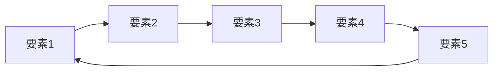

# フライホイール設計ワークフロー

起業大全に基づき、事業の持続的成長を生み出すフライホイール（好循環モデル）を設計する。

## 前提条件
- `lean_canvas.md` が作成済み
- `mvv.md` が作成済み（推奨）
- PMF達成済みまたは達成間近

## ステップ

### 1. フライホイールの概念理解

```markdown
## フライホイールとは

起業大全より：
- **静的モデル**（ビジネスモデル図）× **動的モデル**（フライホイール・時間軸）
- 一度回り始めると加速し続ける「好循環の仕組み」
- Amazonの例: 
  低コスト構造 → 低価格 → 顧客満足 → トラフィック増 
  → 売り手増 → 品揃え増 → 顧客満足...（無限ループ）
```

### 2. 成長エンジンの特定

```markdown
## 成長エンジン分析

起業の科学「3つの成長エンジン」から自社の主エンジンを特定：

| エンジン | 説明 | 自社適合度 |
|---------|------|:----------:|
| **Viral（バイラル）** | 口コミ・紹介で広がる | ⭐⭐⭐/⭐⭐/⭐ |
| **Sticky（スティッキー）** | 高リテンションで成長 | ⭐⭐⭐/⭐⭐/⭐ |
| **Paid（ペイド）** | 広告投資で成長 | ⭐⭐⭐/⭐⭐/⭐ |

### 主成長エンジン
**[選定したエンジン]**

### 選定理由
1. [理由1]
2. [理由2]
3. [理由3]
```

### 3. フライホイール要素の洗い出し

```markdown
## フライホイール要素

自社の好循環を構成する要素を洗い出す：

### 価値提供側
1. [要素: 例「高品質なコンテンツ」]
2. [要素: 例「使いやすいUI」]
3. [要素: 例「迅速なサポート」]

### 顧客側
1. [要素: 例「顧客満足度向上」]
2. [要素: 例「継続利用」]
3. [要素: 例「口コミ・紹介」]

### ビジネス側
1. [要素: 例「収益増加」]
2. [要素: 例「投資余力拡大」]
3. [要素: 例「サービス改善」]
```

### 4. フライホイール設計

```markdown
## フライホイール図

### 視覚化


### フライホイール説明
| ステップ | 要素 | 次への接続理由 |
|---------|------|--------------|
| 1 | [要素1] | → [なぜ次につながるか] |
| 2 | [要素2] | → [なぜ次につながるか] |
| 3 | [要素3] | → [なぜ次につながるか] |
| 4 | [要素4] | → [なぜ次につながるか] |
| 5 | [要素5] | → [最初に戻る理由] |

### 一言で表現
[フライホイールのロジックを1文で]
```

### 5. ネットワーク効果の検討

```markdown
## ネットワーク効果分析

ユーザーが増えるほど価値が上がる仕組みがあるか：

| 効果タイプ | 説明 | 自社での適用可能性 |
|-----------|------|:------------------:|
| **直接ネットワーク効果** | ユーザー同士が直接つながる価値（SNS等） | ✅/❌ |
| **間接ネットワーク効果** | プラットフォームの両面に価値（マーケットプレイス等） | ✅/❌ |
| **データネットワーク効果** | データが増えるほど精度向上 | ✅/❌ |

### ネットワーク効果の設計
[どうすればネットワーク効果を取り込めるか]
```

### 6. フライホイール強化策

```markdown
## フライホイール強化策

各接続ポイントを強化する施策：

| 接続ポイント | 現状の強さ | 強化策 | 優先度 |
|-------------|:----------:|-------|:------:|
| [要素1→要素2] | 強/中/弱 | [施策] | 高/中/低 |
| [要素2→要素3] | 強/中/弱 | [施策] | 高/中/低 |
| [要素3→要素4] | 強/中/弱 | [施策] | 高/中/低 |
| [要素4→要素5] | 強/中/弱 | [施策] | 高/中/低 |
| [要素5→要素1] | 強/中/弱 | [施策] | 高/中/低 |

### 最も強化すべきポイント
**[選定した接続ポイント]**

### 具体的アクション
1. [アクション1]
2. [アクション2]
3. [アクション3]
```

### 7. KPI設定

```markdown
## フライホイールKPI

各要素の健全性を測定する指標：

| 要素 | KPI | 目標値 | 測定頻度 |
|------|-----|-------|---------|
| [要素1] | [指標] | [目標] | 週次/月次 |
| [要素2] | [指標] | [目標] | 週次/月次 |
| [要素3] | [指標] | [目標] | 週次/月次 |
| [要素4] | [指標] | [目標] | 週次/月次 |
| [要素5] | [指標] | [目標] | 週次/月次 |
```

## 出力

成果物を以下のパスに保存：
```
Stock/programs/創業支援・新規事業開発（AIエージェント）/projects/Founder_Agent_Phase1/documents/3_planning/flywheel.md
```

### 出力フォーマット

```markdown
# 成長フライホイール

**作成日**: [日付]
**主成長エンジン**: [Viral/Sticky/Paid]

## フライホイール図
[Mermaid図]

## フライホイール説明
[各要素と接続の説明]

## 強化策
[優先的に強化すべきポイント]

## KPI
[測定指標]

## 次のステップ
→ `/startup_scorecard` で経営全体の可視化
```

## 完了条件
- [ ] 成長エンジンを特定した
- [ ] フライホイール要素を洗い出した
- [ ] フライホイールを設計した
- [ ] ネットワーク効果を検討した
- [ ] 強化策を策定した
- [ ] KPIを設定した
- [ ] `flywheel.md` を保存した
