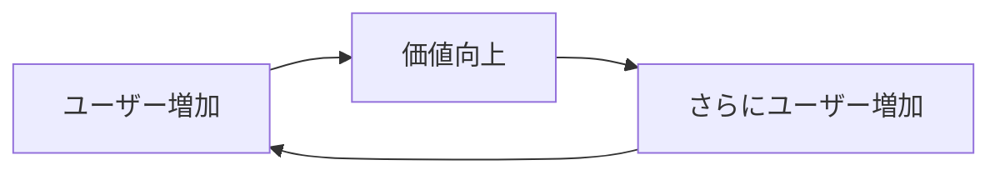

# モート構築ワークフロー

起業大全に基づき、模倣困難な競争優位性（モート）を設計・構築する。

> [!IMPORTANT]
> **起業大全の教え**: モートがなければ、成功しても模倣されて終わる
> 早い段階からモート構築を意識すべき

## 入力・出力

| 項目 | 内容 |
|------|------|
| **入力** | `lean_canvas.md`, `flywheel.md`, `valuation.md` |
| **出力** | `documents/3_planning/moat_strategy.md` |
| **実施タイミング** | PSF達成後、定期的な戦略レビュー時 |

---

## STEP 1: モートの7タイプ理解【自動実行】

```markdown
## モートの7タイプ

| タイプ | 説明 | 代表例 |
|--------|------|--------|
| **ネットワーク効果** | ユーザーが増えるほど価値が上がる | Facebook, LinkedIn |
| **スイッチングコスト** | 乗り換えのコストが高い | Salesforce, SAP |
| **ブランド** | 第一想起ポジション | Apple, Nike |
| **規模の経済** | 規模が大きいほど単位コスト低下 | Amazon, Walmart |
| **知的財産（IP）** | 特許、著作権、ノウハウ | 製薬会社、Tesla |
| **規制** | 許認可、法規制による参入障壁 | 銀行、通信キャリア |
| **コスト優位** | 競合が真似できないコスト構造 | IKEA, Costco |
```

---

## STEP 2: 現在のモート自己評価【自動実行】

```markdown
## 現在のモート評価

### 各タイプの強度
| モートタイプ | 現在の強度 | 構築可能性 | 詳細 |
|-------------|:----------:|:---------:|------|
| ネットワーク効果 | ⭐⭐⭐/⭐⭐/⭐/なし | 高/中/低 | [詳細] |
| スイッチングコスト | ⭐⭐⭐/⭐⭐/⭐/なし | 高/中/低 | [詳細] |
| ブランド | ⭐⭐⭐/⭐⭐/⭐/なし | 高/中/低 | [詳細] |
| 規模の経済 | ⭐⭐⭐/⭐⭐/⭐/なし | 高/中/低 | [詳細] |
| 知的財産（IP） | ⭐⭐⭐/⭐⭐/⭐/なし | 高/中/低 | [詳細] |
| 規制 | ⭐⭐⭐/⭐⭐/⭐/なし | 高/中/低 | [詳細] |
| コスト優位 | ⭐⭐⭐/⭐⭐/⭐/なし | 高/中/低 | [詳細] |

### 総合モート強度
| 評価 | 基準 |
|:----:|------|
| 🟢 強い | 2つ以上のモートが⭐⭐以上 |
| 🟡 中程度 | 1つのモートが⭐⭐以上 |
| 🔴 弱い | すべて⭐以下 |

**現在の評価**: [🟢/🟡/🔴]
```

---

## STEP 3: 優先モートの選定【自動実行】

```markdown
## 優先モート選定

### 選定マトリクス
| モートタイプ | 構築コスト | 構築期間 | 効果の持続性 | 相性 | 優先度 |
|-------------|:----------:|:--------:|:------------:|:----:|:------:|
| [タイプ1] | 高/中/低 | [期間] | 高/中/低 | 高/中/低 | [順位] |
| [タイプ2] | 高/中/低 | [期間] | 高/中/低 | 高/中/低 | [順位] |

### 事業との相性分析
| モートタイプ | 相性が良い理由 / 悪い理由 |
|-------------|-------------------------|
| ネットワーク効果 | [分析] |
| スイッチングコスト | [分析] |

### 選定結果
**主要モート**: [選定したモート]
**補助モート**: [サブで構築するモート]
**選定理由**: [理由]
```

---

## STEP 4: ネットワーク効果設計【該当時】

```markdown
## ネットワーク効果設計

### ネットワーク効果のタイプ
| タイプ | 説明 | 自社での適用 |
|--------|------|-------------|
| 直接効果 | ユーザー同士が直接つながる | [適用方法] |
| 間接効果 | 両面市場で価値が高まる | [適用方法] |
| データ効果 | データ蓄積で精度向上 | [適用方法] |

### 設計


### 施策
| フェーズ | 施策 | 目標 |
|---------|------|------|
| 初期 | [施策] | [目標] |
| 成長期 | [施策] | [目標] |
| 成熟期 | [施策] | [目標] |
```

---

## STEP 5: スイッチングコスト設計【該当時】

```markdown
## スイッチングコスト設計

### コストの種類
| 種類 | 説明 | 自社での実装 |
|------|------|-------------|
| 学習コスト | 新しい使い方を覚える手間 | [実装方法] |
| データ移行コスト | データを移す手間 | [実装方法] |
| 契約コスト | 契約変更の手間・違約金 | [実装方法] |
| 心理的コスト | 慣れたものを変える抵抗 | [実装方法] |
| 統合コスト | 他システムとの連携を再構築 | [実装方法] |

### 設計ポイント
1. [ポイント1]
2. [ポイント2]
3. [ポイント3]

> [!WARNING]
> スイッチングコストは「顧客に不利益」ではなく
> 「深い統合による価値」として設計すべき
```

---

## STEP 6: 知的財産（IP）戦略【該当時】

```markdown
## 知的財産戦略

### 現在の知的財産
| 種類 | 内容 | ステータス |
|------|------|----------|
| 特許 | [内容] | 出願中/取得済み/検討中 |
| 商標 | [内容] | 登録済み/申請中 |
| 著作権 | [内容] | 自動発生 |
| 営業秘密 | [内容] | 管理中 |

### IP戦略
| 観点 | 戦略 |
|------|------|
| 守り（権利化） | [戦略] |
| 攻め（活用） | [戦略] |
| 他社牽制 | [戦略] |

### アクションプラン
| 優先度 | アクション | 担当 | 期限 |
|:------:|-----------|------|------|
| 1 | [アクション] | [担当] | [期限] |
| 2 | [アクション] | [担当] | [期限] |
```

---

## STEP 7: モート構築ロードマップ【自動実行】

```markdown
## モート構築ロードマップ

### 短期（0-6ヶ月）
| 施策 | 目標 | 担当 | KPI |
|------|------|------|-----|
| [施策1] | [目標] | [担当] | [KPI] |

### 中期（6-18ヶ月）
| 施策 | 目標 | 担当 | KPI |
|------|------|------|-----|
| [施策1] | [目標] | [担当] | [KPI] |

### 長期（18ヶ月-）
| 施策 | 目標 | 担当 | KPI |
|------|------|------|-----|
| [施策1] | [目標] | [担当] | [KPI] |

### マイルストーン
| 時期 | モート強度目標 | チェックポイント |
|------|:-------------:|----------------|
| 6ヶ月後 | [目標] | [チェック項目] |
| 12ヶ月後 | [目標] | [チェック項目] |
| 24ヶ月後 | [目標] | [チェック項目] |
```

---

## 出力

成果物を以下のパスに保存：
```
{IDEA_FOLDER}/documents/3_planning/moat_strategy.md
```

---

## 完了条件
- [ ] 7タイプのモートを理解した
- [ ] 現在のモート強度を評価した
- [ ] 優先モートを選定した
- [ ] 選定モートの詳細設計を行った
- [ ] 構築ロードマップを作成した
- [ ] `moat_strategy.md` を保存した

---

**出典**: 田所雅之「起業大全」
