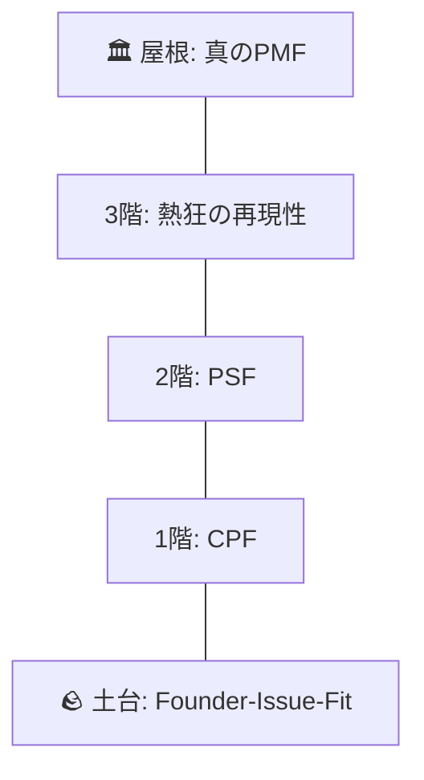

# PMF達成判定ワークフロー

プロダクトが市場に適合しているか（PMF）を多角的に判定する。

## 前提条件
- `psf_diagnosis.md` でPSF達成済み
- MVPが公開済みで実ユーザーが存在
- `startup_science_knowledge.md` を参照可能

## ステップ

### 1. PMFパルテノン神殿チェック

起業の科学の「PMFパルテノン神殿」モデルに基づき、各層の達成状況を確認：

```markdown
## PMFパルテノン神殿 評価

### 神殿構造図



### 各層の達成状況

| 層 | 項目 | 達成 | エビデンス |
|---|------|:----:|-----------|
| 土台 | Vision / Founder-Issue-Fit | ✅/❌ | [詳細] |
| 1階 | CPF (Customer Problem検証) | ✅/❌ | [cpf_diagnosis.mdリンク] |
| 2階 | PSF (Value Proposition検証) | ✅/❌ | [psf_diagnosis.mdリンク] |
| 3階 | 熱狂の再現性・チャネル検証 | ✅/❌ | [詳細] |
| 屋根 | 真のPMF（MOAT構築） | ✅/❌ | [詳細] |
```

### 2. ショーン・エリステスト

```markdown
## ショーン・エリステスト

**質問**: 「このプロダクトが使えなくなったらどう思いますか？」

### 回答分布
| 回答 | 人数 | 割合 |
|-----|-----|-----|
| 非常に残念 | [数] | [%] |
| やや残念 | [数] | [%] |
| 残念ではない | [数] | [%] |
| もう使っていない | [数] | [%] |

### 判定
- **目標**: 「非常に残念」が **40%以上**
- **現状**: [X]%
- **判定**: ✅達成 / ❌未達成
```

### 3. リテンション分析（40%ルール）

```markdown
## リテンション分析

### リテンションカーブ
| 期間 | アクティブユーザー | リテンション率 |
|-----|-----------------|--------------|
| Week 1 | [数] | 100% |
| Week 2 | [数] | [%] |
| Week 4 | [数] | [%] |
| Week 8 | [数] | [%] |
| Week 12 | [数] | [%] |

### 40%ルール判定
- **目標**: 長期リテンション率が **40%以上で平坦化**
- **現状**: [X]%
- **判定**: ✅達成 / ❌未達成

### リテンションカーブの形状
- [ ] 📈 右肩上がり（理想）
- [ ] ➡️ 平坦（PMF達成）
- [ ] 📉 右肩下がり（PMF未達成）
```

### 4. NPS（Net Promoter Score）

```markdown
## NPS測定

**質問**: 「このプロダクトを友人や同僚に薦める可能性は？（0-10点）」

### 回答分布
| カテゴリ | スコア | 人数 | 割合 |
|---------|-------|-----|-----|
| 推奨者（Promoter） | 9-10 | [数] | [%] |
| 中立者（Passive） | 7-8 | [数] | [%] |
| 批判者（Detractor） | 0-6 | [数] | [%] |

### NPS計算
```
NPS = 推奨者% - 批判者% = [X]%
```

### 判定
- **目標**: NPS **40以上**
- **現状**: [X]
- **判定**: ✅達成 / ❌未達成
```

### 5. 口コミ・バイラル係数

```markdown
## 口コミ分析

### 新規ユーザー獲得経路
| 経路 | 人数 | 割合 |
|-----|-----|-----|
| 口コミ・紹介 | [数] | [%] |
| SNS | [数] | [%] |
| 検索 | [数] | [%] |
| 広告 | [数] | [%] |
| その他 | [数] | [%] |

### バイラル係数
```
バイラル係数 = 1ユーザーあたりの紹介人数 = [X]
```
- **目標**: バイラル係数 **1.0以上**（自然成長）
- **現状**: [X]
- **判定**: ✅達成 / ❌未達成
```

### 6. ユニットエコノミクス

```markdown
## ユニットエコノミクス

### LTV（顧客生涯価値）
```
LTV = ARPU × 粗利率 × 平均継続月数
    = [X]円 × [X]% × [X]ヶ月
    = [X]円
```

### CAC（顧客獲得コスト）
```
CAC = 総マーケティング費用 / 新規獲得顧客数
    = [X]円 / [X]人
    = [X]円
```

### LTV/CAC比率
```
LTV/CAC = [X]円 / [X]円 = [X]
```

### 判定
- **目標**: LTV/CAC **3以上**
- **現状**: [X]
- **判定**: ✅達成 / ❌未達成
```

### 7. BtoB特有チェック（該当する場合）

```markdown
## BtoB PMFチェック

| チェック項目 | 達成 | 詳細 |
|-------------|:----:|------|
| チェンジマネジメント成功 | ✅/❌ | [導入企業での定着状況] |
| 決裁者のサクセス | ✅/❌ | [ROI実感、上層部報告] |
| 管理者のサクセス | ✅/❌ | [運用負荷、管理効率] |
| 利用者のサクセス | ✅/❌ | [日常業務での価値実感] |
| 複数部署への展開 | ✅/❌ | [横展開状況] |
```

### 8. 総合判定

```markdown
## PMF総合判定

### スコアサマリー
| 指標 | 目標 | 現状 | 達成 |
|------|------|------|:----:|
| ショーン・エリステスト | 40%+ | [X]% | ✅/❌ |
| リテンション（40%ルール） | 40%+ | [X]% | ✅/❌ |
| NPS | 40+ | [X] | ✅/❌ |
| 口コミ獲得 | あり | [状況] | ✅/❌ |
| LTV/CAC | 3+ | [X] | ✅/❌ |

### 総合判定
| 判定 | 基準 |
|------|------|
| ✅ **PMF達成** | 5項目中4項目以上達成 |
| ⚠️ **PMF達成間近** | 5項目中2-3項目達成 |
| ❌ **PMF未達成** | 5項目中1項目以下達成 |

**今回の判定**: [✅/⚠️/❌]
```

### 9. 次のステップ

```markdown
## 次のステップ

### PMF達成の場合
→ Scaleフェーズへ移行
→ `/build_flywheel` で成長フライホイール設計
→ `/startup_scorecard` で経営状態の可視化

### PMF達成間近の場合
1. 未達成指標の改善に集中
2. [具体的な改善アクション]
3. 4週間後に再度 `/diagnose_pmf` を実行

### PMF未達成の場合
→ `/decide_pivot` でピボット判断を実施
→ 課題・ソリューションの見直し
```

## 出力

成果物を以下のパスに保存：
```
Stock/programs/創業支援・新規事業開発（AIエージェント）/projects/Founder_Agent_Phase1/documents/5_monitoring/pmf_diagnosis.md
```

## 完了条件
- [ ] PMFパルテノン神殿チェックを実施した
- [ ] ショーン・エリステストを実施した
- [ ] リテンション分析を実施した
- [ ] NPSを測定した
- [ ] ユニットエコノミクスを算出した
- [ ] 総合判定を実施した
- [ ] `pmf_diagnosis.md` を保存した
