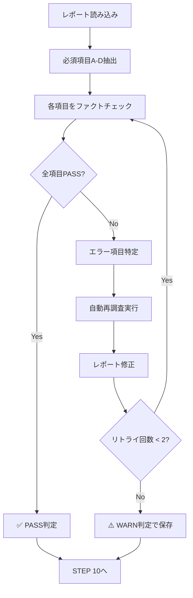
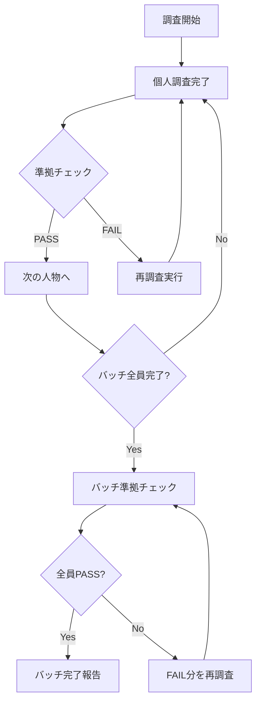

# /research_sns_growth ワークフロー

**バージョン**: 3.4
**作成日**: 2025-12-26
**更新日**: 2025-12-27

> **v3.4 変更点**:
> - **STEP 6.5追加**: 使用ツール・サービス調査（5件以上必須）
> - **STEP 10.5追加**: 事業アイデア候補抽出（3件以上必須）
> - 必須セクション数を13→15に増加
> - 品質チェックリストに行数基準（200行以上）を追加
> - レポートテンプレートを15セクション対応に更新

> **v3.1 変更点**:
> - ファクトチェック＋自動修正フローを追加（STEP 9強化）
> - エラー検出時の自動再調査・修正機能を実装
> - ブラウザアクセス確認を重要項目に追加
> - 修正履歴セクションを必須化

> **v3.0 変更点**:
> - 全セクションにソースURL列を必須化
> - 失敗プロダクト調査ステップを追加（STEP 4.5）
> - 日本市場適用性を定量スコアリング化（5点満点）
> - ハッシュタグ戦略・投稿時間帯分析を必須化

## 概要

海外ソロプレナー・クリエイターのSNS集客成功事例を調査し、5つのプラットフォーム（Twitter/X、TikTok、Instagram、LinkedIn、Facebook）における成長戦略・バズ投稿パターンを分析するワークフロー。

---

## 前提条件

**ファイルパス（絶対パス）**:

```text
BASE_PATH: /Users/yuichi/AIPM/aipm_v0/Stock/programs/創業支援・新規事業開発（AIエージェント）/projects/Solopreneur_Research

調査対象リスト: {BASE_PATH}/documents/sns/sns_targets_list.md
出力先:          {BASE_PATH}/documents/3_analysis/sns/
個人別出力:      {BASE_PATH}/documents/2_discovery/case_studies/{person_name}/sns_analysis.md
進捗管理:        {BASE_PATH}/documents/sns/sns_research_progress.md
```

---

## 入力

| 入力 | 説明 | 必須 |
|------|------|------|
| `target_person` | 調査対象者の名前 | ✅ |
| `sns_accounts` | 対象者のSNSアカウントURL一覧 | ✅ |
| `existing_case_study` | 既存の事例ファイルパス（あれば） | - |

---

## 出力

| 出力 | ファイル名 | 説明 |
|------|------------|------|
| SNS戦略分析レポート | `sns_analysis.md` | 個人別の包括的SNS分析 |
| 進捗管理更新 | `sns_research_progress.md` | 調査状況の更新 |

---

## ワークフローステップ

### STEP 0: 調査対象の特定

```text
入力: 人物名（ユーザー指定 or 未調査リストから自動選択）
出力: 調査対象の基本情報（名前、SNSアカウントURL一覧）
```

1. ユーザー指定の場合: 指定された人物名を使用
2. 自動選択の場合: `sns_targets_list.md` から未調査（🔲）の人物を選択
3. 進捗管理ファイルで調査済みかチェック
4. 既存事例ファイルがあれば読み込み

---

### STEP 1: 対象者情報収集

// turbo
1. 対象者の全SNSアカウントを特定
   - Twitter/X
   - TikTok
   - Instagram
   - LinkedIn
   - Facebook
   - YouTube
   - Blog/Website

2. 各プラットフォームの基本情報を収集（**ソースURL必須**）

| 項目 | 説明 | ソース |
|------|------|--------|
| フォロワー数（現在）| 実数値 | プロフィールURL |
| 投稿数（総数） | | |
| アカウント開設時期（推定） | | |
| プロフィール文 | 全文コピー | |
| リンク先 | LP、ニュースレター等 | |

**エラー時**: アカウントが見つからない場合は Web 検索で代替

---

### STEP 2: データ収集（粒度A: 概要）

// turbo
各プラットフォームについて以下を収集:

| 項目 | 説明 | ソース |
|------|------|--------|
| フォロワー数 | 現在のフォロワー数 | |
| 主要戦略 | プラットフォームでの主な活動内容 | |
| 投稿頻度 | 日/週/月あたりの投稿数 | |
| コンテンツ形式 | テキスト、画像、動画、スレッド等 | |

---

### STEP 3: データ収集（粒度B: 詳細分析）

// turbo

| 項目 | 説明 | 必須 |
|------|------|:----:|
| エンゲージメント率 | いいね数/インプレッション（推定） | ✅ |
| **バズ投稿TOP5** | 最も反応が良かった投稿5件（**URL必須**） | ✅ |
| **投稿時間帯** | 主な投稿時間帯（UTC/JST） | ✅ |
| **ハッシュタグ戦略** | 使用頻度の高いハッシュタグTOP5 | ✅ |
| リプライ・引用RT戦略 | 他ユーザーとのエンゲージメント方法 | - |

---

### STEP 4: データ収集（粒度C: ディープダイブ）

// turbo

| 項目 | 説明 | ソース |
|------|------|--------|
| 成長曲線分析 | フォロワー増加の時系列推移 | SocialBlade, Wayback Machine |
| 転換点特定 | バズった時期、成長が加速した転換点 | |
| コンテンツカテゴリ分類 | 投稿内容の分類 | |
| A/Bテスト推定 | 複数パターンを試している形跡 | |

---

### STEP 4.5: 失敗プロダクト調査

// turbo

成功前の失敗プロダクトを調査:

```text
検索クエリ例:
  - "[人物名] failed projects"
  - "[人物名] startups before success"
  - "[人物名] failures lessons learned"
```

---

### STEP 5: バズ投稿分析

// turbo
バズ投稿TOP5について詳細分析

---

### STEP 6: 成長戦略パターン抽出

以下のパターンを抽出: Build in Public、Giveaway、スレッド投稿、リプライ営業、コラボ、クロスプラットフォーム

---

### STEP 6.5: 使用ツール・サービス調査 ★v3.4追加

// turbo

対象者が使用している主要ツール・サービスを調査:

| カテゴリ | ツール名 | 用途 | ソースURL |
|---------|---------|------|-----------|
| 開発 | | コード作成、デプロイ等 | |
| デザイン | | UI/UXデザイン、グラフィック | |
| マーケティング | | SNS運用、メール配信等 | |
| 分析 | | アクセス解析、A/Bテスト | |
| その他 | | その他重要ツール | |

**調査方法**:
- Twitter/X投稿から言及されているツールを抽出
- ブログ記事・インタビューで紹介されているツール
- プロダクトのAbout/Techページから技術スタック確認
- "What's in my tech stack" 系の投稿を検索

**最低要件**: ツール5件以上、カテゴリ分類済み

---

### STEP 7: 収益化導線分析

// turbo
SNSから収益化までの導線を分析（Mermaid図推奨）

---

### STEP 8: 情報統合・レポート作成

収集した情報を整理してレポート作成

---

## STEP 9: ファクトチェック＋自動修正フロー ★v3.1強化

### 9-1. ファクトチェック対象項目

| カテゴリ | 項目 | 必須 | 許容乖離 | 確認方法 |
|----------|------|:----:|:--------:|----------|
| **A** | フォロワー数 | ✅必須 | 20% | 複数ソース比較 |
| **B** | 収益データ（MRR/ARR） | ✅必須 | 30% | 複数ソース比較 |
| **C** | SNSアカウント存在 | ✅必須 | - | **ブラウザアクセス確認** |
| **D** | プロダクトURL | ✅必須 | - | **ブラウザアクセス確認** |
| **E** | 失敗プロジェクト数 | △推奨 | - | 複数ソース比較 |
| **F** | タイムライン（年月） | △推奨 | - | 複数ソース比較 |

### 9-2. ファクトチェック実行手順



### 9-3. 自動再調査方法（A+B方式）

// turbo

**方法A: Web検索（最大3クエリ）**
```text
クエリ例:
  - "[人物名] twitter followers 2024"
  - "[人物名] revenue MRR ARR"
  - "[人物名] [プロダクト名] users"
```

**方法B: ブラウザアクセス確認（重要項目）**

以下の項目は browser_subagent でブラウザ確認を実施:

| 項目 | 確認内容 | アクション |
|------|----------|------------|
| SNSアカウント | アクセス可能か、凍結されていないか | プロフィールページを開く |
| プロダクトURL | サービスが稼働しているか | トップページを開く |
| フォロワー数 | プロフィールに表示されている数値 | プロフィールを読み取る |

### 9-4. 判定基準

| 判定 | 条件 | アクション |
|------|------|------------|
| ✅ **PASS** | 全必須項目(A-D)が確認可能、乖離許容範囲内 | STEP 10 へ |
| ⚠️ **WARN** | リトライ2回後も1-2項目のみ確認不可 | 警告付きでSTEP 10へ |
| ❌ **NG** | 乖離が許容範囲超 or 主要項目確認不可 | 自動再調査→修正へ |

### 9-5. 乖離率計算

```text
乖離率 = |ソースA値 - ソースB値| / max(ソースA値, ソースB値) × 100

例: ソースA: 50,000, ソースB: 38,000
    乖離率 = |50000 - 38000| / 50000 × 100 = 24% → NG（20%超過）
```

### 9-6. 自動修正フロー

```text
リトライ回数: 最大2回（計3回チェック）

1回目チェック → NGの場合 → 再調査(Web検索) → 修正 → 2回目チェック
2回目チェック → NGの場合 → 再調査(ブラウザ確認) → 修正 → 3回目チェック
3回目チェック → NGの場合 → ⚠️ WARN付きで保存（エラー箇所明記）
```

### 9-7. 修正履歴記録フォーマット

レポート末尾に以下を追記:

```markdown
## 🔄 修正履歴

| # | 日時 | 項目 | 修正前 | 修正後 | 理由 | ソース |
|---|------|------|--------|--------|------|--------|
| 1 | 2025-12-26 16:30 | フォロワー数 | 500K+ | 422K+ | 乖離20%超過 | twitter.com/levelsio |
```

---

### STEP 10: 日本市場適用性評価

定量スコアリング形式で評価（5点満点）

---

### STEP 10.5: 事業アイデア候補抽出 ★v3.4追加

// turbo

この事例から着想を得られる事業アイデアを3-5個提案:

| # | アイデア概要 | ターゲット | 差別化ポイント | 実現難易度 |
|---|-------------|-----------|---------------|-----------|
| 1 | | | | ★★★☆☆ |
| 2 | | | | ★★★★☆ |
| 3 | | | | ★★☆☆☆ |

**着想の視点**:
- この人物が成功した戦略を日本市場に適用するなら？
- この人物が使っているツールに欠けている機能は？
- この人物のターゲット層の隣接ニーズは？
- この人物が解決した課題の類似課題で未解決のものは？

**最低要件**: アイデア3件以上、実現難易度評価済み

---

### STEP 11: レポート作成・保存

// turbo

必須セクション（v3.4: 13セクション → 15セクション）:
- [ ] 基本情報（ソースURL付き）
- [ ] SNSプレゼンス
- [ ] 成長曲線分析（タイムライン表）
- [ ] 失敗プロダクト詳細
- [ ] バズ投稿TOP5（URL付き）
- [ ] 成長戦略パターン
- [ ] **使用ツール・サービス**（★v3.4新規: 5件以上）
- [ ] 収益化導線
- [ ] 日本市場適用性スコア
- [ ] **事業アイデア候補**（★v3.4新規: 3件以上）
- [ ] 情報源リスト
- [ ] ファクトチェック結果
- [ ] **修正履歴**（v3.1必須）
- [ ] 自身のSNS戦略への示唆

---

### STEP 12: 進捗更新

// turbo
1. `sns_targets_list.md` の対象者を ✅完了 に更新
2. `sns_research_progress.md` に調査結果サマリーを追記
3. フォロワー数を最新値に更新

---

## 品質チェックリスト（v3.4）

```text
□ 全項目にソースURLが記載されているか
□ バズ投稿TOP5にURLが含まれているか
□ タイムライン表が作成されているか
□ 失敗プロダクト詳細が記載されているか
□ ハッシュタグ戦略・投稿時間帯が記載されているか
□ 日本市場適用性が定量スコアで算出されているか
□ ★使用ツール・サービスが5件以上記載されているか（v3.4）
□ ★事業アイデア候補が3件以上記載されているか（v3.4）
□ ★アイデアに実現難易度評価が含まれているか（v3.4）
□ ファクトチェックが実行されているか
□ フォロワー数乖離が20%以内か（複数ソース確認）
□ 収益データ乖離が30%以内か
□ SNSアカウント・プロダクトURLがブラウザ確認されているか
□ 修正履歴が記録されているか
□ 不明項目は20%以下か
□ レポート行数が200行以上あるか（v3.4）
□ 必須15セクションが全て含まれているか（v3.4）
```

---

## ⚠️ AIエージェント用：強制実行ルール（v3.2追加）

> [!CAUTION]
> 以下のステップは**絶対にスキップ禁止**。効率化のための省略は許可されない。

### 必須実行チェック（各人物ごと）

| # | ステップ | 必須アクション | スキップ時の対応 |
|---|----------|----------------|------------------|
| 1 | **ブラウザ確認** | `browser_subagent` でTwitterプロフィール確認 | ❌不可 |
| 2 | **フォロワー数取得** | ブラウザから実数を取得 | ❌不可 |
| 3 | **バズ投稿TOP5** | 具体的なURLを記載 | ❌不可 |
| 4 | **日本市場適用性** | 5段階スコア算出（数値必須） | ❌不可 |
| 5 | **ファクトチェック表** | 乖離率を計算して記載 | ❌不可 |
| 6 | **修正履歴セクション** | 変更があれば記録 | ❌不可 |

### レポート必須セクション

すべてのレポートに以下のセクションを**必ず**含めること（v3.4: 15セクション）：

```markdown
## 📋 基本情報（ソースURL付き）
## 📱 SNSプレゼンス（フォロワー実数）
## 💰 収益情報（MRR/ARR）
## 📈 成長曲線分析（タイムライン表）
## ❌ 失敗プロダクト詳細
## 🔥 バズ投稿TOP5（★URL必須）
## 🎯 成長戦略パターン
## 🛠️ 使用ツール・サービス（★v3.4新規: 5件以上）
## 💸 収益化導線（Mermaid図推奨）
## 🇯🇵 日本市場適用性評価（★5点スコア必須）
## 💡 事業アイデア候補（★v3.4新規: 3件以上）
## ✅ ファクトチェック結果（★乖離率計算必須）
## 📚 情報源リスト
## 🔄 修正履歴
## 🎓 自身のSNS戦略への示唆
```

### バッチ処理時の注意

> [!WARNING]
> バッチ処理で効率を優先して品質を犠牲にしてはならない。
> 1人あたり20-30分の調査時間を確保すること。

```text
NG: 「効率化のためブラウザ確認をスキップ」
NG: 「時間節約のためバズ投稿URLを省略」
NG: 「概要版レポートで済ませる」

OK: 「情報が見つからない場合は『調査困難』として記録」
OK: 「リトライ2回後も確認できない場合はWARN判定」
```

---

## 🔄 自動準拠チェック＆再調査ロジック（v3.3追加）

> [!IMPORTANT]
> 各調査終了時とバッチ終了時に自動チェックを実行し、省略があれば再調査する。

### 各調査終了時チェック（個人レポート完成時）

各人物のレポート完成後、以下のチェックを**必ず**実行：

```python
# 疑似コード: 個人レポート準拠チェック（v3.4対応）
def check_report_compliance(report_file):
    required_sections = [
        "📋 基本情報",
        "📱 SNSプレゼンス",
        "💰 収益情報",
        "📈 成長曲線分析",
        "❌ 失敗プロダクト詳細",
        "🔥 バズ投稿TOP5",
        "🎯 成長戦略パターン",
        "🛠️ 使用ツール・サービス",  # v3.4新規
        "💸 収益化導線",
        "🇯🇵 日本市場適用性評価",
        "💡 事業アイデア候補",  # v3.4新規
        "✅ ファクトチェック結果",
        "📚 情報源リスト",
        "🔄 修正履歴",
        "🎓 自身のSNS戦略への示唆"
    ]
    
    missing = []
    for section in required_sections:
        if section not in report_content:
            missing.append(section)
    
    if len(missing) > 0:
        return "FAIL", missing  # 再調査必要
    
    # 行数チェック（200行未満は概要版の可能性）
    if line_count < 200:
        return "WARN", "概要版の可能性あり"
    
    return "PASS", None
```

#### 個人レポート完成時のアクション

| チェック結果 | アクション |
|-------------|----------|
| ✅ PASS | 次の調査へ進む |
| ⚠️ WARN（200行未満） | 警告表示、セクション充足なら続行 |
| ❌ FAIL（セクション欠落） | **即座に再調査実行** |

---

### バッチ終了時チェック（全員完了後）

バッチ内の全員完了後、以下のチェックを**必ず**実行：

```bash
# バッチ終了時のチェック手順
1. バッチ内の全sns_analysis.mdファイルを取得
2. 各ファイルに対して準拠チェックを実行
3. FAIL/WARNファイルをリストアップ
4. FAILファイルは再調査、WARNは確認依頼
```

#### バッチ終了時の準拠チェック表

| レポート | 行数 | 必須セクション | 判定 | アクション |
|---------|-----:|:--------------:|:----:|----------|
| xxx.md | 250+ | 15/15 | ✅ PASS | 完了 |
| yyy.md | 100 | 11/15 | ❌ FAIL | 再調査 |
| zzz.md | 180 | 15/15 | ⚠️ WARN | 確認 |

#### バッチ終了時のアクション

| 状態 | アクション |
|------|----------|
| 全員PASS | バッチ完了、次バッチへ |
| FAILあり | **FAIL分を再調査してから次バッチへ** |
| WARNあり | ユーザーに確認、承認後に次バッチへ |

---

### チェック実行タイミング



---

### 自動再調査の実行条件（v3.4更新）

| 条件 | 再調査実行 |
|------|:---------:|
| 必須15セクションのいずれかが欠落 | ✅ 必須 |
| 行数が200行未満 | ⚠️ 警告（セクション充足なら続行可） |
| ファクトチェック未実施 | ✅ 必須 |
| バズ投稿URLが1件もない | ✅ 必須 |
| 日本市場スコアが数値でない | ✅ 必須 |
| 使用ツールが5件未満 | ✅ 必須（v3.4） |
| 事業アイデアが3件未満 | ✅ 必須（v3.4） |
| Mermaid図がない | ⚠️ 推奨（必須ではない） |

---

## 使用例

```bash
/research_sns_growth Marc Lou         # 特定の人物を調査
/research_sns_growth 次の1件          # 未調査から1人を調査
/research_sns_growth ファクトチェック  # 既存レポートのファクトチェックのみ実行
/research_sns_growth 進捗確認         # 調査進捗を表示
/research_sns_growth 準拠チェック     # 全レポートの準拠状況を確認
```

---

## エラーハンドリング

| エラー | 対応 |
|--------|------|
| X アカウントが見つからない | Web 検索 → ブラウザ確認の順で対応 |
| フォロワー数乖離20%超 | 再調査（最大2回）→ 修正 |
| 収益データ乖離30%超 | 再調査（最大2回）→ 修正 |
| ブラウザ確認失敗 | エラーログ記録、WARN判定で続行 |
| リトライ上限到達 | ⚠️ WARN付きで保存、エラー箇所明記 |
| 準拠チェックFAIL | 再調査実行（省略禁止） |

---

## 更新履歴

| バージョン | 日付 | 変更内容 |
|-----------|------|----------|
| 2.0 | 2025-12-26 | 初版作成 |
| 3.0 | 2025-12-26 | ソースURL必須化、失敗プロダクト調査追加、日本市場定量スコアリング |
| 3.1 | 2025-12-26 | ファクトチェック＋自動修正フロー追加、ブラウザ確認併用、修正履歴必須化 |
| 3.2 | 2025-12-26 | **AIエージェント用強制実行ルール追加**、スキップ禁止項目明確化、必須セクション定義 |
| 3.3 | 2025-12-26 | **自動準拠チェック＆再調査ロジック追加**、個人調査終了時・バッチ終了時の自動チェック義務化 |
| **3.4** | **2025-12-27** | **使用ツール調査（STEP 6.5）・事業アイデア抽出（STEP 10.5）追加、必須セクション15化、200行基準明記** |

