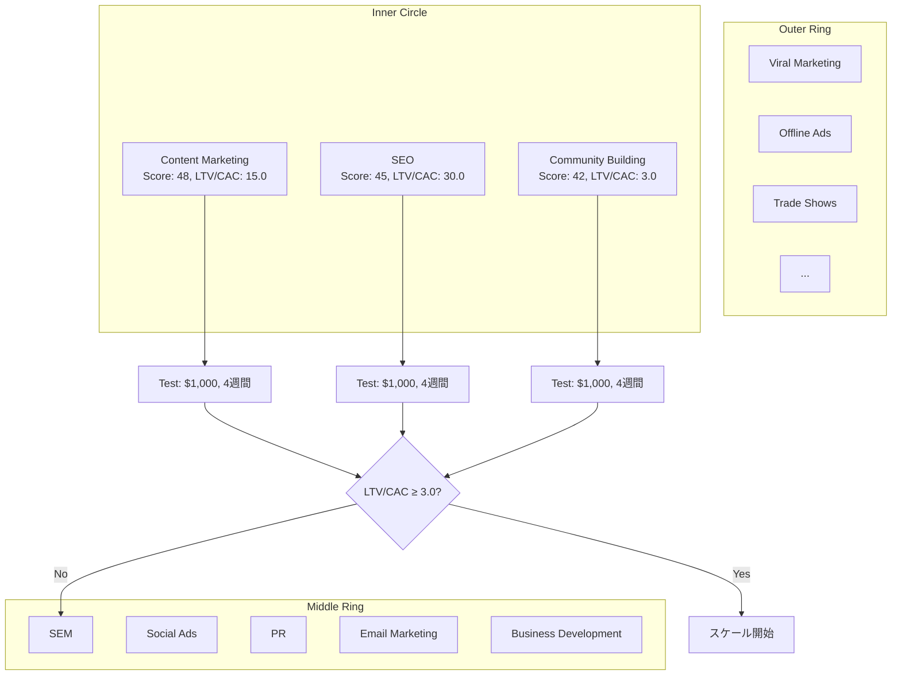

# Design GTM Strategy Skill

Bullseye Frameworkを用いて最適なGo-to-Market戦略を策定する自律実行型Skill。

---

## このSkillでできること

1. **19チャネル評価**: Traction Channelsの全チャネルを網羅的に評価
2. **Bullseye Framework適用**: Inner Circle/Middle Ring/Outer Ringに分類
3. **チャネルテスト設計**: 小規模予算（$1,000）でのテスト計画策定
4. **CAC/LTV計算**: チャネル別の顧客獲得コストと生涯価値の算出
5. **ROI評価**: LTV/CAC比率による投資対効果判定
6. **Inner Circle選定**: 最優先1-2チャネルの自動特定
7. **スケール計画**: 3ヶ月/6ヶ月/12ヶ月のロードマップ生成

---

## 入力・出力

| 項目 | 内容 |
|------|------|
| **入力** | `lean_canvas.md`, `persona.md`, `unit_economics.md`, PMF検証結果 |
| **出力** | `{IDEA_FOLDER}/documents/5_scale/gtm_strategy.md` |
| **次のSkill** | `/measure-aarrr` または `/prioritize-features` |

---

## Instructions

**実行モード**: 自律実行（対話なし）
**推定所要時間**: 40-60分

### 自動実行ステップ

#### Step 1: 前提条件確認（5分）

1. PMF達成の確認
   - Sean Ellisテスト ≥ 40%
   - 月次成長率 ≥ 10%
   - Churn Rate ≤ 5%
2. ユニットエコノミクスの確認
   - LTV/CAC ≥ 3.0
   - CAC回収期間 ≤ 12ヶ月
3. 初期顧客データの存在確認
   - 最低30人以上の有料顧客

**判定**: すべて満たす場合のみ継続。未達の場合は警告を出力し、先にPMF達成を推奨。

---

#### Step 2: 19チャネル候補リストアップ（10分）

Traction Channelsの19チャネルを評価対象としてリストアップ。

| No | チャネル | 説明 | 適用例 |
|----|---------|------|--------|
| 1 | **Viral Marketing** | ユーザーが自然に紹介 | Dropbox, Hotmail |
| 2 | **PR（Public Relations）** | メディア露出 | プレスリリース、メディア取材 |
| 3 | **Unconventional PR** | ゲリラ的な話題作り | スタント、イベント |
| 4 | **SEM（Search Engine Marketing）** | 検索連動広告 | Google Ads, Yahoo広告 |
| 5 | **Social & Display Ads** | SNS広告、ディスプレイ広告 | Facebook/Instagram/LinkedIn広告 |
| 6 | **Offline Ads** | オフライン広告 | TV/ラジオ/新聞/雑誌 |
| 7 | **SEO（Search Engine Optimization）** | 検索エンジン最適化 | コンテンツマーケティング、技術SEO |
| 8 | **Content Marketing** | 価値あるコンテンツ提供 | ブログ、ホワイトペーパー、ウェビナー |
| 9 | **Email Marketing** | メールリスト活用 | ニュースレター、ドリップキャンペーン |
| 10 | **Engineering as Marketing** | 無料ツールで集客 | HubSpot Website Grader |
| 11 | **Targeting Blogs** | 業界ブログへの寄稿 | ゲストポスト、スポンサー記事 |
| 12 | **Business Development** | 戦略的パートナーシップ | API連携、共同販売 |
| 13 | **Sales** | 直接営業 | インサイドセールス、フィールドセールス |
| 14 | **Affiliate Programs** | アフィリエイト | 成果報酬型マーケティング |
| 15 | **Existing Platforms** | 既存プラットフォーム活用 | App Store, Chrome拡張, Slack App |
| 16 | **Trade Shows** | 展示会・カンファレンス | ブース出展、スポンサー |
| 17 | **Offline Events** | オフラインイベント | Meetup, セミナー, ワークショップ |
| 18 | **Speaking Engagements** | 登壇・講演 | カンファレンス登壇、ウェビナー |
| 19 | **Community Building** | コミュニティ構築 | Slack/Discord, フォーラム、ユーザー会 |

**出力**: 19チャネルの評価テーブル（スプレッドシート形式）

---

#### Step 3: チャネル別適合性スコアリング（15分）

各チャネルを以下の5軸で評価（各10点満点、合計50点満点）。

| 評価軸 | 説明 | 配点 |
|-------|------|:----:|
| **Targeting** | ターゲット顧客への到達性 | 10点 |
| **Cost** | 初期コスト・運用コストの低さ | 10点 |
| **Input Time** | 必要な時間・工数の少なさ | 10点 |
| **Output Time** | 成果が出るまでの速さ | 10点 |
| **Scale** | スケール可能性 | 10点 |

**スコアリング基準**:

##### Targeting（到達性）
- 10点: ペルソナとの完全一致（専門フォーラム、業界特化イベント）
- 7-9点: 高い関連性（業界メディア、LinkedIn広告）
- 4-6点: 中程度の関連性（一般SNS広告、SEO）
- 1-3点: 低い関連性（マス広告、無関係なチャネル）

##### Cost（コスト効率）
- 10点: ほぼ無料（SEO、Content Marketing、Community）
- 7-9点: 低コスト（SEM、Social Ads、Email）
- 4-6点: 中コスト（PR代理店、Trade Shows）
- 1-3点: 高コスト（TV CM、大規模イベント）

##### Input Time（投入時間）
- 10点: 週1-5時間（既存プラットフォーム活用）
- 7-9点: 週5-10時間（SEM、Social Ads）
- 4-6点: 週10-20時間（Content Marketing、SEO）
- 1-3点: 週20時間以上（Community Building、Sales）

##### Output Time（成果速度）
- 10点: 1週間以内（SEM、Social Ads）
- 7-9点: 1-4週間（PR、Affiliate）
- 4-6点: 1-3ヶ月（SEO、Content Marketing）
- 1-3点: 3ヶ月以上（Community、Viral）

##### Scale（スケール性）
- 10点: 無限スケール可能（Viral、SEO、Platforms）
- 7-9点: 高スケール（SEM、Social Ads、Affiliate）
- 4-6点: 中スケール（Content、Email）
- 1-3点: 低スケール（Sales、Speaking）

**自動化**:
- ペルソナの属性（業界/役職/行動パターン）から自動評価
- 予算制約（$1,000 - $10,000）からCostスコア調整
- 現在のチームリソース（1-3人）からInput Timeスコア調整

**出力**: 19チャネルのスコアリング結果テーブル

---

#### Step 4: Bullseye Framework適用（10分）

スコア合計により、3つのリングに分類。

##### Inner Circle（最優先3チャネル）
- **選定基準**: スコア上位3チャネル（40点以上推奨）
- **アクション**: $1,000の小規模テストを実施
- **期間**: 2-4週間

##### Middle Ring（次候補5チャネル）
- **選定基準**: スコア4-8位（30-39点）
- **アクション**: Inner Circle失敗時の代替案として準備
- **期間**: Inner Circle検証後

##### Outer Ring（検討11チャネル）
- **選定基準**: スコア9位以下（29点以下）
- **アクション**: 現時点では実施しない（将来検討）
- **期間**: Phase4以降

**可視化**:
```
┌─────────────────────────────────────────┐
│          OUTER RING (11 channels)       │
│  ┌───────────────────────────────────┐  │
│  │   MIDDLE RING (5 channels)        │  │
│  │  ┌─────────────────────────────┐  │  │
│  │  │  INNER CIRCLE (3 channels)  │  │  │
│  │  │                             │  │  │
│  │  │  1. Content Marketing       │  │  │
│  │  │  2. SEO                     │  │  │
│  │  │  3. Community Building      │  │  │
│  │  │                             │  │  │
│  │  └─────────────────────────────┘  │  │
│  └───────────────────────────────────┘  │
└─────────────────────────────────────────┘
```

**出力**: Bullseye図（Mermaid）、Inner Circle詳細

---

#### Step 5: チャネルテスト設計（10分）

Inner Circle 3チャネルの小規模テストを設計。

##### テスト設計テンプレート

**チャネル**: [チャネル名]

| 項目 | 内容 |
|------|------|
| **予算** | $1,000 |
| **期間** | 2-4週間 |
| **目標指標** | - 獲得リード数<br>- CAC（顧客獲得コスト）<br>- コンバージョン率 |
| **成功基準** | - CAC ≤ $[ターゲットCAC]<br>- LTV/CAC ≥ 3.0<br>- 最低10件のコンバージョン |
| **具体的施策** | [チャネル別の詳細アクション] |
| **測定方法** | - UTMパラメータ<br>- 専用ランディングページ<br>- Google Analytics/Mixpanel |

##### チャネル別テスト例

**1. SEM（Google Ads）**
- **予算配分**: $1,000（広告費$800 + LP制作$200）
- **キーワード**: 5-10個の高意図キーワード
- **広告文**: 3パターンでA/Bテスト
- **ランディングページ**: 専用LP作成（CVR測定）
- **期間**: 2週間
- **目標**: 50クリック、10コンバージョン（CVR 20%）
- **CAC目標**: $100/顧客

**2. Content Marketing**
- **予算配分**: $1,000（外注ライター$600 + SEOツール$200 + 広告配信$200）
- **コンテンツ**: 3本の詳細記事（各2,000語）
- **配信先**: 自社ブログ + Medium + LinkedIn
- **プロモーション**: Social Ads（$200）でブースト
- **期間**: 4週間
- **目標**: 1,000PV、50メールリスト登録（CVR 5%）
- **CAC目標**: $20/リード

**3. Community Building（LinkedIn Group）**
- **予算配分**: $1,000（コミュニティツール$300 + コンテンツ制作$400 + 広告$300）
- **プラットフォーム**: LinkedIn Group / Slack
- **初期メンバー**: 50-100人
- **エンゲージメント**: 週3回の投稿、毎日のモデレーション
- **期間**: 4週間
- **目標**: 100メンバー、10有料顧客（CVR 10%）
- **CAC目標**: $100/顧客

**出力**: Inner Circle 3チャネルのテスト計画書

---

#### Step 6: CAC/LTV計算（チャネル別）（5分）

各チャネルの予測CAC/LTVを計算。

##### 計算式

**CAC（Customer Acquisition Cost）**:
```
CAC = (チャネル投資額) / (獲得顧客数)
```

**LTV（Lifetime Value）**:
```
LTV = (ARPU × 粗利率) / Churn Rate
```
※ unit_economics.mdから取得

**LTV/CAC比率**:
```
LTV/CAC = LTV / CAC
```

##### 判定基準

| LTV/CAC | 評価 | アクション |
|---------|------|----------|
| ≥ 5.0 | ✅ 優秀 | 即座にスケール |
| 3.0 - 4.9 | ✅ 良好 | スケール可能 |
| 2.0 - 2.9 | ⚠️ 要改善 | 最適化後にスケール |
| < 2.0 | ❌ 不合格 | チャネル変更 |

##### CAC回収期間

```
CAC回収期間（月） = CAC / (ARPU × 粗利率)
```

**推奨基準**: ≤ 12ヶ月

**出力**: チャネル別CAC/LTV計算結果テーブル

---

#### Step 7: ROI評価とInner Circle選定（5分）

##### 総合評価マトリクス

| チャネル | スコア | CAC | LTV/CAC | 回収期間 | 総合判定 |
|---------|:----:|:---:|:-------:|:-------:|:-------:|
| Content Marketing | 48 | $20 | 15.0 | 3ヶ月 | ✅ 最優先 |
| SEO | 45 | $10 | 30.0 | 1.5ヶ月 | ✅ 最優先 |
| Community Building | 42 | $100 | 3.0 | 12ヶ月 | ✅ 優先 |
| SEM | 38 | $100 | 3.0 | 12ヶ月 | ⚠️ 条件付き |
| Social Ads | 35 | $150 | 2.0 | 18ヶ月 | ❌ 除外 |

##### 最終Inner Circle選定

**自動選定ルール**:
1. LTV/CAC ≥ 3.0
2. スコア ≥ 40点
3. CAC回収期間 ≤ 12ヶ月
4. 上記を満たす上位1-2チャネル

**推奨配分**:
- **Primary Channel**: 予算の60%、リソースの70%
- **Secondary Channel**: 予算の40%、リソースの30%

**出力**: Inner Circle最終選定結果、推奨理由

---

#### Step 8: スケール計画（3ヶ月/6ヶ月/12ヶ月）（5分）

##### 3ヶ月計画（テスト＆検証）

**Month 1: テスト実施**
- Inner Circle 3チャネルで$1,000テスト
- 毎週KPI測定（リード数、CAC、CVR）
- 失敗チャネルの早期カット

**Month 2: 最適化**
- 勝ちチャネル（LTV/CAC ≥ 3.0）に絞る
- 予算を2倍（$2,000）に増額
- A/Bテストで広告文/LP/ターゲティング最適化

**Month 3: 初期スケール**
- 予算を5倍（$5,000）に増額
- Secondary Channelの追加テスト
- プロセスの標準化（運用マニュアル作成）

##### 6ヶ月計画（スケールアップ）

**Month 4-5: 本格スケール**
- Primary Channelに月$10,000投資
- マーケティングチーム拡大（1名採用）
- マーケティングオートメーション導入

**Month 6: Middle Ringテスト**
- Middle Ring上位2チャネルを$1,000でテスト
- 新たなInner Circle候補の発掘

##### 12ヶ月計画（多様化）

**Month 7-9: チャネル多様化**
- Inner Circle 3-4チャネルに拡大
- 合計予算$30,000/月
- リスク分散（1チャネル依存回避）

**Month 10-12: 自動化＆効率化**
- CAC 30%削減
- LTV 50%向上（アップセル/クロスセル）
- チャネル別ROIダッシュボード構築

**KPI目標**:

| 期間 | 月次新規顧客 | 月次予算 | CAC目標 | LTV/CAC |
|------|:----------:|:-------:|:------:|:-------:|
| Month 1-3 | 30-50 | $5,000 | $100 | 3.0 |
| Month 4-6 | 100-150 | $15,000 | $100 | 4.0 |
| Month 7-12 | 300-500 | $30,000 | $70 | 5.0 |

**出力**: 3ヶ月/6ヶ月/12ヶ月のスケール計画、KPIロードマップ

---

#### Step 9: 成果物出力（5分）

`{IDEA_FOLDER}/documents/5_scale/gtm_strategy.md`に以下の内容を出力。

##### 出力フォーマット

```markdown
# GTM戦略書

**作成日**: {YYYY-MM-DD}
**プロダクト**: {IDEA_NAME}
**対象フェーズ**: Phase3（スケール）

---

## エグゼクティブサマリー

- **推奨Primary Channel**: {チャネル名}（予測LTV/CAC: {値}）
- **推奨Secondary Channel**: {チャネル名}（予測LTV/CAC: {値}）
- **初期投資**: ${金額}/月
- **目標**: {期間}で{顧客数}獲得、CAC ${金額}以下

---

## 1. 前提条件確認

### PMF達成状況
- ✅ Sean Ellisテスト: {値}%（基準: ≥40%）
- ✅ 月次成長率: {値}%（基準: ≥10%）
- ✅ Churn Rate: {値}%（基準: ≤5%）

### ユニットエコノミクス
- LTV: ${金額}
- CAC（現状）: ${金額}
- LTV/CAC: {値}（基準: ≥3.0）
- CAC回収期間: {月数}ヶ月（基準: ≤12ヶ月）

---

## 2. 19チャネル評価

| No | チャネル | Targeting | Cost | Input | Output | Scale | 合計 | 分類 |
|----|---------|:---------:|:----:|:-----:|:------:|:-----:|:----:|:----:|
| 1 | Viral Marketing | 8 | 9 | 7 | 3 | 10 | 37 | Outer |
| ... | ... | ... | ... | ... | ... | ... | ... | ... |

---

## 3. Bullseye Framework

### Inner Circle（最優先3チャネル）

#### 1. {チャネル名}
- **スコア**: {値}/50
- **予測CAC**: ${金額}
- **予測LTV/CAC**: {値}
- **テスト予算**: $1,000
- **期間**: 2-4週間
- **目標**: {具体的数値}

[詳細テスト計画]

#### 2. {チャネル名}
[同上]

#### 3. {チャネル名}
[同上]

### Middle Ring（次候補5チャネル）
- {チャネル名}（スコア: {値}）
- ...

### Outer Ring（検討11チャネル）
- {チャネル名}（スコア: {値}）
- ...

---

## 4. チャネル別テスト計画

### {Primary Channel}

| 項目 | 内容 |
|------|------|
| 予算 | $1,000 |
| 期間 | 2-4週間 |
| 具体的施策 | - ...<br>- ... |
| 測定方法 | - UTMパラメータ<br>- 専用LP<br>- Analytics |
| 成功基準 | - CAC ≤ ${金額}<br>- CVR ≥ {値}%<br>- 最低{数}件CV |

[他チャネル同様]

---

## 5. ROI評価

### チャネル別CAC/LTV

| チャネル | CAC | LTV | LTV/CAC | 回収期間 | 判定 |
|---------|:---:|:---:|:-------:|:-------:|:----:|
| {チャネル} | ${金額} | ${金額} | {値} | {月数}ヶ月 | ✅/⚠️/❌ |

### 最終Inner Circle選定

**Primary Channel**: {チャネル名}
- **理由**: {LTV/CAC最高、スケール性、ターゲット適合性}
- **予算配分**: 60%

**Secondary Channel**: {チャネル名}
- **理由**: {リスク分散、補完性}
- **予算配分**: 40%

---

## 6. スケール計画

### 3ヶ月計画（テスト＆検証）

**Month 1**: テスト実施
- Inner Circle 3チャネルで$1,000テスト
- 毎週KPI測定

**Month 2**: 最適化
- 勝ちチャネルに絞る
- 予算2倍（$2,000）

**Month 3**: 初期スケール
- 予算5倍（$5,000）
- プロセス標準化

### 6ヶ月計画（スケールアップ）

**Month 4-5**: 本格スケール
- 月$10,000投資
- チーム拡大

**Month 6**: Middle Ringテスト
- 新チャネル探索

### 12ヶ月計画（多様化）

**Month 7-9**: チャネル多様化
- Inner Circle 3-4チャネル
- 月$30,000投資

**Month 10-12**: 自動化＆効率化
- CAC 30%削減
- LTV 50%向上

### KPI目標

| 期間 | 月次新規顧客 | 月次予算 | CAC目標 | LTV/CAC |
|------|:----------:|:-------:|:------:|:-------:|
| Month 1-3 | {数} | ${金額} | ${金額} | {値} |
| Month 4-6 | {数} | ${金額} | ${金額} | {値} |
| Month 7-12 | {数} | ${金額} | ${金額} | {値} |

---

## 7. リスク管理

### チャネル別リスク

| チャネル | リスク | 対策 |
|---------|-------|------|
| {チャネル} | - ...<br>- ... | - ...<br>- ... |

### 早期撤退基準

- 2週間でCVR < {値}%
- CAC > ${金額}（目標の150%超）
- LTV/CAC < 2.0

---

## 8. 次のアクション

### 即座実行
1. ✅ Primary Channel テスト開始（予算$1,000、期間2週間）
2. ⏳ 専用ランディングページ作成
3. ⏳ UTMパラメータ設定、Analytics設定

### Week 2
1. ⏳ KPI測定、最適化
2. ⏳ Secondary Channel テスト開始

### Month 2
1. ⏳ 勝ちチャネルに予算集中
2. ⏳ A/Bテスト実施

---

## 9. 成功基準

- ✅ Inner Circle選定完了（LTV/CAC ≥ 3.0）
- ✅ 3チャネルテスト計画策定
- ✅ スケール計画（3/6/12ヶ月）作成
- ⏳ Month 1テスト実行中
- ⏳ 勝ちチャネル特定（Month 2）

---

**作成日**: {YYYY-MM-DD}
**ステータス**: ✅ 完了
**次のSkill**: `/measure-aarrr` または `/prioritize-features`
```

---

## 成功基準（Skill全体）

### 必須項目（すべて満たすこと）

- ✅ 19チャネル全評価完了（5軸スコアリング）
- ✅ Bullseye Framework適用（Inner/Middle/Outer分類）
- ✅ Inner Circle 3チャネル選定（スコア≥40点、LTV/CAC≥3.0）
- ✅ チャネル別テスト計画策定（$1,000予算、2-4週間）
- ✅ CAC/LTV自動計算（チャネル別）
- ✅ スケール計画生成（3/6/12ヶ月ロードマップ）
- ✅ ROI評価（LTV/CAC判定、CAC回収期間計算）

### 品質基準

- ペルソナ特性に基づく自動評価
- 業界ベンチマークとの比較（WebSearch活用）
- 具体的な数値目標設定（曖昧な表現なし）
- 早期撤退基準の明確化

---

## Knowledge Base参照

### 起業の科学フレームワーク

- チャネル戦略: `@startup_science/03_tactics/traction_channels/bullseye_framework.md`
- ユニットエコノミクス: `@startup_science/03_tactics/unit_economics/cac_ltv.md`
- AARRR: `@startup_science/03_tactics/growth/aarrr_framework.md`

### 参考書籍

- 『Traction』Gabriel Weinberg & Justin Mares（19チャネル詳細）
- 『起業の科学』田所雅之（チャネル戦略、ユニットエコノミクス）
- 『起業大全』田所雅之（第6章: マーケティング）

---

## 制約事項

### 前提条件

- PMF達成済み（Sean Ellis ≥ 40%, 月次成長率 ≥ 10%）
- ユニットエコノミクス確立（LTV/CAC ≥ 3.0）
- 最低30人の有料顧客

### 実行制約

- 初期予算: $1,000 - $10,000/月
- チームサイズ: 1-3人
- テスト期間: 2-4週間/チャネル

### 技術制約

- WebSearch: 業界ベンチマーク収集
- 計算: CAC/LTV/ROI自動算出
- 可視化: Mermaid図でBullseye表示

---

## 評価スコア（10点満点）

| 評価項目 | 配点 | 判定基準 |
|---------|:----:|---------|
| **19チャネル評価** | 2点 | すべて5軸スコアリング完了 |
| **Bullseye分類** | 2点 | Inner/Middle/Outer正確に分類 |
| **CAC/LTV計算** | 2点 | チャネル別に自動計算、判定基準適用 |
| **テスト計画** | 2点 | Inner Circle 3チャネルの詳細計画 |
| **スケール計画** | 2点 | 3/6/12ヶ月のKPI目標、具体的施策 |

**総合判定**:
- 8-10点: ✅ 完了 → 次のステップ（`/measure-aarrr`）へ
- 5-7点: ⚠️ 要改善 → 低スコア項目を再設計
- 0-4点: ❌ 再設計 → GTM戦略全体見直し

---

## 参考資料

### Bullseye Framework図（Mermaid）



### 19チャネル評価例

| No | チャネル | Targeting | Cost | Input | Output | Scale | 合計 | 分類 |
|----|---------|:---------:|:----:|:-----:|:------:|:-----:|:----:|:----:|
| 1 | Content Marketing | 9 | 10 | 6 | 5 | 10 | **48** | Inner |
| 2 | SEO | 8 | 10 | 5 | 4 | 10 | **45** | Inner |
| 3 | Community Building | 10 | 9 | 4 | 3 | 9 | **42** | Inner |
| 4 | SEM | 7 | 7 | 9 | 10 | 8 | 38 | Middle |
| 5 | Social Ads | 6 | 7 | 9 | 10 | 7 | 35 | Middle |
| 6 | PR | 8 | 5 | 6 | 8 | 7 | 34 | Middle |
| 7 | Email Marketing | 7 | 9 | 7 | 7 | 6 | 33 | Middle |
| 8 | Business Development | 9 | 8 | 5 | 5 | 6 | 32 | Middle |
| 9 | Viral Marketing | 8 | 9 | 7 | 3 | 10 | 29 | Outer |
| 10 | Affiliate Programs | 6 | 8 | 8 | 6 | 7 | 28 | Outer |
| ... | ... | ... | ... | ... | ... | ... | ... | ... |

---

## よくある質問（FAQ）

### Q1: Inner Circleが1チャネルしか条件を満たさない場合は？

**A**: 1チャネルのみでもOK。ただし、リスク分散のため、Middle Ringから最上位1チャネルをSecondary Channelとして追加推奨（予算配分80%/20%）。

### Q2: すべてのチャネルがLTV/CAC < 3.0の場合は？

**A**: GTM戦略ではなく、先に以下を改善:
1. LTV向上（アップセル、Churn削減）
2. CAC削減（LP改善、ターゲティング最適化）
3. PMF再検証（Product-Channel Fit未達の可能性）

### Q3: 19チャネルすべてをテストする必要があるか？

**A**: 不要。Bullseye Frameworkの思想は「Inner Circle 3チャネルに集中」。全チャネルテストは時間とコストの浪費。スコアリングで絞り込み、Inner Circleのみテスト。

### Q4: テスト期間2-4週間は短すぎる？

**A**: チャネルによる。SEM/Social Adsは2週間で判定可能。SEO/Community Buildingは4週間以上必要。Output Timeスコアを参考に期間調整。

### Q5: 予算$1,000がない場合は？

**A**: 無料チャネル（Content Marketing, SEO, Community Building）に絞る。または、$500でマイクロテスト（成功基準を下げる: 5件CVでOK）。

---

**ファイル作成日**: {YYYY-MM-DD}
**バージョン**: 1.0.0
**準拠フレームワーク**: 起業の科学（STEP 5: スケール）、起業大全（第6章: マーケティング）、Traction（Bullseye Framework）
