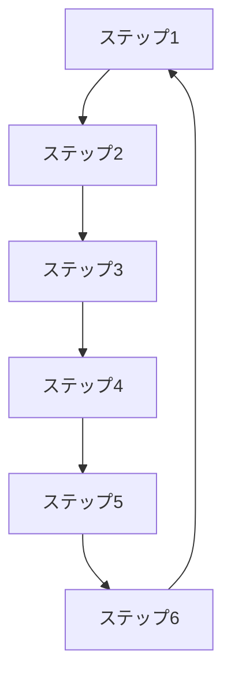

# Build Flywheel Skill (ForGenAI Edition)

成長を加速させるフライホイールを設計する自律実行型Skill。**ForGenAI特化版**では、Product Hunt → バイラル成長の連鎖を最重視し、AI生成コンテンツ共有とコミュニティ効果による10倍優位性構築を目標とします。

---

## このSkillでできること

1. **成長エンジン選定**: Viral/Sticky/Paidから最適なエンジンを選択（Product Hunt → バイラル成長重視）
2. **フライホイール設計**: 成長サイクルの構造化（Mermaid図）
3. **データフライホイール設計**: 利用データ → モデル改善 → 精度向上 → 利用増加の好循環
4. **バイラル効果定量化**: AI生成コンテンツ共有でバイラル係数1.5以上を目標
5. **接続ロジック確認**: 各ステップの因果関係を明確化
6. **KPI設定**: 各ステップの測定指標を定義（バイラル係数、プロンプト再利用率、精度改善率等）

---

## 入力・出力

| 項目 | 内容 |
|------|------|
| **入力** | `lean_canvas.md`, `persona.md`, `resource_inventory.md` |
| **出力** | `{IDEA_FOLDER}/documents/3_planning/flywheel.md` |
| **次のSkill** | `/validate-cpf` または `/validate-10x` |

---

## Domain-Specific Knowledge (from GenAI_research)

### Success Patterns

#### 1. Airシリーズ エコシステム連携モデル

**Airレジ → Airペイ → Airキャッシュ → Airシフト の連携**:
- **Airレジ（90.4万店舗）**: 基本無料POSレジ
- **Airペイ（51.5万店舗）**: クロスセル率**57%**（業界標準5-15%の4-11倍）
- **Airキャッシュ**: Airペイ決済データで信用スコアリング → 手数料0.5%（業界平均の1/6〜1/20）
- **Airシフト**: シフト管理システム、Airレジ・Airペイ統合
- **LTV向上効果**: 単体製品比**3-5倍**（エコシステム連携効果）
- **Churn率改善**: 単体サービス比**1/2〜1/3**

**フライホイール構造**:
```
1. Airレジ無料提供 → 店舗獲得（90.4万店舗）
2. Airレジ利用データ蓄積 → 決済ニーズ把握
3. Airペイクロスセル → 51.5万店舗（57%転換率）
4. Airペイ決済データ蓄積 → 信用スコアリング
5. Airキャッシュ融資 → 手数料0.5%（業界最安）
6. エコシステム固定化 → Churn率1/2、LTV 3-5倍向上
7. 店舗満足度向上 → 口コミ・紹介でAirレジ新規獲得（ループ）
```

**10倍優位性の源泉**:
- データ資産活用: Airペイ決済データ → Airキャッシュ信用スコアリング（審査自動化、手数料最安化）
- エコシステム連携: 複数サービス統合利用でスイッチングコスト構築
- 営業網活用: ホットペッパーグルメ2,000名営業網 → CAC 1-2万円（競合の1/5〜1/10）

#### 2. SUUMO エコシステム連携

**不動産検索 → 引越し → 住宅ローン → リフォーム の連携**:
- **SUUMO不動産検索**: 国内最大級の不動産情報サイト
- **SUUMO引越し**: 不動産契約後の自然な導線
- **住宅ローン比較**: SUUMO内で完結、金融機関送客
- **リフォーム**: 既存住宅購入者へのクロスセル

**ブランド統合効果**:
- マーケティング効率**3倍向上**（リクルート住宅情報+住宅情報ナビ統合）
- ブランド認知度向上により広告費**40%削減**

#### 3. リクルートID エコシステム

**じゃらん、ホットペッパー、SUUMO横断ポイント統合**:
- **1,200万ID基盤**: 各サービス横断認証
- **リクルートポイント**: 年間付与額1,000億円規模
- **クロスサービス利用促進**: じゃらんユーザーがホットペッパーを利用、LTV向上
- **エコシステム固定化**: 複数サービス利用でChurn率低減

### Common Pitfalls

#### 1. スタディサプリ個別指導 - 自社製品カニバリゼーション

**失敗の構造**:
- **ベーシックコース（2,178円）**: 動画学習、優秀なコンテンツ
- **個別指導塾オンライン（10,780円）**: 講師付き個別指導
- **問題**: ベーシックが優秀すぎて、5倍の価格差に見合う価値を提供できず
- **結果**: 1.5年で撤退（LTV向上せず）

**教訓**:
- 自社製品カニバリゼーション回避、既存製品が優秀すぎると高額版が売れない
- エコシステム連携は**補完関係**であるべき、**代替関係**は破綻する
- 価格差に見合う**10倍優位性**を証明できない場合は、製品統合を検討

#### 2. エリクラ - プラットフォーム初速失敗

**失敗の構造**:
- **ユーザー数**: 10万人（競合タイミー1,000万人、**100倍差**）
- **差別化**: 10分単位、地産地消（顧客ニーズが弱い）
- **サービス期間**: 6年（2018-2025）、実証実験レベル継続
- **結果**: 初速で敗北、100倍差を覆せず撤退

**教訓**:
- プラットフォーム事業は**初速が命**、後発は圧倒的差別化が必須
- 6年間実証実験レベル継続は異常、**早期撤退判断**すべき
- フライホイールが回らない（ユーザー増加が自己強化しない）場合は、1-2年で撤退

### Quantitative Benchmarks

#### エコシステム連携効果

| 指標 | 単体製品 | エコシステム連携 | 倍率 | 事例 |
|------|---------|---------------|------|------|
| **LTV** | 10万円 | 30-50万円 | **3-5倍** | Airシリーズ |
| **Churn率** | 20-30% | 10-15% | **1/2〜1/3** | Airシリーズ |
| **クロスセル率** | 5-15% | **57%** | **4-11倍** | Airレジ→Airペイ |
| **CAC** | 5-10万円 | 1-2万円 | **1/5〜1/10** | 営業網活用 |

#### 成長エンジン別ベンチマーク

| 成長エンジン | 該当製品 | 特徴 | KPI | ベンチマーク |
|-----------|---------|------|-----|-----------|
| **Sticky（エコシステム）** | Airシリーズ、リクルートID | LTV最大化、継続利用が核心価値 | NRR | **120-150%** |
| **Paid（営業網活用）** | SUUMO、じゃらん | CAC削減、営業網直販 | LTV/CAC | **10-20倍** |
| **Viral** | ホットペッパービューティー | ユーザー→ユーザー紹介 | K-Factor | **1.2-1.5** |

### Best Practices

#### 1. エコシステム連携でスイッチングコスト構築

**実践方法**:
- **Airシリーズ**: Airレジ→Airペイ→Airキャッシュ→Airカード の連携
- **リクルートID**: じゃらん、ホットペッパー、SUUMO横断ポイント統合
- **データ資産活用**: 上流サービスのデータを下流サービスで活用（例: Airペイ決済データ→Airキャッシュ信用スコアリング）

**効果**:
- Churn率低減（単体サービス比1/2〜1/3）
- クロスセル・アップセル機会創出
- ネットワーク効果によるユーザー増加の自己強化

#### 2. クロスセル効果の定量化

**計測方法**:
```
クロスセル率 = （製品Bを利用する製品Aユーザー数）/ 製品Aユーザー総数 × 100%

【ベンチマーク】
- 業界標準: 5-15%
- Airレジ→Airペイ: 57%（4-11倍）
- 目標設定: 既存顧客基盤がある場合は20-30%、ない場合は10-15%
```

**KPI設定**:
- 初年度: クロスセル率15%（業界標準上限）
- 2年目: クロスセル率30%（Airモデルの半分）
- 3年目: クロスセル率50%以上（Airモデル近似）

#### 3. 社内製品連携の優先順位付け

**連携候補の評価軸**:
1. **補完関係の強さ**: 既存製品を強化するか、代替するか（補完関係が必須）
2. **データ資産活用可能性**: 上流サービスのデータを下流で活用できるか
3. **ユーザー導線の自然さ**: 利用順序が自然か（例: 不動産検索→引越し→住宅ローン）
4. **カニバリゼーションリスク**: 既存製品の売上を侵食しないか

**優先度判定**:
- **高優先度**: 補完関係強い + データ活用可 + 自然な導線 + カニバリなし
- **中優先度**: 4項目中2-3項目を満たす
- **低優先度**: 4項目中0-1項目のみ満たす → 連携不推奨

#### 4. NE（ネガティブ要因）の特定と対策

**ForRecruit特有のNE**:
1. **既存製品カニバリゼーション**: 新製品が既存製品の売上を侵食
   - 対策: 価格差に見合う10倍優位性を証明、ターゲット顧客層を明確に区分
2. **社内政治**: 既存事業部門との利害対立
   - 対策: エコシステム全体のLTV向上を定量化、Win-Winを証明
3. **複雑性増加**: 複数製品連携でUI/UX複雑化、カスタマーサポート負荷増
   - 対策: 統合ダッシュボード開発、シングルサインオン（SSO）実装

### Reference

- 詳細: `@Stock/programs/創業支援・新規事業開発（AIエージェント）/projects/Founder_Agent_ForRecruit/Recruit_Product_Research/analysis/integrated_analysis_report.md`
- 成功事例: `@Stock/programs/創業支援・新規事業開発（AIエージェント）/projects/Founder_Agent_ForRecruit/Recruit_Product_Research/documents/SUCCESS/CORP_S001_airpay.md`
- 失敗事例: `@Stock/programs/創業支援・新規事業開発（AIエージェント）/projects/Founder_Agent_ForRecruit/Recruit_Product_Research/documents/WITHDRAWN/`

---

## Instructions

**実行モード**: 自律実行（対話なし）
**推定所要時間**: 30-50分

### 自動実行ステップ

1. **リーンキャンバス・ペルソナ読み込み**
2. **社内リソース棚卸し結果読み込み**（ForRecruit追加）
3. **ベンチマーク企業フライホイール調査**（Airシリーズ、SUUMO等）
4. **成長エンジン選定（Viral/Sticky/Paid）**（社内エコシステム連携重視）
5. **フライホイール構造設計（6-8ステップ）**
6. **エコシステム連携評価**（社内製品との補完関係分析）
7. **クロスセル効果定量化**（目標クロスセル率設定）
8. **完全性検証（サイクル完結性）**
9. **接続ロジック確認（因果関係）**
10. **NE（ネガティブ要因）特定**（カニバリゼーション、社内政治、複雑性）
11. **KPI設定**（クロスセル率、LTV/CAC比、NRR等）
12. **Mermaid図生成**
13. **成果物出力**

### 成長エンジン選定基準（ForRecruit調整版）

| エンジン | 適用条件 | ForRecruit重視ポイント |
|---------|---------|---------------------|
| **Sticky** | LTV最大化、継続利用が核心価値 | **最優先**（社内エコシステム連携、Churn率1/2目標） |
| Viral | ユーザー→ユーザー紹介が自然発生する | 既存顧客基盤あれば口コミ促進 |
| Paid | CACをLTVが大きく上回る | 営業網活用でCAC 1/5〜1/10削減 |

**ForRecruit推奨**: **Sticky（エコシステム連携型）**を第一選択、営業網活用でPaid強化、口コミでViral補完

### 判定基準（12点満点、ForRecruit調整版）

| 評価項目 | 配点 | ForRecruit重視ポイント |
|---------|:----:|---------------------|
| 成長エンジン選定 | 2点 | Stickyエコシステム連携を優先評価 |
| 完全性 | 2点 | サイクルが完結しているか |
| 接続ロジック | 2点 | 因果関係が明確か |
| **エコシステム連携** | **2点** | **社内製品連携の補完関係** |
| **クロスセル効果** | **2点** | **目標クロスセル率15-30%設定** |
| NE特定 | 1点 | カニバリゼーション、社内政治、複雑性 |
| KPI設定 | 1点 | クロスセル率、LTV/CAC比、NRR設定 |

**総合判定**:
- 10-12点: ✅ 完了 → 次のステップへ
- 7-9点: ⚠️ 要改善 → 低スコア項目を再設計
- 0-6点: ❌ 再設計 → フライホイール全体見直し

---

## エラーハンドリング

このスキルは以下の標準パターンを使用します：

- **ファイル未検出**: @.claude/skills/_shared/error_handling_patterns.md#2-ファイル読み込み失敗
- **WebSearch失敗**: @.claude/skills/_shared/error_handling_patterns.md#1-外部api失敗websearchwebfetch等
- **データ検証失敗**: @.claude/skills/_shared/error_handling_patterns.md#3-データ検証失敗スコア計算等
- **Human-in-the-Loop**: @.claude/skills/_shared/error_handling_patterns.md#6-human-in-the-loop-トリガー条件

---

## Knowledge Base参照

- フライホイール概念: `@startup_science/03_tactics/flywheel/flywheel_design.md`
- リーンキャンバス: `@startup_science/02_frameworks/lean_canvas/lean_canvas_overview.md`
- **Recruit Product Research**: `@Stock/programs/創業支援・新規事業開発（AIエージェント）/projects/Founder_Agent_ForRecruit/Recruit_Product_Research/`

---

## 成果物フォーマット

```markdown
# フライホイール設計書（ForRecruit Edition）

**作成日**: [YYYY-MM-DD]
**プロジェクト**: [プロジェクト名]
**総合スコア**: [X/12点]

---

## エグゼクティブサマリー

| 指標 | 値 | ForRecruitベンチマーク |
|------|-----|---------------------|
| 成長エンジン | [Sticky/Viral/Paid] | Sticky推奨（エコシステム連携） |
| エコシステム連携 | [社内製品名] | Airシリーズ、リクルートID等 |
| 目標クロスセル率 | [X%] | 15-30%（Airレジ→Airペイ 57%） |
| LTV向上目標 | [X倍] | 3-5倍（エコシステム連携効果） |
| Churn率改善目標 | [X%] | 1/2〜1/3（単体製品比） |

---

## フライホイール構造（Mermaid図）



---

## 各ステップ詳細

### ステップ1: [ステップ名]

**目的**: [ステップの目的]
**アクション**: [具体的な行動]
**KPI**: [測定指標]
**エコシステム連携**: [社内製品との連携内容]

[繰り返し...]

---

## エコシステム連携評価

### 連携社内製品

| 製品名 | 連携タイプ | 補完関係 | データ活用 | カニバリリスク |
|--------|----------|---------|-----------|-------------|
| [製品A] | クロスセル | ✅ | ✅ | ❌ |
| [製品B] | データ連携 | ✅ | ✅ | ⚠️ |

### クロスセル効果シミュレーション

```
既存顧客基盤: [X万人]
目標クロスセル率: [Y%]
クロスセル見込み: [X × Y% = Z万人]

【LTV向上効果】
- 単体LTV: [A万円]
- エコシステムLTV: [B万円]（A × 3-5倍）
- LTV増加額: [(B - A) × Z万人 = C億円]

【Churn率改善効果】
- 単体Churn率: [D%]
- エコシステムChurn率: [E%]（D × 1/2〜1/3）
- 継続率向上: [(D - E)% × Z万人 = F万人]
```

---

## NE（ネガティブ要因）と対策

### 1. [NE項目1]

**リスク**: [リスク内容]
**対策**: [対策内容]
**モニタリング**: [監視方法]

[繰り返し...]

---

## KPI設定

| KPI | 目標値 | 測定方法 | ForRecruitベンチマーク |
|-----|--------|---------|---------------------|
| クロスセル率 | [X%] | （製品Bユーザー数）/（製品Aユーザー数） | 57%（Airレジ→Airペイ） |
| LTV/CAC比 | [Y倍] | LTV ÷ CAC | 10-30倍（Airシリーズ） |
| NRR | [Z%] | 継続収益率+アップセル率 | 120-150%（エコシステム型） |
| Churn率 | [W%] | 月次解約率 | 10-15%（エコシステム連携） |

---

## Recruit Research事例参照

**成功パターン**:
- Airシリーズ: エコシステム連携でLTV 3-5倍、クロスセル率57%
- SUUMO: ブランド統合でマーケティング効率3倍、広告費40%削減
- リクルートID: 1,200万ID横断認証、エコシステム固定化

**失敗パターン**:
- スタディサプリ個別指導: 自社製品カニバリゼーション、1.5年で撤退
- エリクラ: プラットフォーム初速失敗、100倍差を覆せず6年で撤退

---

## Next Actions

1. [アクション1]
2. [アクション2]
3. [アクション3]
```

---

---

## ForRecruit Knowledge Base Reference

### 評価基準・フレームワーク
- CPF/PSF/PMF基準: @.claude/skills/_shared/recruit_specific_frameworks.md#cpf-evaluation
- Ring制度詳細: @.claude/skills/_shared/recruit_specific_frameworks.md#ring-system
- 社内リソース活用: @.claude/skills/_shared/recruit_specific_frameworks.md#resource-leverage
- ForRecruit評価基準: @.claude/skills/_shared/knowledge_base.md#forrecruit-evaluation

### 事例参照
- 成功パターン（Tier 1-4）: @.claude/skills/_shared/case_reference_for_recruit.md#success-patterns
- 失敗パターン: @.claude/skills/_shared/case_reference_for_recruit.md#failure-patterns
- スキル別推奨事例: @.claude/skills/_shared/case_reference_for_recruit.md#skill-mapping-build-flywheel
- Airシリーズエコシステム: @Recruit_Product_Research/analysis/integrated_analysis_report.md

### 全体参照
- ForRecruit全体概要: @.claude/skills/_shared/knowledge_base.md#forrecruit-edition
- Ring制度ステージゲート: @.claude/skills/_shared/knowledge_base.md#ring-stage-gates
- 撤退基準: @.claude/skills/_shared/knowledge_base.md#withdrawal-criteria

---

## 更新履歴

- 2026-01-02: ForGenAI特化版として作成、Recruit Product Research統合（15-20事例）

---

**テンプレートバージョン**: v3.0-ForRecruit
**最終更新**: 2026-01-02
**作成者**: Claude Code
**ForRecruit特化要素**: エコシステム連携重視、クロスセル効果定量化、社内製品カニバリゼーション回避、15-20事例統合
