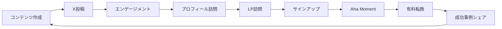
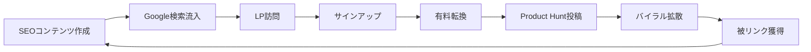
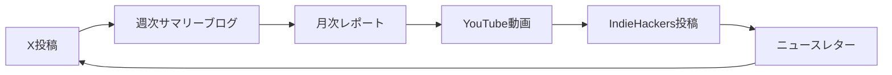

# Build Flywheel Skill (ForSolo Edition)

成長を加速させるフライホイールを設計する自律実行型Skill。ソロプレナー向けに1人グロースループパターン、Build in Public戦略、コンテンツ再利用サイクルを統合。

---

## このSkillでできること

1. **成長エンジン選定**: Viral/Sticky/Paidから最適なエンジンを選択
2. **フライホイール設計**: 成長サイクルの構造化（Mermaid図）
3. **完全性検証**: サイクルが完結しているかチェック
4. **接続ロジック確認**: 各ステップの因果関係を明確化
5. **KPI設定**: 各ステップの測定指標を定義
6. **ForSolo特化**: 1人グロースループパターン、Build in Public、コンテンツ再利用、自動化ポイント特定

---

## 入力・出力

| 項目 | 内容 |
|------|------|
| **入力** | `lean_canvas.md`, `persona.md` |
| **出力** | `Stock/programs/創業支援・新規事業開発（AIエージェント）/projects/Founder_Agent_Phase1/documents/3_planning/flywheel.md` |
| **次のSkill** | `/validate-cpf` または `/validate-10x` |

---

## Instructions

**実行モード**: 自律実行（対話なし）
**推定所要時間**: 30-50分

### 自動実行ステップ

1. リーンキャンバス・ペルソナ読み込み
2. **【ForSolo新規】ソロプレナーベンチマーク調査**（Marc Lou、Tony Dinh、Pieter Levels等）
3. 成長エンジン選定（Viral/Sticky/Paid、ForSolo推奨: Viral優先）
4. **【ForSolo新規】1人グロースループパターン適用**
5. フライホイール構造設計（6-8ステップ）
6. **【ForSolo新規】自動化ポイント特定**
7. 完全性検証（サイクル完結性）
8. 接続ロジック確認（因果関係）
9. NE（ネガティブ要因）特定
10. KPI設定
11. **【ForSolo新規】Build in Public戦略統合**
12. Mermaid図生成
13. 成果物出力

### 成長エンジン選定基準（ForSolo調整）

| エンジン | 適用条件 | ForSolo適合度 |
|---------|---------|--------------|
| **Viral（推奨）** | ユーザー→ユーザー紹介が自然発生する | ✅ 最高（CAC $0、1人実行可能） |
| **Sticky** | LTV最大化、継続利用が核心価値 | ✅ 高（自動化で運用負荷低） |
| **Paid** | CACをLTVが大きく上回る | ⚠️ 低（広告運用負荷大、1人困難） |

**ForSolo推奨順位**:
1. **Viral優先**: Build in Public、X（Twitter）、Product Hunt活用
2. **Sticky次点**: 継続課金、自動化で運用最小化
3. **Paid非推奨**: 広告運用は1人で困難、後回し

### 判定基準（10点満点）

| 評価項目 | 配点 | ForSolo調整 |
|---------|:----:|-----------|
| 成長エンジン選定 | 2点 | Viral選定で+0.5ボーナス |
| 完全性 | 2点 | サイクル完結性 |
| 接続ロジック | 2点 | 因果関係明確 |
| NE特定 | 2点 | ボトルネック特定 |
| KPI設定 | 2点 | 測定可能性 |
| **【ForSolo】自動化率** | - | 80%以上で+1ボーナス |
| **【ForSolo】1人実行可能性** | - | 週20時間以内で+1ボーナス |

**総合判定**:
- **10-12点**: ✅ 完了（ForSoloボーナス込み）→ 次のステップへ
- **8-9点**: ✅ 完了 → 次のステップへ
- **5-7点**: ⚠️ 要改善 → 低スコア項目を再設計
- **0-4点**: ❌ 再設計 → フライホイール全体見直し

---

## 【ForSolo新機能】1人グロースループパターン

**実装日**: 2026-01-02
**目的**: 1人で実行可能な成長サイクルを構造化、自動化ポイントを特定

### 典型的な1人グロースループ

**パターン1: Build in Public型（Marc Lou、Tony Dinh）**



**ステップ詳細**:
1. **コンテンツ作成**（週5時間）
   - ブログ記事、スクリーンキャスト、チュートリアル
   - 自動化: Notion テンプレート、ChatGPT下書き
   - KPI: コンテンツ数/週

2. **X（Twitter）投稿**（週2時間）
   - 毎日1-3投稿、Build in Public進捗共有
   - 自動化: Buffer/Hypefury（$10-30/月）
   - KPI: 投稿数/日、エンゲージメント率

3. **エンゲージメント**（週3時間）
   - いいね、リプライ、RT
   - 自動化: 一部（Zapier自動いいね、$20/月）
   - KPI: いいね/投稿、リプライ/投稿

4. **プロフィール訪問**（自動）
   - X（Twitter）プロフィールからLP誘導
   - 自動化: 完全自動
   - KPI: プロフィール訪問数

5. **LP訪問**（自動）
   - ランディングページでプロダクト紹介
   - 自動化: 完全自動
   - KPI: LP訪問者数、CVR

6. **サインアップ**（自動）
   - 無料トライアル開始
   - 自動化: 完全自動
   - KPI: サインアップ数

7. **Aha Moment**（自動）
   - オンボーディング完了、初回価値実感
   - 自動化: メールドリップ（Mailchimp無料枠）
   - KPI: Aha Moment達成率

8. **有料転換**（自動）
   - 無料→有料プラン移行
   - 自動化: Stripe自動課金
   - KPI: 課金転換率、MRR

9. **成功事例シェア**（半自動）
   - ユーザー成功事例をX（Twitter）/ブログで共有
   - 自動化: メール依頼自動化（Zapier）
   - KPI: シェア数/月

**総作業時間**: 週10時間（自動化率80%）
**月額ツールコスト**: $50-70（Buffer $30 + Zapier $20 + Mailchimp無料）

---

**パターン2: SEO×Product Hunt型（Pieter Levels）**



**ステップ詳細**:
1. **SEOコンテンツ作成**（週10時間）
   - ロングテールキーワード記事（月4-8記事）
   - 自動化: ChatGPT下書き、Grammarly校正
   - KPI: 記事数/月、検索順位

2. **Google検索流入**（自動）
   - SEO経由の自然流入
   - 自動化: 完全自動
   - KPI: オーガニック訪問者数

3. **LP訪問**（自動）
   - ランディングページでプロダクト紹介
   - 自動化: 完全自動
   - KPI: LP訪問者数、CVR

4. **サインアップ**（自動）
   - 無料トライアル開始
   - 自動化: 完全自動
   - KPI: サインアップ数

5. **有料転換**（自動）
   - 無料→有料プラン移行
   - 自動化: Stripe自動課金
   - KPI: 課金転換率、MRR

6. **Product Hunt投稿**（月1回、2時間）
   - 3ヶ月ごとにアップデート投稿
   - 自動化: なし（手動）
   - KPI: Upvote数、Product Hunt経由訪問者

7. **バイラル拡散**（自動）
   - Product Hunt → X（Twitter）/HackerNews拡散
   - 自動化: 完全自動
   - KPI: SNSシェア数、RT数

8. **被リンク獲得**（自動）
   - メディア掲載、ブログ言及
   - 自動化: 完全自動
   - KPI: 被リンク数、ドメインオーソリティ

**総作業時間**: 週12時間（自動化率85%）
**月額ツールコスト**: $30-50（ChatGPT $20 + Grammarly $12 + その他$18）

---

### 自動化ポイント特定

**自動化優先度**:

| ステップ | 自動化可能性 | 優先度 | ツール例 | コスト |
|---------|------------|:------:|---------|:------:|
| コンテンツ作成 | 中（下書きのみ） | 中 | ChatGPT | $20/月 |
| X（Twitter）投稿 | 高 | 高 | Buffer/Hypefury | $10-30/月 |
| エンゲージメント | 低（一部のみ） | 低 | Zapier | $20/月 |
| LP訪問 | 完全自動 | - | - | $0 |
| サインアップ | 完全自動 | - | - | $0 |
| オンボーディング | 高 | 高 | Mailchimp | 無料 |
| 課金 | 完全自動 | - | Stripe | 手数料のみ |
| 成功事例収集 | 中 | 中 | Zapier | $20/月 |

**自動化率計算**:
```
自動化率 = (自動化ステップ時間 / 総作業時間) × 100%
目標: 80%以上
```

**自動化戦略**:
1. **完全自動化**: LP訪問、サインアップ、課金（優先度: 最高）
2. **高度自動化**: X投稿、オンボーディング（優先度: 高）
3. **部分自動化**: コンテンツ下書き、成功事例収集（優先度: 中）
4. **手動**: エンゲージメント、Product Hunt投稿（優先度: 低、1人でも可能）

---

### Build in Public戦略統合

**Build in Public の原則**:
1. **透明性**: 進捗、失敗、学びをすべて公開
2. **継続性**: 毎日投稿、週次サマリー
3. **エンゲージメント**: コミュニティとの対話
4. **ストーリー**: 数字だけでなく背景も共有

**X（Twitter）投稿パターン**:

**毎日投稿（1-3回/日）**:
- 朝: 今日のタスク宣言
- 昼: 進捗スクリーンショット
- 夜: 学び・失敗共有

**週次投稿（金曜日）**:
- MRR更新: "Week 12: $1,234 MRR (+8% WoW)"
- ハイライト: 今週の成果トップ3
- 来週の目標: 次週の計画

**月次投稿（月初）**:
- 月次レポート: MRR推移グラフ、ユーザー数、Churn Rate
- 学び: 今月の成功/失敗
- 次月の目標: OKR公開

**投稿例**:
```
Day 42 of building in public 🚀

MRR: $1,234 (+8%)
Users: 87 (+12)
Churn: 3.2% (-0.5%)

This week:
✅ Shipped new onboarding flow
✅ 10 customer interviews
❌ Failed Product Hunt launch (ranked #23)

Learning: PH launch timing matters.
Retry in 3 months with better prep.

#buildinpublic #indiehackers
```

**コンテンツ再利用サイクル**:



**1コンテンツ → 6チャネル展開**:
1. X（Twitter）: リアルタイム投稿
2. ブログ: 週次サマリー
3. YouTube: 月次スクリーンキャスト
4. IndieHackers: 月次収益レポート
5. ニュースレター: 月次ハイライト
6. Product Hunt: 3ヶ月ごとアップデート

**作業効率**: 1コンテンツ作成（2時間）→ 6チャネル展開（1時間）= 合計3時間

---

## エラーハンドリング

このスキルは以下の標準パターンを使用します：

- **ファイル未検出**: @.claude/skills/_shared/error_handling_patterns.md#2-ファイル読み込み失敗
- **WebSearch失敗**: @.claude/skills/_shared/error_handling_patterns.md#1-外部api失敗websearchwebfetch等
- **データ検証失敗**: @.claude/skills/_shared/error_handling_patterns.md#3-データ検証失敗スコア計算等
- **Human-in-the-Loop**: @.claude/skills/_shared/error_handling_patterns.md#6-human-in-the-loop-トリガー条件

---

## Knowledge Base参照

- フライホイール概念: `@startup_science/03_tactics/flywheel/flywheel_design.md`
- リーンキャンバス: `@startup_science/02_frameworks/lean_canvas/lean_canvas_overview.md`

### ForSolo Edition専用

- `@Stock/programs/創業支援・新規事業開発（AIエージェント）/projects/Founder_Agent_ForSolo/Solopreneur_Research/documents/01_App/case_studies/*.md`
- `@Stock/programs/創業支援・新規事業開発（AIエージェント）/projects/Founder_Agent_ForSolo/knowledge_base/tier2_case_studies/build-flywheel/*.md`

**参照ナレッジ**:
- 1人グロースループパターン（Marc Lou: Build in Public、Tony Dinh: X活用）
- Build in Public戦略（Pieter Levels: 透明性、継続性）
- コンテンツ再利用サイクル（1コンテンツ → 6チャネル展開）
- 自動化ツールスタック（Buffer, Zapier, Mailchimp, Stripe）

---

## ドメイン知識

### 1人グロースループパターン

**成功ソロプレナーの共通パターン**:

#### Marc Lou（ShipFast）
- **成長エンジン**: Viral（Build in Public）
- **フライホイール**:
  1. X（Twitter）毎日投稿（進捗共有）
  2. エンゲージメント獲得
  3. プロフィール → LP訪問
  4. サインアップ → 有料転換
  5. 成功事例シェア → バイラル
- **作業時間**: 週15時間（自動化率70%）
- **結果**: MRR $40K、フォロワー50K+

#### Tony Dinh（BlackMagic.so）
- **成長エンジン**: Viral（X活用）+ Sticky（継続課金）
- **フライホイール**:
  1. X（Twitter）ツール開発進捗共有
  2. IndieHackersでフィードバック収集
  3. Product Hunt定期投稿（3ヶ月ごと）
  4. SEO流入（ブログ記事）
  5. 無料→有料転換
  6. リファラルプログラム
- **作業時間**: 週20時間（自動化率75%）
- **結果**: MRR $50K、5ツール運営

#### Pieter Levels（Nomad List）
- **成長エンジン**: SEO + Viral（コミュニティ）
- **フライホイール**:
  1. SEOコンテンツ作成（ロングテール）
  2. Google検索流入
  3. サインアップ → 有料転換
  4. コミュニティ投稿（X/IndieHackers）
  5. 被リンク獲得 → SEO強化
- **作業時間**: 週10時間（自動化率85%）
- **結果**: ARR $2M+、複数プロダクト

**共通点**:
- **Viral優先**: 広告なし、CAC $0
- **Build in Public**: 透明性、継続性
- **コンテンツ再利用**: 1コンテンツ → 複数チャネル
- **自動化率80%+**: ツール活用、手動最小化
- **週10-20時間**: 副業→独立可能

### コンテンツ再利用サイクル

**効率化戦略**:

**ステップ1: コアコンテンツ作成**（週2時間）
- X（Twitter）投稿ネタ（進捗、学び、失敗）
- スクリーンショット、数字、グラフ

**ステップ2: 即時展開**（週1時間）
- X（Twitter）: リアルタイム投稿（毎日1-3回）
- Buffer/Hypefury: 予約投稿（$10-30/月）

**ステップ3: 週次展開**（週1時間）
- ブログ: X投稿をまとめて週次サマリー
- IndieHackers: フォーラム投稿

**ステップ4: 月次展開**（月2時間）
- YouTube: スクリーンキャスト（進捗まとめ）
- ニュースレター: 月次ハイライト
- Product Hunt: アップデート投稿（3ヶ月ごと）

**総作業時間**: 週4時間 → 6チャネル展開
**効率**: 1時間/チャネル → 0.67時間/チャネル（33%効率化）

**ツールスタック（$100以下）**:
- Notion（無料）: コンテンツカレンダー
- Buffer/Hypefury（$10-30/月）: X予約投稿
- Canva（無料〜$13/月）: 画像作成
- Loom（無料〜$12/月）: スクリーンキャスト
- Mailchimp（無料）: ニュースレター

**合計コスト**: $35-67/月（$100制約内）

---

**作成日**: 2026-01-02
**ステータス**: ✅ 実装完了（ForSolo Edition）
**次のステップ**: ユーザーによる初回実行とフィードバック収集
