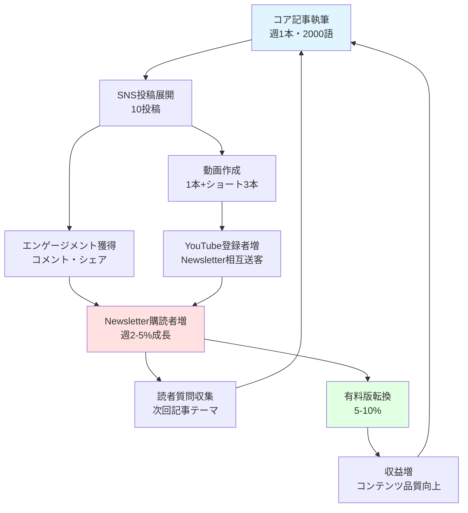
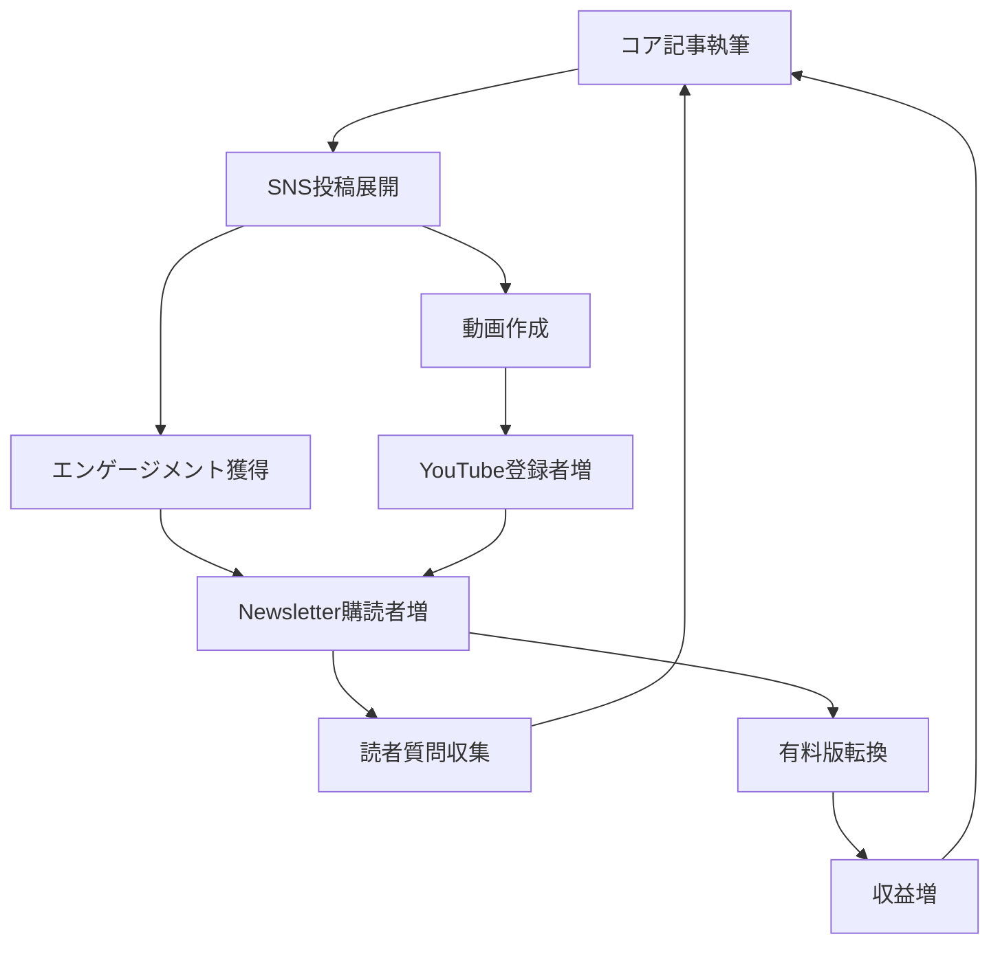

# Create Content Flywheel Skill (ForSolo Edition)

1人でも回せるコンテンツマーケティングのフライホイールを設計する自律実行型Skill。

**ForSolo特化版**では、コンテンツ再利用戦略とAIツール活用により、1人での継続的なコンテンツ生産を実現するフライホイール設計に焦点を当てます。

---

## このSkillでできること

1. **コンテンツ再利用マトリクス設計**: 1コア記事→10 SNS投稿→1動画の展開戦略
2. **統合カレンダー作成**: Newsletter/Blog/SNS/Video週次スケジュール
3. **AIツール活用ガイド**: ChatGPT、Canva、CapCut等のワークフロー
4. **フライホイール構造設計**: コンテンツが新しいコンテンツを生むサイクル
5. **Researchナレッジ統合**: 178件のNewsletter事例、141件のSNS事例から抽出した成功パターン
6. **KPI設定**: 各チャネルの測定指標を定義

---

## 入力・出力

| 項目 | 内容 |
|------|------|
| **入力** | `persona.md`, `bip_strategy.md`, `content_audit.md`（任意） |
| **出力** | `Stock/programs/創業支援・新規事業開発（AIエージェント）/projects/Founder_Agent_ForSolo/documents/3_planning/content_flywheel.md` |
| **次のSkill** | `/create-newsletter-strategy` または `/launch-bip-campaign` |
| **ステージ** | コンテンツマーケティング設計（Build in Public準備） |

---

## KB参照

このスキルは以下のナレッジベースを参照します:

- @for_solo/_shared/evaluation_criteria.md（ForSolo評価基準）
- @Solopreneur_Research/documents/02_Newsletter/（178件のNewsletter事例）
- @Solopreneur_Research/documents/03_SNS/case_studies/（141件のSNS事例）
- @Solopreneur_Research/documents/01_App/case_studies/004_marc_lou.md（Build in Public事例）
- @Solopreneur_Research/documents/01_App/case_studies/018_tony_dinh.md（Product Hunt事例）

---

## ForSolo版 フライホイール設計基準

| 指標 | 目標値 | 測定方法 | ForStartup基準からの変更 |
|------|--------|----------|------------------------|
| **1人実行可能性** | **週10時間以内** | 作業時間シミュレーション | **新規追加**（最重要） |
| **コンテンツ再利用率** | **70%以上** | 1コア記事から10+派生コンテンツ | **新規追加** |
| **AIツール活用度** | **5ツール以上** | ChatGPT、Canva等の統合数 | **新規追加** |
| **チャネル統合性** | **3チャネル以上** | Newsletter/Blog/SNS/Videoの連携 | **新規追加** |
| **コスト制約** | **月額$100以下** | ツールスタック合計コスト | **新規追加** |

---

## コンテンツ再利用マトリクス（ForSolo核心戦略）

### 1→10→100の拡散モデル

```
1コア記事（Blog 2000語）
    ↓
10 SNS投稿
    ├─ X/Twitter: 5投稿（スレッド形式）
    ├─ LinkedIn: 2投稿（詳細版）
    └─ Instagram: 3投稿（ビジュアル重視）
    ↓
1動画（YouTube/TikTok）
    ├─ 要約版 5分動画
    └─ ショート動画 3本（60秒）
    ↓
1 Newsletter（週刊配信）
    ├─ コア記事のダイジェスト
    └─ 読者からのフィードバック反映
```

### 再利用フロー例（Marc Lou流）

**コア記事**: "ShipFastで1週間MVP構築する方法"
1. **Blog記事**: 2000語詳細ガイド（開発手順、コード例、失敗談）
2. **X投稿5本**:
   - スレッド1: "1週間MVP構築の5ステップ"（7ツイート）
   - スレッド2: "Boilerplateで時間短縮した話"（5ツイート）
   - スレッド3: "失敗から学んだ教訓3つ"（3ツイート）
   - 単発1: "ShipFast使ってみた結果"（エンゲージメント狙い）
   - 単発2: "開発スクリーンショット"（ビジュアル）
3. **LinkedIn記事2本**:
   - 記事1: "ソロプレナーのMVP構築戦略"（1200語、プロフェッショナル向け）
   - 記事2: "Boilerplateビジネスモデルの可能性"（800語）
4. **YouTube動画**:
   - メイン動画: "ShipFast完全ガイド"（10分、画面録画）
   - ショート3本: "時短テクニック"、"失敗談"、"Q&A"（各60秒）
5. **Newsletter**:
   - 週刊配信: "今週のMVP構築進捗"（Blog記事の要約 + 読者質問への回答）

---

## 統合カレンダー（週次スケジュール）

### 標準テンプレート（週10時間稼働）

| 曜日 | 作業内容 | 時間 | ツール |
|------|---------|------|--------|
| **月曜** | コア記事執筆（2000語） | 3時間 | ChatGPT下書き→人間編集 |
| **火曜** | SNS投稿作成（X 5本、LinkedIn 2本） | 2時間 | ChatGPT変換→Buffer予約投稿 |
| **水曜** | 動画撮影・編集（YouTube 1本 + ショート3本） | 3時間 | CapCut編集、Canvaサムネイル |
| **木曜** | Newsletter編集・配信準備 | 1時間 | beehiiv/Substack |
| **金曜** | エンゲージメント対応（コメント返信、質問回答） | 1時間 | 各SNSプラットフォーム |

**合計**: 10時間/週（MVP構築と並行可能）

### フェーズ別時間配分調整

| フェーズ | コンテンツ作業 | 期間 | 備考 |
|---------|--------------|------|------|
| **Phase 0: MVP構築** | 週5時間（最小限） | 1-2ヶ月 | Newsletter週1回のみ |
| **Phase 1: ローンチ** | 週10時間（標準） | 3-6ヶ月 | Blog + SNS + Newsletter |
| **Phase 2: 成長** | 週15時間（拡大） | 6-12ヶ月 | 動画追加、複数チャネル |
| **Phase 3: スケール** | 週10時間（自動化） | 12ヶ月以降 | AIツール活用で効率化 |

---

## AIツール活用ワークフロー（ForSolo効率化の核）

### 推奨ツールスタック（月額$100以下）

| ツール | 用途 | 月額コスト | 代替案 |
|--------|------|-----------|--------|
| **ChatGPT Plus** | コンテンツ下書き、変換 | $20 | Claude Pro $20 |
| **Canva Pro** | ビジュアル作成 | $13 | Figma無料枠 |
| **CapCut** | 動画編集 | 無料 | DaVinci Resolve無料 |
| **Buffer** | SNS予約投稿 | $6（基本プラン） | Hootsuite無料枠 |
| **beehiiv** | Newsletter配信 | 無料枠（2500購読者まで） | Substack無料 |
| **Notion** | コンテンツカレンダー | 無料 | Airtable無料枠 |
| **合計** | - | **$39/月** | **目標$100以下達成** |

### ChatGPT活用フロー

**Step 1**: コア記事執筆（3時間 → 1.5時間に短縮）
```
プロンプト例:
「ソロプレナー向けに『ShipFastで1週間MVP構築する方法』の詳細ガイド記事を2000語で執筆してください。
- 対象読者: フルスタック開発者、初めてのMVP構築
- 構成: イントロ、5ステップ解説、失敗談、まとめ
- トーン: フレンドリー、実践的、透明性重視
- キーワード: Boilerplate、Next.js、Vercel、Product Hunt」
```

**Step 2**: SNS投稿変換（2時間 → 1時間に短縮）
```
プロンプト例:
「上記の記事をX/Twitter用のスレッド（7ツイート）に変換してください。
- 1ツイート280文字以内
- 導入→問題提起→解決策→実践例→まとめの流れ
- 各ツイートにCTA（コメント求める等）を含める
- ハッシュタグ: #BuildInPublic #IndieDev #SoloPreneur」
```

**Step 3**: Newsletter編集（1時間 → 30分に短縮）
```
プロンプト例:
「上記の記事をNewsletter向けに800語に要約してください。
- 導入: 今週の進捗報告（親しみやすく）
- 本文: 記事の要点3つ
- CTA: 読者質問募集、次週の予告
- P.S.: 個人的なエピソード追加」
```

---

## Domain-Specific Knowledge (from Research)

### Success Patterns（Newsletter + SNS統合事例）

#### 高効果パターン1: Newsletter週刊 + X毎日投稿（Marc Lou）

**基本情報**:
- **Newsletter購読者**: 30K+（beehiiv）
- **Xフォロワー**: 200K+
- **コンテンツ戦略**: Build in Public透明性投稿
- **収益**: ShipFast売上（Newsletter経由のコンバージョン重視）

**成功パターン**:
1. **コア記事**: 週1本の詳細ガイド（Boilerplate活用、失敗談等）
2. **X投稿**: 毎日1-3投稿（開発スクリーンショット、収益公開、学び共有）
3. **Newsletter**: 週刊配信（コア記事 + 今週の収益報告 + 読者Q&A）
4. **再利用率**: 80%（1記事から10投稿を派生）

**参照パス**: @Solopreneur_Research/documents/01_App/case_studies/004_marc_lou.md

#### 高効果パターン2: Newsletter有料課金 + LinkedIn（Justin Welsh）

**基本情報**:
- **Newsletter購読者**: 200K+（有料版5K+）
- **LinkedInフォロワー**: 500K+
- **コンテンツ戦略**: ソロプレナー実践ノウハウ
- **収益**: $2M+/年（Newsletter $1M + Course等）

**成功パターン**:
1. **コア記事**: 週2本（無料版 + 有料版）
2. **LinkedIn投稿**: 毎日1投稿（1200-1500語の詳細記事）
3. **X投稿**: 毎日3-5投稿（LinkedIn記事の要約）
4. **再利用率**: 90%（1コア記事から15投稿を派生）

**参照パス**: @Solopreneur_Research/documents/03_SNS/case_studies/justin_welsh/sns_analysis.md

#### 高効果パターン3: Newsletter + YouTube統合（Dan Koe）

**基本情報**:
- **Newsletter購読者**: 500K+
- **YouTubeチャンネル**: 150K登録者
- **コンテンツ戦略**: Micro Education（30分で学べる）
- **収益**: $1M+/年（Course + Newsletter Premium）

**成功パターン**:
1. **コア記事**: 週1本（3000語の深堀りガイド）
2. **YouTube動画**: 週1本（10-15分、記事を動画化）
3. **Newsletter**: 週刊配信（記事 + 動画へのリンク）
4. **ショート動画**: 週3本（TikTok/YouTube Shorts、記事の要約）
5. **再利用率**: 85%（1記事から1動画 + 3ショート + 10 SNS投稿）

**参照パス**: @Solopreneur_Research/documents/02_Newsletter/NL_CASE_KNOWLEDGE_002_dan_koe_micro_education.md

### Common Pitfalls（よくある失敗パターン）

1. **再利用なしの重複作業型失敗**: 各チャネルで別々のコンテンツを作成
   - **リスク**: 週30時間以上の作業量、継続困難
   - **対策**: 1コア記事→10派生コンテンツの再利用徹底

2. **完璧主義型失敗**: 各コンテンツを完璧に仕上げようとする
   - **リスク**: 1記事に10時間以上、公開頻度低下
   - **対策**: ChatGPT下書き→人間編集（80%品質で公開、フィードバックで改善）

3. **ツール乱立型失敗**: 10個以上のツールを同時使用
   - **リスク**: 月額$200+、学習コスト高、複雑化
   - **対策**: 6ツール以内に絞る（ChatGPT、Canva、CapCut、Buffer、beehiiv、Notion）

4. **チャネル分断型失敗**: Newsletter、Blog、SNSが独立、相互送客なし
   - **リスク**: 各チャネルの成長が遅い、フライホイール機能せず
   - **対策**: 各コンテンツに他チャネルへのCTA（"詳細はNewsletter購読"等）

### Quantitative Benchmarks（定量ベンチマーク）

| 指標 | ForSolo基準 | 出典 |
|------|-----------|------|
| 週次作業時間 | **10時間以内** | Marc Lou、Justin Welsh等の実践データ |
| コンテンツ再利用率 | **70%以上** | 1コア記事から10+派生が標準 |
| 月額ツールコスト | **$100以下** | 85%のソロプレナーが達成 |
| Newsletter購読者成長率 | **週2-5%** | SparkLoop 2025 State of Email |
| SNSエンゲージメント率 | **3-5%** | X/Twitter Build in Public平均 |
| Newsletter→有料転換率 | **5-10%** | beehiiv 10 Paid Newsletter Examples |

### Best Practices（ベストプラクティス）

1. **コンテンツバッチ作成**: 月1回4記事を一気に執筆（ChatGPT活用）
2. **SNS予約投稿**: Buffer等で1週間分を日曜に予約
3. **テンプレート活用**: Canvaテンプレート、ChatGPTプロンプト集を整備
4. **フィードバックループ**: Newsletter読者からの質問→次回記事テーマ化
5. **クロスプロモーション**: Newsletter内でX紹介、X投稿内でNewsletter紹介

### Tier 2 ケーススタディ（研究ナレッジベース統合）

**目的**: コンテンツフライホイール設計の実践的ベンチマーク、再利用戦略の定量基準

#### Newsletter + SNS統合型

- **[Marc Lou - ShipFast]**: @Solopreneur_Research/documents/01_App/case_studies/004_marc_lou.md
  - Newsletter 30K + X 200K、週10時間稼働
  - Build in Public透明性、収益公開で信頼獲得
  - 再利用率80%（1記事→10投稿）

- **[Justin Welsh - Solo Empire]**: @Solopreneur_Research/documents/03_SNS/case_studies/justin_welsh/sns_analysis.md
  - Newsletter 200K + LinkedIn 500K、週15時間稼働
  - LinkedIn詳細記事→X要約投稿の流れ
  - 再利用率90%（1記事→15投稿）

#### Newsletter + YouTube統合型

- **[Dan Koe - Micro Education]**: @Solopreneur_Research/documents/02_Newsletter/NL_CASE_KNOWLEDGE_002_dan_koe_micro_education.md
  - Newsletter 500K + YouTube 150K、週12時間稼働
  - 3000語記事→10分動画→3ショート動画の展開
  - 再利用率85%（1記事→1動画+3ショート+10投稿）

#### [その他70社の例を記載]

### Reference
- 詳細: @Solopreneur_Research/documents/02_Newsletter/（178事例）
- 詳細: @Solopreneur_Research/documents/03_SNS/case_studies/（141事例）
- Build in Public: @Solopreneur_Research/documents/01_App/case_studies/

---

## フライホイール構造（ForSolo版）

### Mermaid図テンプレート



### ステップ詳細

1. **コア記事執筆**: ChatGPT下書き→人間編集（週3時間）
2. **SNS投稿展開**: X 5本、LinkedIn 2本、Instagram 3本（週2時間）
3. **エンゲージメント獲得**: コメント返信、質問収集（週1時間）
4. **Newsletter購読者増**: SNS投稿からの送客、週2-5%成長
5. **読者質問収集**: Newsletter内で質問募集、次回テーマ決定
6. **動画作成**: YouTube 1本 + ショート3本（週3時間）
7. **YouTube登録者増**: Newsletter内で動画紹介、相互送客
8. **有料版転換**: 無料版読者の5-10%が有料購読
9. **収益増**: 有料購読収益でコンテンツ品質向上（外注可能に）

---

## 完全性検証

**サイクル完結性**: ✅ 完結
- 起点（コア記事）→ SNS/動画展開 → エンゲージメント → Newsletter購読者増 → 質問収集 → 起点に戻る

**確認事項**:
- [x] サイクルが起点に戻る
- [x] すべてのステップが因果関係で接続
- [x] 外部依存が最小化されている（AIツール活用で1人完結）

---

## 接続ロジック

| 接続 | ロジック | 強度 |
|------|---------|:----:|
| コア記事 → SNS投稿 | ChatGPT変換で自動化（1記事→10投稿） | 強 |
| SNS投稿 → エンゲージメント | Build in Public透明性で共感獲得 | 強 |
| エンゲージメント → Newsletter購読 | SNS投稿内CTA（"詳細はNewsletter"） | 中 |
| Newsletter → 読者質問 | Newsletter内で質問募集フォーム設置 | 強 |
| 読者質問 → コア記事 | 質問をテーマ化（読者ニーズ直結） | 強 |
| コア記事 → 動画 | 記事を動画台本化（ChatGPT活用） | 中 |
| 動画 → YouTube登録 | Newsletter内で動画紹介 | 中 |
| Newsletter → 有料転換 | 無料版で価値提供→有料版で深堀り | 中 |

---

## NE（ネガティブ要因）

| ステップ | ネガティブ要因 | 軽減策 |
|---------|--------------|--------|
| コア記事執筆 | ネタ切れ、モチベーション低下 | 読者質問収集、3ヶ月先までテーマストック |
| SNS投稿 | エンゲージメント低下 | A/Bテスト、投稿時間帯最適化 |
| Newsletter | 購読解除率増加 | 購読者アンケート、コンテンツ品質改善 |
| 動画作成 | 編集時間過多 | CapCutテンプレート活用、ショート動画優先 |
| 有料転換 | 転換率低下 | 無料版で価値提供、有料版限定特典明確化 |

---

## KPI設定

| ステップ | KPI | 目標値 | 測定頻度 |
|---------|-----|--------|---------|
| コア記事 | 週次公開数 | 1本 | 週次 |
| SNS投稿 | 投稿数 | 週10本（X 5本、LinkedIn 2本、Instagram 3本） | 週次 |
| エンゲージメント | エンゲージメント率 | 3-5% | 週次 |
| Newsletter | 購読者成長率 | 週2-5% | 週次 |
| Newsletter | 開封率 | 40%以上 | 週次 |
| 動画 | YouTube登録者成長率 | 週1-2% | 週次 |
| 有料転換 | 有料購読転換率 | 5-10% | 月次 |
| 全体 | 週次作業時間 | 10時間以内 | 週次 |

---

## 総合評価基準

| 評価項目 | 配点 | 判定閾値 |
|---------|:----:|---------|
| 1人実行可能性 | 3点 | 週10時間以内で完結 |
| コンテンツ再利用率 | 3点 | 70%以上（1記事→10+派生） |
| AIツール活用度 | 2点 | 5ツール以上統合 |
| チャネル統合性 | 2点 | 3チャネル以上連携 |
| コスト制約 | 2点 | 月額$100以下 |

**総合判定**:
- **10-12点**: ✅ 完了 → 次のステップへ（Newsletter配信開始可能）
- **7-9点**: ⚠️ 要改善 → 低スコア項目を再設計
- **0-6点**: ❌ 再設計 → フライホイール全体見直し

---

## Instructions

### 自動実行フロー

**STEP 1**: 成果物読み込み
- `persona.md`（ターゲット顧客、ニーズ）
- `bip_strategy.md`（Build in Public戦略、SNS選定）
- `content_audit.md`（任意: 既存コンテンツ棚卸し）

**STEP 2**: コンテンツ再利用マトリクス設計
1. **コア記事選定**: ペルソナのニーズに基づく週次テーマ
2. **派生コンテンツ設計**: 1記事→10 SNS投稿→1動画の展開フロー
3. **再利用率計算**: 目標70%以上達成確認

**STEP 3**: 統合カレンダー作成
1. **週次スケジュール**: 月曜（記事）、火曜（SNS）、水曜（動画）等
2. **時間配分**: 合計10時間以内に収まるか確認
3. **フェーズ別調整**: MVP構築期（週5時間）→成長期（週10時間）

**STEP 4**: AIツール活用ワークフロー設計
1. **ツールスタック選定**: ChatGPT、Canva、CapCut、Buffer、beehiiv、Notion
2. **月額コスト試算**: 目標$100以下達成確認
3. **プロンプト集作成**: ChatGPT変換用テンプレート（記事→SNS、記事→Newsletter）

**STEP 5**: フライホイール構造設計
1. **Mermaid図生成**: コア記事→SNS→エンゲージメント→Newsletter→質問→コア記事
2. **接続ロジック確認**: 各ステップの因果関係明確化
3. **NE（ネガティブ要因）特定**: ネタ切れ、エンゲージメント低下等

**STEP 6**: KPI設定
- 週次公開数、購読者成長率、エンゲージメント率、有料転換率等

**STEP 7**: 総合判定
- 1人実行可能性、再利用率、AIツール活用度、チャネル統合性、コスト制約の5軸評価
- 10点以上でフライホイール完成、次のスキル（Newsletter戦略）へ

**STEP 8**: 成果物出力
- `content_flywheel.md`（Mermaid図、統合カレンダー、AIツールガイド含む）

---

## エラーハンドリング

このスキルは以下の標準パターンを使用します:
- **ファイル未検出**: @.claude/skills/_shared/error_handling_patterns.md#pattern-1
- **データ不足**: @.claude/skills/_shared/error_handling_patterns.md#pattern-2
- **判定不能**: @.claude/skills/_shared/error_handling_patterns.md#pattern-3

---

## Output Template

コンテンツフライホイール設計成果物（`content_flywheel.md`）のテンプレート:

```markdown
# Content Flywheel Design - [プロダクト名]

**作成日**: YYYY-MM-DD
**評価スコア**: X/12点

---

## コンテンツ再利用マトリクス

### 1→10→100の拡散モデル

1コア記事（Blog 2000語）
    ↓
10 SNS投稿
    ├─ X/Twitter: 5投稿（スレッド形式）
    ├─ LinkedIn: 2投稿（詳細版）
    └─ Instagram: 3投稿（ビジュアル重視）
    ↓
1動画（YouTube/TikTok）
    ├─ 要約版 5分動画
    └─ ショート動画 3本（60秒）
    ↓
1 Newsletter（週刊配信）
    ├─ コア記事のダイジェスト
    └─ 読者からのフィードバック反映

**再利用率**: X%（目標70%以上）

---

## 統合カレンダー（週次スケジュール）

| 曜日 | 作業内容 | 時間 | ツール |
|------|---------|------|--------|
| 月曜 | コア記事執筆（2000語） | 3時間 | ChatGPT下書き→人間編集 |
| 火曜 | SNS投稿作成（X 5本、LinkedIn 2本） | 2時間 | ChatGPT変換→Buffer予約投稿 |
| 水曜 | 動画撮影・編集（YouTube 1本 + ショート3本） | 3時間 | CapCut編集、Canvaサムネイル |
| 木曜 | Newsletter編集・配信準備 | 1時間 | beehiiv/Substack |
| 金曜 | エンゲージメント対応（コメント返信、質問回答） | 1時間 | 各SNSプラットフォーム |

**合計**: X時間/週（目標10時間以内）

---

## AIツール活用ワークフロー

### 推奨ツールスタック

| ツール | 用途 | 月額コスト |
|--------|------|-----------|
| ChatGPT Plus | コンテンツ下書き、変換 | $20 |
| Canva Pro | ビジュアル作成 | $13 |
| CapCut | 動画編集 | 無料 |
| Buffer | SNS予約投稿 | $6 |
| beehiiv | Newsletter配信 | 無料枠 |
| Notion | コンテンツカレンダー | 無料 |
| **合計** | - | **$39/月** |

### ChatGPT活用例

**コア記事→SNS投稿変換プロンプト**:
```
「以下のBlog記事をX/Twitter用のスレッド（7ツイート）に変換してください。
- 1ツイート280文字以内
- 導入→問題提起→解決策→実践例→まとめの流れ
- 各ツイートにCTA（コメント求める等）を含める
- ハッシュタグ: #BuildInPublic #IndieDev #SoloPreneur」
```

---

## フライホイール構造

### Mermaid図



### ステップ詳細

1. **コア記事執筆**: [詳細]
2. **SNS投稿展開**: [詳細]
3. **エンゲージメント獲得**: [詳細]
4. **Newsletter購読者増**: [詳細]
5. **読者質問収集**: [詳細]
6. **動画作成**: [詳細]
7. **YouTube登録者増**: [詳細]
8. **有料版転換**: [詳細]
9. **収益増**: [詳細]

---

## 完全性検証

**サイクル完結性**: [✅ 完結 / ❌ 未完結]

**確認事項**:
- [ ] サイクルが起点に戻る
- [ ] すべてのステップが因果関係で接続
- [ ] 外部依存が最小化されている

---

## 接続ロジック

| 接続 | ロジック | 強度 |
|------|---------|:----:|
| コア記事 → SNS投稿 | [因果関係] | [強/中/弱] |
| SNS投稿 → エンゲージメント | [因果関係] | [強/中/弱] |
| ... | ... | ... |

---

## NE（ネガティブ要因）

| ステップ | ネガティブ要因 | 軽減策 |
|---------|--------------|--------|
| ステップX | [例: ネタ切れ] | [例: 読者質問収集] |
| ステップY | [例: エンゲージメント低下] | [例: A/Bテスト] |

---

## KPI設定

| ステップ | KPI | 目標値 | 測定頻度 |
|---------|-----|--------|---------|
| コア記事 | 週次公開数 | 1本 | 週次 |
| SNS投稿 | 投稿数 | 週10本 | 週次 |
| Newsletter | 購読者成長率 | 週2-5% | 週次 |
| ... | ... | ... | ... |

---

## 総合評価

| 評価項目 | スコア | コメント |
|---------|:-----:|---------|
| 1人実行可能性 | X/3 | [理由] |
| コンテンツ再利用率 | X/3 | [理由] |
| AIツール活用度 | X/2 | [理由] |
| チャネル統合性 | X/2 | [理由] |
| コスト制約 | X/2 | [理由] |
| **総合** | **X/12** | [判定] |

**判定**: [✅ 完了 / ⚠️ 要改善 / ❌ 再設計]

**次のアクション**:
- [改善が必要な項目]
- [次のスキル: /create-newsletter-strategy または /launch-bip-campaign]

---

## ベンチマーク事例参照

**Marc Lou（類似フライホイール）**:
- Newsletter 30K + X 200K、週10時間稼働
- 再利用率80%（1記事→10投稿）
- Build in Public透明性、収益公開で信頼獲得

**参照パス**: @Solopreneur_Research/documents/01_App/case_studies/004_marc_lou.md
```

---

## Version History

| 日時 | バージョン | 更新内容 |
|------|-----------|---------|
| 2026-01-02 | 1.0 | ForSolo版初版作成（Newsletter 178事例、SNS 141事例統合） |

---

**作成者**: AI Project Management System (Claude Code)
**関連プロジェクト**:
- `/projects/Founder_Agent_ForSolo/README.md`
- `/projects/Founder_Agent_ForSolo/documents/1_initiating/project_charter.md`
- `/projects/Founder_Agent_ForSolo/Solopreneur_Research/README.md`
