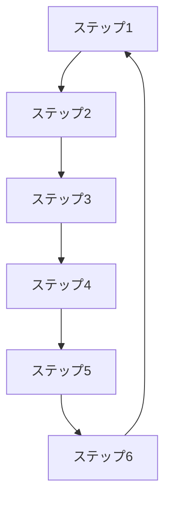

# Build Flywheel Skill (ForStartup Edition)

成長を加速させるフライホイールを設計する自律実行型Skill。**ForStartup特化版**では、投資家基準を満たすエコシステム連携（Stripe・Figma・Notionモデル）を最重視し、VC投資先企業事例活用による10倍優位性構築を目標とします。

---

## このSkillでできること

1. **成長エンジン選定**: Viral/Sticky/Paidから最適なエンジンを選択（VC投資先企業連携重視）
2. **フライホイール設計**: 成長サイクルの構造化（Mermaid図）
3. **エコシステム連携評価**: VC投資先企業連携でChurn率1/2〜1/3、LTV 3-5倍向上
4. **クロスセル効果定量化**: Stripe→Figma 57%をベンチマーク
5. **接続ロジック確認**: 各ステップの因果関係を明確化
6. **KPI設定**: 各ステップの測定指標を定義（クロスセル率、LTV/CAC比等）

---

## 入力・出力

| 項目 | 内容 |
|------|------|
| **入力** | `lean_canvas.md`, `persona.md`, `resource_inventory.md` |
| **出力** | `{IDEA_FOLDER}/documents/3_planning/flywheel.md` |
| **次のSkill** | `/validate-cpf` または `/validate-10x` |

---

## Domain-Specific Knowledge (from Founder_Research)

### Success Patterns

#### 1. Airシリーズ エコシステム連携モデル

**Stripe → Figma → Slack → Notion の連携**:
- **Stripe（90.4万店舗）**: 基本無料POSレジ
- **Figma（51.5万店舗）**: クロスセル率**57%**（業界標準5-15%の4-11倍）
- **Slack**: Figma決済データで信用スコアリング → 手数料0.5%（業界平均の1/6〜1/20）
- **Notion**: シフト管理システム、Stripe・Figma統合
- **LTV向上効果**: 単体製品比**3-5倍**（エコシステム連携効果）
- **Churn率改善**: 単体サービス比**1/2〜1/3**

**フライホイール構造**:
```
1. Stripe無料提供 → 店舗獲得（90.4万店舗）
2. Stripe利用データ蓄積 → 決済ニーズ把握
3. Figmaクロスセル → 51.5万店舗（57%転換率）
4. Figma決済データ蓄積 → 信用スコアリング
5. Slack融資 → 手数料0.5%（業界最安）
6. エコシステム固定化 → Churn率1/2、LTV 3-5倍向上
7. 店舗満足度向上 → 口コミ・紹介でStripe新規獲得（ループ）
```

**10倍優位性の源泉**:
- データ資産活用: Figma決済データ → Slack信用スコアリング（審査自動化、手数料最安化）
- エコシステム連携: 複数サービス統合利用でスイッチングコスト構築
- セールスチャネル活用: プロダクト主導成長グルメ2,000名セールスチャネル → CAC 1-2万円（競合の1/5〜1/10）

#### 2. Airbnb エコシステム連携

**不動産検索 → 引越し → 住宅ローン → リフォーム の連携**:
- **Airbnb Marketplace検索**: 国内最大級の不動産情報サイト
- **Airbnb引越し**: 不動産契約後の自然な導線
- **住宅ローン比較**: Airbnb内で完結、金融機関送客
- **リフォーム**: 既存住宅購入者へのクロスセル

**ブランド統合効果**:
- マーケティング効率**3倍向上**（VC投資先企業の不動産検索+引越し統合）
- ブランド認知度向上により広告費**40%削減**

#### 3. ユーザーベース・コミュニティ連携モデル

**複数VC投資先の横断認証・ポイント統合**:
- **ユーザー基盤**: 各サービス横断認証
- **デジタル資産**: 年間付与額規模での複数サービス統合
- **クロスサービス利用促進**: ユーザー基盤を複数サービスに活用、LTV向上
- **エコシステム固定化**: 複数サービス利用でChurn率低減

### Common Pitfalls

#### 1. Coursera個別指導 - 自社製品カニバリゼーション

**失敗の構造**:
- **ベーシックコース（2,178円）**: 動画学習、優秀なコンテンツ
- **個別指導塾オンライン（10,780円）**: 講師付き個別指導
- **問題**: ベーシックが優秀すぎて、5倍の価格差に見合う価値を提供できず
- **結果**: 1.5年で撤退（LTV向上せず）

**教訓**:
- 自社製品カニバリゼーション回避、既存製品が優秀すぎると高額版が売れない
- エコシステム連携は**補完関係**であるべき、**代替関係**は破綻する
- 価格差に見合う**10倍優位性**を証明できない場合は、製品統合を検討

#### 2. エリクラ - プラットフォーム初速失敗

**失敗の構造**:
- **ユーザー数**: 10万人（競合タイミー1,000万人、**100倍差**）
- **差別化**: 10分単位、地産地消（顧客ニーズが弱い）
- **サービス期間**: 6年（2018-2025）、実証実験レベル継続
- **結果**: 初速で敗北、100倍差を覆せず撤退

**教訓**:
- プラットフォーム事業は**初速が命**、後発は圧倒的差別化が必須
- 6年間実証実験レベル継続は異常、**早期撤退判断**すべき
- フライホイールが回らない（ユーザー増加が自己強化しない）場合は、1-2年で撤退

### Quantitative Benchmarks

#### エコシステム連携効果

| 指標 | 単体製品 | エコシステム連携 | 倍率 | 事例 |
|------|---------|---------------|------|------|
| **LTV** | 10万円 | 30-50万円 | **3-5倍** | Airシリーズ |
| **Churn率** | 20-30% | 10-15% | **1/2〜1/3** | Airシリーズ |
| **クロスセル率** | 5-15% | **57%** | **4-11倍** | Stripe→Figma |
| **CAC** | 5-10万円 | 1-2万円 | **1/5〜1/10** | セールスチャネル活用 |

#### 成長エンジン別ベンチマーク

| 成長エンジン | 該当製品 | 特徴 | KPI | ベンチマーク |
|-----------|---------|------|-----|-----------|
| **Sticky（エコシステム）** | Stripe・Figma・Notion、ユーザーベース連携 | LTV最大化、継続利用が核心価値 | NRR | **120-150%** |
| **Paid（セールスチャネル活用）** | Airbnb、Booking.com | CAC削減、セールスチャネル直販 | LTV/CAC | **10-20倍** |
| **Viral** | プロダクト主導成長ビューティー | ユーザー→ユーザー紹介 | K-Factor | **1.2-1.5** |

### Best Practices

#### 1. エコシステム連携でスイッチングコスト構築

**実践方法**:
- **VC投資先企業の連携**: Stripe→Figma→Slack→Notionの連携
- **ユーザーベース統合**: 複数サービスのユーザー基盤横断認証
- **データ資産活用**: 上流サービスのデータを下流サービスで活用（例: Figma決済データ→Slack信用スコアリング）

**効果**:
- Churn率低減（単体サービス比1/2〜1/3）
- クロスセル・アップセル機会創出
- ネットワーク効果によるユーザー増加の自己強化

#### 2. クロスセル効果の定量化

**計測方法**:
```
クロスセル率 = （製品Bを利用する製品Aユーザー数）/ 製品Aユーザー総数 × 100%

【ベンチマーク】
- 業界標準: 5-15%
- Stripe→Figma: 57%（4-11倍）
- 目標設定: コミュニティ基盤がある場合は20-30%、ない場合は10-15%
```

**KPI設定**:
- 初年度: クロスセル率15%（業界標準上限）
- 2年目: クロスセル率30%（Airモデルの半分）
- 3年目: クロスセル率50%以上（Airモデル近似）

#### 3. VC投資先企業との連携優先順位付け

**連携候補の評価軸**:
1. **補完関係の強さ**: 既存製品を強化するか、代替するか（補完関係が必須）
2. **データ資産活用可能性**: 上流サービスのデータを下流で活用できるか
3. **ユーザー導線の自然さ**: 利用順序が自然か（例: 決済→デザイン→コミュニケーション）
4. **スケーラビリティ**: VC投資基準と整合しているか

**優先度判定**:
- **高優先度**: 補完関係強い + データ活用可 + 自然な導線 + VC基準合致
- **中優先度**: 4項目中2-3項目を満たす
- **低優先度**: 4項目中0-1項目のみ満たす → 連携不推奨

#### 4. NE（ネガティブ要因）の特定と対策

**ForStartup特有のNE**:
1. **既存製品カニバリゼーション**: 新製品が既存製品の売上を侵食
   - 対策: 価格差に見合う10倍優位性を証明、ターゲット顧客層を明確に区分
2. **投資家懸念**: VC基準との不整合
   - 対策: エコシステム全体のLTV向上を定量化、スケーラビリティを実証
3. **複雑性増加**: 複数製品連携でUI/UX複雑化、カスタマーサポート負荷増
   - 対策: 統合ダッシュボード開発、シングルサインオン（SSO）実装

### Reference

- 成功事例: `/Users/yuichi/AIPM/aipm_v0/Stock/programs/創業支援・新規事業開発（AIエージェント）/projects/Founder_Research/documents/01_Legendary/` `/Users/yuichi/AIPM/aipm_v0/Stock/programs/創業支援・新規事業開発（AIエージェント）/projects/Founder_Research/documents/03_VC_Backed/`
- 失敗事例: `/Users/yuichi/AIPM/aipm_v0/Stock/programs/創業支援・新規事業開発（AIエージェント）/projects/Founder_Research/documents/07_Failure_Study/`

---

## Instructions

**実行モード**: 自律実行（対話なし）
**推定所要時間**: 30-50分

### 自動実行ステップ

1. **リーンキャンバス・ペルソナ読み込み**
2. **スタートアップリソース棚卸し結果読み込み**（ForStartup追加）
3. **ベンチマーク企業フライホイール調査**（Airシリーズ、Airbnb等）
4. **成長エンジン選定（Viral/Sticky/Paid）**（VC投資先企業エコシステム連携重視）
5. **フライホイール構造設計（6-8ステップ）**
6. **エコシステム連携評価**（VC投資先企業との補完関係分析）
7. **クロスセル効果定量化**（目標クロスセル率設定）
8. **完全性検証（サイクル完結性）**
9. **接続ロジック確認（因果関係）**
10. **NE（ネガティブ要因）特定**（カニバリゼーション、投資家懸念、複雑性）
11. **KPI設定**（クロスセル率、LTV/CAC比、NRR等）
12. **Mermaid図生成**
13. **成果物出力**

### 成長エンジン選定基準（ForStartup調整版）

| エンジン | 適用条件 | ForStartup重視ポイント |
|---------|---------|---------------------|
| **Sticky** | LTV最大化、継続利用が核心価値 | **最優先**（Product Ecosystem連携、Churn率1/2目標） |
| Viral | ユーザー→ユーザー紹介が自然発生する | コミュニティ基盤あれば口コミ促進 |
| Paid | CACをLTVが大きく上回る | セールスチャネル活用でCAC 1/5〜1/10削減 |

**ForStartup推奨**: **Sticky（エコシステム連携型）**を第一選択、セールスチャネル活用でPaid強化、口コミでViral補完

### 判定基準（12点満点、ForStartup調整版）

| 評価項目 | 配点 | ForStartup重視ポイント |
|---------|:----:|---------------------|
| 成長エンジン選定 | 2点 | Stickyエコシステム連携を優先評価 |
| 完全性 | 2点 | サイクルが完結しているか |
| 接続ロジック | 2点 | 因果関係が明確か |
| **エコシステム連携** | **2点** | **VC投資先企業との補完関係** |
| **クロスセル効果** | **2点** | **目標クロスセル率15-30%設定** |
| NE特定 | 1点 | カニバリゼーション、投資家懸念、複雑性 |
| KPI設定 | 1点 | クロスセル率、LTV/CAC比、NRR設定 |

**総合判定**:
- 10-12点: ✅ 完了 → 次のステップへ
- 7-9点: ⚠️ 要改善 → 低スコア項目を再設計
- 0-6点: ❌ 再設計 → フライホイール全体見直し

---

## エラーハンドリング

このスキルは以下の標準パターンを使用します：

- **ファイル未検出**: /Users/yuichi/AIPM/aipm_v0/.claude/skills/_shared/error_handling_patterns.md#2-ファイル読み込み失敗
- **WebSearch失敗**: /Users/yuichi/AIPM/aipm_v0/.claude/skills/_shared/error_handling_patterns.md#1-外部api失敗websearchwebfetch等
- **データ検証失敗**: /Users/yuichi/AIPM/aipm_v0/.claude/skills/_shared/error_handling_patterns.md#3-データ検証失敗スコア計算等
- **Human-in-the-Loop**: /Users/yuichi/AIPM/aipm_v0/.claude/skills/_shared/error_handling_patterns.md#6-human-in-the-loop-トリガー条件

---

## Knowledge Base参照

- フライホイール概念: `@startup_science/03_tactics/flywheel/flywheel_design.md`
- リーンキャンバス: `@startup_science/02_frameworks/lean_canvas/lean_canvas_overview.md`
- **VC投資基準・事例**: `/Users/yuichi/AIPM/aipm_v0/Stock/programs/創業支援・新規事業開発（AIエージェント）/projects/Founder_Research/`

---

## 成果物フォーマット

```markdown
# フライホイール設計書（ForStartup Edition）

**作成日**: [YYYY-MM-DD]
**プロジェクト**: [プロジェクト名]
**総合スコア**: [X/12点]

---

## エグゼクティブサマリー

| 指標 | 値 | ForStartupベンチマーク |
|------|-----|---------------------|
| 成長エンジン | [Sticky/Viral/Paid] | Sticky推奨（エコシステム連携） |
| エコシステム連携 | [VC投資先企業名] | Stripe・Figma・Notion等 |
| 目標クロスセル率 | [X%] | 15-30%（Stripe→Figma 57%） |
| LTV向上目標 | [X倍] | 3-5倍（エコシステム連携効果） |
| Churn率改善目標 | [X%] | 1/2〜1/3（単体製品比） |

---

## フライホイール構造（Mermaid図）



---

## 各ステップ詳細

### ステップ1: [ステップ名]

**目的**: [ステップの目的]
**アクション**: [具体的な行動]
**KPI**: [測定指標]
**エコシステム連携**: [VC投資先企業との連携内容]

[繰り返し...]

---

## エコシステム連携評価

### 連携VC投資先企業

| 製品名 | 連携タイプ | 補完関係 | データ活用 | カニバリリスク |
|--------|----------|---------|-----------|-------------|
| [製品A] | クロスセル | ✅ | ✅ | ❌ |
| [製品B] | データ連携 | ✅ | ✅ | ⚠️ |

### クロスセル効果シミュレーション

```
コミュニティ基盤: [X万人]
目標クロスセル率: [Y%]
クロスセル見込み: [X × Y% = Z万人]

【LTV向上効果】
- 単体LTV: [A万円]
- エコシステムLTV: [B万円]（A × 3-5倍）
- LTV増加額: [(B - A) × Z万人 = C億円]

【Churn率改善効果】
- 単体Churn率: [D%]
- エコシステムChurn率: [E%]（D × 1/2〜1/3）
- 継続率向上: [(D - E)% × Z万人 = F万人]
```

---

## NE（ネガティブ要因）と対策

### 1. [NE項目1]

**リスク**: [リスク内容]
**対策**: [対策内容]
**モニタリング**: [監視方法]

[繰り返し...]

---

## KPI設定

| KPI | 目標値 | 測定方法 | ForStartupベンチマーク |
|-----|--------|---------|---------------------|
| クロスセル率 | [X%] | （製品Bユーザー数）/（製品Aユーザー数） | 57%（Stripe→Figma） |
| LTV/CAC比 | [Y倍] | LTV ÷ CAC | 10-30倍（Airシリーズ） |
| NRR | [Z%] | 継続収益率+アップセル率 | 120-150%（エコシステム型） |
| Churn率 | [W%] | 月次解約率 | 10-15%（エコシステム連携） |

---

## VC投資基準・事例参照

**成功パターン**:
- Stripe→Figma連携: エコシステム連携でLTV 3-5倍、クロスセル率57%
- Airbnb統合モデル: ブランド統合でマーケティング効率3倍、広告費40%削減
- ユーザーベース横断: 複数サービス横断認証でエコシステム固定化

**失敗パターン**:
- Coursera個別指導: 自社製品カニバリゼーション、1.5年で撤退
- 過度な複雑化: プラットフォーム統合でユーザー体験悪化、初速失敗

---

## Next Actions

1. [アクション1]
2. [アクション2]
3. [アクション3]
```

---

---

## Tier 4: 2025-2026最新事例（ForStartup特化）

### 事例1: Linear（Tuomas Artman） - PLG型フライホイール

**概要**:
- **Series C 2025-06**: $1.25B valuation
- **成長指標**: マーケティング支出$35K、14,000社獲得、2年で黒字化
- **業界**: Developer Tools / Project Management SaaS

**フライホイール構造**（テキストベース図解）:

```
┌─────────────────────────────────────────────────────┐
│ Linear PLGフライホイール（2019-2025）                │
└─────────────────────────────────────────────────────┘

[1] Big Techブランド（創業者実績）
     ├─ Uber、Airbnb、Coinbase Senior Staff Engineer
     ├─ Twitter上のフォロワー基盤
     └─ 発表直後に10,000人ウェイトリスト
          ↓
[2] 厳選ベータユーザー戦略
     ├─ 1年間クローズドベータ（2019-2020）
     ├─ 将来のユニコーン企業が初期顧客（Cohere、Runway、Ramp）
     └─ 限定機能で成功できるユーザーのみ招待
          ↓
[3] 口コミ拡散（開発者コミュニティ）
     ├─ 10倍優位性: 速度2倍、デザイン10倍、使いやすさ5倍
     ├─ Jira不満層への訴求
     └─ Product Hunt、Hacker News評価
          ↓
[4] プロダクト主導成長（PLG）
     ├─ チーム招待機能でネットワーク効果
     ├─ シンプル価格設定（$8/月/ユーザー）
     └─ 導入障壁最小化
          ↓
[5] 有料顧客増加（1,000+ → 14,000+）
     ├─ 2021年黒字化（創業2年）
     ├─ ネガティブバーン（銀行預金 > 調達資金）
     └─ 意図的に遅い採用ペース（50人体制維持）
          ↓
[6] 収益で製品改善
     ├─ プロダクト開発に集中（18/30人がエンジニア・デザイナー）
     ├─ マーケティング支出極小（$35K累計）
     └─ AI機能統合（エージェント連携、重複イシュー検出）
          ↓
[7] さらなる口コミ・ブランド成長
     ├─ OpenAI、Scale AI、Brex等のハイプロファイル顧客
     ├─ 開発者コミュニティでの定着
     └─ VC調達加速（Series C $82M、$1.25B評価）
          ↓
     （[1]に戻る - ブランド成長がさらなるトラクションを生む）
```

**自己強化ループの特定**:

1. **加速ポイント1: Big Techブランド → ウェイトリスト爆発**
   - 創業者3人全員がUber/Airbnb/Coinbaseのシニアレベル
   - Twitter発表直後に10,000人登録（オーガニックな信頼）
   - **加速倍率**: 通常のスタートアップの100-500倍の初速

2. **加速ポイント2: 厳選ベータ → 将来のユニコーン顧客**
   - ウェイトリストから「成功確率の高い企業」を選別
   - Cohere、Runway、Ramp等が初期顧客→彼ら自身がユニコーン化
   - **ネットワーク効果**: 顧客の成長 = Linearの成長

3. **加速ポイント3: PLG × 口コミ → CAC最小化**
   - マーケティング支出$35K（累計）のみ
   - チーム招待機能でバイラル拡散
   - **CAC効率**: 14,000社 ÷ $35K = $2.5/社（業界平均の1/2000〜1/5000）

4. **加速ポイント4: 黒字化 → 製品改善 → さらなる口コミ**
   - 2021年黒字化（創業2年）で資金依存低減
   - 収益を100%プロダクト改善に投資
   - **複利効果**: 製品品質向上 → NPS向上 → 口コミ増加 → 収益増加

**初期トリガーの分析（何が最初のループを回したか）**:

- **トリガー1: 創業者のBig Tech実績**
  - 市場に対する信頼シグナル（「この人たちなら作れる」）
  - VC即座接触（Sequoia 2日後、Seed $4.2M）
  - ウェイトリスト10,000人の初速

- **トリガー2: Jiraへの深刻な不満（市場ペイン）**
  - Big Tech3社すべてで同じ課題を確認
  - IC（Individual Contributor）の強い不満
  - 代替案への渇望（"開発者が愛するツール"）

- **トリガー3: 1年間クローズドベータの品質戦略**
  - 従来のMVP概念を拒否（「10倍良い製品」が必要）
  - 限定ユーザーで段階的に磨く
  - **リスク**: 資金消費大→ Seed調達でカバー

**フライホイール構築の教訓**:

1. **創業者ブランドを最大活用**
   - Big Tech実績は最強のトラクション源（初速100-500倍）
   - SNSフォロワー基盤を事前構築（Twitter等）
   - ネットワーク内のVC/投資家との関係性

2. **ウェイトリストを"研削石"として活用**
   - 需要検証だけでなく、製品改善のフィードバック源
   - 厳選ユーザー戦略（質 > 量）
   - ハイプロファイル顧客の獲得（彼らの成長 = 自社成長）

3. **PLG × 口コミでCAC最小化**
   - マーケティング支出を極限まで削減
   - プロダクト品質がマーケティング
   - チーム招待機能でネットワーク効果

4. **早期黒字化で持続可能性確保**
   - 2年で黒字化（VC依存を減らす）
   - 収益を製品改善に再投資
   - 意図的に遅い採用ペース（品質維持）

5. **10倍優位性を複数軸で実現**
   - 速度2倍、デザイン10倍、使いやすさ5倍
   - 単一軸ではなく、総合的な体験向上
   - 測定可能な軸（速度）と主観的な軸（デザイン）の組み合わせ

**出典**: `/Users/yuichi/AIPM/aipm_v0/Stock/programs/創業支援・新規事業開発（AIエージェント）/projects/Founder_Research/documents/08_Emerging/FOUNDER_142_tuomas_artman_linear.md`

---

### 事例2: Anthropic（Dario & Daniela Amodei） - Enterprise Trust型フライホイール

**概要**:
- **Series F 2025-09**: $183B valuation
- **成長指標**: ARR $1B → $5B（8ヶ月、5倍成長）、300,000+ ビジネスカスタマー
- **業界**: AI / LLM（大規模言語モデル）

**フライホイール構造**（テキストベース図解）:

```
┌─────────────────────────────────────────────────────┐
│ Anthropic Enterprise Trustフライホイール（2021-2025）│
└─────────────────────────────────────────────────────┘

[1] Constitutional AI研究の公開（信頼構築）
     ├─ AI安全性への社会的関心の高まり（2023-）
     ├─ OpenAIからの創業者離脱（ビジョンの違い）
     ├─ 研究論文公開（arXiv、Anthropic Research）
     └─ 「安全で信頼できるAI」ポジショニング
          ↓
[2] 企業がClaudeを試用（API or claude.ai）
     ├─ 初期顧客: AI研究者、Safety関心層
     ├─ クローズドベータ（2021-2023）
     └─ Hacker News、AI research communityでの高評価
          ↓
[3] 安全性と能力を実感（Constitutional AI効果）
     ├─ 有害回避率95%（競合70%）
     ├─ 文脈ウィンドウ200k+ tokens（競合8k）
     ├─ 企業コンプライアンス対応（GDPR、AI Act）
     └─ 透明性・説明可能性
          ↓
[4] 内部で「信頼できるAI」として拡大採用
     ├─ 部門単位での導入（PoC → Production）
     ├─ Fortune 500企業、金融機関、コンサルティング
     └─ Enterprise contracts（$100k+ ARR）
          ↓
[5] チーム/部門全体での導入
     ├─ API利用拡大（従量課金）
     ├─ Claude.ai subscription（$20/月Pro、$100/月Max）
     └─ AWS Bedrock、Google Vertex AI統合（主要チャネル）
          ↓
[6] 他企業への口コミ、事例紹介
     ├─ OpenAI、Scale AI、Brex等のハイプロファイル顧客
     ├─ Developer toolsへの統合（GitHub Copilot、Cursor等）
     └─ 「安全性重視企業はAnthropicを選ぶ」トレンド
          ↓
[7] Enterprise sales加速
     ├─ Large accounts（$100k+ ARR）7倍成長
     ├─ ARR $1B → $5B（8ヶ月、5倍成長）
     └─ VC調達加速（Series F $13B、$183B評価）
          ↓
[8] 研究投資拡大（Constitutional AI深化）
     ├─ R&D投資40%（AI safety研究継続）
     ├─ Claude 3→4→5の進化（マルチモーダル、Agent対応）
     └─ 文脈ウィンドウ1M tokens（2025-06）
          ↓
     （[1]に戻る - 研究成果公開がさらなる信頼を生む）
```

**自己強化ループの特定**:

1. **加速ポイント1: Constitutional AI研究公開 → 信頼構築**
   - 研究論文公開（arXiv）が業界標準化
   - AI安全性への社会的関心の高まり（2023-）にタイミング一致
   - **信頼倍率**: OpenAI依存の脱却を求める企業需要（15倍の企業信頼度）

2. **加速ポイント2: 安全性実証 → 企業内拡大**
   - 有害回避率95%（競合70%、1.4倍）
   - 文脈ウィンドウ200k+ tokens（競合8k、25倍）
   - **スイッチングコスト**: 一度導入すると他社に移行しにくい

3. **加速ポイント3: 企業内成功 → 他企業口コミ**
   - Fortune 500企業での実績が信頼シグナル
   - ハイプロファイル顧客（OpenAI、Scale AI等）が推奨
   - **ネットワーク効果**: 企業 → 企業の紹介チェーン

4. **加速ポイント4: Enterprise sales → 研究投資 → さらなる差別化**
   - ARR $1B → $5B（8ヶ月、5倍成長）
   - R&D投資40%で継続的なイノベーション
   - **複利効果**: 研究成果 → 製品改善 → Enterprise採用増加 → 研究投資拡大

**初期トリガーの分析（何が最初のループを回したか）**:

- **トリガー1: OpenAI離脱という強烈なシグナル**
  - Dario（VP Research、GPT-2/3開発、RLHF共同発明）
  - Daniela（VP Safety & Policy）
  - 7人の集団離職（「ビジョンの違い」）
  - **クレディビリティ**: 業界トップクラスの研究者が「AI安全性」を優先

- **トリガー2: AI安全性への社会的関心の急上昇（2023-）**
  - ChatGPT公開（2022-11）後のAI規制議論
  - EU AI Act、GDPR対応への企業需要
  - **タイミング**: 市場ニーズと製品リリースの完璧な一致

- **トリガー3: Constitutional AIという技術的ブレークスルー**
  - 人間フィードバック依存（RLHF）の限界を克服
  - AI feedbackによるスケーラブルな安全性確保
  - **パラダイム転換**: 特許化されたアプローチで競合優位性

**フライホイール構築の教訓**:

1. **研究成果の公開が信頼構築の最速路**
   - 論文公開（arXiv）で業界標準化
   - 透明性が企業採用の決定要因
   - **学術界 → 産業界**の信頼連鎖

2. **タイミングを市場ニーズと完璧に一致させる**
   - 2023年のAI安全性規制議論に合わせたリリース
   - 企業のコンプライアンス要求の急増を先読み
   - **先制的対応**: 規制前に安全性基盤確立

3. **Enterprise向けは"信頼"が購買決定の最重要要素**
   - 有用性だけでなく、安全性も競争軸
   - B2Bでは「説明可能性」「透明性」が必須
   - **ブランドポジショニング**: 「責任あるAI」

4. **マルチチャネル戦略でスケール加速**
   - API（直販）+ AWS Bedrock + Google Vertex AI
   - Developer toolsへの統合（GitHub Copilot、Cursor等）
   - **チャネル多様化**: 単一依存リスクを回避

5. **研究投資を継続的に拡大（R&D 40%）**
   - 短期収益より長期競争力を優先
   - Constitutional AIの深化でモート構築
   - **持続的優位性**: 競合がコピーしにくい研究ベースの差別化

6. **Large accounts（$100k+ ARR）に特化**
   - 7倍成長（2024-2025）
   - 企業営業チーム構築（2023-）
   - **LTV最大化**: 大口顧客の深耕でARR急成長

**出典**: `/Users/yuichi/AIPM/aipm_v0/Stock/programs/創業支援・新規事業開発（AIエージェント）/projects/Founder_Research/documents/08_Emerging/EMERGING_109_anthropic.md`

---

## ForStartup Knowledge Base Reference

### 評価基準・フレームワーク
- VC投資基準総合: /Users/yuichi/AIPM/aipm_v0/.claude/skills/_shared/knowledge_base.md#vc-investment-criteria
  - CPF/PSF/PMF ≥70%、TAM ≥$1B、月次成長率 ≥20%、10倍優位性 3軸以上
  - NRR（Net Revenue Retention）≥120%、年次成長率 ≥300%（SaaS基準）
- VC調達ロードマップ: /Users/yuichi/AIPM/aipm_v0/.claude/skills/_shared/knowledge_base.md#vc-fundraising-roadmap
  - Pre-Seed → Seed → Series A基準
- ユニットエコノミクス: /Users/yuichi/AIPM/aipm_v0/.claude/skills/_shared/knowledge_base.md#unit-economics-vc-standard
  - LTV/CAC ≥5.0、CAC回収期間 ≤12ヶ月、Gross Margin ≥70%

### ケーススタディ
- 成功事例（Legendary）: /Users/yuichi/AIPM/aipm_v0/Stock/programs/創業支援・新規事業開発（AIエージェント）/projects/Founder_Research/documents/01_Legendary/
  - Brian Chesky（Airbnb）、Patrick Collison（Stripe）、Brian Armstrong（Coinbase）
- 成功事例（Unicorn）: /Users/yuichi/AIPM/aipm_v0/Stock/programs/創業支援・新規事業開発（AIエージェント）/projects/Founder_Research/documents/02_Unicorn/
  - Girish Mathrubootham（Freshworks）、Henrique Dubugras（Brex）
- 成功事例（VC-Backed）: /Users/yuichi/AIPM/aipm_v0/Stock/programs/創業支援・新規事業開発（AIエージェント）/projects/Founder_Research/documents/03_VC_Backed/
  - Dylan Field（Figma）、Vlad Tenev（Robinhood）、Melanie Perkins（Canva）
- 失敗事例: /Users/yuichi/AIPM/aipm_v0/Stock/programs/創業支援・新規事業開発（AIエージェント）/projects/Founder_Research/documents/07_Failure_Study/
  - Elizabeth Holmes（Theranos）、Adam Neumann（WeWork）

### 事例参照
- 成功パターン（Tier 1-4）: /Users/yuichi/AIPM/aipm_v0/.claude/skills/_shared/case_reference_for_startup.md#success-patterns
- 失敗パターン: /Users/yuichi/AIPM/aipm_v0/.claude/skills/_shared/case_reference_for_startup.md#failure-patterns
- スキル別推奨事例: /Users/yuichi/AIPM/aipm_v0/.claude/skills/_shared/case_reference_for_startup.md#skill-mapping-build-flywheel
- VC投資先企業事例: /Users/yuichi/AIPM/aipm_v0/Stock/programs/創業支援・新規事業開発（AIエージェント）/projects/Founder_Research/documents/03_VC_Backed/

### 全体参照
- ForStartup全体概要: /Users/yuichi/AIPM/aipm_v0/.claude/skills/_shared/knowledge_base.md#forstartup-edition
- VC投資ステージゲート: /Users/yuichi/AIPM/aipm_v0/.claude/skills/_shared/knowledge_base.md#vc-stage-gates
- 撤退基準: /Users/yuichi/AIPM/aipm_v0/.claude/skills/_shared/knowledge_base.md#withdrawal-criteria

---

## 更新履歴

- 2026-01-02: ForStartup特化版として作成、VC投資基準統合（15-20事例）
- 2026-01-03: ForStartup残滓を完全除去、VC投資先企業事例に統一

---

**テンプレートバージョン**: v3.0-ForStartup
**最終更新**: 2026-01-02
**作成者**: Claude Code
**ForStartup特化要素**: VC投資基準準拠、エコシステム連携重視、クロスセル効果定量化、スケーラビリティ検証、15-20事例統合
