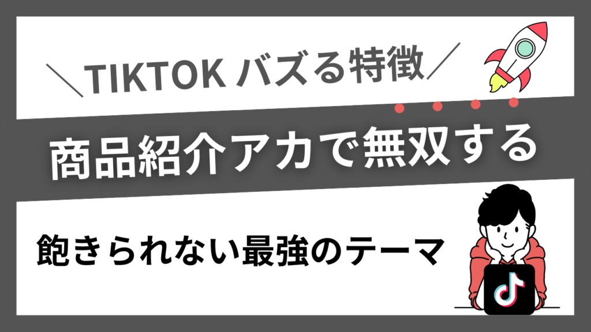
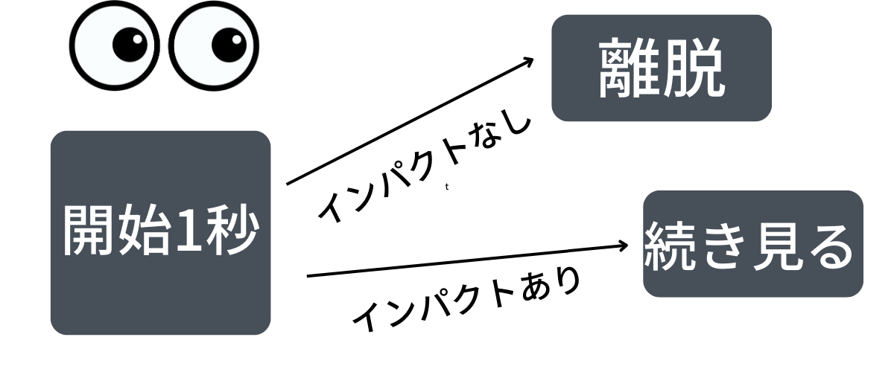

# TIKTOKの商品紹介　バズるコンテンツテーマ

**URL**: https://affiliateman.site/tiktok_contentsbaz/

---

- ホーム
- TikTok

# TIKTOKの商品紹介　バズるコンテンツテーマ

2022年12月17日

SHARE

- ツイート
- シェア
- はてブ
- LINE
- Pocket

Kくん

今回は僕がコスメジャンルに参入しているのでコスメ系で発信していきます。ただどのジャンルでも同じことが言えるので参考にしていただければと思います

離脱率が一番高いファーストビューに惹きつける

TIKTOKは動画の平均指標時間が高いと良い動画として評価されます。そこで一番離脱の高いタイミングが最初です。

開始1秒できまります。そのため開始1秒ではインパクトのある見せ方ができれば離脱されにくくなります

インパクトはざっくりというとバエルおしゃれな商品と便利な商品です

え！この商品なに！！おしゃれ！！！って思わしたらいいんです。

それかこの商品便利だ！便利そうだ！と思わせればいいということです。

上記踏まえた上でTIKTOKでバズりやすく、

PR案件が来やすいと言われる商品紹介ジャンルの単品商品の訴求方法を軽く説明します。

バズりやすいテーマ

今回は商品紹介(単品/1商材)でバズりやすいテーマをまとめました。

バエるおしゃれな商品

便利な商品

### バエるおしゃれな商品

TIKTOKでバズるには商品の効果などよりかはいかにバエかになります。

ニベアのクリームの機能がどんだけ良くても、なかなかTIKTOKばえするような見せ方は難しいです。なのでそれよりかは下記のようなtiktokバエルするような商品を選定するのが大切です。

コスメ商品の機能や成分よりいかにバエルかが大切です

- コスメボックス
- LUSHのリップ
- 可愛いお菓子
- LUSHスキンケア
- カプセルリップ
- 酵素洗顔
- チョコレート
- チーズリップ
- スライム掃除機
- ましゅまろカイロ
- ガチャガチャ商品映え最強
- インパクト大の抹茶
- やばいカステラ

ガチャガチしゃ商品映えの動画のガチャガチャをおすすめコスメいれて、2022年買ったコスメ5選でガチャガチャの中に入れて訴求するの対な見せ方もありですね

下記投稿でもシェアしましたが、商品力や料理の美味しさなんて必要ありません。必要なのはいかにバエルか、商品のおしゃれさが大切です。バズるという点で大切ということです。

ほんとにいいなって思ってる商品でも商品のパッケージがいけてないと結構伸ばすの難しいイメージです

ショート動画で無双する方法これガチで有益なんだけど

商品の紹介は機能や成分が良い商品を紹介するのではなく、いかにバエる商品であるかをみたらいいとおもう

バズるには最初の冒頭で、何この商品！見たことないんだけど！？と思わすことが大切です

つまり商品力

▼イメージ画像4枚pic.twitter.com/6yw7CjVjVO

— Kくん/SNS攻略サロン運営 (@fqw5963)December 17, 2022

### 便利な機能

開始の早いタイミングで便利だ！と思われることが大切です。

- アイラインをすぐかける商品
- 眉毛を簡単に綺麗にカットできる商品
- ダイソウの持ち運び香水
- ソファー水圧掃除機
- バブルーン

今回はこんな感じで終わりたいと思います。

- ツイート
- シェア
- はてブ
- LINE
- Pocket

CATEGORY :

- TikTok

- TIKTOKバズるコンテンツ ファーストビュー
- TikTok 伸びているおすすめジャンルまとめ
- 【TikTok攻略】TikTok フォロワーを伸ばすための教科書

TIKTOKバズるコンテンツ ファーストビュー

TikTok 伸びているおすすめジャンルまとめ

【TikTok攻略】TikTok フォロワーを伸ばすための教科書

### コメントを残すコメントをキャンセル

メールアドレスが公開されることはありません。*が付いている欄は必須項目です

コメント*

名前*

メール*

サイト

次回のコメントで使用するためブラウザーに自分の名前、メールアドレス、サイトを保存する。

---

## 記事内画像

