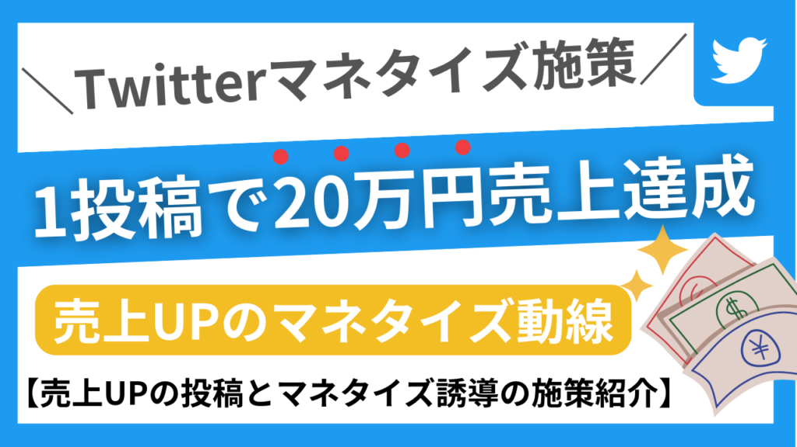
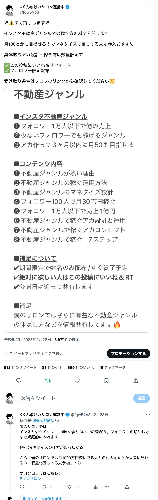
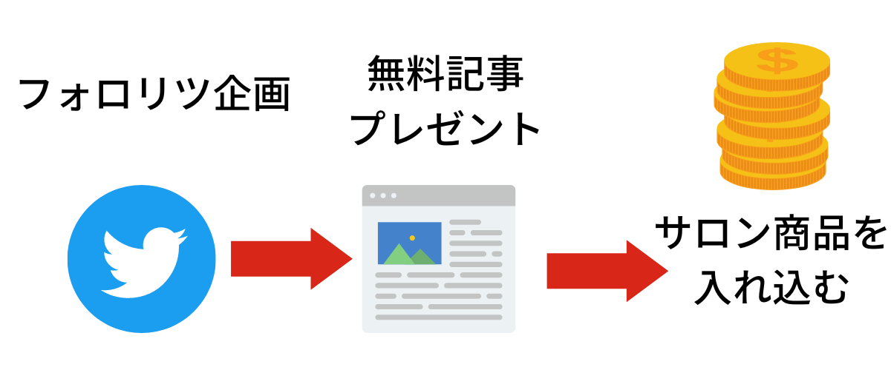
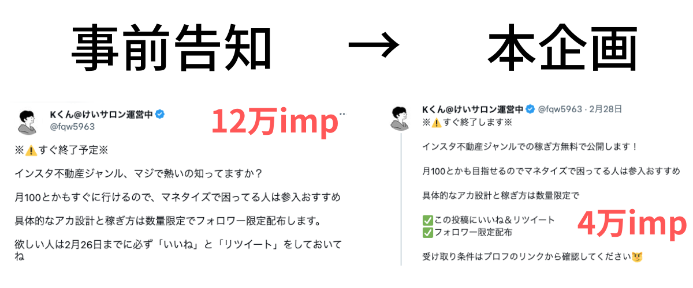
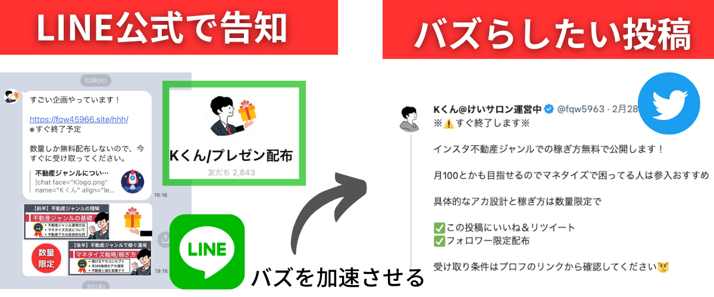
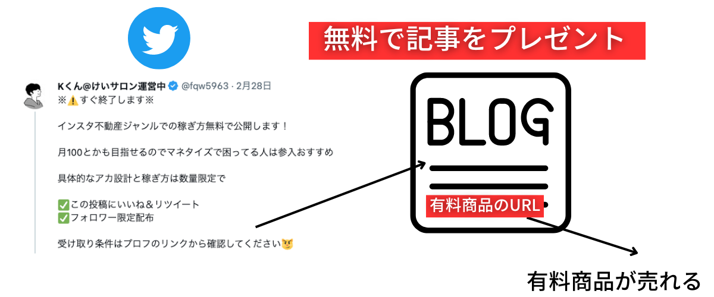
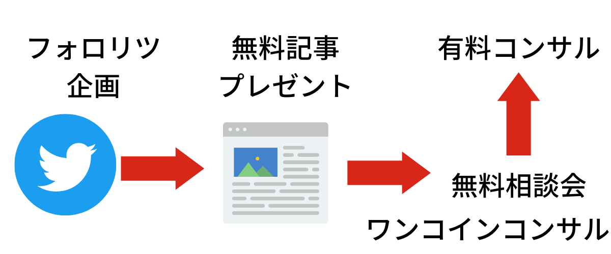
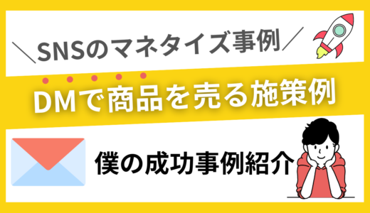
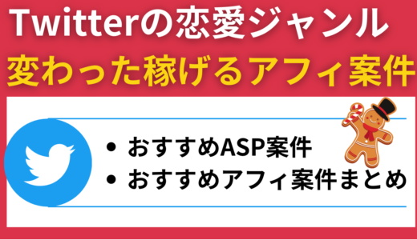

# 【1ツイートで20万円売上】Twitterのマネタイズ施策

**URL**: https://affiliateman.site/twitter-20man/

---

- ホーム
- Twitter

# 【1ツイートで20万円売上】Twitterのマネタイズ施策

2023年3月14日2023年4月8日

SHARE

- ツイート
- シェア
- はてブ
- LINE
- Pocket

僕は1投稿でサロン商品の売上を約12万円、

さらにその投稿経由でコンサル依頼3件(2万円/時×3件)を得ることができました

さらにさらにあまり売る気のないnote(3980円×7部くらい)も地味に売れました。

計20万円くらい1日で売ることができました。

しかもフォロワー1万人くらいのアカで、、

## 売上20万円を生み出したツイート

結論フォロリツ企画がバズってサロン入会者が一気に増えました。

ここからが本題です。

## フォロリツ企画で売上をあげる動線

フォロリツ企画とは

この投稿をいいね/RT &フォローしてくれた人限定で無料で〇〇を上げる施策になります。

フォロリツをする時は必ず自分が獲得したいフォロワーに刺さるテーマにしましょう！

例えば僕ならSNS攻略のサロンを運営しているので、SNS運用系のプレゼントをあげます。

これが例えばamazonギフト券とかになるとそこで獲得したいフォロワーはお金が欲しいので、僕の投稿を新規あげても何も反応してもらえません。

逆にインスタの伸ばし方というフォロリツ企画で集めたフォロワーに対してインスタの稼ぎ方のツイートをした時にはささりますよね、なのでフォロリツの企画は自分の発信テーマや売りたい商品と近いものにしましょう。

それを踏まえてフォロリツ企画の目的を言います。

フォロリツ企画はフォロワーを増やす目的もありますが、一番は売上を爆速に生み出す売上拡大施策です。

もう一度言います。フォロリツの目的は売上拡大です！必ず無料プレゼントの中に有料商品を入れましょう

## 

実際のフォロリツで配布したコンテンツ

前半パート

後半パート

### 有料商品の誘導のポイントについて

フォロリツの企画の内容と売る商品の内容はできるだけ近い物にしましょう！

インスタ稼げるジャンル（無料で配布）

インスタで月100万円稼ぐストーリーの型50選(有料note)

コンビニで食べても太らないお菓子30選(無料配布)2ヶ月で20kg痩せたダイエット方法(有料note)

マッチングアプリでモテるプロフ書き方（無料配布）

マッチングアプリでいいねが止まらなくなるアプリ運用（有料note）

こんな感じでフォロリツの参加者に対して、無料でコンテンツを配布してその中に商品を誘導するイメージです。

## ガチで裏技の施策

フォロリツ企画をする前にする事前告知ツイートは本企画のフォロリツよりバズります。実際にここからも商品がうれます。

僕はこれで20人くらいにサロン入ってもらえました。

その事前ツイートがこちら！！

ビジネス界隈で最強の称号1000いいね/1000リツイート超えました！フォロワー1万人の僕のアカでここまで

伸びたのはけっこうすごいと思ってます。

Kくん

事前ツイートの方がなぜか毎回3倍くらい伸びます。これでいっきにフォロワー300人くらい増やして、かつサロン入会者も増やしました。

人ってリリースよりその前の告知の方が反応いいんですよね

例えば鬼滅の刃も新作が映画館で出る6ヶ月前くらいの事前告知の方が話題性でバズりますよね！けどリリースしてみればもうそこの頃には

その当初ほど話題じゃなくなるみたいな感じで、人って告知の受けが高いんです。なのでフォロリツをする場合は告知を絶対に挟みましょう。

事前告知ツイートのコメント欄にも商品の紹介をすることでガチで売り上げが上がったのでおすすめです。

上記ツイートのコメント欄を見ればわかると思います

### さらに最強の応用編

Kくん

- 売りたい商品を決める
- 売りたい商品を無料プレゼント記事の中に紹介する
- 無料プレゼントの記事のPV数を上げるためにそれを紹介しているフォロリツ企画の投稿をバズらせる
- バズらせるためにLINE公式アカを活用して一気に拡散される

豆知識

SNSで投稿をした時にはフォロワーの20~30%に届く

LINE公式アカでメッセージを送ったら開封率は70%超えたりする

つまりSNSで告知した内容をLINEでも告知することでより多くの人にリーチするということ

## フォロリツ企画で月100万円も可能です

僕はフォロリツで2980円を売りましたが、有料コンサル6ヶ月50万円を二人に売ったらそれで月100万円の達成です。

基本的に5万円を超える商品を売る場合は直接ZOOMとかで売らないと売れないことがほとんどなので、無料相談会を特典に入れたり

ワンコイン(500円)コンサルという名目で無料コンサルをして、

そのコンサルの中で有料コンサルを売るみたいなのができれば月100も目指せます。

現に僕のフォロリツでサロンしか売りませんでしたが、勝手にDMでコンサルしてくれませんか？と3名の方から連絡が来て、料金提示したら

2万円/時のコンサルがDMのみで3名も決まりました。

僕はやりませんが、2万円/時のコンサルを受けた人に対して高額のコンサルを提案して成約できれば月100もすぐ行きます。

ワンコインコンサル

商品価格5万円の商品をZOOMで売る場合は、ある程度見込み顧客じゃないと売れません、

そのためあえて500円の相談会にして

スクリーニングすることでより成約率の高い層からの相談がきます。

無料相談会ですと大量に成約率の低い層からの申し込みがくるので

僕ならあえてお金を挟むことでZOOM申込者の質が高まるので、そういった意味でもワンコインコンサルを挟むのはおすすめです

もう一つ売上をあげる施策について

商品が売れるツイートを把握するということです。

下記が商品売れるツイートです。

### 商品の実績を訴求する

凄すぎる。。初期垢が1日でインスタフォロワー1000人増えてる。僕のサロン限定です。

すごい大手アカからメンションもらえますしかもメンションから獲得するフォロワーは質が高いのでおすすめ

インスタ伸ばしたい人はぜひ

最大10万人のアカからメンションもらえるかもしれません#けいサロン実績pic.twitter.com/ewata8LZXw

— Kくん@けいサロン運営中 (@fqw5963)March 3, 2023

### コメント欄で袋とじ戦法

凄すぎる。。初期垢が1日でインスタフォロワー1000人増えてる。僕のサロン限定です。

すごい大手アカからメンションもらえますしかもメンションから獲得するフォロワーは質が高いのでおすすめ

インスタ伸ばしたい人はぜひ

最大10万人のアカからメンションもらえるかもしれません#けいサロン実績pic.twitter.com/ewata8LZXw

— Kくん@けいサロン運営中 (@fqw5963)March 3, 2023

袋とじ戦法とはエロ本で下着が見えそうな写真(無料部分)で興味を湧かせて、

1番みたい下着を脱いだ部分を有料で見せる これでサロンやnoteで月200~300売れる いかに続きの有料部分をみたい！と無料部分で思わせるかが大切

#### 他ジャンルへの活かし方

■恋愛noteについて

僕のnoteを読んで大好きな彼氏ができた！と報告DMがきました！

証拠のDM写真を貼る

■マッチングアプリ攻略note

僕のnoteを読んだ人から経験人数が10人1ヶ月で増えたとDM報告頂けました！

今すぐモテたい人は読んでみてね！

■ダイエットコンサル

やばい！いまコンサルしている人が開始1ヶ月ですがすでに5kgも痩せている。。3ヶ月コンサルなので後２ヶ月でさらに10kg痩せさせる予定！

### コメント欄活用して商品誘導

凄すぎる。。初期垢が1日でインスタフォロワー1000人増えてる。僕のサロン限定です。

すごい大手アカからメンションもらえますしかもメンションから獲得するフォロワーは質が高いのでおすすめ

インスタ伸ばしたい人はぜひ

最大10万人のアカからメンションもらえるかもしれません#けいサロン実績pic.twitter.com/ewata8LZXw

— Kくん@けいサロン運営中 (@fqw5963)March 3, 2023

Kくん

この場合はたまたまサロンメンバーがこれサロンで見れますか？って言ってくれて、そこで見れる！と回答することで

いち早く情報を知りたい人は僕のサロンに入会します

### 中身のテーマを見せる

1ツイートで16万円一撃で稼いだTwitter施策知りたい人いますか？？

これ上手くハマればフォロワー5000人とかでも月100も可能です

いいねリツ多いとサロン限定で公開します

さすがこれは無料で出せません。そんくらい有益かつ、みんなやると稼げなくなるので、クローズでシェアします

— けいサロンｌ 掲示板 (@keicuun)March 1, 2023

1投稿で16万円稼ぐ施策！を教える！でこれサロンでしか見れないよと言った形にすることでサロンの入会者が増える

こんなイメージですね！

### 補足について

これ理解すると毎月300とかはいきます。投稿には3つの種類があります。

(1)新規フォロワーを集める投稿マスうけする/初心者ターゲットの投稿

(2)フォロワーをファン化する投稿脱初心者~中級者向けの投稿をする

(3)商品を売るための投稿商品を売るための教育と販売投稿

特に(3)が売上増に大切

— Kくん@けいサロン運営中 (@fqw5963)March 3, 2023

上記でいうところの(3)のところの投稿は上記に紹介した投稿になります。

こういった(3)の施策を知らない人が多いのでそれ理解していたら結構マネタイズうまくいきます。

Kくん

ちなみに今回はツイッターの例にはなりましたが、これインスタでも同じことが言えるのでインスタにも横展開できます。

ストーリーで上記を訴求すればいいだけですね！

- ツイート
- シェア
- はてブ
- LINE
- Pocket

CATEGORY :

- Twitter
- マネタイズ手法

- 【マネタイズ戦略】Twitterで売上を最大級に稼ぐ方法
- 【インスタ/Twitter】DMで商品を売る施策について
- Twitter垢作って1日でフォロワー4000人になっているアカ見つけました
- 【Twitter攻略】フォロワーの伸ばし方
- Twitterのフォロワー増の成功事例
- Twitterの恋愛ジャンルで稼げるアフィまとめ

【マネタイズ戦略】Twitterで売上を最大級に稼ぐ方法

【インスタ/Twitter】DMで商品を売る施策について

Twitter垢作って1日でフォロワー4000人になっているアカ見つけました

【Twitter攻略】フォロワーの伸ばし方

Twitterのフォロワー増の成功事例

Twitterの恋愛ジャンルで稼げるアフィまとめ

### コメントを残すコメントをキャンセル

メールアドレスが公開されることはありません。*が付いている欄は必須項目です

コメント*

名前*

メール*

サイト

次回のコメントで使用するためブラウザーに自分の名前、メールアドレス、サイトを保存する。

---

## 記事内画像

