# ツイッター稼げるジャンルと稼ぎ方まとめ

**URL**: https://affiliateman.site/twitter/

---

- ホーム
- Twitter

# ツイッター稼げるジャンルと稼ぎ方まとめ

2022年10月31日2022年11月15日

SHARE

- ツイート
- シェア
- はてブ
- LINE
- Pocket

Kくん

2022年10月時点の情報で今後新規ジャンルも増えてくるので都度更新していきます。

恋愛系

男性をーターゲットにした恋愛ジャンルは大きく分けて2つに別れます。ナンパ（セフレ量産）と彼女作りになります。

一般的には彼女作りの上位互換がナンパ界隈（遊び）です。

ナンパ(遊び)は本気でモテたいという温度感が彼女作りのジャンルよりも高いため商品が売れまくります。

彼女作りや恋愛論は本気でモテたい！という人より恋愛に興味がありゆるく投稿を見ている人が多いのでナンパ界隈よりは商品は売れにくいです、

しかし投稿の内容は初心者うけする内容や共感系が多いのでフォロワーはかなり伸ばしやすいです。

マネタイズ方法

ナンパ界隈note：マッチングアプリの攻略法/ストリートナンパ攻略法/セフレ量産など外見改善コンサル：メイク、ファッション、整形コンサルなど

コンサル：マッチングアプリのコンサル(プロフ/写真撮影/メッセージ/アポなど)

恋愛界隈

note：好きな人に振り向いてもらう方法/モテる会話術/モテる褒め方など

僕の経験談

僕は上記ナンパ遊び界隈でフォロワー5000人前後いた際にアフィをしました。商品はED薬とアフターピルです。１投稿したら5万円ほど商品が売れました、商品数で言うと100個以上売れました。

20代後半になると勃起しにくくなるが、まだ遊びたい！行為の最中に萎えてしまうのはいやなどのニーズがあったので商品が爆売れましました。

ED系の投稿をもっと増やすと月30万円くらい目指せるかなと思いました。

稼いでいるnoteTips例

稼いでいるnote例

稼いでいる恋愛note

次は恋愛界隈でも女性に向けた発信ジャンルです。

大きく分けて彼とよりを取戻したい復縁と、モテる女性になって彼氏を作りたいという２つの軸になります。

上記の中でも復縁系はとても悩みが深く、緊急度が高い悩みになるので商品がよく売れると聞きます。

フォロワー1000人以下でも月50~80マンくらい稼いでいる人もいるのでおすすめです。

マネタイズ方法

復縁note：復縁攻略法/復縁の経験談系のnote

コンサル：復縁するにあたって支援するコンサル

占い：占いアフィなどに流す

→占いでよく来るテーマの一つが復縁なので相性がいい

恋愛界隈

note：ヤリステされない女になる方法/追われる/女性になる方法

コンサル：マッチングアプリ/合コンの運用コンサルなど

→特に30代の結婚をしたい女性になればなるほど需要が高

このジャンルはかかなり伸びやすいジャンルですがユーザーの通報などアカバンのリスクがあります。

なのでサブ垢を作っておくことがお勧めです。

伸びる投稿としては共感系の投稿(ワンナイトで終わった話/ヤリステされる女の話など)から気持ち良いHのテクニックなどのsexテクニック系の投稿なんかが伸びる、

さらに上記右側のように実際に女性との行為を撮影して、続きはファンクラブに流すといったサロン形態をとっているアカウントもあります。

マネタイズ

note：イキまくるキスの仕方/きもちいフェラの仕方/ナカイキ入門

オンラインサロン：セクテックオンラインサロン/ノウイキオンランサロン

アフィ：マイメアリのようなアダルトグッツアイテム

マネタイズのテーマ例

セクテク系のテーマ

アダルトアフィ

ダイエット

このジャンルは固定ツイートに太った時の写真と痩せた時の写真をはっています。

ツイートがバズる、プロフィールに流入する、固定ツイートを見る、BA画像がすごい、

フォローみたいな流れが多いのでダイエットジャンルに参入したい人は参考にしていただければと思います。

伸びる投稿

足痩せトレーニングの動画体重を痩せるためにやったダイエット方法ダイエットに効く商品やアイテムを紹介実際のダイエット食事とそのレシピ方法をシェアする

りりか

レモンサワー

マネタイズ方法

コンテンツ販売(note)

ダイエットレシピのnote私がダイエットで痩せるためにやったことまとめ太らない食べ物 150選note

ダイエットのPRダイエットジャンルではベースフードやサジーといったPR商品を上げている人が多いです。

おそらくフォロワーの数によって変わってくるかなと思います。フォロワー1万人くらいいれば1投稿で5万円くらいはもらえるのではないかと思います。

長期ダイエットコンサルライザップのような感じでマンツーマンで指導するダイエットコンサルです。毎月10万円でダイエットを支援するみたいな感じのコンサル形のモデルになります。

ダイエットを教えることができれば毎月3人のコンサル生をとれれば月30万円は入ってきます。

美容/美容整形

このジャンルでは毎日の美容習慣で役に立つ女美容磨きの投稿、さらにもう少し深い悩みを指す場合は整形やプチ整形の情報発信がおすすめだったりします。

固定投稿に垢抜け前の自分と垢抜けた後の自分のbeforeAfterを貼ると

ファン化しやすく同じ投稿を上げるても反応率変わってくるのでおすすめです。

コスメのメイク方法の例

伸びている新作アイテム紹介

足が綺麗になった夜の習慣 5選

肌のトーンアップに効果のある美容液まとめ

この新作めちゃくちゃいい！ニキビ治ったし安いのでおすすめ

面長に特化したメイク術

マネタイズ

有料note垢抜けために行ったこと肌が綺麗になるためにやったこと整形500万円かけた私のおすすめ施術都内のおすすめクリニック（施術メニューにあった）

アフィとPRコスメ系のアフィやダイエット系のアフィ美容系のPR案件

整形コンサル相手の顔に合わせたおすすめの整形とクリニックを紹介→クリニックからの紹介料ももらえれることも可(仲介業)

髭脱毛のマネタイズ方法

美肌治療のアフィ

バズツイート

就活

就活ジャンルはツイッターの中でもけっこう美味しいジャンルかなと思いますね！

少ないフォロワー数でもしっかりファン化できていれば稼げるジャンルです。

長期コンサルなどをとれればけっこう美味しいかなと思います！

伸びている投稿

最終面接でやるべきことまとめ面接で印象に残るための面接術ブラック企業まとめ年収が高い企業まとめ離職率が低い企業まとめ

就活のマネタイズ例

note就活で大手企業に内定をもらう方法面接で無双する方法Fラン大学でもエントリーシート無双する方法

アフィ就活サイトのアフィ就活エージェントのアフィ逆求人サイトのアフィOB訪問系のアフィ

エージェント優秀な就活生を取りたい企業に対して就活生を斡旋する代理業LINEアカウントに誘導して就活生を確保して、興味関心のある就活生に企業を紹介

長期コンサル大手内定をもらうためのコンサル

就職

このジャンルはサラリーマンやOLに刺さるような共感系のツイート、仕事で役に立つ系のハウツー系の投稿が伸びる印象です。

伸びる投稿のイメージ

- 営業で使える質問7選
- 優秀な同僚がよく使う言葉　10選
- ZOOMの会議で役立つ機能まとめ

マネタイズの例

note

転職で年収200万円UPする秘訣平社員から部長まで2年でなった方法接待で使えるおすすめのお店まとめ

コンサルキャリアUPの支援ビジネススキルをあげて優秀な人材になるコンサル

オンラインサロン

社会人に役に立つためのオンラインサロン仕事で使える会話や営業特化のオンラインサロン

motoさんの売れているnote例

ビジネスジャンル

ビジネスジャンルはツイッターの中でも稼げるカテゴリーの１つです。

月3000万円以上稼いでいる人もいるので参入する見込みはあるかなと思います。

伸びる投稿

インスタで稼げるジャンルまとめTIKTOKで2022年はやるジャンル伸びるサムネ100選　図解解説インスタフォロワー1万人までにやったこと

マネタイズ方法

noteインスタで月３０万円稼ぐ方法インスタで稼げるジャンル徹底解説ツイッターの恋愛ジャンル完全攻略

コンサル長期コンサルの場合月２回のZOOMとスラックで質問無制限回答(月25万円)

単発コンサルの場合ZOOM1時間：１万円など

オンラインサロンインスタの攻略法を発信しているサロンSNSで稼ぐためのサロン副業全般で稼ぐための情報サロン

教材スクール単価５０万円のSNS攻略教材10万円のインスタ攻略教材※情報と価格が釣り合ってないとたたかれる

運用代行ツイッターで影響力をつけて運用の代行の問い合わせを増やす例）インスタの発信をして企業から運用の一部を代行してほしいと連絡が来る

旅行

旅行系のジャンルは万人受けするジャンルになるためフォロワーが伸びやすいジャンルの１つになります。

ただマネタイズが少ししにくいジャンルでもあるので、けっこう難易度高めの印象です。

PR案件が定期的にこれば結構ありかなとは思いますね！

伸びる投稿

おすすめの星のリゾートまとめこの夏行きたいおすすめ四国スポットまとめ旅行料金を安くするテクニック

アフィ

旅行予約/格安チケット/航空券予約

基本的には割引やキャンペーン訴求がメインかなと思います。旅行系のアフィって毎年割引される時期が決まっています。

夏休み/春休み/年末/クリスマスなど連休やイベントごとで安くなるのでそのタイミングで訴求すると売れたりします。あとはGoTo travelのキャンペンなんかもよさげですね！

PR案件

こちらに関してはフォロワーが増えてきたらDMから宿泊＋報酬でPR依頼が来たりするのでアフィ以外にもマネタイズはできるかなと思います。

旅する2人

トラベラー

ぴち家

りゅうまい夫婦

おさる旅

PR案件の例

アゴダのPRアンケン

デートスポット

これは先ほどの旅行にデートを掛け算したジャンルになります。

またデート✖️お店やカフェのコンセプトアカウントも伸びています。

この辺のジャンルモテが掛け算されるので恋愛系のアフィなども訴求することができます。

伸びる投稿

カップルといきたい四国の旅行スポまとめ新宿の横並びの雰囲気があるお店新宿の女性が仕上がる薄暗いバーまとめ渋谷のデートで使える最強の居酒屋

マネタイズ

noteデートで使える最強のお店(東京/関東/福岡)まとめ

アフィマッチングアプリ/旅行系の予約案件

デートで使える最強のお店note

旅行の格安のタイミングでキャンペーン訴求

外見改善

このジャンルはモテと外見改善を掛け算して発信しているアカウントが伸びています。特にマッチングアプリとの相性はいいかなと思います。

マッチングアプリって99.9%顔写真ゲームなのでその顔写真をとるために外見改善をしている人が多いのが現状です。

なのでモテと外見改善を掛け算することでマネタイズできやすいジャンルでもあります、

新作のアイテム紹介

伸びる投稿

- 無印の新作の美容アイテムA やばすぎた！
- 肌が綺麗になる美容習慣まとめ
- おすすめの美容整形
- 最新のZARAファッション

マネタイズ方法

外見コンサル

メンズメイク：1万円/時ファッションコンサル：1万円/時

note僕が垢抜けるためにやったこと(ビフォアフターの写真あり)メンズメイク初心者でも簡単にできる！　ロードマップかっこよくなれる美容まとめ

図解解説

このジャンルでは各ジャンルの特化アカウントが伸びている印象です。

とくにエクセル系は伸びている印象です。また最近ではCANVAやCupCUTなど副業で利用するツールなどの図解解説も流行っているのでおすすめです。

オンラインサロン/教材

一番お金になるのはサロンか教材かなと思います。エクセル攻略サロンやCanVAのやり方を教えるサロンなどです。

ここでいう教材はCANVA完全攻略教材(動画10本＋3ヶ月質問し放題パック)みたいな感じのイメージです。

note

短期的に稼ぎたい人はnoteもいいかなと思います。

社会人1年目が覚えるべきエクセル最強術マクロの組み方 初心者でもわかる！エクセルで時短に繋がる最強の活用方法

キャンバのサロン運営例

図解解説

このジャンルでは本で学んだことや本の図解解説を紹介しているジャンルになります。このジャンルのマネタイズ方法としては紹介する本を悩みのある特化ジャンルにするということです。

あらゆるジャンルの本を紹介すると属性のニーズがバラつきます。

そのため例えば下記のような感じで特化にしていきます。

- 会話術に特化した本紹介
- 恋愛に関する情報を発信する本紹介アカウント
- 仕事で使える本紹介アカウント

上記のような感じで特化にするとそれ関連のnoteやオンラインサロンといった感じで

マネタイズができるのでけっこうおすすめになります。

他にも図解解説で伸ばしてから別アカウントのツイッターの伸ばし方形を発信しているアカウントに誘導して、

そちらでツイッター攻略サロンの案内をして稼いでいるアカウントもありますね

本紹介アカウント

ツイッターの誘導

お金や資産運用

この辺はけっこうツイッターでも伸びているジャンルになります。

ここ2,3年で流行ってきているポイかつなどはけっこう手軽にできるので主婦の間でどんどん人気になってきています。

その他にも老後に資金を貯めるための資産運用（積みたねにーさやいでこ）などのツイートも伸びています。

マネタイズジャンル

アフィリエイト

- クレジットカード(楽天/エポス/PayPayカードなど)
- 旅行予約(楽天トラベル/じゃらんなど)
- ポイントサイトの会員登録(ハピタス/リーベイツ/モッピー)
- ふるさと納税(さとふる/楽天ふるさと納税)
- 資産運用(SBI証券/楽天証券/LINE証券など)

旅行ジャンルは割引キャンペーンが多いのでそのタイミングで訴求すれば売り上げがでやすいです

このジャンルは基本的にはアフィがメインかなと思います。

あとはサブでnoteなどを販売したり、副業を始めたいという人をターゲットに副業で月10万円稼ぐためのオンラインサロンなどを解説して副業全般を訴求するのもありかなと思います、

参考になるアカウント

ツイートをばずらしてコメ欄で解説→自社ブログに誘導→ブログ内のアフィリンクでマネタイズ

その他

伸びているアカウントが他にもあるので簡単に紹介していきます。

トレンド系(流行を発信)@____hnjs@_yokopii

属人性を出している場合はファッション系やコスメ、おすすめ商品のアフィなどあらゆる商品が売れるので属人性×トレンドはけっこうおすすめだったりします。

暮らし系ホテル暮らし

ホテルのOK案件や旅行系のアフィ案件がおすすめです。

また属人性を持って発信していればコスメ、ファッションなどあらゆる商品が売れるので

顔は出さずとも雰囲気がわかるような投稿もしていくことをおすすめします。

例：今日は沖縄きたよ〜（綺麗な足を海に入れている写真など）

弁当解説annko〒

料理レシピのnoteやレシピ系のオンラインサロンなどがおすすめかなと思いますが、

悩みの深さが浅いこともあり、人生の優先度的にお金を払ってまでは、、、ってなりガッツリとマネタイズが難しそうな印象です。

属人生(OL系)

yumeasami

らむね

属人生がけっこうあるので、ファンがついていればなんでも商品は売れます。つまり最強です！！！

僕のおすすめジャンル

僕がお勧めするジャンルは恋愛、ビジネス、就活、資産運用や節約、仕事術系、この辺かなと思います。左に行けば行くほどおすすめです。

特に恋愛とビジネス系はほんとに稼げます。

フォロワー5000人くらいたら月100マンくらいは目指せるジャンルになりますので本気で頑張りたい人はこの２つがおすすめかなと思います。

理由はこのジャンルは他のジャンルと違い、この界隈の読者は受け身ではなく積極的に情報収集している人がおおく、その分お金も落としてくれます。そのため個人的にはおすすめかなと思います。

それ以外では就活や仕事術系もアフィリエイト案件が多い、かつコンサルなどができるので月100万円目指せるかなと思います

特に金融系のジャンルはクレジットカードや証券会社の口座開設などで5000円くらい報酬がもらえます。

さらにクレカや証券の口座開設ってユーザーは無料で作成できるためCVRも高いです。

- ツイート
- シェア
- はてブ
- LINE
- Pocket

CATEGORY :

- Twitter

- 【フォロワーを増やす施策】外部誘導施策 10選
- 【マネタイズ戦略】Twitterで売上を最大級に稼ぐ方法
- 【インスタ/Twitter】DMで商品を売る施策について
- 【有益です！】商品が驚くほど売れるTwitterの型　10選
- Twitter垢作って1日でフォロワー4000人になっているアカ見つけました
- 【Twitter攻略】フォロワーの伸ばし方

【フォロワーを増やす施策】外部誘導施策 10選

【マネタイズ戦略】Twitterで売上を最大級に稼ぐ方法

【インスタ/Twitter】DMで商品を売る施策について

【有益です！】商品が驚くほど売れるTwitterの型　10選

Twitter垢作って1日でフォロワー4000人になっているアカ見つけました

【Twitter攻略】フォロワーの伸ばし方

---

## 記事内画像

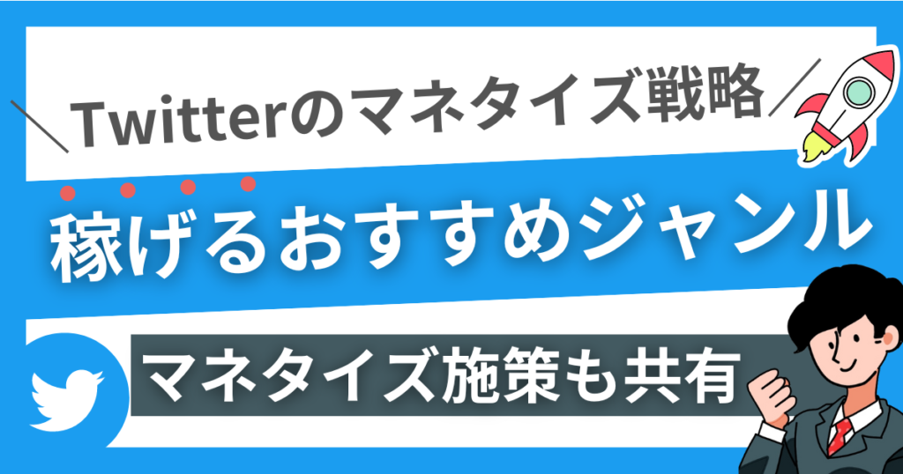

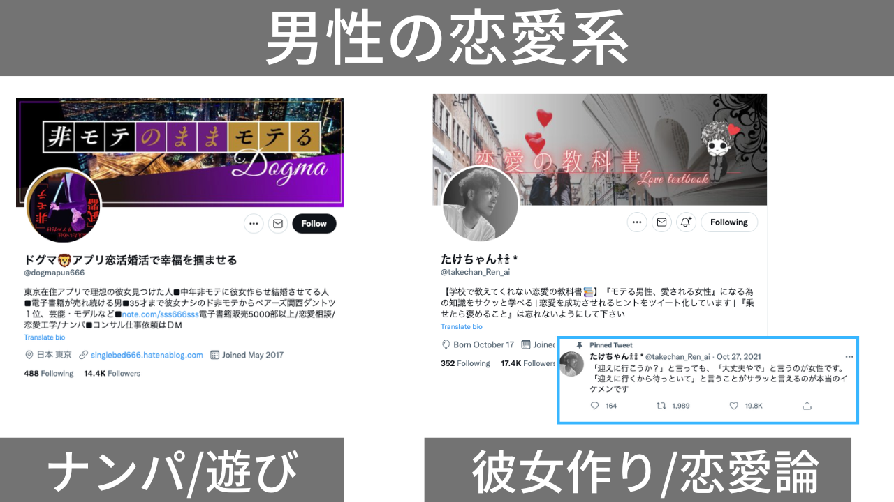

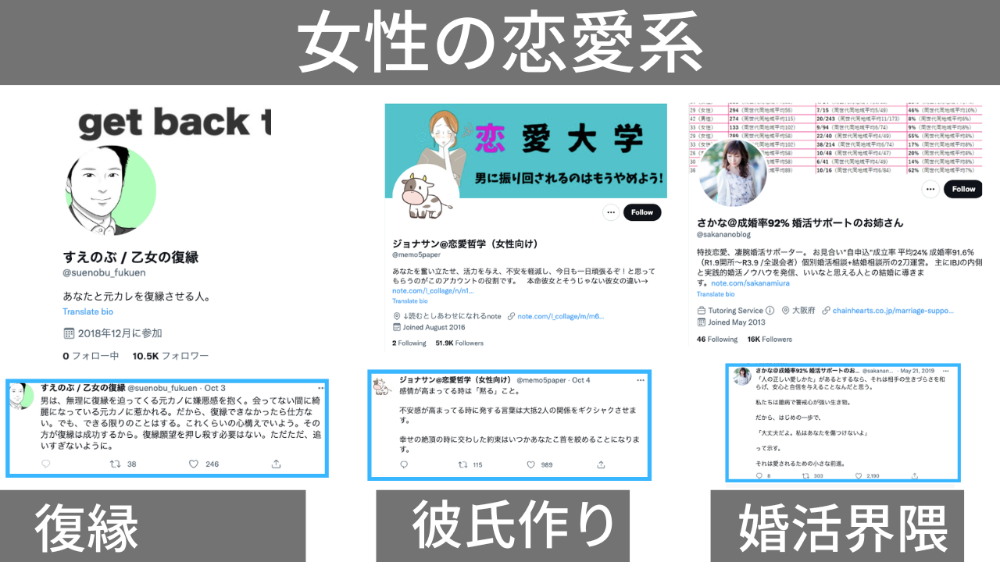

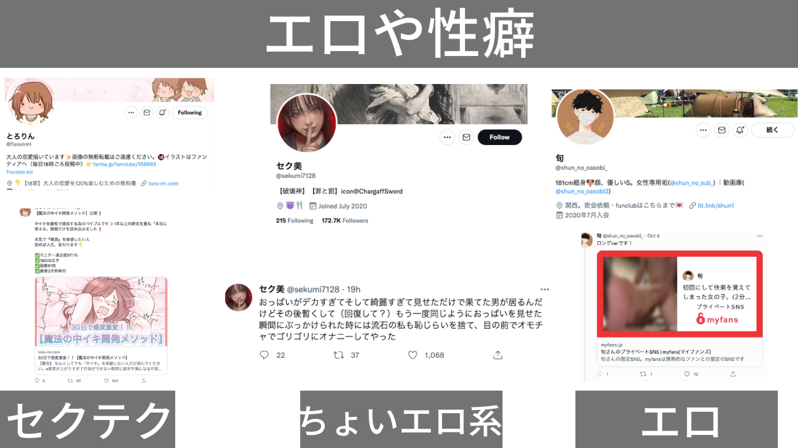

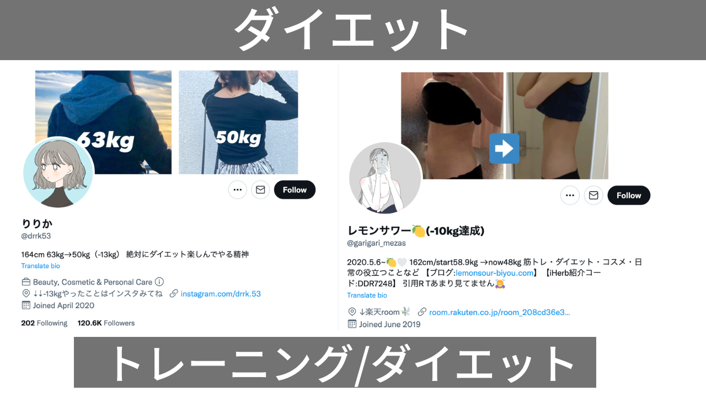

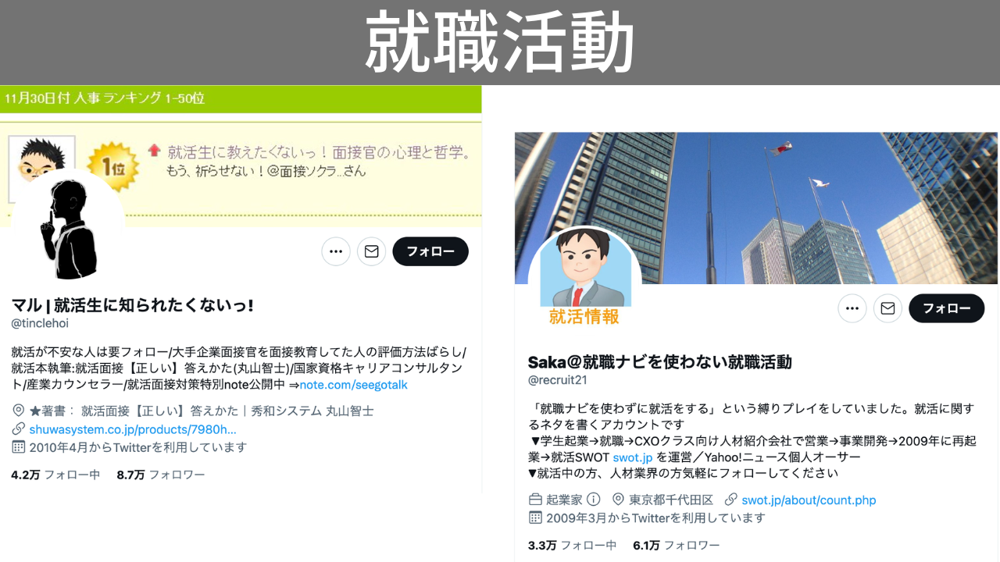

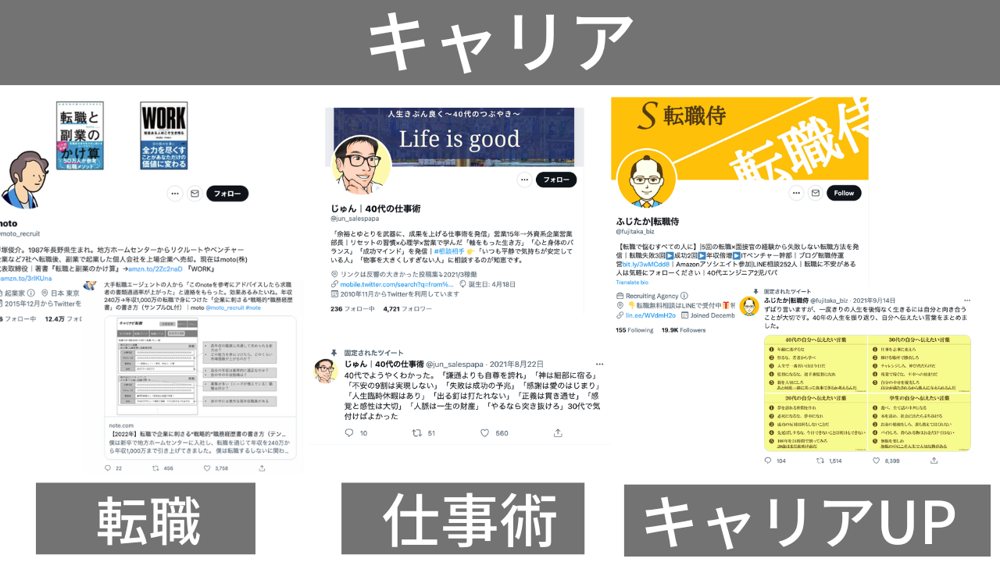

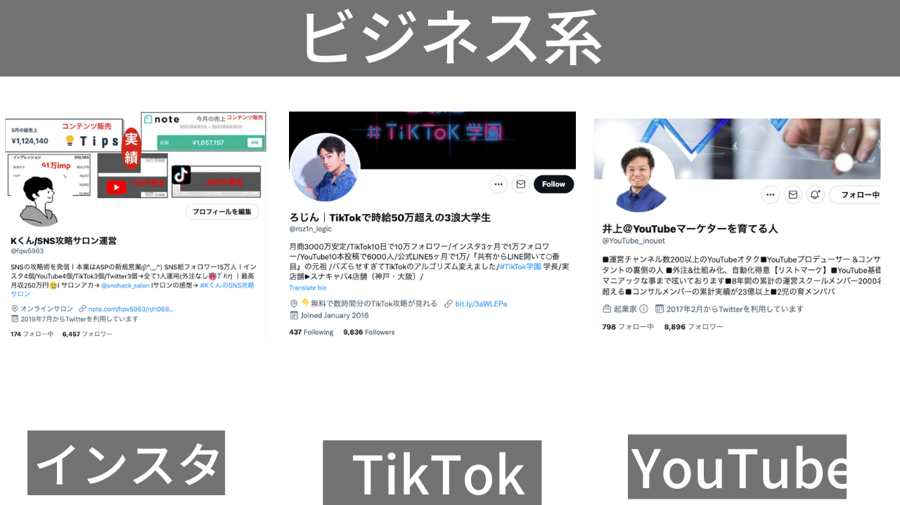

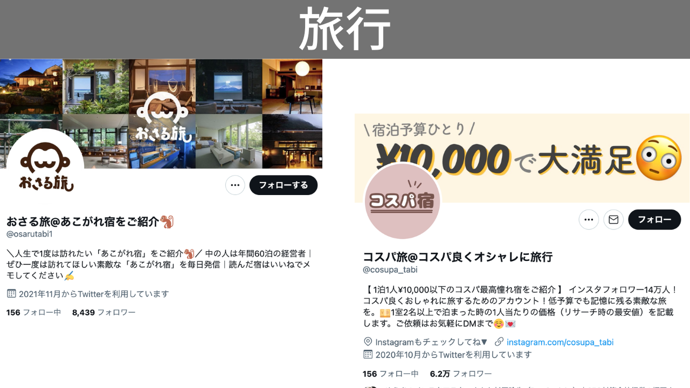

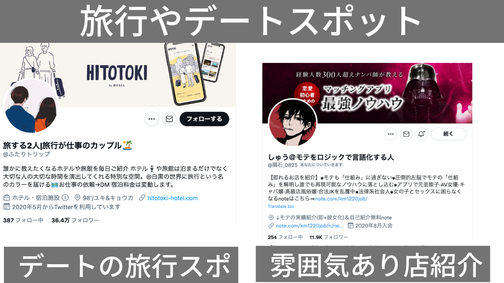

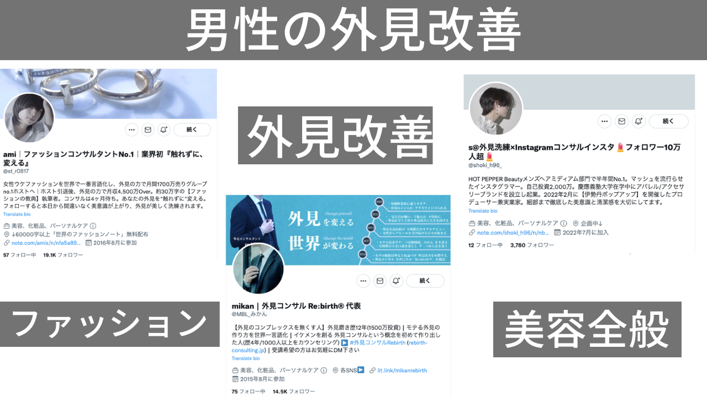

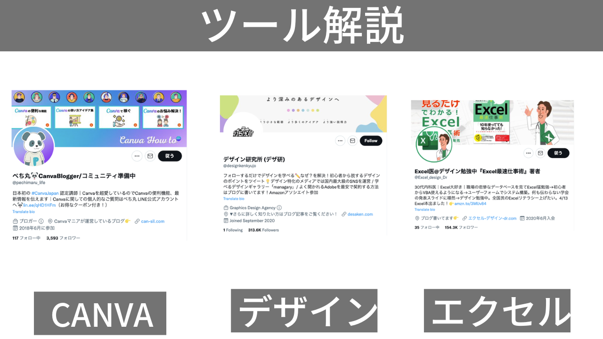

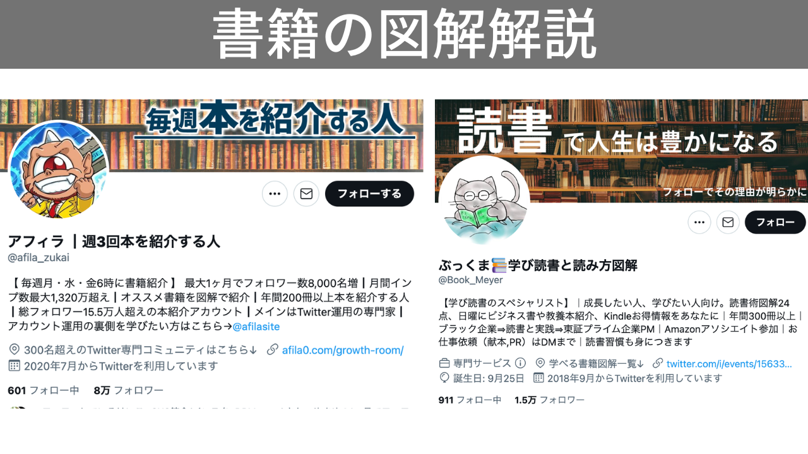

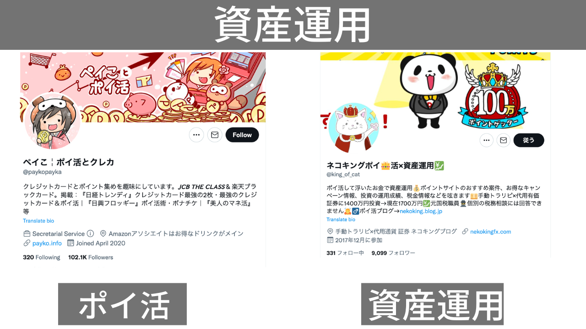

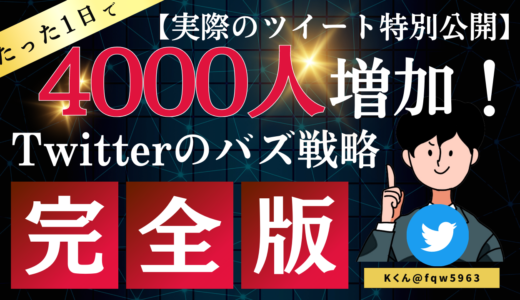

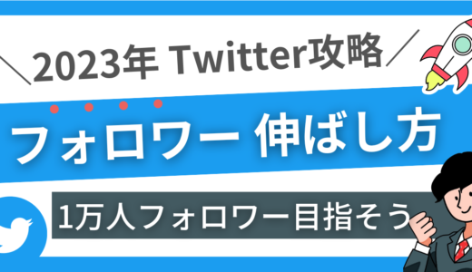

