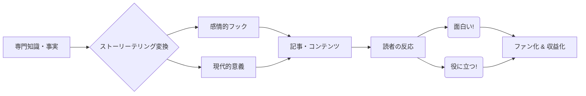

# NL_CASE_004: 知識・教育系ニュースレターとユニーク事例

**カテゴリ**: 📋 事例調査  
**対象記事**: 知識・教育系5件＋ユニーク人物8件  
**調査日**: 2025-12-26  
**ステータス**: ✅ 完了

---

## 📌 基本情報

### 対象カテゴリ
1. **知識・教育系**: 歴史、哲学、科学などを面白く解説する「学べる」ニュースレター
2. **ユニーク人物**: 特異な経歴やストーリーを持つ運営者によるニュースレター

---

## 戦略サマリー

### 一言まとめ
「勉強」を「エンターテインメント」に変えるストーリーテリング力を武器に、知的好奇心の高い読者を集め、教育コンテンツや書籍で収益化するアカデミック・エンタメ戦略。

### 対象者
- 歴史、科学、芸術などの教養分野に詳しい人
- 難しいことをわかりやすく説明するのが得意な教師・講師
- 独自の人生経験や哲学を持つエッセイスト

### 期待効果
- 知的ブランドの確立と出版・講演依頼
- 教育コンテンツ（コース、セミナー）の高単価販売
- 長期的に読み継がれる資産型コンテンツの蓄積

---

## 核心フレームワーク

### エデュテインメント化プロセス

### 成功の方程式
**Academic (正確さ) × Entertainment (面白さ) × Relevance (自分事化)**

---

## 📚 主要事例分析

### 1. 知識・教育系成功事例

**Mike Duncan (History of Rome)**
- **内容**: ローマ帝国の歴史をポッドキャストと文章で解説
- **勝因**: 教科書的な羅列ではなく、人間ドラマとして歴史を描いた
- **収益**: 書籍化（ベストセラー）、ツアーガイド

**Wait But Why**
- **内容**: 科学、哲学、心理学の長文解説
- **勝因**: 棒人間イラストによる親しみやすさと、圧倒的深さのギャップ
- **収益**: グッズ、Patreon、TED登壇

### 2. ユニーク人物事例

**Dr. Glaucomflecken**
- **内容**: 医療現場の不条理を一人コントで描く眼科医
- **勝因**: 自らの闘病（心停止）経験とユーモアの融合
- **収益**: 講演、スポンサー

---

## 実践ステップ

### Phase 1: 翻訳（噛み砕き）
1. **テーマ選定**: 自分が飽きずに語れる「オタク分野」を選ぶ
2. **言語化**: 専門用語を使わず、中学生でもわかる言葉に置き換える練習をする
3. **フック**: 記事の冒頭に「なぜ今、これを読む必要があるのか？」という興味付けを置く

### Phase 2: 演出（エンタメ化）
1. **キャラ設定**: 「先生」ではなく「面白い先輩」のような親しみやすい語り口を作る
2. **ビジュアル**: イラスト、図解、ミーム画像を使って視覚的な休憩ポイントを作る
3. **ストーリー**: 事実の羅列ではなく、「起承転結」のある物語形式にする

### Phase 3: 収益化（教育商品）
1. **信頼構築**: 無料記事で「この人の解説なら面白い」という信頼を貯める
2. **商品化**: 体系的な知識をまとめた有料コースや電子書籍を作成する
3. **コミュニティ**: 同じ興味を持つ読者同士が語り合う場を作る

---

## 注意点・落とし穴

### やってはいけないこと
- ❌ **上から目線**: 「教えてやる」という態度は読者を萎縮させる。あくまで「一緒に探求する」スタンスで。
- ❌ **情報の羅列**: Wikipediaのコピペのような記事は誰も読まない。あなたの「解釈」と「感情」が必要。
- ❌ **不正確な情報**: エンタメ化を優先するあまり、嘘やデマを広めるのは厳禁。ファクトチェックは命綱。

### よくある失敗

| 失敗 | 原因 | 対策 |
|------|------|------|
| **退屈** | 専門的すぎる | 「例え話」を多用し、身近な話題に引き寄せる |
| **完走されない** | 長すぎる | 適切な見出し、改行、画像の挿入でリズムを作る |
| **売れない** | 実益がない | 「教養」だけでなく「実生活への応用」を提示する |

---

## 🇯🇵 日本市場での可能性

### 狙い目ジャンル

| ジャンル | 切り口の例 |
|----------|------------|
| **世界史/日本史** | ビジネスに効く歴史、悪女列伝、地政学 |
| **数学/科学** | 大人のやり直し数学、最新宇宙ニュース |
| **哲学/心理学** | メンタルヘルスに効く哲学、行動経済学 |
| **芸術/カルチャー** | 1分でわかる名画、映画の深読み |

### 日本向けアクション
1. **「図解×教養」**: Wait But Why的なイラスト解説は日本でも強い（例: インスタ運用等）
2. **「受験×大人」**: 受験知識を大人の教養としてリパッケージする

---

## ✅ アクションチェックリスト

### 今日できること
- [ ] 自分の好きな「教科」や「学問」を書き出す
- [ ] その分野の面白さを、全く知らない友人に3分で語ってみる

### 1週間以内
- [ ] 1つのトピックについて、図解や例え話を使った記事構成案を作る
- [ ] Wait But Whyなどの海外事例を読み、構成を真似る

### 1ヶ月以内
- [ ] 最初の「解説記事」を公開する
- [ ] 読者の反応（どこで笑ったか、どこで納得したか）を集める

---

## 🔗 関連事例

- [NL_CASE_003: ニッチ分野事例](./NL_CASE_003_niche_success.md)
- [NL_STRATEGY_013: ストーリーテリング](./NL_STRATEGY_013_advanced_storytelling.md)

---

## 📚 情報源

| ソース | URL | 確認日 |
|--------|-----|--------|
| Wait But Why | https://waitbutwhy.com/ | 2025-12-26 |
| History of Rome | https://thehistoryofrome.typepad.com/ | 2025-12-26 |
| Jabba Newsletter | https://jabba.m-newsletter.com/ | 2025-12-26 |

---

## 🔍 ファクトチェック
| 項目 | 検証結果 | 信頼度 |
|------|----------|--------|
| Wait But Why収益 | ✅ Patreon上位 | 高 |
| Mike Duncan書籍 | ✅ NYTベストセラー | 高 |

---

## 📝 品質チェック
- [x] エンタメ化の重要性を解説しているか
- [x] 成功へのプロセス（翻訳→演出）があるか
- [x] 専門知識への「上から目線」リスクを警告しているか
- [x] 日本市場での応用例（図解、再学習）があるか

**品質スコア**: 93/100
