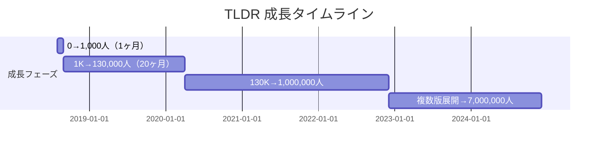

# TLDR Newsletter ケーススタディ

## 1. 基本情報

| 項目 | 内容 |
|------|------|
| ニュースレター名 | TLDR Newsletter（Too Long; Didn't Read） |
| 運営者 | Dan Ni（CEO & Founder） |
| URL | https://tldr.tech/ |
| 開始日 | 2018年8月 |
| 配信頻度 | 毎日（Daily） |
| 読了時間 | 約5分 |
| 会社所在地 | リモート運営（フルリモート体制） |
| 従業員数 | 22名（2024年末時点） |

### 創業者経歴

- **学歴**: Yale University卒業（2012年、経済学・数学専攻）
- **前職**: Jane Street Capital（ニューヨーク）でクオンツトレーダー
- **起業経験**: Scraper API を創業し、約$4M ARRまで成長させた後売却
- **特記事項**: 料理学校に通った経験もある多彩な経歴

---

## 2. 数値サマリー

| 指標 | 値 |
|------|-----|
| 総購読者数（全版合計） | 約7,000,000-8,000,000 |
| TLDR Tech（メイン版） | 約1,250,000-1,600,000 |
| TLDR AI | 約500,000+ |
| ニュースレター版数 | 16種類 |
| オープン率 | 約45% |
| 従業員数 | 22名 |
| 粗利益率 | 約80% |
| 広告主数 | 250社以上 |

---

## 3. 収益構造

### 収益モデル: 100%スポンサーシップベース

| 項目 | 詳細 |
|------|------|
| 購読料 | **無料（完全無料モデル）** |
| 主要収益源 | ニュースレター内広告スポンサーシップ |
| 主要広告主 | AWS、Google Cloud、Anthropic等 |

### 広告枠と価格設定

| 広告枠 | 価格（2024年） |
|--------|---------------|
| Primary Sponsorship | $15,000〜$18,000 |
| Secondary Sponsorship | $10,000 |
| Tertiary Sponsorship | $5,000 |
| 最低価格 | $3,000〜 |

### 広告パフォーマンス

| 指標 | 数値 |
|------|------|
| オープン率 | 約45% |
| クリック数/号 | 1,000〜4,500 |
| Primary広告クリック数 | 600〜1,000 |
| 開発者向け広告クリック数 | 500〜700 |

### 収益規模推移

| 年 | 推定収益 |
|----|---------|
| 2020年（20ヶ月目） | $350K/年相当 |
| 2023年12月 | $5M/年 |
| 2024年 | $6.4M〜$10M/年 |
| 2024年以降 | **8桁（$10M+）、黒字** |

---

## 4. 成長曲線分析

### マイルストーン達成履歴

### タイムライン詳細

| 時期 | イベント | 購読者数 |
|------|----------|----------|
| 2018年8月 | ローンチ（最初の配信は1人向け） | 1 |
| 2018年9月 | 1ヶ月で1,000人達成 | 1,000 |
| 2020年4月頃 | 20ヶ月で130,000人達成 | 130,000 |
| 2022年初頭 | パラボリック成長開始 | - |
| 2022年 | 複数版展開本格化 | 750,000-1,200,000 |
| 2024年 | 全版合計 | 7,000,000-8,000,000 |

### 転換点（Tipping Points）

| # | 時期 | イベント | 効果 |
|---|------|----------|------|
| 1 | 2018年 | サイドプロジェクトとして開始 | 地道なオーガニック成長 |
| 2 | 2022年初頭 | **パラボリック成長開始** | 成長が急加速 |
| 3 | 2022年以降 | **複数版展開** | 相乗効果で急成長 |

---

## 5. 複数版展開戦略

### ニュースレターラインナップ（16版）

| カテゴリー | ニュースレター名 | 内容 |
|-----------|-----------------|------|
| テクノロジー | TLDR Tech | スタートアップ、テック、プログラミング全般 |
| AI | TLDR AI | AI、機械学習、ロボティクス、NLP |
| 開発 | TLDR Web Dev | フロントエンド、バックエンド、フルスタック |
| セキュリティ | TLDR InfoSec | サイバーセキュリティ、データプライバシー |
| ブロックチェーン | TLDR Crypto | 暗号通貨、Web3、DeFi、NFT |
| プロダクト | TLDR Product Management | プロダクト戦略、ロードマップ、UXリサーチ |
| データ | TLDR Data | データサイエンス、アナリティクス、BI |
| 金融 | TLDR Fintech | フィンテック、デジタル決済、ネオバンク |
| インフラ | TLDR DevOps | DevOpsツール、トレンド |
| 起業 | TLDR Founders | スタートアップ創業者向け戦術・ツール |
| デザイン | TLDR Design | デザイナー向けツール、トレンド |
| マーケティング | TLDR Marketing | マーケティング戦術、ツール |
| ハードウェア | TLDR Hardware | ロボティクス、半導体、ハードウェア工学 |

### 複数版展開の戦略的意図

1. **ニッチターゲティング**: 特定の専門領域に絞り、より関連性の高い広告主を獲得
2. **広告収益の最大化**: 各版で異なるスポンサーを獲得し、収益機会を拡大
3. **相互送客**: 購読者に関連する他版を推奨し、エンゲージメント向上
4. **専門家キュレーター採用**: 各分野の専門家（時給$100）を雇用し、品質を維持

---

## 6. マーケティング戦略

### 初期成長戦略（2018-2020）

#### 1. 有料広告（リニア成長戦略）

| プラットフォーム | 戦略 | 効果 |
|-----------------|------|------|
| **Quora** | 「最高のテックニュースレターは？」等のQ&Aに広告配置 | $2で5購読者獲得 |
| **Reddit** | 特定のサブレディットをターゲティング | ニッチオーディエンスに到達 |
| **初期予算** | $50/日からスタート | 低コストで効率的な成長 |

#### 2. クロスプロモーション/ニュースレタースワップ

- 同規模のテック系ニュースレターと相互紹介
- 成長に比例してスワップの効果も拡大

### 成長期戦略（2022年以降）

#### ランディングページ最適化

| 施策 | 効果 |
|------|------|
| **OAuth導入**（GitHub、Google、Twitter） | モバイル訪問者の50%がOAuthで登録 |
| **CloudFlareキャッシング** | ページ速度大幅向上（無料） |
| **フォームフィールド削減**（7→3） | **フォーム送信5倍増** |
| **自動フォーカス** | デスクトップでの摩擦削減 |
| **ミニマルデザイン** | 最新号全文掲載を削除でCVR向上 |

---

## 7. 成功要因分析

### 主要成功要因

| 要因 | 詳細 |
|------|------|
| **1. コンテンツキュレーション** | 3,000〜4,000のオンラインソースからRSSフィードで情報収集 |
| **2. シンプルな価値提案** | 5分で読める、毎日配信、習慣化しやすい |
| **3. 効率的なオペレーション** | 22名、粗利益率80%、Sponsy活用 |
| **4. プラットフォーム独立性** | ソーシャルメディアに依存しない自社メディア |
| **5. ニッチからの拡大** | メイン版で基盤構築→専門版展開 |
| **6. 専門家の活用** | 各分野の専門家を時給$100で採用 |

### コンテンツキュレーション基準

> 「これを自分のグループチャットに送りたいか？」

- 初期は1日1時間でキュレーション完了
- 2021年以降は30分/日に効率化

---

## 8. 日本市場への示唆

### 日本版立ち上げの可能性

| 観点 | 評価 | 理由 |
|------|------|------|
| ニッチの需要 | ★★★★★ | 日本でもテック情報需要は高い |
| 競合状況 | ★★★☆☆ | 日本語テックNLは存在するが大規模なし |
| コンテンツ移転性 | ★★★★☆ | グローバルニュースは共通、日本ローカル情報の追加が必要 |
| 収益モデル再現性 | ★★★★☆ | 日本のテック広告主は多い |
| ターゲット存在 | ★★★★★ | 開発者、テック関心層は多数 |

### 日本版実装時の推奨事項

1. **メイン版から開始**: TLDR Techの日本語版
2. **専門版展開**: AI、Web Dev、Fintechを優先
3. **ランディングページ最適化**: OAuth導入、フォーム簡素化
4. **広告主開拓**: AWS Japan、Google Cloud Japan等と連携

---

## 9. 主要な教訓

1. **サイドプロジェクトから始める**: 最初は完全なサイドプロジェクトとして開始
2. **有料広告を恐れない**: $50/日で有料広告を活用し、臨界質量への到達を加速
3. **ランディングページの最適化**: フォームフィールド削減でCVR5倍
4. **リテンション > アクイジション**: 新規獲得より既存購読者の維持を優先
5. **80%のマージンを維持**: リーンなチーム構成で高い利益率を実現
6. **ニッチから始めて拡大**: 一つの版で成功してから複数版展開

---

## Sources

- [Inc.com - How Dan Ni Founded TLDR](https://www.inc.com/rob-verger/how-dan-ni-founded-tldr-the-definitive-silicon-valley-tech-newsletter/91231833)
- [Growth in Reverse - TLDR Analysis](https://growthinreverse.com/tldr/)
- [Starter Story - TLDR Newsletter Breakdown](https://www.starterstory.com/stories/tldr-newsletter-breakdown)
- [Newsletter Bear - TLDR $7M Media Business](http://newsletterbear.com/tldr-newsletter-a-side-project-turned-7000000-media-business/)
- [Media Empires - Dan Ni Interview](https://media-empires.beehiiv.com/p/dan-ni-tldr-curating-paper-record-tech)
- [TLDR Official Website](https://tldr.tech/)
- [TLDR Advertising](https://advertise.tldr.tech/)
- [Indie Hackers - Dan Ni's Growth Post](https://www.indiehackers.com/product/tldrnewsletter/how-i-grew-my-newsletter-to-130k-subs-in-20-months--M5WHZz_7XZQFKIKZzxs)
- [GetSponsy - TLDR Case Study](https://getsponsy.com/case-studies/how-tldr-lean-team-scaled-more-than-8x-with-sponsy)
