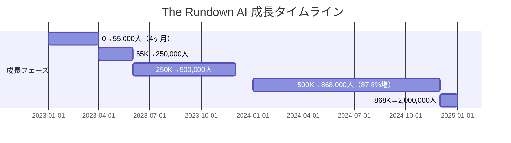
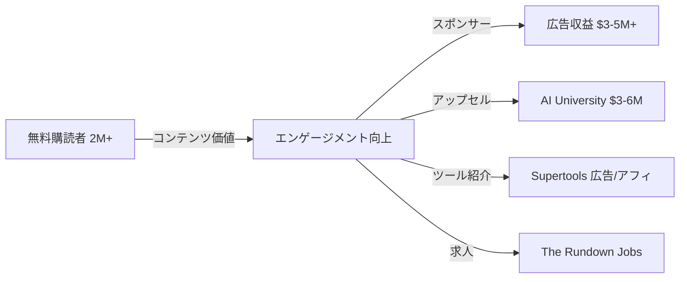

# The Rundown AI ケーススタディ

## 1. 基本情報

| 項目 | 内容 |
|------|------|
| ニュースレター名 | The Rundown AI |
| 運営者 | Rowan Cheung（創業者・CEO） |
| URL | https://www.therundown.ai/ |
| プラットフォーム | beehiiv |
| 設立日 | 2022年（本格開始は2023年1月） |
| 配信頻度 | 毎日（日刊） |
| 読了時間 | 約5分 |
| 本拠地 | カナダ・バンクーバー（2025年よりスイスに移住） |
| 従業員数 | 12名（2024年末時点） |

### 運営者経歴

- 元競泳セミプロ選手（COVID-19でキャリア終了）
- DALL-E 2に触発されAI領域に参入（2022年）
- **Forbes 30 Under 30（Education部門）選出**（2025年）
- Mark Zuckerberg、Satya Nadella、Demis Hassabis等へのインタビュー実績

---

## 2. 数値サマリー

| 指標 | 値 |
|------|-----|
| 総購読者数 | **2,000,000+** |
| AI University会員 | 5,000+ |
| 平均開封率 | 46.5%（業界トップクラス） |
| クリック率 | 2.8% |
| メイン広告クリック数 | 1,500〜3,000 |
| 読者の米国在住率 | 80%以上 |
| Twitterフォロワー | 567,900+ |
| 推定ARR | **$7-12M/年** |

---

## 3. 収益構造

### 収益源一覧

| 収益源 | 詳細 | 推定規模 |
|--------|------|----------|
| ニュースレター広告/スポンサーシップ | メイン収益源、数ヶ月先まで予約済み | $3-5M+/年 |
| AI University | 月額$99 / 年額$999 | $3-6M/年 |
| Supertools | AIツールディレクトリ、月間350,000ビュー | 広告・アフィリエイト |
| The Rundown Jobs | AI求人ボード | 掲載料 |

### スポンサーシップ詳細

| 項目 | 詳細 |
|------|------|
| リピートスポンサー率 | 80%以上 |
| 主要スポンサー | Microsoft、Google、Salesforce、Meta等 |
| 広告カスタマイズ | マスコットを組み込むなど、コンテンツに溶け込む形式 |

### AI University収益試算

- 会員数: 5,000+
- 70%の会員が企業のL&D予算または税控除で支払い
- 月額$99 × 5,000 = **$495,000/月** または
- 年額$999 × 5,000 = **$5M/年**

---

## 4. 成長曲線分析

### マイルストーン達成履歴

### タイムライン詳細

| 時期 | イベント | 購読者数 |
|------|----------|----------|
| 2022年 | DALL-E 2に触発されAI領域参入 | - |
| 2023年1月 | ニュースレター本格開始（ChatGPT波に乗る） | 0 |
| 2023年4月 | **全てTwitterからのオーガニック流入** | 55,000 |
| 2023年5月 | 4ヶ月で達成 | 150,000 |
| 2023年6月 | Twitter 300,000フォロワー達成 | 250,000 |
| 2023年9月 | The Rundown Jobs ローンチ | - |
| 2023年末 | Twitter 500,000フォロワー、1B+ impressions | 500,000 |
| 2024年3月 | AI University ローンチ | - |
| 2024年末 | チーム12名に拡大、87.8%成長 | 868,485 |
| 2025年 | Forbes 30 Under 30 選出 | **2,000,000+** |

### 転換点（Tipping Points）

| # | 時期 | イベント | 効果 |
|---|------|----------|------|
| 1 | 2022年11月 | **ChatGPT公開** | AI津波の最前線に位置（先行者優位） |
| 2 | 2023年初頭 | バイラルTwitterスレッド | 最初の55,000人は全てTwitterから |
| 3 | 2024年 | AI University ローンチ | 収益多角化、有料教育プラットフォーム |

---

## 5. Twitter/X連携戦略

### Rowan Cheung個人アカウント実績

| 指標 | 数値 |
|------|------|
| 現在のフォロワー数 | 567,900+ |
| 2023年の成長 | 1,000 → 500,000フォロワー（年間） |
| 2023年インプレッション | 1B+（10億回以上） |
| 称号 | Tweethunter「Fastest-Growing Account on Twitter」2023年受賞 |

### Twitter → ニュースレター導線戦略

1. **バイラルスレッド戦略**: 最新AIニュースを分かりやすく要約、各スレッド最後にニュースレター登録CTA
2. **コンテンツ再利用**: ニュースレターコンテンツをTwitterスレッドに変換
3. **一貫したブランディング**: AI速報の信頼できる情報源としてのポジショニング

### AIアバター実験

- AI生成アバターによる動画コンテンツを展開
- 48,400フォロワー、700万回以上の再生を獲得
- バックラッシュはほぼゼロ（価値あるコンテンツであれば受け入れられる）

---

## 6. 収益化導線分析

### マネタイズモデル

### AI University詳細

| 項目 | 内容 |
|------|------|
| 価格 | 月額$99 / 年額$999 |
| 会員数 | 5,000+ |
| 支払い元 | 70%が企業L&D予算または税控除 |
| コンテンツ | デイリークラス、無料特典、AIリーダーとのQ&A |

---

## 7. 成功要因分析

### 主要成功要因

| 要因 | 詳細 |
|------|------|
| **1. タイミングの完璧さ** | ChatGPT公開前からAI領域で活動、先行者優位 |
| **2. Twitter→NLフライホイール** | バイラルコンテンツ→購読→更なるコンテンツの好循環 |
| **3. 実用性重視** | 「なぜ重要か」「どう仕事に活かすか」を常に明確化 |
| **4. プラットフォーム選択** | beehiivのAd Network、Recommendations機能を最大活用 |
| **5. 収益の多角化** | 広告、教育、ツール、求人の複合収益モデル |
| **6. 信頼性の構築** | Mark Zuckerberg等へのインタビュー、大手企業パートナーシップ |
| **7. チーム構築** | ソロプレナー→12名チームへスケール |

### コンテンツ戦略

**「なぜ重要か」の明確化**:
- 抽象的なAI進歩を具体的なユースケースに紐付け
- ニュース報告だけでなく、仕事への応用方法を提示
- 100万人以上の読者から実世界のAI活用事例を収集

---

## 8. 日本市場への示唆

### 日本版立ち上げの可能性

| 観点 | 評価 | 理由 |
|------|------|------|
| ニッチの需要 | ★★★★★ | 日本でもAI需要は急成長中 |
| 競合状況 | ★★★☆☆ | 日本語の大規模AI NLは少ない |
| コンテンツ移転性 | ★★★★★ | グローバルAIニュースは共通 |
| 収益モデル再現性 | ★★★★☆ | 広告+教育プラットフォームは可能 |
| ターゲット存在 | ★★★★★ | 企業のAI活用ニーズは高い |

### 日本版実装時の推奨事項

1. **Twitter/X戦略の日本版**: 日本語でのバイラルスレッド展開
2. **AI教育プラットフォーム**: 日本企業向けAI研修コンテンツ
3. **ローカルツールディレクトリ**: 日本で使えるAIツール特化
4. **法人向けプラン**: 企業のL&D予算を狙う

---

## 9. 主要な教訓

1. **先行者優位を活かす**: メガトレンドの初期段階で参入
2. **Twitter→NLフライホイール**: 両プラットフォームの相乗効果を最大化
3. **実用性を常に意識**: 読者の仕事に直結する価値を提供
4. **収益源を多角化**: 単一収益源に依存しないビジネスモデル
5. **信頼性の構築**: 大手企業・著名人との関係構築
6. **チームでスケール**: 適切なタイミングで人材を採用

---

## Sources

- [The Rundown AI Official](https://www.therundown.ai/)
- [beehiiv - Creator Spotlight: Rowan Cheung](https://www.beehiiv.com/blog/creator-spotlight-rowan-cheung)
- [Rowan Cheung Official Website](https://rowancheung.com/)
- [Forbes 30 Under 30](https://www.instagram.com/p/DOJVD39DsiG/)
- [The Rundown AI University](https://www.rundown.ai/ai-university/)
- [Super.so Case Study](https://super.so/blog/from-ai-curiosity-to-a-powerful-business-venture)
- [beehiiv Ad Network Case Study](https://www.beehiiv.com/blog/why-the-rundown-founder-says-the-beehiiv-ad-network-is-the-best-newsletter-growth-channel)
