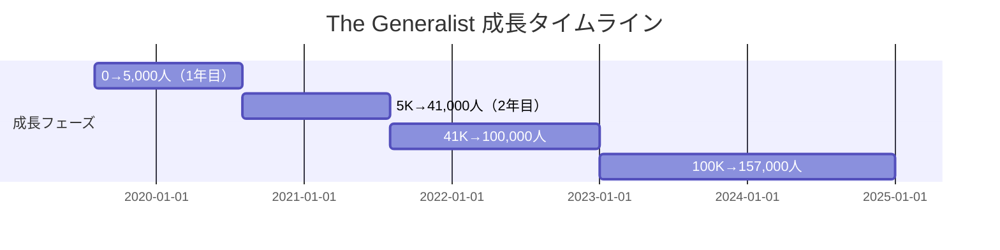
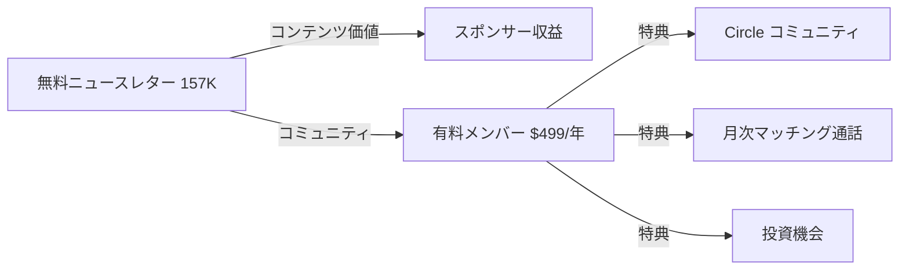

# The Generalist ケーススタディ

## 1. 基本情報

| 項目 | 内容 |
|------|------|
| ニュースレター名 | The Generalist |
| 運営者 | Mario Gabriele |
| URL | https://www.generalist.com/ |
| プラットフォーム | Substack |
| 開始日 | 2019年8月16日 |
| フルタイム移行 | 2020年8月 |
| 配信頻度 | 週1回（日曜日に「Briefings」を配信） |
| ポジション | Substack ビジネスカテゴリ **第5位** |

### 運営者経歴

- Columbia University（政治学・国際開発学）
- 法律事務所（最初の仕事）
- NYU夜間クラスでフィクション・ライティングを学ぶ
- AND CO（成長担当リード、後にFiverrに売却）
- Charge Ventures（ベンチャーパートナー）
- **2020年8月**: The Generalistをフルタイムで開始

---

## 2. 数値サマリー

| 指標 | 値 |
|------|-----|
| 総購読者数 | **157,000+** |
| 有料購読者数 | 約2,000（推定） |
| 有料転換率 | 約1.3% |
| 推定ARR | **$500K+** |
| 年間価格 | $499/年（以前は$199） |
| Substackランキング | ビジネスカテゴリ第5位 |

---

## 3. 収益構造

### 収益モデルの進化

| フェーズ | 時期 | 主要収益源 |
|----------|------|-----------|
| Phase 1 | 2020-2021年 | サブスクリプション75%、スポンサー25% |
| Phase 2 | 2022年以降 | **スポンサーシップ中心**（全コンテンツ無料化） |

### 2021年8月時点の収益内訳

| 収益源 | 金額 | 比率 |
|--------|------|------|
| サブスクリプション | $231K | 75% |
| スポンサーシップ | $60K | 19% |
| NFT売上 | $17K | 6% |
| **合計** | **$308K** | 100% |

### 価格設定の変遷

| 時期 | 月額 | 年額 |
|------|------|------|
| 初期（2020-2021年） | $22 | $199 |
| 現在（2025年） | $22/月（コミュニティなし） | **$499/年** |
| 3年プラン | - | $1,198 |

### NFT実験（2021年）

| プロジェクト | 収益 |
|-------------|------|
| $GENERALIST（Mirror） | 20 ETH調達、3つのNFTを28.6 ETH（約$59K）で販売 |
| Foxes | プライマリーセール$150K、セカンダリー$35K+ |

---

## 4. 成長曲線分析

### マイルストーン達成履歴

### タイムライン詳細

| 時期 | イベント | 購読者数 |
|------|----------|----------|
| 2019年8月16日 | 初記事公開 | 0 |
| 2020年8月 | 1年目終了、フルタイム移行 | ~5,000 |
| **2021年4月** | **Red Bull記事がTwitterでバイラル（8,000いいね、2,400RT）** | - |
| 2021年5月 | S-1 Club開始 | - |
| 2021年8月 | 年間収益$308K達成 | ~41,000 |
| 2021年10月 | Tim Ferrissによる暗号通貨記事シェア | - |
| 2022年1月 | **全コンテンツ無料化、スポンサーシップモデルへ転換** | ~60,000 |
| 2025年現在 | - | 157,000+ |

### 転換点（Tipping Points）

| # | 時期 | イベント | 効果 |
|---|------|----------|------|
| 1 | 2021年4月 | **Red Bull分析スレッドがバイラル** | Twitter、Reddit、Hacker Newsで拡散 |
| 2 | 2021年10月 | Tim Ferrissによるシェア | 暗号通貨シリーズが大きく露出 |
| 3 | 2022年1月 | **無料化への転換** | ペイウォール撤廃、スポンサーシップ中心へ |

---

## 5. 深掘り分析の手法

### 執筆プロセス

| 項目 | 詳細 |
|------|------|
| 1記事あたりの制作時間 | **50-60時間** |
| 週間スケジュール | 月・火：リサーチ集中 / 水：アウトライン / 週末前：専門家インタビュー |
| 記事の長さ | 通常10,000語、最長15,000語超 |
| シリーズ最大規模 | Founders Fundシリーズ：4部構成、35,000語以上 |

### 独自の手法

| 手法 | 詳細 |
|------|------|
| **Multiplayer Pieces** | 複数の専門家（VC GP、CEO）を招いて共同執筆 |
| **S-1 Club** | IPO予定企業をセクター専門家と共同分析 |
| **ナラティブ重視** | エクイティリサーチ + ストーリーテリング + Wikipedia的な深さ |

### 差別化ポイント

> 「The New Yorkerのウィットと皮肉、The Informationのテック洞察を組み合わせたスタイル」— 読者評価

---

## 6. バイラルコンテンツ分析

### Red Bullバイラル事例（2021年4月）

| 指標 | 数値 |
|------|------|
| いいね | 8,000+ |
| リツイート | 2,400+ |
| 拡散先 | Twitter、Reddit、Hacker News |

### バイラルパターン

1. **深いリサーチ**: 50-60時間の調査に基づく網羅的分析
2. **Twitterスレッド化**: 長文記事を読みやすいスレッドに変換
3. **専門家ネットワーク**: Multiplayer Piecesで拡散力を強化

---

## 7. 収益化導線分析

### ビジネスモデルの転換理由

Mario曰く：
> 「Generalistは汎用的なため、業界特化ニュースレターほどサブスクの財布シェアを取れない。スポンサーシップは読者数に応じてスケールする」

### 現在の収益化構造

### メンバーシップ特典

- プライベートコミュニティ（Circle）へのアクセス
- 月次キュレーション・イントロ（他メンバーとのマッチング通話）
- イベント参加
- 投資機会

---

## 8. 成功要因分析

### 主要成功要因

| 要因 | 詳細 |
|------|------|
| **1. 圧倒的な品質とデプス** | 1記事50-60時間投下。深く狭くで差別化 |
| **2. 一貫性** | 週1回の高品質配信を維持 |
| **3. ユニークなポジショニング** | エクイティリサーチ + ナラティブ + 百科事典的網羅性 |
| **4. Multiplayer Piecesモデル** | 専門家を巻き込み、質と拡散力を同時獲得 |
| **5. 柔軟なビジネスモデル転換** | ペイウォール→無料+スポンサーへ大胆に移行 |
| **6. コミュニティ構築** | 高品質なCEO/VCネットワークを形成 |

### Mario自身の言葉

> 「質の高いものを一貫して作り続け、共有すれば成長する。それは本当にシンプルで、同時に難しいこと」

### 競合優位性

1. **VC経験による視点**: Charge Venturesでの投資経験が分析の質を担保
2. **ライティング訓練**: NYUでのフィクション・ライティング修行がナラティブ力に
3. **時間投資の覚悟**: 他のニュースレターが週数時間なのに対し、週50-60時間

---

## 9. 日本市場への示唆

### 日本版立ち上げの可能性

| 観点 | 評価 | 理由 |
|------|------|------|
| ニッチの需要 | ★★★★☆ | 深掘り企業分析の需要はある |
| 競合状況 | ★★★★☆ | 日本語で同等の質のNLは少ない |
| コンテンツ移転性 | ★★★☆☆ | 米国企業分析が多く、日本企業版が必要 |
| 収益モデル再現性 | ★★★★☆ | スポンサー+有料コミュニティは可能 |
| ターゲット存在 | ★★★★☆ | 投資家、経営者、ビジネスパーソン |

### 日本版実装時の推奨事項

1. **日本企業のディープダイブ**: ソフトバンク、楽天、サイバーエージェント等
2. **Multiplayer Pieces**: 日本のVC、CEOとの共同執筆
3. **S-1 Club日本版**: 日本のIPO企業分析
4. **コミュニティ**: 高品質な経営者/投資家ネットワーク

---

## 10. 主要な教訓

1. **質に時間を投資**: 週50-60時間で競合と差別化
2. **一貫した配信**: 週1回の高品質コンテンツを維持
3. **専門家を巻き込む**: Multiplayer Piecesで質と拡散力を同時獲得
4. **ビジネスモデルは柔軟に**: ペイウォール→スポンサーへの転換も躊躇しない
5. **ニッチ特化 vs 汎用性**: 汎用ニュースレターはスポンサーシップが向いている
6. **コミュニティは資産**: 高品質なネットワークがビジネス価値を創出

---

## Sources

- [The Generalist | Substack](https://www.generalist.com/)
- [Growth in Reverse - Mario Gabriele: The Road to $300k+](https://growthinreverse.com/generalist/)
- [Aakash Gupta - How Mario Gabriele Disrupted Tech Analysis](https://www.aakashg.com/the-generalist/)
- [Alex Danco - The next evolution of the Internet Newsletter](https://alexdanco.com/2021/02/20/the-next-evolution-of-the-internet-newsletter-with-mario-gabriele-of-the-generalist/)
- [Nathan Barry - Mario Gabriele Interview](https://nathanbarry.com/031-mario-gabriele-lifelong-obsession-thriving-business/)
- [Indie Hackers - How Mario Gabriele Revolutionized the Newsletter Business](https://www.indiehackers.com/post/how-mario-gabriele-revolutionized-the-newsletter-business-f9c41472b4)
