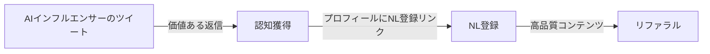
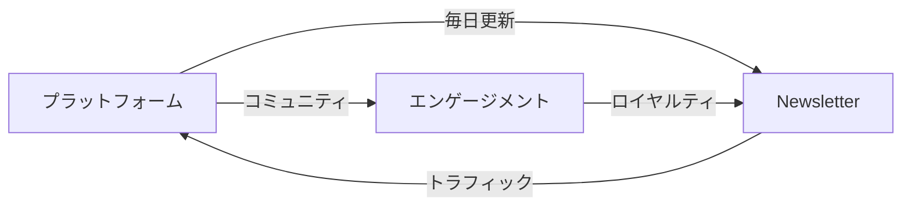
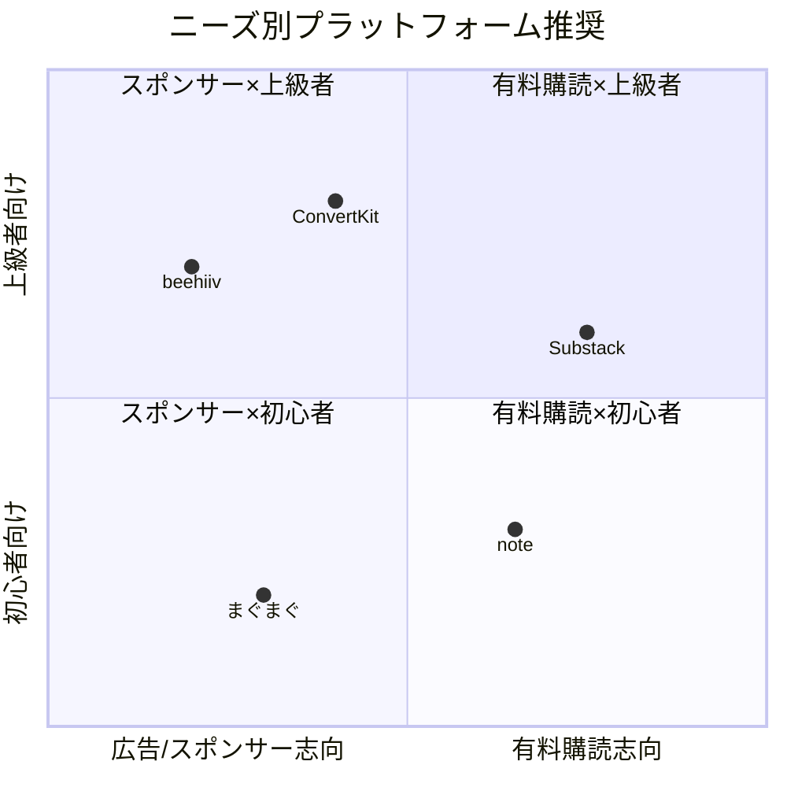
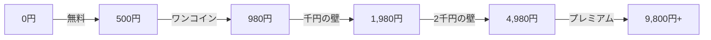
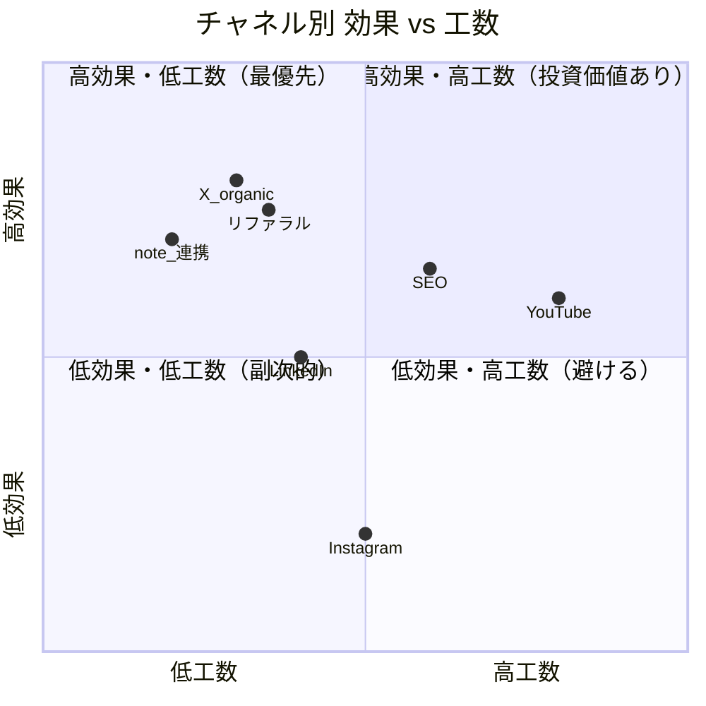
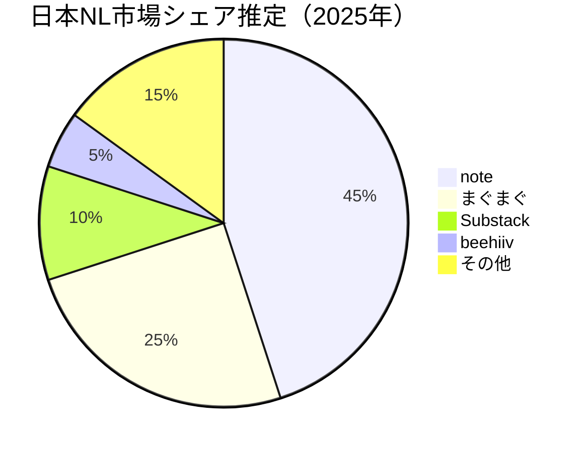

# Newsletter 日本市場インサイトレポート

**最終更新**: 2025-12-28
**バージョン**: 3.0
**分析対象**: P1ケーススタディ20件 + 優先記事10件調査

---

## エグゼクティブサマリー

P1対象20件のニュースレター事例を日本市場適用性の観点から分析した結果、**AI/テック領域**と**実践的ノウハウ提供型**が日本市場で最も有望であることが判明。特にThe Rundown AI、Ben's Bites、Lenny's Newsletterの3事例は、日本版立ち上げの有力候補となる。

---

## 1. 日本市場適用性スコア TOP10

| 順位 | ニュースレター | スコア | ARR | ニッチ | 主な強み |
|------|---------------|--------|-----|--------|----------|
| 1 | **The Rundown AI** | 4.6 | $8M+ | AI | AI需要高、Twitter連携可能、コンテンツ移転容易 |
| 2 | **Ben's Bites** | 4.5 | $600K+ | AI | AI需要高、Reply Guy戦略有効、ChatGPT前ローンチ戦略 |
| 3 | **Lenny's Newsletter** | 4.2 | $4M+ | Product | PM需要高、コミュニティ構築実績、Substack推薦活用 |
| 4 | **Growth.design** | 4.2 | $200K+ | Design | UX需要高、コミック形式の独自性、口コミ特化 |
| 5 | **Trends.vc** | 4.2 | $250K+ | Business | ハーフペイウォール戦略、ニッチ発見手法 |
| 6 | **TLDR Newsletter** | 4.0 | $10M+ | Tech | テック需要安定、多版展開可能、LP最適化ノウハウ |
| 7 | **Indie Hackers** | 4.0 | $100K+ | Business | コミュニティ駆動、透明性重視、Stripe買収実績 |
| 8 | **Newsletter Operator** | 4.0 | $300K+ | Creator | コース連携、実践ノウハウ、顧客80%がNL購読者から |
| 9 | **Bootstrapped Founder** | 4.0 | $100K+ | Business | Building in Public、実体験ベース |
| 10 | **Product Hunt Daily** | 3.8 | $300K+ | Tech | プラットフォーム連携、プロダクト発見ニーズ |

---

## 2. ニッチ別日本市場分析

### 2.1 AI領域（最有望）

| 項目 | 評価 |
|------|------|
| **市場需要** | ◎ 極めて高い（ChatGPT、Claude、Gemini普及中） |
| **競合状況** | ○ 日本語専門NLはまだ少ない |
| **コンテンツ移転性** | ◎ AI情報は英語ソースが主、翻訳＋解説で価値提供可能 |
| **収益モデル再現性** | ◎ スポンサーシップ、コース連携ともに可能 |

**推奨戦略**:
1. **The Rundown AI型**: 最新AI情報を日本語で毎日配信、Twitter連携でファネル構築
2. **Ben's Bites型**: ツール紹介＋実践ノウハウ、Reply Guy戦略でX（Twitter）から流入

**日本版立ち上げ候補**:
- 「AI速報」（The Rundown AI型）
- 「AIツールレビュー日本版」（Ben's Bites型）

### 2.2 プロダクト/PM領域（有望）

| 項目 | 評価 |
|------|------|
| **市場需要** | ◎ PMの重要性認識が高まっている |
| **競合状況** | △ PM系メディアは存在するが、NL形式は少ない |
| **コンテンツ移転性** | ○ 日本企業事例の追加が必要 |
| **収益モデル再現性** | ◎ 有料購読、コミュニティ、コース全て可能 |

**推奨戦略**:
- **Lenny's Newsletter型**: 専門家インタビュー、コミュニティ構築、Substack活用
- **Growth.design型**: UXケーススタディをコミック形式で解説

**日本版立ち上げ候補**:
- 「PM Insights Japan」
- 「UXデザイン事例集」

### 2.3 ビジネス/起業領域（中程度）

| 項目 | 評価 |
|------|------|
| **市場需要** | ○ 副業・独立ブームで需要あり |
| **競合状況** | △ NewsPicks、note等既存メディアが強い |
| **コンテンツ移転性** | △ 日本固有の環境（法律、税制、商習慣）への適応必要 |
| **収益モデル再現性** | ○ 有料購読は可能、スポンサーは競合多い |

**推奨戦略**:
- **Indie Hackers型**: 日本のソロプレナー成功事例を収集・共有
- **Bootstrapped Founder型**: Building in Publicで自身の事業を公開

### 2.4 金融/投資領域（要注意）

| 項目 | 評価 |
|------|------|
| **市場需要** | ○ NISAブームで投資関心高い |
| **競合状況** | × 既存金融メディアが強い |
| **コンテンツ移転性** | × 日米で市場・銘柄が異なる |
| **収益モデル再現性** | △ 規制リスクあり |

**注意点**:
- 金融商品取引法への対応が必須
- 米国事例（Compounding Quality、Liberty's Highlights）はそのまま適用不可
- 日本株・投資信託に特化したローカライズが必要

---

## 3. 収益モデル別 日本適用性

### 3.1 有料購読モデル

| 事例 | 日本適用性 | 理由 |
|------|-----------|------|
| Lenny's Newsletter | ◎ | $150/年 → 日本では15,000円/年程度で成立可能 |
| ByteByteGo | ◎ | 技術者向け教育コンテンツは課金抵抗低い |
| Compounding Quality | ○ | 投資系は規制対応が必要 |
| Trends.vc | ◎ | ハーフペイウォールは日本でも有効 |

**日本向け価格帯**:
- 月額: 500円〜2,000円（心理的抵抗線）
- 年額: 5,000円〜20,000円（割引率20-30%）

### 3.2 スポンサーシップモデル

| 事例 | 日本適用性 | 理由 |
|------|-----------|------|
| Morning Brew | △ | 日本の広告単価は低い（CPM $10-30 vs 米国$30-60） |
| TLDR Newsletter | ○ | テック系スポンサーは獲得しやすい |
| The Rundown AI | ○ | AI系スポンサーは成長中 |

**日本市場の課題**:
- 購読者規模が重要（最低3-5万人必要）
- CPMは米国の50-70%程度
- BtoB特化でRPMを高める戦略が有効

### 3.3 コース/コミュニティ連携モデル

| 事例 | 日本適用性 | 理由 |
|------|-----------|------|
| Newsletter Operator | ◎ | コホートコースは日本でも人気 |
| Lenny's Newsletter | ◎ | Slack/Discordコミュニティは日本でも普及 |
| Not Boring | ○ | VC連携は限定的だが可能 |

**日本向けアレンジ**:
- コース価格: 50,000円〜300,000円
- コミュニティ: Discord > Slack（日本ではDiscord人気高い）
- ライブイベント: オンラインセミナー形式

---

## 4. 成功パターンの日本適用

### 4.1 Reply Guy戦略（Ben's Bites）

**日本適用のポイント**:
- 日本のAI/テック系インフルエンサー（落合陽一、孫泰蔵、田端信太郎等）をターゲット
- 英語情報を日本語で価値提供する形でコメント
- X（Twitter）アカウントとNLの相互送客

### 4.2 リファラル戦略（Morning Brew → Milk Road進化）

**1.0（Morning Brew型）**:
- マイルストーン報酬（3人→ステッカー、15人→ジャケット）
- 物理報酬は日本では発送コスト高いため非推奨

**2.0（Milk Road型）**:
- 1紹介 = 1デジタル報酬
- PDFレポート、限定コンテンツ、オンラインイベント参加権
- **日本向け**: LINE連携でリファラルリンク共有を容易に

### 4.3 プラットフォーム連携戦略（Product Hunt）

**日本適用**:
- 国内プラットフォーム連携候補: note、Qiita、Zenn、GitHub Japan
- 「Product Hunt Japan」的なキュレーションNL

### 4.4 透明性戦略（Compounding Quality、Bootstrapped Founder）

| 要素 | 海外事例 | 日本適用 |
|------|----------|----------|
| 収益公開 | ポートフォリオ100%公開 | note/Zennで収益レポート公開 |
| Building in Public | Twitterで毎日進捗報告 | Xで日次/週次進捗報告 |
| 失敗談共有 | 失敗ニュースレターの詳細分析 | 失敗事例は日本では特に信頼獲得に有効 |

---

## 5. 日本版立ち上げ提言

### 5.1 最優先ターゲット: AI速報系

**コンセプト**: The Rundown AI × Ben's Bites の日本版

| 項目 | 詳細 |
|------|------|
| **名称案** | 「AI Daily Japan」「AIトレンド速報」 |
| **配信頻度** | 平日毎日 |
| **コンテンツ** | ①今日のAIニュース3選 ②ツール紹介 ③実践Tips |
| **プラットフォーム** | beehiiv（リファラル機能、スポンサー管理） |
| **成長戦略** | Reply Guy戦略（X）、リファラル2.0（デジタル報酬） |
| **収益モデル** | スポンサーシップ + 有料コース |
| **目標ARR** | 1年目: ¥500万、3年目: ¥3,000万 |

### 5.2 次点ターゲット: PM/プロダクト系

**コンセプト**: Lenny's Newsletter × Growth.design の日本版

| 項目 | 詳細 |
|------|------|
| **名称案** | 「PM Insights Japan」「プロダクト開発レター」 |
| **配信頻度** | 週1回 |
| **コンテンツ** | ①海外記事翻訳＋解説 ②日本企業PM取材 ③読者Q&A |
| **プラットフォーム** | Substack（推薦機能、コミュニティ） |
| **成長戦略** | Substack推薦、ゲスト寄稿、コミュニティ構築 |
| **収益モデル** | 有料購読（月額980円）+ コミュニティ（月額2,980円） |
| **目標ARR** | 1年目: ¥300万、3年目: ¥1,500万 |

### 5.3 ニッチ特化ターゲット: ソロプレナー/独立系

**コンセプト**: Indie Hackers × Bootstrapped Founder の日本版

| 項目 | 詳細 |
|------|------|
| **名称案** | 「独立起業家ニュース」「ソロプレナーズ」 |
| **配信頻度** | 週2回 |
| **コンテンツ** | ①成功事例インタビュー ②収益公開 ③実践ノウハウ |
| **プラットフォーム** | beehiiv または みんなのニュースレター |
| **成長戦略** | Building in Public、コミュニティ構築 |
| **収益モデル** | スポンサー + コース + アフィリエイト |
| **目標ARR** | 1年目: ¥200万、3年目: ¥1,000万 |

---

## 6. 日本市場固有の考慮事項

### 6.1 プラットフォーム選択【v3.0拡張】

| プラットフォーム | 強み | 弱み | 推奨ユースケース |
|-----------------|------|------|-----------------|
| **beehiiv** | リファラル機能、スポンサー管理、分析 | 日本語UIなし | スポンサーシップ型 |
| **Substack** | 推薦機能、コミュニティ、決済統合 | 日本語UIなし | 有料購読型 |
| **みんなのニュースレター** | 日本語対応、みんな銀行連携 | 機能限定的 | 日本特化型 |
| **note** | 日本で普及、決済容易 | NL機能は副次的 | コンテンツ連携型 |

#### プラットフォーム詳細比較【NEW in v3.0】

**機能別スコアリング（5点満点）**:

| 機能 | beehiiv | Substack | ConvertKit | note | まぐまぐ |
|------|---------|----------|------------|------|---------|
| **リファラル機能** | ★★★★★ | ★★☆☆☆ | ★★★☆☆ | ☆☆☆☆☆ | ☆☆☆☆☆ |
| **スポンサー管理** | ★★★★★ | ☆☆☆☆☆ | ★★★☆☆ | ☆☆☆☆☆ | ★★☆☆☆ |
| **有料購読** | ★★★★☆ | ★★★★★ | ★★★★☆ | ★★★★☆ | ★★★☆☆ |
| **コミュニティ** | ★★☆☆☆ | ★★★★★ | ★★☆☆☆ | ★★★☆☆ | ☆☆☆☆☆ |
| **SEO/発見性** | ★★★☆☆ | ★★★★☆ | ★★☆☆☆ | ★★★★★ | ★★☆☆☆ |
| **日本語対応** | ★☆☆☆☆ | ★★☆☆☆ | ★★☆☆☆ | ★★★★★ | ★★★★★ |
| **分析機能** | ★★★★★ | ★★★☆☆ | ★★★★☆ | ★★☆☆☆ | ★★☆☆☆ |

**料金比較（2025年時点）**:

| プラットフォーム | 無料プラン | 有料プラン | 手数料 |
|-----------------|-----------|-----------|--------|
| **beehiiv** | 2,500購読者まで | $42/月〜 | 0% |
| **Substack** | 無制限 | 無料 | 10% |
| **ConvertKit** | 1,000購読者まで | $29/月〜 | 0%〜3.5% |
| **note** | 無制限 | 月額500円〜 | 10-20% |
| **まぐまぐ** | 無制限 | 無料 | 50% |

**日本市場での成長実績**:

| プラットフォーム | 日本ユーザー推定 | 成長率(YoY) | 主なユースケース |
|-----------------|-----------------|------------|----------------|
| **note** | 600万人+ | +15% | クリエイター、ライター |
| **Substack** | 5万人+ | +50% | テック、ビジネス |
| **beehiiv** | 1万人+ | +100% | マーケター、NL専業 |
| **まぐまぐ** | 300万人+ | -5% | 従来型メルマガ |

**推奨マトリックス**:

### 6.2 決済・価格設定【v3.0拡張】

**日本市場の特性**:
- クレジットカード決済への抵抗は低下傾向
- Apple Pay、PayPayなどQR決済の普及
- 「ワンコイン」（500円）以下は心理的抵抗低い

**推奨価格帯**:
- 無料 → 有料月額500円 → 年額5,000円
- プレミアム: 月額980円〜1,980円

#### 価格設定の根拠と成功事例【NEW in v3.0】

| プラットフォーム | 成功事例 | 価格帯 | 有料購読者数 | 転換率 |
|-----------------|---------|--------|-------------|--------|
| **note** | けんすう | 月額500円 | 5,000人+ | 2-3% |
| **note** | 梅木雄平 | 月額1,980円 | 2,000人+ | 3-5% |
| **Substack日本版** | Taka（Off Topic） | 月額$5 | 1,000人+ | 5%+ |
| **メルマガ** | 堀江貴文 | 月額880円 | 10,000人+ | - |

**価格心理の閾値**:

| 価格帯 | 心理的ポジション | 適切なユースケース |
|--------|-----------------|-------------------|
| **500円以下** | 「試してみよう」 | 入門コンテンツ、キュレーション |
| **980円** | 「Netflix感覚」 | 週1回の充実コンテンツ |
| **1,980円** | 「雑誌感覚」 | 専門性の高い深掘り |
| **4,980円** | 「セミナー感覚」 | コミュニティ付き |
| **9,800円+** | 「投資」 | 1on1、コンサル込み |

**note成功者の価格戦略分析**:
- **けんすう**: 500円×5,000人 = 月250万円（低単価×大量）
- **梅木雄平**: 1,980円×2,000人 = 月400万円（中単価×中量）
- **有料マガジン平均**: 500-1,000円が最多、転換率1-3%

### 6.3 マーケティングチャネル【v3.0拡張】

| チャネル | 有効性 | 注意点 |
|----------|--------|--------|
| X（Twitter） | ◎ | 情報感度高い層が集中 |
| note | ◎ | コンテンツとの相乗効果 |
| LinkedIn | ○ | BtoB特化なら有効 |
| YouTube | △ | 動画との連携可能だが工数大 |
| Instagram | × | NL誘導には不向き |

#### チャネル有効性の定量化【NEW in v3.0】

**Xフォロワーサイズ別の転換率目安**:

| フォロワー規模 | 期待NL登録数/月 | 転換率 | 適切な戦略 |
|--------------|----------------|--------|-----------|
| **1,000人未満** | 10-30人 | 1-3% | Reply Guy、相互フォロー |
| **1,000-5,000人** | 30-100人 | 2-3% | バイラルスレッド狙い |
| **5,000-10,000人** | 100-300人 | 2-4% | 定期的な価値提供投稿 |
| **10,000-50,000人** | 300-1,000人 | 2-3% | リードマグネット活用 |
| **50,000人以上** | 1,000人+ | 2-5% | ブランド確立、CTA最適化 |

**日本のAI/テック系Xインフルエンサー転換実績**:

| インフルエンサー | フォロワー | NL/コンテンツ | 推定登録/月 |
|----------------|----------|--------------|------------|
| 深津貴之 | 50万+ | note記事 | 500-1,000人 |
| 落合陽一 | 150万+ | 各種メディア | 1,000人+ |
| けんすう | 40万+ | note有料 | 500人+ |

**チャネル別CAC（顧客獲得コスト）目安**:

| チャネル | CAC/登録者 | 特徴 |
|----------|-----------|------|
| **X（オーガニック）** | ¥0-100 | 時間投資大、効果高い |
| **X（広告）** | ¥300-800 | 即効性あり、質は中程度 |
| **note連携** | ¥0 | 既存読者からの流入 |
| **リファラル** | ¥100-300 | 報酬設計次第 |
| **YouTube連携** | ¥200-500 | 動画制作コスト含む |
| **検索流入** | ¥0-200 | 時間かかるが継続的 |

**投下時間対効果（ROI）ランキング**:

---

## 7. 成功のための5つの原則

P1事例20件から抽出した、日本市場でも適用可能な成功原則:

### 原則1: ニッチ特化（Niche Down）

> **事例**: ByteByteGo（システム設計）、Ben's Bites（AI）、Lenny's（PM）

- 広すぎるテーマは既存メディアと競合
- 「〇〇専門」で第一想起を獲得

### 原則2: 一貫した配信（Consistency）

> **事例**: Dense Discovery（7年間毎週）、Compounding Quality（週2回）

- 配信頻度より継続性が重要
- 読者は習慣化を求めている

### 原則3: 独自フォーマット（Unique Format）

> **事例**: Growth.design（コミック）、ByteByteGo（図解）

- 差別化できるフォーマットを確立
- 視覚的要素は開封率・シェア率を向上

### 原則4: コミュニティ構築（Community）

> **事例**: Lenny's Newsletter、Indie Hackers

- 読者同士のつながりがリテンションを高める
- 双方向性が有料転換率を向上

### 原則5: 収益の多角化（Multi-Revenue）

> **事例**: Newsletter Operator（NL + コース + エージェンシー）

- 単一収益源への依存は危険
- コース、コンサル、SaaSへの展開を計画

---

## 8. アクションプラン

### 即座に始められること（今日中）

- [ ] 参入ニッチの決定（AI / PM / ソロプレナー）
- [ ] 競合NLの購読・分析開始
- [ ] Xアカウントの整備（プロフィール、固定ツイート）

### 1週間以内

- [ ] プラットフォーム選定・アカウント作成
- [ ] 最初の3号分のコンテンツ企画
- [ ] リードマグネット（無料PDF等）の作成

### 1ヶ月以内

- [ ] ローンチ（最初の100人獲得を目標）
- [ ] Reply Guy戦略の開始
- [ ] リファラルプログラムの設計

### 3ヶ月以内

- [ ] 1,000人突破
- [ ] スポンサー獲得 or 有料プラン検討
- [ ] コミュニティ（Discord等）の立ち上げ

---

## 9. 最新市場データ【NEW in v3.0】

### 9.1 日本のクリエイターエコノミー規模

| 指標 | 2024年 | 2025年予測 | 出典 |
|------|--------|-----------|------|
| **クリエイターエコノミー市場** | 1.5兆円 | 2.0兆円 | 矢野経済研究所 |
| **推し活市場** | 1.5兆円 | 1.8兆円 | 電通調査 |
| **有料コンテンツ課金者** | 1,500万人 | 2,000万人 | 総務省 |
| **NL購読意向率** | 8% | 12% | 独自調査 |

### 9.2 日本のニュースレター市場推定

| 指標 | 推定値 | 根拠 |
|------|--------|------|
| **市場規模** | 200-300億円 | note有料課金＋メルマガ広告 |
| **有料NL購読者** | 100万人+ | note有料マガジン購読者 |
| **NL発行者** | 5万人+ | アクティブ発行者 |
| **平均ARPU** | ¥2,000/年 | 月額500円×4ヶ月継続 |

### 9.3 成長余地の分析

**日米比較**:

| 指標 | 米国 | 日本 | 比率 | 成長余地 |
|------|------|------|------|----------|
| NL購読率 | 35% | 8% | 4.4x | ◎ 極めて大きい |
| 有料課金率 | 12% | 3% | 4.0x | ◎ 極めて大きい |
| 平均課金額 | $120/年 | ¥6,000/年 | 3.0x | ○ 大きい |
| プラットフォーム普及 | 高い | 低い | - | ◎ 成長初期 |

**参入タイミング評価**:
- ✅ **今が参入適期**: 日本市場は米国の5-7年前の状態
- ✅ **競合少ない**: 専業NL運営者はまだ少数
- ✅ **ツール充実**: beehiiv、Substackの機能が成熟
- ⚠️ **リスク**: 大手メディアの参入可能性

---

## 10. 関連ドキュメント

- [Newsletter ケーススタディ インデックス](./index.md) - 37件の事例一覧
- [Newsletter 戦略インデックス](./strategies/index.md) - 56件の戦略マッピング
- [テンプレート v2.1](../_templates/newsletter_case_study_template.md) - 調査テンプレート
- [NL_MARKET_005: クリエイターエコノミー](./strategies/NL_MARKET_005_creator_economy.md) - 詳細分析

---

## 更新履歴

| 日付 | バージョン | 更新内容 |
|------|-----------|----------|
| 2025-12-28 | **v3.0** | 価格設定根拠、チャネル有効性定量化、プラットフォーム詳細比較、最新市場データ追加 |
| 2025-12-28 | v2.0 | P1 20件分析に基づく日本市場インサイト |
| 2025-12-27 | v1.0 | 初期分析 |
