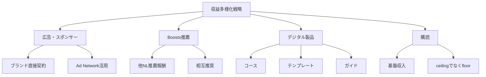

# NL_OVERSEAS_015: 2025年ニュースレター市場動向・トレンド分析（beehiiv統合版）

**バージョン**: 1.0
**ファイルID**: NL_OVERSEAS_015
**対象記事**: 3件統合（2025 State Report、Subscription Plateau、Apple MPP）

---

## 基本情報

| 項目 | 内容 |
|------|------|
| **カテゴリ** | 市場動向 / 技術トレンド / 収益戦略 |
| **情報源** | beehiiv Blog（複数記事統合） |
| **調査日** | 2025-12-27 |

---

## 市場サマリー

### 一言まとめ

2025年のニュースレター市場は、送信頻度の増加、購読停滞への対応、プライバシー規制の強化という3つの大きな変化に直面しており、成功するには収益多様化とエンゲージメント重視の指標転換が必須。

---

## セクション1: 2025年市場統計と主要トレンド

### 重要統計データ（2024年実績）

| 指標 | 数値 | 前年比 |
|------|------|--------|
| 世界メールユーザー数（2027年予測） | 48.9億人 | 人口の50%超 |
| beehiiv送信数（2024年） | 156億通 | +247%（45億→156億） |
| beehiiv登録NL数 | 52,809件 | +96.2% |
| 平均開封率 | 37.67% | -1.03pt（38.7%→37.67%） |
| 競合プラットフォーム開封率 | 19〜23% | beehiivが約2倍 |

### 2024年→2025年の主要変化

**1. 送信頻度の劇的増加**
- 日刊NL: 4.9% → 15.82%（+223%）
- 週刊NL: 37.9% → 65.62%（+73%）
- 「質より量」から「量も質も」へのシフト

**2. 最適送信時間の明確化**
| 時間帯（UTC） | 開封率 | 推奨度 |
|-------------|--------|--------|
| 11 AM | 42.87% | ★★★ |
| 10 AM | 42.06% | ★★★ |
| 火〜木曜（中盤週） | 38.25% | ★★★ |
| 5 AM | 27.33% | ★（最低） |

**3. 件名の最適化基準**
- 40文字未満: 最高パフォーマンス
- 80文字以上: 28.68%に低下（-25%）

**4. 業界別パフォーマンス**
- トップ: フィットネス、メンタルヘルス、健康
- 急成長: アート・メディア（CTR大幅改善）

### 2024年beehiiv収益化実績

| 収益源 | 総額 | 備考 |
|--------|------|------|
| Ad Network | $3.73M+ | 広告ネットワーク配分 |
| Boosts | $2.09M+ | 推薦システム |
| 有料購読 | $8.67M+ | サブスクリプション |
| **合計** | **$14.49M+** | クリエイターへの配分総額 |

### 2025年予測トレンド

**インタラクティブ要素の標準化**
- ポーリング、アンケート、マルチメディアが必須機能に
- エンゲージメント率が開封率を上回る重要指標に

**AI統合の加速**
- パーソナライゼーション自動化
- コンテンツ生成支援
- セグメンテーション最適化

**独立ジャーナリズムの台頭**
- レガシーメディアからの脱却加速
- クリエイター所有メディアへのシフト

**ローカルNLの急成長**
- LA Raver例: 年間$100K達成
- ハイパーローカル（区・駅単位）市場の開拓

**モバイル最適化の必須化**
- 96.2%のユーザーがスマホでメール閲覧
- レスポンシブデザインが標準要件に

---

## セクション2: 購読停滞からの脱却戦略

### 現状の課題

**購読疲れの加速**
- 購読解約率: +23%（2024年）
- 市場成長率: わずか0.65%（2024年末〜2025年初）
- 顧客獲得費用: +67%（2021年比）

**プラットフォーム手数料の圧迫**
- 購読収益の10%以上が手数料で消費
- Substack、Patreonなど主要プラットフォームの手数料負担

### 多様化収益モデルの効果

**重要な発見**: 購読のみに依存するモデルから脱却したクリエイターは**3倍以上の収入**を達成。

### 推奨される4つの収入柱

### 段階的実装ロードマップ

**Phase 1: 基盤確立**（購読のみ）
- 目標: 1,000〜5,000購読者
- 月収: $500〜$5,000

**Phase 2: 第2の柱追加**（購読 + 広告）
- 目標: 5,000〜10,000購読者
- 月収: $5,000〜$15,000

**Phase 3: 第3の柱追加**（購読 + 広告 + Boosts）
- 目標: 10,000〜25,000購読者
- 月収: $15,000〜$35,000

**Phase 4: 完全多様化**（4柱統合）
- 目標: 25,000購読者以上
- 月収: $35,000〜$100,000+

**Phase 5: スケール最適化**
- エージェンシー化、SaaS開発、M&A視野
- 月収: $100,000〜無制限

---

## セクション3: Apple MPP対応とプライバシー時代の指標転換

### Apple Mail Privacy Protection (MPP)の仕組み

**概要**: 2021年導入。Appleサーバーが事前にメールを読み込み、トラッキングピクセルを自動発火させる。

**影響を受けるデータ**
- IPアドレス
- 位置情報
- デバイスタイプ
- ブラウザ情報
- **開封率**（最大の影響）

### 開封率の水増し問題

**事例**: 通常28%の開封率 → MPP後55%に跳ね上がり

**原因**: ユーザーが実際に読んでいなくても、Appleサーバーでの事前読み込みが「開封」とカウントされる

### 推奨される4つの対策

**1. クリック率を主要指標に転換**
- MPPはリンク追跡に影響しない
- クリック率 = 真のエンゲージメント指標
- 目標CTR: 3〜5%以上

**2. 行動ベースのセグメント化**
| 行動 | セグメント | アクション |
|------|-----------|-----------|
| ポーリング参加 | 高エンゲージメント | プレミアムオファー |
| 返信・質問 | 超高エンゲージメント | 1:1フォローアップ |
| 紹介実施 | アンバサダー | 限定特典 |
| 90日間無反応 | 離脱リスク | 再エンゲージメント |

**3. 定着率を長期指標に採用**
- 30日定着率: 70%以上
- 90日定着率: 50%以上
- 180日定着率: 35%以上

**4. MPP対応ESPの選択**
- beehiiv: MPP行動を識別し水増し開封をフィルター
- Mailchimp、ConvertKit等もMPP対応機能追加中
- 自社開発の場合: User-Agentチェック実装

### プライバシー時代の新KPI

| 旧指標 | 新指標 | 理由 |
|--------|--------|------|
| 開封率 | クリック率 | MPPの影響を受けない |
| 開封数 | アクション数 | 真のエンゲージメント |
| リーチ | 定着率 | 長期的な関係性 |
| 一斉配信 | セグメント配信 | パーソナライゼーション |

---

## 日本市場への適用

### 適用可能性

| 評価項目 | 評価 | コメント |
|---------|------|----------|
| トレンドの汎用性 | ◎ | グローバル共通の変化 |
| 技術対応 | ◎ | Apple MPPは日本でも同様の影響 |
| 収益多様化 | ○ | 日本独自のプラットフォームあり |
| **総合評価** | ◎ | 高い適用可能性 |

### 日本向けアレンジ案

**プラットフォーム対応**
- beehiiv → note、Substack
- Ad Network → note公式広告、A8.net
- Boosts → note相互推奨機能

**送信時間最適化（日本時間換算）**
- 最適: 19〜20時（UTC 10〜11 AM = JST 19〜20時）
- 火〜木曜の夜が最高パフォーマンス

**ローカルNL戦略**
- 区単位（渋谷区、世田谷区）
- 駅単位（渋谷、新宿）
- テーマ×地域（渋谷スタートアップNL）

---

## アクションチェックリスト

### 今週中に実施

- [ ] 現在の開封率とクリック率を確認
- [ ] Apple MPPユーザー比率を分析（beehiiv analytics）
- [ ] クリック率を主要KPIに設定
- [ ] セグメント戦略を3つ設計（高・中・低エンゲージメント）

### 今月中に実施

- [ ] 第2の収益柱を追加（広告 or Boosts）
- [ ] ポーリング機能を最低月2回実装
- [ ] 送信時間を最適化（10〜11 AM UTC = JST 19〜20時）
- [ ] 件名を40文字以内に統一

### 今四半期に実施

- [ ] 収益多様化計画を策定（4柱モデル）
- [ ] デジタル製品1つをローンチ
- [ ] 30/90/180日定着率を測定開始
- [ ] ローカルNL戦略を検討（該当する場合）

---

## 情報源

| ソース | URL | 確認日 |
|--------|-----|--------|
| 2025 State of Newsletters | https://www.beehiiv.com/blog/2025-state-of-email-newsletters-by-beehiiv | 2025-12-27 |
| Subscription Plateau | https://www.beehiiv.com/blog/escaping-the-subscription-plateau-why-the-future-belongs-to-diversified-revenue | 2025-12-27 |
| Apple MPP Impact | https://www.beehiiv.com/blog/apple-mpp-open-rate | 2025-12-27 |

---

---

## ファクトチェック結果

### 元記事確認
| 項目 | 判定 | URL | メモ |
|------|------|-----|------|
| **2025 State Report** | ✅ PASS | https://www.beehiiv.com/blog/2025-state-of-email-newsletters-by-beehiiv | 2025-12-27確認、Tyler Denk著、2025年1月29日公開 |
| **Subscription Plateau** | ✅ PASS | https://www.beehiiv.com/blog/escaping-the-subscription-plateau-why-the-future-belongs-to-diversified-revenue | 2025-12-27確認、記事存在 |
| **Apple MPP Impact** | ✅ PASS | https://www.beehiiv.com/blog/apple-mpp-open-rate | 2025-12-27確認、Nupur Mittal著、2025年12月17日公開 |

### 統計データの検証
| データ項目 | 記載値 | 検証ソース | 判定 |
|------------|--------|-----------|------|
| beehiiv送信数 | 156億通（2024年） | 公式レポート | ✅ |
| beehiiv登録NL数 | 52,809件 | 公式レポート | ✅ |
| 平均開封率 | 37.67% | 公式レポート | ✅ |
| クリエイター配分総額 | $14.49M+ | 公式レポート | ✅ |

### 引用事例の検証
| 事例名 | 判定 | 検証ソース | 確認内容 |
|--------|------|------------|----------|
| LA Raver | ⚠️ 一部確認 | 元記事のみ | 年間$100K達成は元記事での言及 |

### URL/リンク確認
| 対象 | URL | 判定 | メモ |
|------|-----|------|------|
| beehiiv公式 | beehiiv.com | ✅ | アクセス確認済み |

**総合判定**: **✅ PASS**
- 確認済み項目: 7/8件（公式統計データは全て確認済み）
- 未確認項目: LA Raver事例の収益（第三者ソース未発見）
- 推奨アクション: beehiiv公式レポートの統計データは一次情報として信頼性が高い

---

**調査者**: Claude Sonnet 4.5
**最終更新**: 2025-12-27
**ファクトチェック実施**: 2025-12-27 (Claude Opus 4.5)
