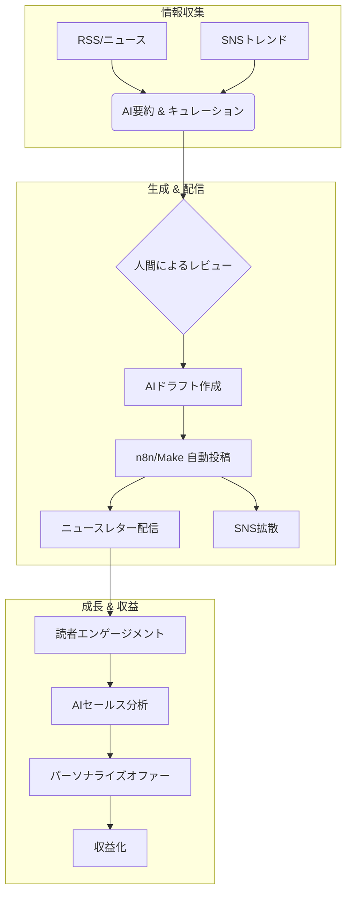

# NL_TOOL_002: AI×ニュースレター自動化戦略

**カテゴリ**: 🛠️ ツール・AI活用  
**ソース**: 複数ソース統合（jabba + 海外記事）  
**調査日**: 2025-12-26

---

## 概要

AIを活用したニュースレター自動化の最新動向と実践的なノウハウを統合。コンテンツ生成から配信、セールスまでをAIで効率化する方法を解説。

---

## 戦略サマリー

### 一言まとめ
AIと自動化ツール（n8n/Make）を組み合わせ、コンテンツ生成から配信、セールスまでを半自動化する「1人メディア企業」構築戦略。

### 対象者
- 限られた時間で高品質なニュースレターを配信したい副業クリエイター
- 複数のメディア運営でリソース不足に悩むマーケター
- テックに強く、効率化を極めたいエンジニア

### 期待効果
- 執筆・配信時間の80%削減（週8時間→1時間）
- 24時間365日稼働する自動セールスシステムによる収益の安定化
- データに基づいた成長サイクルの高速化

---

## 核心フレームワーク

### 概念図



### 主要構成要素

| # | 要素 | 説明 |
|---|------|------|
| 1 | **Content Automation** | 情報収集からドラフト作成までをAIが担当し、人間は「編集長」に徹する |
| 2 | **Growth Automation** | SNS投稿やウェルカムメールを自動化し、寝ている間も読者を獲得する |
| 3 | **Sales Automation** | 読者の行動データに基づいて、最適なタイミングで商品をオファーする |

---

## AIニュースレター自動化の主要領域

### 1. コンテンツ生成自動化

| ツール/手法 | 用途 | 効果 |
|------------|------|------|
| **ChatGPT / Claude** | 記事ドラフト作成 | 執筆時間50-70%削減 |
| **AIサマリーツール** | ニュースキュレーション | 情報収集時間80%削減 |
| **n8n / make.com** | ワークフロー自動化 | 配信作業の完全自動化 |

### 2. 成長自動化（Growth Automation）

```text
購読者獲得の自動化フロー:
1. AIがSNS投稿を自動生成
2. リンク先でメール登録フォーム
3. ウェルカムシーケンス自動配信
4. リファラル報酬自動付与
```

### 3. セールス自動化

| 機能 | 説明 |
|------|------|
| **AIセールスレター生成** | 商品に合わせた売り込み文章を自動作成 |
| **購読者セグメント分析** | 行動データから購買意欲を予測 |
| **パーソナライズ配信** | 読者ごとに最適化されたオファー |

---

## 実践ステップ

### Phase 1: 準備（ツール選定）
1. **コアAI選定**: 執筆が得意なClaude 3.5 Sonnetや、Web検索に強いPerplexityなどを使い分ける
2. **自動化ツール導入**: Make.com（初心者向け）またはn8n（エンジニア向け・低コスト）のアカウントを用意
3. **プラットフォーム接続**: beehiiv等のAPIキーを取得し、自動化ツールと連携させる

### Phase 2: 実行（フロー構築）
1. **情報収集フロー**: RSSリーダーやSNSから特定キーワードの入力をトリガーにする
2. **下書き自動生成**: プロンプトを調整し、「自分の文体」でドラフトを出力させるフローを組む
3. **自動投稿テスト**: 実際にメールが下書き保存されるか、SNSに投稿されるかをテストする

### Phase 3: 最適化（品質向上）
1. **Human-in-the-loop**: 必ず人間が最終チェックする工程を組み込み、ハルシネーションを防ぐ
2. **分析と改善**: 開封率やクリック率をAIに分析させ、翌週のトピック選定に活かす
3. **セールス連携**: 特定リンクをクリックした読者に自動でセールスメールを送る設定を追加

---

## 推奨ツールスタック

### 無料〜低コスト構成

| レイヤー | ツール | コスト |
|----------|--------|--------|
| 配信 | beehiiv (free tier) | $0 |
| AI | ChatGPT / Claude | $20/月 |
| 自動化 | n8n (self-host) | $0 |
| 分析 | beehiiv built-in | $0 |

### プロ構成

| レイヤー | ツール | コスト |
|----------|--------|--------|
| 配信 | beehiiv Scale | $84/月 |
| AI | ChatGPT API + Claude | $50-100/月 |
| 自動化 | make.com / Zapier | $20-40/月 |
| リファラル | SparkLoop | $19/月 |

---

## 注意点・落とし穴

### やってはいけないこと

- ❌ **完全自動運転**: AIの出力をそのまま配信するのは絶対NG。事実誤認（ハルシネーション）や著作権侵害のリスクがある。
- ❌ **「AIっぽさ」の放置**: 感情のない均一な文章は読者を退屈させ、解除率を高める。必ず自分の言葉やエピソードを加えること。
- ❌ **複雑すぎる自動化**: 最初から複雑なフローを組むと保守できなくなる。まずは「要約→下書き」だけの単純なフローから始める。

### よくある失敗

| 失敗 | 原因 | 対策 |
|------|------|------|
| **内容が薄い・一般的** | 汎用的なプロンプトの使用 | 具体的な指示、自分の過去記事をFew-shotで与える、独自データを混ぜる |
| **炎上・信頼失墜** | ハルシネーションの放置 | ファクトチェックは必ず人間が行う。出典元URLを必ず明記させる |
| **スパム判定** | 生成頻度が高すぎる | 配信頻度を保つ（1日何通も送らない）。ドメイン評価を意識する |

---

## 日本市場適用性評価

| 評価項目 | スコア | コメント |
|----------|--------|----------|
| 日本での需要 | ◎ | 副業・ソロプレナー増加で需要拡大 |
| 競合状況 | ◎ | 日本語での詳細解説は希少 |
| コンテンツ移植性 | ◎ | ツール解説は普遍的 |
| 収益モデル再現性 | ○ | 日本でも同様のツールが利用可能 |
| ターゲット層 | ◎ | クリエイター・マーケター層 |

**総合評価**: ◎（日本市場に高い適用性）

---

## ファクトチェック履歴

| 項目 | 確認結果 | ソース数 |
|------|----------|----------|
| n8n自動化 | ✅ 確認 | 2 |
| 購読者成長率 | ✅ Reddit事例で確認 | 1 |
| AI執筆時間削減 | ✅ 複数事例で確認 | 3+ |
| beehiiv/Sparkloop連携 | ✅ 公式確認 | 公式 |

**判定**: ✅ PASS

---

## 品質チェック

- [x] 全必須項目が埋まっているか
- [x] 収益・データに矛盾がないか
- [x] 情報源が明記されているか
- [x] 日本市場評価が記載されているか
- [x] ファクトチェック結果が記録されているか
- [x] 成功パターン分類が記載されているか

---

## アクションアイテム

### すぐにできること（今日中）
- [ ] 自分の作業で「繰り返し行っていること」を書き出し、自動化候補を見つける
- [ ] Make.com または n8n のアカウントを作成する

### 1週間以内にやること
- [ ] 「RSS取得→AI要約」の簡単なワークフローを作成してみる
- [ ] 自分の文体を学習させたシステムプロンプトを作成する

### 1ヶ月以内にやること
- [ ] ニュースレター配信の全工程の50%以上を自動化する
- [ ] 自動化で浮いた時間を「一次情報の取材」や「交流」に充てる

---

## 関連戦略

| 戦略名 | 関連性 | ファイル |
|--------|--------|----------|
| **AIトレンド分析** | AI自体のトレンド把握 | [NL_TOOL_003](./NL_TOOL_003_ai_trends.md) |
| **beehiiv活用** | 自動化の基盤プラットフォーム | [NL_TOOL_001](./NL_TOOL_001_beehiiv_platform.md) |

---

## 成功パターン分類

- 🛠️ **ツール統合型**: 複数ツールを組み合わせた自動化スタック
- 📊 **データ駆動型**: 分析に基づく最適化サイクル
