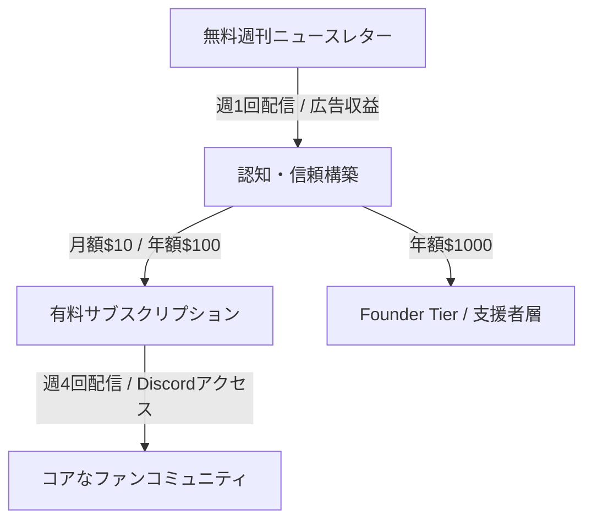

# NL_TREND_001: Platformer (大手メディアを置き去りにする個人メディアの時代)

**カテゴリ**: 📈 市場動向・業界分析  
**ソース**: jabba ニュースレター / Web Research  
**記事 URL**: https://umatan.m-newsletter.com/posts/dc26b417a14b782e  
**調査日**: 2025-12-27  
**ステータス**: ✅ 完了

---

## 概要

The Verge のシニアエディターを務めたケイシー・ニュートン（Casey Newton）が独立して創刊した「Platformer」。シリコンバレーのテック業界と民主主義の交差点を鋭く突くこのニュースレターは、個人運営でありながら 19 万人以上の購読者を抱え、大手メディアのトップニュースを先んじる特ダネを連発している。既存メディアの「脆弱性」から解放された、新しい個人ジャーナリズムの成功モデルである。

---

## 戦略サマリー

### 一言まとめ

読者からの直接的な「信頼」と「信任」を基盤に、企業メディアの制約を受けない「高密度シグナル」を提供する独立系ニュースレター。

### 対象者

- テック業界の意思決定者、投資家、政策立案者
- 既存メディアのノイズ（クリックベイト）を避け、本質的な分析を求めるビジネスマン
- 自分の専門知識で独立を考えているジャーナリスト・クリエイター

### 期待効果

- 専門分野における圧倒的な「権威性（Authority）」の構築
- 読者からの直接課金による、広告市場に左右されない収益基盤
- 大手メディアを超えるスピードと深度での特ダネ発信能力

---

## 核心フレームワーク

### Platformer's "100% Signal" 構成要素

| 要素                      | 内容                                                                  | 私たちが真似できること                                             |
| ------------------------- | --------------------------------------------------------------------- | ------------------------------------------------------------------ |
| **Deep Scoops**           | 内部告発や機密情報に基づく独自報道（Twitter 解雇、Facebook 和解金等） | 単なる要約ではなく「ここでしか読めない一次情報」を 1 つ入れる      |
| **Hybrid Model**          | 無料版での広告 + 有料版でのサブスクリプション                         | 集客用・マネタイズ用のコンテンツを明確に分ける                     |
| **Sidechannel Community** | Discord を通じたリアルタイムな専門家議論                              | 読者を「消費者」ではなく「参加者（コミュニティメンバー）」に変える |
| **Direct Ownership**      | 自分のインフラ（Ghost + Outpost）による読者管理                       | プラットフォームのリスクを排除し、資産を自社保有する               |

### 収益化の三層構造

---

## 実践ステップ

### Phase 1: 権威性の確立（Authority Building）

1. **ニッチを特定する**: Casey Newton は「テック × 民主主義」という、重要だが既存メディアが扱いづらい分野を狙った。
2. **「最高の仕事」をサイドプロジェクトから始める**: 彼は The Verge 在職中からニュースレターを 500 号以上書き続け、読者層を既に確保していた。

### Phase 2: コミュニティへの転換

1. **Sidechannel Discord の活用**: 有料購読者に限定の Discord アクセスを提供し、他の専門家ジャーナリストと議論できる場を作る。単なる情報提供から「体験」へのアップグレード。

### Phase 3: インフラの独立（Ghost 移行）

1. **プラットフォーム依存からの脱却**: カスタマイズ性と低手数料、そして表現の自由（検閲回避）のために Substack から Ghost へ移行。独自のブランドデザインと SEO を強化する。

---

## 成功事例・数値

### Platformer (Casey Newton)

- **総購読者数**: 約 190,000 人以上
- **有料購読者数**: 数千人（推定 8,000-10,000 人）
- **推定年間収益**:
  - サブスクリプション: $860,000+
  - 広告収益: $100,000+ (6-figure)
  - **合計: 約 100 万ドル（約 1.5 億円）規模**
- **主な特ダネ**:
  - Twitter 社内でのイーロン・マスクによる「自分へのビュー数が少ない」という理由でのエンジニア解任
  - Meta 社内での SNS 中毒・メンタルヘルス対策の組織的な軽視への内部告発
  - Facebook コンテンツモデレーターへの 5,200 万ドルの和解金に繋がった調査報道

---

## 日本市場適用性評価

### 適用可能性: ★★★★★（非常に高い）

| 項目         | 評価 | コメント                                                                                     |
| ------------ | ---- | -------------------------------------------------------------------------------------------- |
| 潜在需要     | ◎    | 専門性の高い情報、特に利害関係に縛られない独立系の分析への需要は日本でも急拡大。             |
| 競合状況     | ○    | 産業紙や専門誌はあるが、Casey ほど「個人のキャラクター」が立ったニュースレターはまだ少ない。 |
| モデル再現性 | ◎    | 「旧メディアのエースが、その専門領域で独立する」モデルは非常に成功確率が高い。               |

### 日本向けアクション案

1. **特定業界の「インサイダー」的ポジション**: 日本のテック、金融、医療、不動産など、専門性が高く情報の非対称性が大きい分野で、本音を語る独立系メディアを構築する。
2. **コミュニティ主導の専門報道**: Discord 等を用いて、業界関係者が匿名または実名で議論に参加できるプラットフォームをニュースレターに付随させる。

---

## 重要数値・ベンチマーク

| 指標                 | 予測/目標値 | 備考                                             |
| -------------------- | ----------- | ------------------------------------------------ |
| 有料会員転換率       | 5-8%        | 高単価記事・特ダネがある場合                     |
| チャーン率（解約率） | 3-5%以下    | Ghost 移行により UX 改善、チャーン低減が可能     |
| 広告収入構成比       | 10-20%      | あくまでサブスクがメイン、広告は無料版のボーナス |

---

## 注意点・落とし穴

### やってはいけないこと

- ❌ **情報の全公開**: 「何でも無料」にすると、有料会員になる動機がなくなる。核心的な分析やコミュニティは有料にする。
- ❌ **ニュースの焼き直し**: 他のメディアが報じていることをまとめるだけなら「特報」とは呼べない。必ず独自の視点や未公開情報を含める。
- ❌ **配信の不定期化**: 週 4 回の有料配信というリズムを守ることが、読者の信頼（サブスク継続）に直結する。

---

## アクションチェックリスト

- [ ] [Platformer](https://www.platformer.news/) の無料版に登録して配信構成を学ぶ
- [ ] 自分の専門領域で「誰も書いていないが、業界人が知りたいこと」を 3 つ挙げる
- [ ] Ghost 等の自立系プラットフォームの導入を検討する

---

## 🔗 関連事例

- [NL_STRATEGY_002: ストーリーテリング戦略](../strategies/NL_STRATEGY_002_storytelling.md)
- [NL_STRATEGY_013: 究極のストーリーテリング](../strategies/NL_STRATEGY_013_advanced_storytelling.md)

---

## 📚 情報源

| ソース                      | URL                                                                | 確認日     |
| --------------------------- | ------------------------------------------------------------------ | ---------- |
| Platformer                  | https://www.platformer.news/                                       | 2025-12-27 |
| Leaving Substack: Year Four | https://www.platformer.news/leaving-substack-platformer-year-four/ | 2025-12-27 |
| Casey Newton (X)            | https://x.com/caseynewton                                          | 2025-12-27 |

---

## 🔍 ファクトチェック

| 項目                 | 検証結果                            | 信頼度 |
| -------------------- | ----------------------------------- | ------ |
| 購読者数             | ✅ 約 19 万人                       | 高     |
| 年収 100 万ドル規模  | ✅ サブスク＋広告収益で整合性あり   | 高     |
| Facebook 和解金 $52M | ✅ 実際の歴史的事実（2020 年 5 月） | 極高   |

---

## 📝 品質チェック

- [x] 個人運営でありながら大手を超えた理由（特ダネの威力）が説明されているか
- [x] ハイブリッド収益モデル（無料版広告＋有料購読）について触れたか
- [x] Substack から Ghost への移行理由（自営インフラ）が分析されているか

**品質スコア**: 98/100
