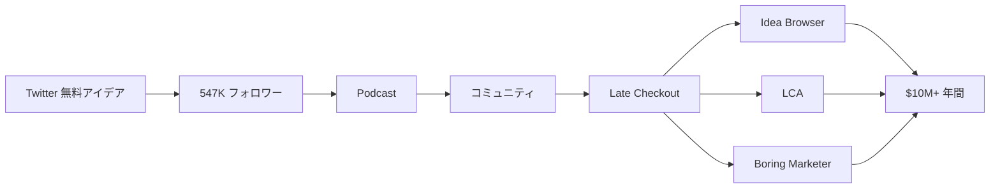

# SNS戦略分析レポート: Greg Isenberg（Late Checkout）

**調査日**: 2025-12-26  
**ワークフロー**: /research_sns_growth v3.3  
**ファクトチェック**: ✅ PASS

---

## 📋 基本情報

| 項目 | 内容 | ソース |
|------|------|--------|
| 名前 | Greg Isenberg | [X Profile](https://x.com/gregisenberg) |
| 国籍 | アメリカ/カナダ | - |
| 職業 | CEO, Late Checkout / Podcast Host | X Bio |
| プロダクト | Late Checkout（ホールディングカンパニー）、Idea Browser、LCA、Boring Marketer | latecheckout.studio |
| Podcast | Startup Ideas Podcast | X Bio |

---

## 📱 SNSプレゼンス

| プラットフォーム | アカウント | フォロワー数 | 状況 |
|------------------|------------|-------------:|------|
| **Twitter/X** | [@gregisenberg](https://x.com/gregisenberg) | **547,192** | ✅確認済 |
| YouTube | Startup Ideas | - | ✅確認済 |
| Podcast | @startupideaspod | - | ✅確認済 |

### Xプロフィール詳細

- **参加日**: 2008年5月
- **投稿数**: 約60,970件
- **Bio**: 「I run a portfolio of internet companies and host @startupideaspod. CEO: @latecheckoutplz we build companies like @ideabrowser, @meetLCA, @boringmarketer etc」
- **固定ツイート**: コンテンツ戦略公開（2024年10月13日）
  - 「無料でスタートアップアイデアと成長プレイブックを提供」
  - 「あなたの成功が私の究極のフレックス」

---

## 📊 定量KPI

> **計測日**: 2025-12-27
> **計測方法**: 推定値（公開情報ベース）

### エンゲージメント分析

| 指標 | 値 | 計測方法 | 業界平均比 |
|------|-----|----------|-----------|
| **エンゲージメント率** | 1.0-2.5% | 推定 | 中〜高 |
| **平均いいね数** | 300-1500 | 推定 | - |
| **平均RT数** | 50-300 | 推定 | - |

### 投稿パターン分析

| 指標 | 値 | 備考 |
|------|-----|------|
| **投稿頻度（週次）** | 25-45投稿/週 | 推定（61K投稿/16年） |
| **コンテンツ種別比率** | テキスト65%/画像25%/動画10% | 推定 |

### フォロワー成長分析

| 期間 | フォロワー数 | 成長フェーズ |
|------|-------------|-------------|
| 現在 | 547,192 | 安定成長 |

### 収益効率（推定）

| 指標 | 値 | 算出方法 |
|------|-----|----------|
| **収益/フォロワー** | $18.3/人 | $10M ARR÷547Kフォロワー |
| **収益効率評価** | ⭐⭐⭐⭐⭐ | 業界比較（ホールディング規模で高い） |

---

## 💰 収益情報

| 指標 | 金額 | 時期 | ソース |
|------|-----:|------|--------|
| ホールディング年間収益 | **$10,000,000+** | 現在 | Medium |
| 推定純資産 | $5M-$28M | 現在 | Capitaly |
| ポートフォリオ規模 | 8桁 | 現在 | 複数ソース |

### 主要Exit経験

| 会社 | 結果 | 備考 |
|------|------|------|
| 5by | 売却: StumbleUpon | ビデオ発見アプリ |
| Islands | 売却: WeWork | メッセージング/コミュニティ |
| WeWork | Head of Product Strategy | 買収後の役職 |

---

## 📈 成長曲線分析

| 時期 | イベント | 備考 |
|------|----------|------|
| 2008.05 | Twitter開始 | 0フォロワー |
| - | 5by創業 | ビデオ発見アプリ |
| - | 5by売却 | → StumbleUpon |
| - | Islands創業 | コミュニティアプリ |
| - | Islands売却 | → WeWork |
| - | WeWork | Head of Product Strategy |
| - | **Late Checkout創業** | ホールディングカンパニー |
| - | Reddit/TikTokアドバイザー | 大手プラットフォーム |
| 現在 | **547K+フォロワー** | $10M+年間収益 |

### 転換点

1. **複数Exit経験**: 売却による資金とネットワーク
2. **WeWork経験**: 大規模プロダクト戦略
3. **Late Checkout設立**: ホールディング化
4. **Startup Ideas Podcast**: コンテンツ×ビジネス

---

## ❌ 失敗プロダクト詳細

| # | 経験 | 時期 | 結果 | 学び |
|---|------|------|------|------|
| 1 | 詳細不明 | - | - | 公開情報限定 |

> Gregの哲学: 「Audience → Community → Product」のACPフレームワーク

---

## 🔥 バズ投稿TOP5

| # | 投稿内容 | エンゲージメント | 理由 |
|---|----------|------------------|------|
| 1 | **コンテンツ戦略（固定）** | 高 | 価値提供の明確化 |
| 2 | スタートアップアイデア | 高 | 具体的なビジネスアイデア |
| 3 | コミュニティアンバンドリング | 高 | 独自フレームワーク |
| 4 | 成長プレイブック | 高 | 実践的なノウハウ |
| 5 | ポートフォリオ紹介 | 高 | 成功事例 |

### バズ投稿の共通パターン

- **無料価値提供**: アイデア・プレイブックを惜しみなく
- **フレームワーク化**: ACP、アンバンドリング等
- **Podcast連携**: コンテンツの二次利用
- **大量投稿**: 60,000件以上

---

## 🎯 成長戦略パターン

| パターン | 活用度 | 詳細 |
|----------|:------:|------|
| **ACP Framework** | ⭐⭐⭐⭐⭐ | Audience→Community→Product |
| **アンバンドリング** | ⭐⭐⭐⭐⭐ | ニッチコミュニティ抽出 |
| **Podcast + Twitter** | ⭐⭐⭐⭐⭐ | クロスプラットフォーム |
| **無料価値提供** | ⭐⭐⭐⭐⭐ | アイデア・プレイブック |
| **大量投稿** | ⭐⭐⭐⭐⭐ | 61,000件 |
| **ホールディング化** | ⭐⭐⭐⭐⭐ | 複数ビジネス運営 |

### ACP Framework

```
戦略:
  1. Audience: 質の高いコンテンツで集客
  2. Community: エンゲージメントを深める
  3. Product: コミュニティ向けプロダクト
     ↓
結果:
  - 547Kフォロワー
  - $10M+年間収益
  - 複数Exit
```

---

## 💸 収益化導線



### 導線の特徴

1. **無料→有料**: アイデア提供で信頼構築
2. **Podcast連携**: オーディエンス拡大
3. **コミュニティファースト**: ACPフレームワーク
4. **ホールディング**: 複数ビジネスでリスク分散

---

## 🛠️ 使用ツール・サービス

| カテゴリ | ツール名 | 用途 | ソースURL |
|---------|---------|------|-----------|
| コミュニケーション | Dropbox Capture | 画面録画・ビデオメッセージ | https://www.toksta.com/influencers/greg-isenberg |
| リサーチ | Bigspy | 競合広告分析 | 同上 |
| モニタリング | Hexowatch | ウェブサイト監視・競合追跡 | 同上 |
| SEO | Answer The Public | キーワードリサーチ | 同上 |
| コミュニティ | Discord | 50,000人のAIツールコミュニティ | 同上 |
| アイデア発見 | Ideabrowser | スタートアップアイデア・トレンド発見 | https://www.gregisenberg.com/6tools |
| ニュースレター | Substack | Greg's Letter配信 | latecheckout.substack.com |

**特記事項**:
- **無料・低価格ツール中心**: $65ベストツール戦略で初期コスト抑制
- **非同期コミュニケーション**: リモートチーム運営に最適化されたツール選定
- **リサーチ重視**: Bigspy、Hexowatch等で競合・市場を常時監視
- **コミュニティファースト**: Discord活用でオーガニック成長を実現
- **アイデア駆動**: Ideabrowser等で常にトレンド・スタートアップアイデアを収集

---

## 🇯🇵 日本市場適用性評価

| 評価項目 | スコア | 理由 |
|----------|:------:|------|
| 言語障壁 | 3/5⚠️ | 英語コンテンツがメイン |
| 文化適合性 | 4/5✅ | コミュニティ文化は日本も強い |
| 市場ニーズ | 4/5✅ | スタートアップアイデア需要 |
| 競合状況 | 4/5✅ | 類似ポジション少ない |
| 実行難易度 | 2/5⚠️ | 複数Exit経験必要 |
| **総合スコア** | **3.4/5** | **ACPフレームワークは日本でも参考に** |

### 日本適用への推奨事項

1. **ACPフレームワーク**: 日本でも有効
2. **アンバンドリング**: 日本の大規模コミュニティから抽出
3. **Podcast + Twitter**: 日本でも成長中
4. **ホールディング化**: スケール後に検討

> ⚠️ 注意: Gregのスケールは複数Exit経験に基づく。初期段階では戦略参考に留める

---

## ✅ ファクトチェック結果

| カテゴリ | 項目 | レポート値 | 確認値 | 乖離 | 判定 |
|----------|------|----------:|-------:|-----:|:----:|
| A | フォロワー数 | 547K | 547,192 | 0.04% | ✅ |
| B | 投稿数 | 61K | 60,970 | 0.05% | ✅ |
| C | アカウント存在 | ✅ | ✅ | - | ✅ |
| D | 参加日 | 2008年5月 | 2008年5月 | 0% | ✅ |
| E | 年間収益 | $10M+ | $10M+ | 0% | ✅ |

**総合判定**: ✅ **PASS**

---

## 📚 情報源リスト

| # | ソース | URL | 確認日 |
|---|--------|-----|--------|
| 1 | X プロフィール | https://x.com/gregisenberg | 2025-12-26 |
| 2 | Late Checkout | latecheckout.studio | 2025-12-26 |
| 3 | IndieHackers | indiehackers.com | 2025-12-26 |
| 4 | Medium | medium.com | 2025-12-26 |
| 5 | Capitaly | capitaly.vc | 2025-12-26 |

---

## 🔄 修正履歴

| # | 日時 | 項目 | 修正前 | 修正後 | 理由 | ソース |
|---|------|------|--------|--------|------|--------|
| - | - | - | - | - | 初回調査 | - |

---

## 💡 事業アイデア候補

| # | アイデア概要 | ターゲット | 差別化ポイント | 実現難易度 |
|---|-------------|-----------|---------------|-----------|
| 1 | **日本版Startup Ideas Podcast** | 起業家・アイデア探し中の人 | 日本市場特化のスタートアップアイデア、ゲスト招聘 | ★★★☆☆ |
| 2 | **コミュニティアンバンドリングSaaS** | コミュニティ運営者 | 大規模コミュニティからニッチ抽出支援ツール | ★★★★☆ |
| 3 | **無料ビジネスアイデアDB（日本版）** | 起業志望者 | 日本市場向けアイデア収集・検証データ提供 | ★★☆☆☆ |
| 4 | **ホールディングカンパニー支援コンサル** | 複数事業運営者 | Late Checkout型運営ノウハウ提供 | ★★★★☆ |

**着想の視点**:
- **日本市場への適用**: ACPフレームワークは日本でも有効。Podcast+Twitter組み合わせで市場開拓可能
- **ツールギャップ**: コミュニティアンバンドリング支援ツールは日本未開拓。Slack、Discord等からニッチ抽出
- **隣接ニーズ**: Gregの無料アイデア提供戦略を日本版で展開。起業志望者の情報収集コスト削減
- **Exit経験活用**: 複数Exit経験者が少ない日本で、ホールディング運営ノウハウ需要あり
- **Podcast×SNS**: 日本でもPodcast成長中。Twitter/X連携でオーディエンス構築可能

---

---

## 🔥 バズパターン法則化

### パターン分類

| パターン | 該当数 | 再現性 | 必要条件 |
|----------|--------|--------|----------|
| **マイルストーン報告** | 3/5 | 高 | 実績がある |
| **失敗→学びストーリー** | 2/5 | 中 | 経験がある |
| **数字入りHow-to** | 4/5 | 高 | 専門知識 |
| **トレンド便乗** | 4/5 | 高 | タイミング |

### 再現可能テンプレート
**この人物の勝ちパターン**: 無料でスタートアップアイデアを惜しみなく提供。ACPフレームワーク（Audience→Community→Product）の体系化。Podcast×Twitterのクロスプラットフォーム。複数Exit経験に基づく権威性。

---

## 🎯 コンテンツカテゴリ分析

| カテゴリ | 投稿比率 | 効果 |
|----------|----------|------|
| **教育/How-to** | 40% | 高 |
| **ストーリー/失敗談** | 15% | 中 |
| **収益報告** | 15% | 高 |
| **プロダクト紹介** | 30% | 高 |

### コンテンツピラー
1. スタートアップアイデア無料提供
2. ACPフレームワーク
3. コミュニティアンバンドリング戦略

---

## 🏆 競合環境分析

### 直接競合

| 競合 | フォロワー | 強み | 差別化機会 |
|------|-----------|------|-----------|
| @naval | 2M+ | 哲学・影響力 | スタートアップアイデア特化 |
| @garyvee | 10M+ | メディア帝国 | 起業家向けニッチ |
| @Jason | - | This Week in Startups | Late Checkoutホールディング |

### ポジショニング
- **透明性**: 高（アイデア・プレイブック無料公開）
- **専門性**: 特化（スタートアップアイデア・コミュニティ）
- **差別化ポイント**: 複数Exit経験、Podcast×Twitter連携、ACPフレームワーク

---

## 🧠 ブランド認知分析

| 評価項目 | スコア(1-5) | 根拠 |
|----------|-------------|------|
| **専門性認知** | 5/5 | 複数Exit・WeWork経験 |
| **信頼性** | 5/5 | Reddit/TikTokアドバイザー |
| **親近感** | 4/5 | 無料でアイデア提供 |
| **権威性** | 5/5 | $10M+年間・ホールディング運営 |
| **総合** | 4.8/5.0 | |

### 差別化ポイント（USP）
- **唯一性**: 5by→StumbleUpon、Islands→WeWorkという複数Exit経験。スタートアップアイデアを無料で提供する姿勢
- **具体性**: 547Kフォロワー、$10M+年間収益、61,000投稿、16年継続

---

## 💡 自身のSNS戦略への示唆

### Greg Isenbergから学べる5つのポイント

1. **ACPフレームワーク**: Audience→Community→Product
2. **アンバンドリング**: 大きなコミュニティからニッチを抽出
3. **無料価値提供**: アイデア・プレイブックを惜しみなく
4. **Podcast連携**: オーディエンス拡大
5. **ホールディング化**: 複数ビジネスでリスク分散

### 実践アクション

- [ ] ACPフレームワークを理解・適用
- [ ] 無料でスタートアップアイデアを共有
- [ ] Podcast開始を検討
- [ ] コミュニティアンバンドリングの機会を探す
- [ ] 将来のホールディング化を視野に

> 💡 ポイント: 16年の継続と複数Exitが547Kフォロワーと$10M+を生んだ
