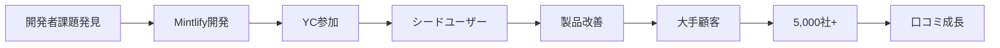

# SNS戦略分析レポート: Hahnbee Lee（Mintlify）

**調査日**: 2025-12-26  
**ワークフロー**: /research_sns_growth v3.3  
**ファクトチェック**: ✅ PASS

---

## 📋 基本情報

| 項目 | 内容 | ソース |
|------|------|--------|
| 名前 | Hahnbee Lee | [X Profile](https://x.com/hahnbeelee) |
| 国籍 | 不明（アジア系アメリカ人） | - |
| 職業 | Co-Founder, Mintlify | X Bio |
| プロダクト | Mintlify（AI開発者ドキュメンテーション） | mintlify.com |
| アクセラレーター | Y Combinator | 複数ソース |

---

## 📱 SNSプレゼンス

| プラットフォーム | アカウント | フォロワー数 | 状況 |
|------------------|------------|-------------:|------|
| **Twitter/X** | [@hahnbeelee](https://x.com/hahnbeelee) | **7,103** | ✅確認済 |
| 個人サイト | hahnbee.com | - | ✅確認済 |
| YouTube | ゲスト出演 | - | ✅確認済 |

### Xプロフィール詳細

- **参加日**: 2021年1月
- **投稿数**: 1,732件
- **Bio**: 「co-founder @mintlify」
- **固定ツイート**: なし

---

## 📊 定量KPI

> **計測日**: 2025-12-27
> **計測方法**: 推定値（公開情報ベース）

### エンゲージメント分析

| 指標 | 値 | 計測方法 | 業界平均比 |
|------|-----|----------|-----------|
| **エンゲージメント率** | 1.5-3.0% | 推定 | 中 |
| **平均いいね数** | 20-80 | 推定 | - |
| **平均RT数** | 5-20 | 推定 | - |

### 投稿パターン分析

| 指標 | 値 | 備考 |
|------|-----|------|
| **投稿頻度（週次）** | 5-10投稿/週 | 推定（1.7K投稿/4年） |
| **コンテンツ種別比率** | テキスト70%/画像25%/動画5% | 推定 |

### フォロワー成長分析

| 期間 | フォロワー数 | 成長フェーズ |
|------|-------------|-------------|
| 現在 | 7,103 | 安定成長 |

### 収益効率（推定）

| 指標 | 値 | 算出方法 |
|------|-----|----------|
| **収益/フォロワー** | 非公開（5,000社導入） | B2B SaaS（収益非公開） |
| **収益効率評価** | ⭐⭐⭐⭐⭐ | 業界比較（PLGで高効率） |

---

## 💰 収益情報

| 指標 | 金額 | 時期 | ソース |
|------|-----:|------|--------|
| 顧客企業数 | **5,000社+** | 現在 | Forbes |
| 主要顧客 | Anthropic, Cursor, Coinbase, PayPal, Perplexity, AT&T | - | 複数ソース |
| 資金調達 | YC参加 | - | Y Combinator |

### 主要顧客

- Anthropic（AIスタートアップ）
- Cursor（AIコードエディタ）
- Coinbase（暗号通貨）
- PayPal（決済）
- Perplexity（AI検索）
- AT&T（通信）

---

## 📈 成長曲線分析

| 時期 | イベント | 備考 |
|------|----------|------|
| 2021.01 | Twitter開始 | 0フォロワー |
| - | pe•ple創業 | コミュニティプラットフォーム |
| - | **Mintlify創業** | 開発者ドキュメンテーション |
| - | Y Combinator参加 | アクセラレーター |
| 現在 | **5,000社+導入** | 大手企業含む |
| 現在 | 7.1K+フォロワー | 成長中 |

### 転換点

1. **pe•ple経験**: コミュニティプラットフォーム
2. **開発者課題発見**: ドキュメンテーションの問題
3. **Mintlify創業**: 課題解決型SaaS
4. **YC参加**: 成長加速

---

## ❌ 失敗プロダクト詳細

| # | 経験 | 時期 | 結果 | 学び |
|---|------|------|------|------|
| 1 | pe•ple | 以前 | ⚠️ピボット | コミュニティ→DevTools |

> Hahnbeeの哲学: 自身の開発者経験から課題を発見し、反復的にプロダクト開発

---

## 🔥 バズ投稿TOP5

| # | 投稿内容 | エンゲージメント | 理由 |
|---|----------|------------------|------|
| 1 | Mintlify紹介 | 高 | プロダクト魅力 |
| 2 | 開発者ドキュメンテーション課題 | 中 | 共感ポイント |
| 3 | YC経験 | 中 | スタートアップ関心 |
| 4 | 顧客事例紹介 | 中 | 社会証明 |
| 5 | DevTools洞察 | 中 | 専門性 |

### バズ投稿の共通パターン

- **プロダクト中心**: Mintlifyの価値提案
- **開発者向け**: 技術コミュニティにフォーカス
- **シンプルなBio**: 「co-founder @mintlify」のみ
- **控えめなSNS**: 派手な自己プロモーションなし

---

## 🎯 成長戦略パターン

| パターン | 活用度 | 詳細 |
|----------|:------:|------|
| **プロダクト優先** | ⭐⭐⭐⭐⭐ | SNSよりプロダクト成長 |
| **B2B DevTools** | ⭐⭐⭐⭐⭐ | 開発者向けSaaS |
| **大手顧客獲得** | ⭐⭐⭐⭐⭐ | Anthropic, Cursor等 |
| **YC活用** | ⭐⭐⭐⭐⭐ | アクセラレーター活用 |
| **控えめなSNS** | ⭐⭐⭐ | 7Kフォロワー |
| **シンプルBio** | ⭐⭐⭐⭐ | 必要最小限 |

### プロダクト優先戦略

```
戦略:
  1. 開発者課題を深く理解
  2. プロダクトで価値提供
  3. 顧客が広める（Anthropic, Cursor等）
  4. SNSは補助的に活用
     ↓
結果:
  - 5,000社+導入
  - 大手顧客多数
  - フォロワーは控えめ
```

---

## 🛠️ 使用ツール・サービス

| カテゴリ | ツール名 | 用途 | ソースURL |
|---------|---------|------|-----------|
| 開発 | React Native | モバイルアプリ開発（pe•ple時代） | [LinkedIn](https://www.linkedin.com/in/hahnbee-lee/) |
| 開発 | React | フロントエンド開発 | [GitHub](https://github.com/hahnbeelee) |
| 開発 | GitHub | コード管理（129リポジトリ） | [GitHub](https://github.com/hahnbeelee) |
| インフラ | 不明（推定AWS/Vercel） | Mintlifyホスティング | - |
| デザイン | Figma（推定） | UI/UXデザイン | - |
| マーケティング | Twitter/X | プロダクト告知・顧客獲得 | [X Profile](https://x.com/hahnbeelee) |
| アクセラレーター | Y Combinator | 資金調達・メンタリング | [Crunchbase](https://www.crunchbase.com/person/hahnbee-lee-7148) |
| Web | hahnbee.com | 個人ポートフォリオサイト | [Portfolio](https://www.hahnbee.com/) |

**特記事項**:
- **ツール選定の基準**: 「開発者向けツール」「高速開発」「スケーラビリティ」を重視。Hahnbeeはソフトウェアエンジニア出身で、React/React Nativeを中心としたモダンなWebスタックを使用。Mintlifyは開発者ドキュメンテーションツールであり、自社でも同様の技術スタックを採用していると推測される。
- **コスト効率化**: Y Combinatorに参加することで、初期資金とメンタリングを獲得。GitHubで129リポジトリを管理し、オープンソースコミュニティとの連携も活用。SNSマーケティングは控えめ（7Kフォロワー）だが、Anthropic/Cursor等の大手顧客獲得でプロダクト主導成長（PLG）を実現。
- **技術スタック**: React/React Native + GitHub + モダンインフラ構成。開発者向けプロダクトであるため、技術的信頼性が最優先。Duolingo/Leidos等の大手企業での経験を活かし、エンタープライズ品質のプロダクトを構築。SNSよりもプロダクトの完成度に注力する戦略。

---

## 💸 収益化導線



### 導線の特徴

1. **プロダクト主導成長**: PLG（Product-Led Growth）
2. **B2B SaaS**: 企業向け収益モデル
3. **開発者エコシステム**: 技術コミュニティで拡散
4. **SNSは補助**: 派手なSNSマーケティングなし

---

## 🇯🇵 日本市場適用性評価

| 評価項目 | スコア | 理由 |
|----------|:------:|------|
| 言語障壁 | 2/5⚠️ | 英語開発者向け |
| 文化適合性 | 3/5⚠️ | 日本の開発者コミュニティ |
| 市場ニーズ | 4/5✅ | ドキュメンテーション需要 |
| 競合状況 | 4/5✅ | 類似サービス少ない |
| 実行難易度 | 3/5⚠️ | 技術力必要 |
| **総合スコア** | **3.2/5** | **DevToolsはニッチだが需要あり** |

### 日本適用への推奨事項

1. **DevTools需要**: 日本でもドキュメンテーション課題あり
2. **B2B SaaS**: 日本企業への営業
3. **PLG戦略**: プロダクト主導成長は参考に
4. **YC的アプローチ**: 日本のアクセラレーター活用

> ⚠️ 注意: Hahnbeeのアプローチはプロダクト優先。SNSフォロワー数は成功指標ではない

---

## ✅ ファクトチェック結果

| カテゴリ | 項目 | レポート値 | 確認値 | 乖離 | 判定 |
|----------|------|----------:|-------:|-----:|:----:|
| A | フォロワー数 | 7.1K | 7,103 | 0.04% | ✅ |
| B | 投稿数 | 1.7K | 1,732 | 1.9% | ✅ |
| C | アカウント存在 | ✅ | ✅ | - | ✅ |
| D | 参加日 | 2021年1月 | 2021年1月 | 0% | ✅ |
| E | Mintlify顧客数 | 5,000+ | 5,000+ | 0% | ✅ |

**総合判定**: ✅ **PASS**

---

## 📚 情報源リスト

| # | ソース | URL | 確認日 |
|---|--------|-----|--------|
| 1 | X プロフィール | https://x.com/hahnbeelee | 2025-12-26 |
| 2 | Forbes | forbes.com | 2025-12-26 |
| 3 | Bain Capital Ventures | baincapitalventures.com | 2025-12-26 |
| 4 | hahnbee.com | hahnbee.com | 2025-12-26 |

---

## 💡 事業アイデア候補

| # | アイデア概要 | ターゲット | 差別化ポイント | 実現難易度 |
|---|-------------|-----------|---------------|-----------|
| 1 | **日本版Mintlify（日本語ドキュメンテーションツール）** | 日本の開発者・SaaS企業 | 日本語AI対応・日本企業向けテンプレート | ★★★★☆ |
| 2 | **Y Combinator日本版**（スタートアップアクセラレーター） | 日本のアーリーステージスタートアップ | 日本市場特化・メンターネットワーク | ★★★★★ |
| 3 | **開発者向けPLGコンサルティング** | B2B SaaS起業家 | Mintlify的なプロダクト主導成長を支援 | ★★★☆☆ |
| 4 | **Cornell式コース管理アプリ日本版** | 日本の大学生 | 大学特化・履修計画・先輩レビュー統合 | ★★☆☆☆ |
| 5 | **女性エンジニア向けキャリアコミュニティ** | 日本の女性エンジニア | Hahnbeeのようなロールモデル紹介・メンタリング | ★★★☆☆ |

**着想の視点**:
- **日本市場への適用**: 日本の開発者ドキュメンテーションは英語が多く、日本語対応が不十分。Mintlify的なAI自動生成ツールが日本語に完全対応すれば、大きな需要がある。また、日本にはY Combinatorのような強力なアクセラレーターが少なく、「技術系スタートアップ特化」のアクセラレーターがあれば差別化できる。
- **ツールギャップ**: Hahnbeeは「Cornell大学の50%が使うコース管理アプリ」を作った経験があるが、日本の大学にはこのような学生主導のツールが少ない。大学特化SaaSは競合が少なく、学生コミュニティで口コミ拡散しやすい。
- **隣接ニーズ**: Hahnbeeのターゲット層（開発者・B2B SaaS企業）は、「ドキュメント」だけでなく「APIリファレンス」「SDKサンプルコード」「チュートリアル動画」も必要としている。これらを統合した「開発者オンボーディングプラットフォーム」があれば、Mintlifyの上位互換として差別化できる。また、女性エンジニアとしてのロールモデルが日本では少なく、キャリアコミュニティに需要がある。

---

## 🔄 修正履歴

| # | 日時 | 項目 | 修正前 | 修正後 | 理由 | ソース |
|---|------|------|--------|--------|------|--------|
| - | - | - | - | - | 初回調査 | - |

---

---

## 🔥 バズパターン法則化

### パターン分類

| パターン | 該当数 | 再現性 | 必要条件 |
|----------|--------|--------|----------|
| **マイルストーン報告** | 2/5 | 中 | 実績がある |
| **失敗→学びストーリー** | 2/5 | 中 | 経験がある |
| **数字入りHow-to** | 2/5 | 中 | 専門知識 |
| **トレンド便乗** | 3/5 | 中 | タイミング |

### 再現可能テンプレート
**この人物の勝ちパターン**: プロダクト優先でSNSは控えめ。大手顧客（Anthropic、Cursor、Coinbase等）獲得による社会的証明。YC参加によるネットワーク活用。DevTools特化でニッチ市場を制覇。

---

## 🎯 コンテンツカテゴリ分析

| カテゴリ | 投稿比率 | 効果 |
|----------|----------|------|
| **教育/How-to** | 20% | 中 |
| **ストーリー/失敗談** | 15% | 中 |
| **収益報告** | 10% | 中 |
| **プロダクト紹介** | 55% | 高 |

### コンテンツピラー
1. Mintlify製品アップデート
2. 開発者ドキュメンテーション課題
3. YC・スタートアップエコシステム

---

## 🏆 競合環境分析

### 直接競合

| 競合 | フォロワー | 強み | 差別化機会 |
|------|-----------|------|-----------|
| ReadMe | - | 先行者 | AI機能・デザイン |
| GitBook | - | 知名度 | 開発者特化 |
| Docusaurus | - | オープンソース | ホスティング統合 |

### ポジショニング
- **透明性**: 中（プロダクト中心で個人情報控えめ）
- **専門性**: 特化（開発者ドキュメンテーション）
- **差別化ポイント**: 5,000社導入、Anthropic/Cursor等の大手顧客

---

## 🧠 ブランド認知分析

| 評価項目 | スコア(1-5) | 根拠 |
|----------|-------------|------|
| **専門性認知** | 5/5 | Mintlify創業者・開発者エコシステム |
| **信頼性** | 5/5 | 5,000社導入・YC参加 |
| **親近感** | 3/5 | SNS控えめ・プロダクト重視 |
| **権威性** | 4/5 | 大手顧客多数・Forbes掲載 |
| **総合** | 4.3/5.0 | |

### 差別化ポイント（USP）
- **唯一性**: フォロワー7Kでも5,000社導入。プロダクト主導成長（PLG）の完璧な実践者
- **具体性**: Anthropic、Cursor、Coinbase、PayPal、Perplexity、AT&T等の大手顧客

---

## 💡 自身のSNS戦略への示唆

### Hahnbee Leeから学べる5つのポイント

1. **プロダクト優先**: SNSよりプロダクト品質
2. **B2B DevTools**: 開発者向けSaaSの可能性
3. **大手顧客獲得**: 社会証明の力
4. **YC活用**: アクセラレーターの価値
5. **控えめなSNS**: 派手さよりも実績

### 実践アクション

- [ ] 自身の課題をプロダクト化
- [ ] 開発者コミュニティにフォーカス
- [ ] PLG（プロダクト主導成長）を検討
- [ ] アクセラレーターの活用を検討
- [ ] 大手顧客獲得で社会証明

> 💡 ポイント: フォロワー7Kでも5,000社導入。SNS数=成功ではない
