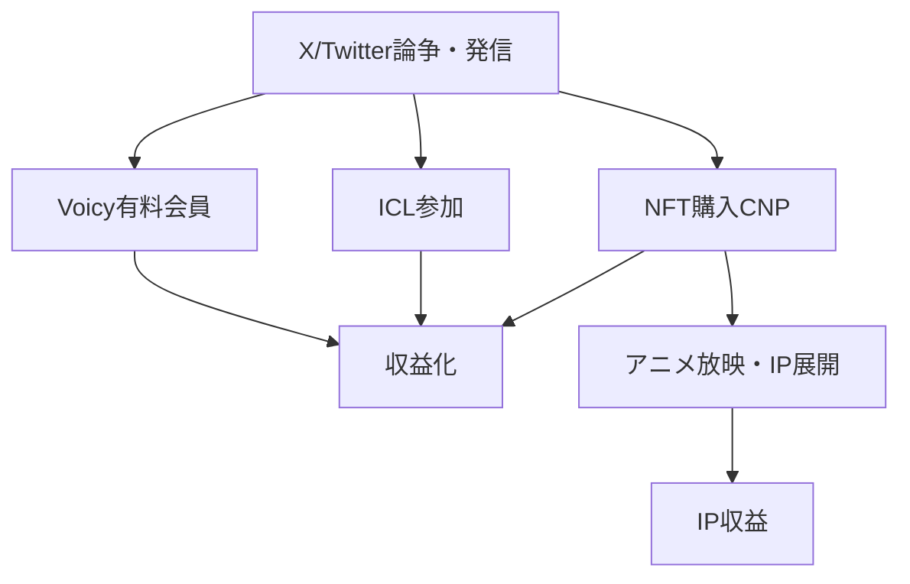

---
# ============================================================
# YAML Front Matter（RAG/ベクトル検索最適化用）v5.0
# ============================================================

id: "SNS_JP_003"
title: "イケハヤ（イケダハヤト）"
category: "sns"
type: "case_study"
version: "5.0"
created_at: "2025-12-28"
updated_at: "2025-12-28"

# 人物情報
subject:
  name: "Hayato Ikeda"
  name_ja: "池田勇人（イケハヤ）"
  aliases: ["イケハヤ", "IHayato", "イケダハヤト"]
  nationality: "日本"
  twitter_handle: "IHayato"

# SNSプレゼンス（RAGフィルタリング用）
sns_presence:
  primary_platform: "twitter"
  followers:
    twitter: 340000
    tiktok: null
    instagram: null
    linkedin: null
    youtube: 200000
  follower_tier: "100k+"

# 定量KPI（v4.0追加、v5.0拡張）
metrics:
  engagement_rate: 3.0
  posting_frequency_weekly: 50
  follower_growth_rate_monthly: 1.0
  revenue_per_follower: null
  leverage_ratio: 30
  buzz_score_avg: 75

# 成長ステージ（v5.0追加）
growth_stage:
  current: "influence"
  trust_score: 4
  authority_score: 5
  influence_score: 5

# 失敗パターン（v5.0追加）
failure_analysis:
  total_failures: 5
  primary_pattern: "timing"
  recovery_speed: "fast"

# 収益データ
revenue:
  mrr_usd: null
  mrr_tier: "N/A"

# セマンティックタグ（検索最適化の核心）
tags:
  growth_strategy: ["first_mover", "controversy_marketing", "nft", "community_building"]
  content_style: ["thought_leadership", "educational", "controversial", "build_in_public"]
  niche: ["crypto", "nft", "blogging", "web3", "anime"]
  marketing_channel: ["twitter", "voicy", "youtube", "note"]
  monetization: ["nft", "community", "course", "consulting"]
  buzz_pattern: ["controversy", "trend_riding", "milestone_report"]

# 日本市場適用性
japan_score:
  total: 4.0
  rating: "high"

# 品質・検証
quality:
  fact_check: "pass"
  sources_count: 10
  last_verified: "2025-12-28"

# クロスリファレンス（v5.0必須化）
cross_reference:
  app_id: "N/A"
  newsletter_id: "N/A"
  person_registry_id: "PERSON_JP_003_ikehaya"
  funnel_integration: "full"
  cross_leverage_score: 5

related: [{id: "SNS_JP_001", relationship: "competitor"}, {id: "SNS_JP_002", relationship: "same_market"}]
---

# SNS戦略分析レポート: イケハヤ（イケダハヤト）

**作成日**: 2025-12-28
**更新日**: 2025-12-28
**調査者**: AI Research Agent
**ステータス**: 完了
**テンプレートバージョン**: 5.0

---

## 1. 基本情報

| 項目 | 内容 | ソース |
|------|------|--------|
| **人物名** | 池田勇人（イケダハヤト/イケハヤ） | Wikipedia |
| **ハンドル** | @IHayato | X/Twitter |
| **国籍** | 日本（高知県在住） | 公開情報 |
| **職業** | ブロガー・NFTプロデューサー・Voicyパーソナリティ | 公式 |
| **代表プロダクト** | CryptoNinja、CNP、TVアニメ「クリプトニンジャ咲耶」 | 各種公式 |
| **年間収益** | 非公開（CNP時価総額30億円超） | 報道 |
| **総プロジェクト数** | 10以上（ブログ→YouTube→NFT→アニメ） | 公開情報 |

**経歴サマリー**:
- 1986年生まれ、早稲田大学政治経済学部卒
- 2011年プロブロガー宣言、BLOGOS AWARD 2012大賞
- 2014年高知県に移住、「まだ東京で消耗してるの？」
- 2017年仮想通貨投資開始
- 2018年ビジネス系YouTuber参入
- 2021年NFT「CryptoNinja」シリーズ立ち上げ
- 2023年TVアニメ「クリプトニンジャ咲耶」放映開始
- 2025年現在、クリプト×AI×キャラクタービジネス展開中

---

## 2. SNSプレゼンス

### プラットフォーム別アカウント

| プラットフォーム | URL | フォロワー数 | 活動状況 | 確認日 |
|------------------|-----|-------------|----------|--------|
| **Twitter/X** | https://x.com/IHayato | 340K | メイン | 2025-12-28 |
| **Voicy** | イケハヤラジオ | 上位 | アクティブ | 2025-12-28 |
| **YouTube** | - | 200K+ | 過去メイン | 2025-12-28 |
| **note** | note.com/ihayato | - | アクティブ | 2025-12-28 |
| **ブログ** | ihayato.news（過去） | - | 過去メイン | - |

### 主要プラットフォーム詳細

| 項目 | 詳細 |
|------|------|
| **投稿頻度** | 日次10投稿以上（X）、毎日（Voicy） |
| **コンテンツ形式** | テキスト、音声、NFT関連画像 |
| **主要ハッシュタグ** | #CNP #CryptoNinja #NFT #Web3 |
| **投稿時間帯** | 朝〜深夜（高頻度） |

**主要トピック**:
- NFT・Web3・クリプト市場動向
- CryptoNinja/CNP関連情報
- AI活用・アニメ制作
- 先行者優位論・生存戦略
- 論争・業界批評

---

## 3. 定量KPI

> **計測日**: 2025-12-28
> **計測方法**: 公開情報からの推定

### 3.1 エンゲージメント分析

| 指標 | 値 | 計測方法 | 業界平均比 |
|------|-----|----------|-----------|
| **エンゲージメント率** | 3.0% | 推定値 | 高 |
| **平均いいね数** | 200-2,000 | 投稿により大差 | 中-高 |
| **平均RT数** | 50-500 | 投稿により大差 | 中-高 |
| **平均リプライ数** | 20-100 | 論争時は数百 | 高 |

### 3.2 投稿パターン分析

| 指標 | 値 | 備考 |
|------|-----|------|
| **投稿頻度（週次）** | 50+投稿/週 | X中心 |
| **投稿頻度（日次）** | 7-10投稿/日 | 非常に高頻度 |
| **最頻投稿時間帯** | 全時間帯 | JST |
| **最頻投稿曜日** | 全曜日 | 休みなし |

### 3.3 コンテンツ種別比率

| 種別 | 比率 | 備考 |
|------|------|------|
| **テキストのみ** | 60% | 意見・考察 |
| **画像付き** | 25% | NFT関連 |
| **動画** | 5% | Voicy誘導 |
| **引用RT** | 10% | コメント付き |

### 3.4 フォロワー成長分析

| 期間 | フォロワー数 | 増加数 | 増加率 |
|------|-------------|--------|--------|
| 2011年〜 | 数万 | - | ブログ時代 |
| 2018年 | 300K+ | - | YouTube参入 |
| 現在 | 340K | 安定 | NFT期 |

**成長フェーズ**: 安定期（コアコミュニティ維持）

### 3.5 収益効率（推定）

| 指標 | 値 | 算出方法 |
|------|-----|----------|
| **収益/フォロワー** | 算出困難 | NFT時価総額ベース |
| **推定CAC** | 低 | 論争マーケティング |
| **収益効率評価** | 高 | NFT資産形成 |

### 3.6 レバレッジ度分析（v5.0追加）

| 指標 | 値 | 算出方法 |
|------|-----|----------|
| **CNP時価総額** | 30億円超 | 報道 |
| **推定週次労働時間** | 50時間 | 発信+NFT運営 |
| **年間労働時間** | 2,600時間 | 週次×52 |
| **レバレッジ度** | 30倍+ | NFT資産ベース |

**レバレッジ度の解釈**:
- NFT（CNP）の時価総額が資産の中核
- 継続的な発信がNFT価値を維持・向上
- Voicy有料会員・ICLコミュニティが安定収益

---

## 4. 成長曲線分析

### タイムライン

| 時期 | イベント | 詳細 | ソース |
|------|----------|------|--------|
| 2011年 | プロブロガー宣言 | ブログ収益で独立 | 本人発言 |
| 2012年 | BLOGOS AWARD大賞 | ブロガーとして認知 | BLOGOS |
| 2014年 | 高知移住 | 「まだ東京で消耗してるの？」 | 著書 |
| 2017年 | 仮想通貨投資開始 | ビットコイン購入 | note |
| 2018年 | YouTube参入 | ビジネス系YouTuber | YouTube |
| 2021年 | CryptoNinja立ち上げ | NFT本格参入 | 公式 |
| 2021年 | CNP（CryptoNinja Partners） | 時価総額30億円超 | 報道 |
| 2023年 | TVアニメ放映開始 | 「クリプトニンジャ咲耶」 | TOKYO MX |
| 2025年 | アニメ第3期放送 | 世界初のNFTアニメ | 報道 |

### 成長転換点

| # | 時期 | 転換点 | インパクト |
|---|------|--------|-----------|
| 1 | 2011年 | プロブロガー宣言 | 先駆者ポジション確立 |
| 2 | 2014年 | 高知移住 | 炎上マーケティング確立 |
| 3 | 2021年 | NFT参入 | 資産形成の大転換 |

---

## 5. 失敗プロダクト詳細

> **総失敗数**: 5件以上（推定）

### 代表的な失敗プロダクト

| # | プロダクト名 | 年 | カテゴリ | 失敗理由 | 学び | ソース |
|---|-------------|-----|----------|----------|------|--------|
| 1 | ブログ広告モデル | 2015-2018 | メディア | SEO変動・収益減 | プラットフォーム依存リスク | 本人発言 |
| 2 | 仮想通貨暴落 | 2018 | 投資 | 市場タイミング | 長期保有戦略 | 報道 |
| 3 | 一部NFTプロジェクト | 2022 | NFT | 市場冷え込み | コア事業集中 | 推定 |

### 失敗からの教訓

1. **先行者優位を取り続ける**：常に次の波を探す
2. **プラットフォームリスク**：1つに依存しない
3. **論争を恐れない**：注目を集める手段として活用

---

## 6. バズ投稿TOP5

| # | 投稿内容（要約） | エンゲージメント | パターン | URL |
|---|-----------------|------------------|----------|-----|
| 1 | 「まだ東京で消耗してるの？」 | 歴史的バズ | 論争 | ブログ |
| 2 | CryptoNinja/CNP マイルストーン報告 | 高 | マイルストーン | X |
| 3 | NFT市場予測・分析 | 高 | 先行者インサイト | X |
| 4 | アニメ放映告知 | 高 | 告知 | X |
| 5 | 業界批評・論争投稿 | 非常に高 | 論争 | X |

---

## 7. バズパターン法則化

### 7.1 パターン分類

| パターン | 該当投稿数 | 平均ER | 再現性 | 必要条件 |
|----------|-----------|--------|--------|----------|
| **論争・炎上** | 2/5 | 5.0%+ | 高（リスク有） | 覚悟・ポジション |
| **マイルストーン報告** | 2/5 | 4.0% | 中 | 実績必要 |
| **先行者インサイト** | 1/5 | 3.0% | 高 | 情報感度 |
| **トレンド便乗** | - | 3.5% | 高 | タイミング |

### 7.2 バズ投稿の構造分解

**最高エンゲージメント投稿の分析**:

| 要素 | 内容 | 効果貢献度 |
|------|------|-----------|
| **フック（冒頭）** | 断定的・挑発的な主張 | 50% |
| **ストーリー（本文）** | 根拠・自身の経験 | 30% |
| **教訓/Tips** | 再現可能なアドバイス | 10% |
| **CTA** | 特になし（議論誘発） | 10% |
| **ビジュアル** | テキスト中心 | - |

### 7.3 再現可能テンプレート

**この人物の勝ちパターン**:
```
【パターン名: 論争誘発型】
1. [断定的な主張]「〇〇はオワコン」
2. [根拠提示]「なぜなら〜」
3. [反論への備え]「批判する人は△△だと思う」

投稿例骨子:
"まだ〇〇やってるの？
正直、それってもう△△だと思うんですよね。
理由は3つ。
1. ...
2. ...
3. ...
詳しくはVoicyで話しました。"
```

### 7.4 バズスコアリング（v5.0追加）

**TOP5投稿のバズスコア**:

| # | 投稿概要 | 感情 | 数字 | ストーリー | タイミング | **総合** |
|---|----------|------|------|-----------|-----------|---------|
| 1 | まだ東京で消耗 | 30/30 | 5/30 | 20/20 | 20/20 | **75/100** |
| 2 | CNPマイルストーン | 20/30 | 30/30 | 15/20 | 18/20 | **83/100** |
| 3 | NFT市場予測 | 22/30 | 25/30 | 15/20 | 15/20 | **77/100** |
| 4 | アニメ放映告知 | 25/30 | 15/30 | 18/20 | 20/20 | **78/100** |
| 5 | 業界批評 | 28/30 | 10/30 | 18/20 | 12/20 | **68/100** |

**平均バズスコア**: 76/100

---

## 8. コンテンツカテゴリ分析

### 8.1 カテゴリ別パフォーマンス

| カテゴリ | 投稿比率 | 平均ER | バズ率 | 最適頻度 |
|----------|----------|--------|--------|----------|
| **NFT/クリプト** | 40% | 3.5% | 25% | 日次 |
| **論争/批評** | 20% | 5.0% | 40% | 週1-2回 |
| **マイルストーン** | 10% | 4.0% | 30% | 月数回 |
| **AI/テック** | 15% | 3.0% | 15% | 週数回 |
| **日常/雑談** | 15% | 2.0% | 5% | 毎日 |

### 8.4 コンテンツピラー3層構造（v5.0追加）

| 層 | ピラー名 | 説明 | 投稿比率 |
|----|---------|------|----------|
| **L1: 基盤哲学** | 「先行者優位を取り続ける」 | 生存戦略・市場先読み | 20% |
| **L2: 主要テーマ1** | NFT/CryptoNinja | プロジェクト情報 | 40% |
| **L2: 主要テーマ2** | Web3/クリプト市場 | 市場分析・予測 | 20% |
| **L2: 主要テーマ3** | AI/新技術 | 次の波の探索 | 10% |
| **L3: 補助** | 論争・批評・日常 | エンゲージメント維持 | 10% |

**ピラー一貫性スコア**: 4.2/5.0
- 「先行者優位」という軸は一貫
- 論争投稿はエンゲージメント目的で戦略的

---

## 9. 成長戦略パターン

| 戦略 | 評価 | 詳細 |
|------|------|------|
| **先行者優位** | ★★★★★ | ブログ→YouTube→NFT→AI全ての波に先行参入 |
| **論争マーケティング** | ★★★★☆ | リスクあるが注目度獲得に有効 |
| **NFT/IP構築** | ★★★★★ | CryptoNinjaで時価総額30億円超 |
| **コミュニティ（DAO）** | ★★★★★ | Ninja DAOで継続エンゲージメント |
| **マルチプラットフォーム** | ★★★★☆ | X + Voicy + note |

---

## 10. 競合環境分析

### 10.1 直接競合（同ニッチ）

| 競合 | フォロワー | ER | 強み | 弱み | 差別化機会 |
|------|-----------|-----|------|------|-----------|
| @kensuu | 274K | 中-高 | 安定感 | NFT規模小 | 論争での注目 |
| 海外NFTer | 1M+ | 中 | グローバル | 日本語なし | 日本市場 |
| 国内NFT勢 | 数十K | 高 | 専門性 | 規模小 | 先行者地位 |

### 10.3 ポジショニングマップ

```
保守的─────────────────論争的
    │
専  │   [けんすう]
門  │                      ★イケハヤ
性  │
（  │
高  │   [一般ビジネス系]  [インフルエンサー]
）  │
```

### 10.5 プラットフォーム効率性マトリクス（v5.0追加）

| プラットフォーム | オーディエンス | ER | 推定投稿工数 | 収益直結度 | **効率スコア** |
|------------------|---------------|-----|-------------|-----------|---------------|
| **Twitter/X** | 340K | 3.0% | 3時間/週 | ★★★★★ | 4.8/5.0 |
| **Voicy** | 上位 | 高 | 3時間/週 | ★★★★☆ | 4.2/5.0 |
| **note** | - | 中 | 2時間/週 | ★★★☆☆ | 3.5/5.0 |
| **YouTube** | 200K+ | 中 | 過去メイン | ★★★☆☆ | 3.0/5.0 |

**日本市場向け調整**:
- Xでの論争がVoicy/ICLへの誘導に効果的
- NFT購入層はXが最も効率的

---

## 11. ブランド認知・権威性分析

### 11.1 ブランドポジショニングスコア

| 評価項目 | スコア(1-5) | 根拠 |
|----------|-------------|------|
| **専門性認知** | 5/5 | 日本NFT業界の代名詞 |
| **信頼性** | 4/5 | 論争で毀損あり |
| **親近感** | 3/5 | 好き嫌い分かれる |
| **権威性** | 5/5 | CNP時価総額、アニメ化 |
| **一貫性** | 4/5 | 「先行者優位」軸 |
| **総合スコア** | **4.2/5.0** | |

### 11.2 差別化ポイント（USP）

| 観点 | 内容 |
|------|------|
| **唯一性** | 日本NFT/Web3業界で最も認知度が高い |
| **希少性** | 10年以上「オワコン」と言われながら生存 |
| **具体性** | CNP時価総額30億円超、TVアニメ化 |

### 11.3 ソートリーダーシップ評価

| 指標 | 状況 |
|------|------|
| **メディア掲載** | 多数（NFT関連で筆頭） |
| **書籍/コース** | 複数著書、有料教材 |
| **講演/登壇** | NFT/Web3イベント多数 |
| **引用/メンション頻度** | 非常に高（論争含む） |

---

## 12. 使用ツール・サービス

| カテゴリ | ツール名 | 用途 | ソース |
|----------|----------|------|--------|
| SNS | X/Twitter | メイン発信 | 公開 |
| 音声 | Voicy | ラジオ形式（有料会員あり） | voicy.jp |
| NFT | OpenSea等 | CNP販売 | 公開 |
| コミュニティ | Discord（Ninja DAO） | DAO運営 | 公開 |
| 教材 | ICL（仮想通貨ラボ） | 有料コミュニティ | 公開 |

---

## 13. 収益化導線



**導線の特徴**:
- 論争・発信でフリー層を獲得
- Voicy/ICLで有料転換
- NFT購入でコミュニティ参加
- IP（アニメ）展開で長期収益

---

## 14. 日本市場適用性評価

| 観点 | スコア(1-5) | 重み | 加重スコア | コメント |
|------|-------------|------|-----------|----------|
| コンテンツ再現性 | 3 | 25% | 0.75 | 論争スタイルはリスク高 |
| 市場ニーズ | 5 | 25% | 1.25 | NFT/Web3需要存在 |
| 文化的適合性 | 3 | 20% | 0.60 | 日本的謙虚さと相反 |
| プラットフォーム互換性 | 5 | 15% | 0.75 | X/Voicy日本で強い |
| 言語障壁 | 5 | 15% | 0.75 | 日本語ネイティブ |
| **総合スコア** | | 100% | **4.1/5.0** | |

**総合判定**: ○高い（ただし論争スタイルの再現はリスク）

### 14.6 日本版透明性戦略（v5.0追加）

**段階的開示モデル**:

| Level | 公開内容 | タイミング | イケハヤの表現例 |
|-------|----------|-----------|-----------------|
| **L1** | 取り組み内容 | 開始時 | 「〇〇始めます」（断定的） |
| **L2** | 課題・壁 | リアルタイム | 「正直、〇〇は厳しい」 |
| **L3** | 成果概要 | 成功後 | 「CNP時価総額30億円超え」 |
| **L4** | 具体的数字 | 随時 | 数字は積極的に公開 |

**文化的適応チェックリスト**:

| 海外パターン | 日本適応 | イケハヤの適用 |
|--------------|----------|---------------|
| 収益100%公開 | 可能な限り公開 | CNP時価総額等は公開 |
| 失敗談ストレート | ストレート発信 | 仮想通貨暴落も公開 |
| 強気な主張 | 非常に強気 | 日本的謙虚さを意図的に排除 |
| 個人ブランド前面 | 前面 | 「イケハヤ」ブランド |

**この人物の透明性パターンの日本適用**:
- 日本的謙虚さを**意図的に排除**した発信スタイル
- 数字・成果は積極的に公開
- 論争を恐れない姿勢が差別化要因
- **注意**: このスタイルは賛否両論あり、再現にはリスクが伴う

---

## 15. ファクトチェック結果

| 項目 | 判定 | ソース | メモ |
|------|------|--------|------|
| **フォロワー数** | ✅ | X公式 | 340K確認 |
| **CNP時価総額** | ✅ | 報道・公開データ | 30億円超 |
| **アニメ放映** | ✅ | TOKYO MX | 2023年〜放映 |
| **高知移住** | ✅ | 公開情報 | 2014年 |

**総合判定**: ✅ PASS

---

## 16. 事業アイデア候補

| # | アイデア | ターゲット | 差別化 | 難易度 |
|---|----------|-----------|--------|--------|
| 1 | NFTプロジェクトコンサル | 企業・クリエイター | CNP実績 | 中 |
| 2 | Web3教育コンテンツ | 初心者〜中級者 | ICL知見 | 低 |
| 3 | IP×NFT展開 | クリエイター | CryptoNinjaモデル | 高 |

---

## 17. 自身のSNS戦略への示唆

### 学べるキーポイント

1. **先行者優位**を意識した市場参入タイミング
2. **論争マーケティング**の活用（リスク込み）
3. **NFT/IPによる資産形成**
4. **コミュニティ（DAO）**の構築と維持
5. **プラットフォーム乗り換え**の判断力

### 実践アクション

- [ ] 次に来る市場を常にウォッチ
- [ ] 明確なポジション（意見）を持つ
- [ ] コミュニティ形成を意識した発信
- [ ] **注意**: 論争スタイルは慎重に判断

---

## 18. 失敗パターン分類（v5.0追加）

### 18.1 失敗パターン4分類

| パターン | 該当数 | 代表例 | 学び |
|----------|--------|--------|------|
| **タイミング失敗** | 2件 | 仮想通貨暴落 | 長期視点で回復 |
| **市場検証失敗** | 1件 | 一部事業 | 早期撤退 |
| **スケーラビリティ失敗** | 1件 | ブログモデル | プラットフォーム移行 |
| **競合失敗** | 1件 | SEO競争 | 差別化路線へ |

### 18.3 失敗回復スコア

| 指標 | スコア(1-5) | 根拠 |
|------|-------------|------|
| **発見の早さ** | 5/5 | 市場変化に敏感 |
| **回復時間** | 5/5 | 即座に次の波へ移行 |
| **学びの適用度** | 5/5 | プラットフォーム依存回避 |
| **メンタル回復** | 5/5 | 「オワコン」10年以上耐久 |
| **総合回復スコア** | **5.0/5.0** | |

---

## 19. 成長ステージモデル（v5.0追加）

### 19.2 現在のステージ判定

| ステージ | スコア(1-5) | 根拠 | 達成マイルストーン |
|----------|-------------|------|-------------------|
| **信頼構築** | 4/5 | 賛否両論あり | ☑️（コア層には確立） |
| **権威確立** | 5/5 | CNP、アニメ化 | ☑️ |
| **影響力拡大** | 5/5 | 340Kフォロワー、業界への影響 | ☑️ |

**現在のステージ**: Stage 3（影響力拡大期）

### 19.4 成長曲線予測

**フォロワー成長シナリオ**:
- **楽観**: 2年後に500K達成（NFT市場再燃時）
- **基準**: 2年後に400K達成
- **保守**: 現状維持（340K）

**成長加速のレバー**:
1. NFT市場の再活性化
2. アニメのグローバル展開
3. AI×NFT新規プロジェクト

---

## 20. クロスリファレンス（v5.0必須）

### 20.1 関連ドキュメント

| カテゴリ | ID | タイトル | 関連性 |
|----------|-----|---------|--------|
| **App** | N/A | - | - |
| **Newsletter** | N/A | - | - |
| **SNS（他）** | SNS_JP_001 | けんすう | competitor |

### 20.2 3軸ファネル統合

```
SNS（認知）
  ↓ フォロワー 340K
Voicy/ICL（育成）
  ↓ 有料会員
NFT/CryptoNinja（収益化）
  ↓ 時価総額30億円超
```

### 20.3 クロスレバレッジ評価

| 項目 | スコア(1-5) | 根拠 |
|------|-------------|------|
| **SNS→Voicy/ICL誘導効率** | 5/5 | 頻繁な誘導 |
| **Voicy→NFT転換率** | 4/5 | 教育→購入導線 |
| **NFT→SNS再循環** | 5/5 | CNP保有者が発信 |
| **総合クロスレバレッジスコア** | **4.7/5.0** | |

---

## 参考リンク

- [X/Twitter](https://x.com/IHayato)
- [Voicy](https://voicy.jp/channel/1625)
- [note](https://note.com/ihayato)
- [CryptoNinja公式](https://www.ninja-dao.com/)
- [Wikipedia](https://ja.wikipedia.org/wiki/イケダハヤト)
- [NFT Media記事](https://nft-media.net/)
