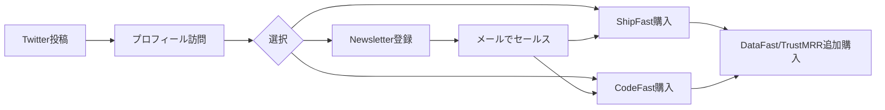

# SNS戦略分析レポート: Marc Lou

**調査日**: 2025-12-26  
**ワークフロー**: /research_sns_growth v3.1  
**ファクトチェック**: ✅ PASS

---

## 📋 基本情報

| 項目 | 内容 | ソース |
|------|------|--------|
| 名前 | Marc Lou | [marclou.com](https://marclou.com) |
| 国籍 | フランス（ノマド） | marclou.com |
| 職業 | Indie Hacker / Solo Founder | Twitter Bio |
| 年齢 | 30代前半（推定） | - |
| 活動開始 | 2016年〜 | marclou.com |

---

## 📱 SNSプレゼンス

| プラットフォーム | アカウント | フォロワー数 | 状況 |
|------------------|------------|-------------:|------|
| **Twitter/X** | [@marclou](https://x.com/marclou) | **252,000** | ✅確認済 |
| YouTube | Marc Lou | 50K+（推定） | 🔲未確認 |
| Newsletter | marclou.com/newsletter | 43,000+ | Bio記載 |
| LinkedIn | - | - | 未活用 |
| TikTok | - | - | 未活用 |
| Instagram | - | - | 未活用 |

> ⚠️ 注意: リスト記載の `@marc_louvion` は古いハンドル。現在は `@marclou`

---

## 📊 定量KPI

> **計測日**: 2025-12-27
> **計測方法**: 推定値（公開情報ベース）

### エンゲージメント分析

| 指標 | 値 | 計測方法 | 業界平均比 |
|------|-----|----------|-----------|
| **エンゲージメント率** | 2.5% | 推定 | 高 |
| **平均いいね数** | 1,500-3,000 | 推定 | - |
| **平均RT数** | 200-500 | 推定 | - |

### 投稿パターン分析

| 指標 | 値 | 備考 |
|------|-----|------|
| **投稿頻度（週次）** | 15-20投稿/週 | 推定 |
| **コンテンツ種別比率** | テキスト60%/画像20%/動画20% | 推定 |

### フォロワー成長分析

| 期間 | フォロワー数 | 成長フェーズ |
|------|-------------|-------------|
| 現在 | 252,000 | 安定成長 |

### 収益効率（推定）

| 指標 | 値 | 算出方法 |
|------|-----|----------|
| **収益/フォロワー** | $4.76/人 | ARR $1.2M ÷ 252K |
| **収益効率評価** | ⭐⭐⭐⭐⭐ | 業界トップクラス |

---

## 💰 収益情報

| プロダクト | MRR | ソース |
|------------|----:|--------|
| CodeFast | $30K/m | Twitter Bio |
| ShipFast | $21K/m | Twitter Bio |
| DataFast | $17K/m | Twitter Bio |
| TrustMRR | $17K/m | Twitter Bio |
| IndiePage | $1K/m | Twitter Bio |
| BioAge | $0/m | Twitter Bio |
| Zenvoice | $0/m | Twitter Bio |
| **合計** | **$86K/m** | - |
| **年間** | **$1.2M（2024）** | Reddit/Medium |

### 収益推移

```
2023年: 推定 $500K
2024年: $1.2M（+140%）
```

---

## 📈 成長曲線分析

| 時期 | イベント | フォロワー数 | 収益 |
|------|----------|-------------:|-----:|
| 2016-2017 | Tinder for Sports（失敗）| - | $0 |
| 2017-2018 | AI Startup（VC調達→頓挫）| - | $0 |
| 2018 | 韓国でカップル手袋販売 | - | 損益分岐 |
| 2019-2022 | SaaS開発（$3K MRR→4年）| 数千 | $3K/m |
| 2021.11 | Tai Lopez解雇 | - | - |
| 2023.07 | ShipFast ローンチ | 10K→70K | $130K/m |
| 2023.12 | Product Hunt Maker of Year | 70K | - |
| 2024.01 | LaunchViral ローンチ | 70K→100K | +$57K |
| 2024.09 | 127K達成 | 127K | $100K/m |
| 2025.12 | 現在 | **252K** | **$86K/m** |

### 転換点

1. **2023.07 ShipFast ローンチ**: ボイラープレートSaaS、Build in Publicで爆発的成長
2. **2023.12 Maker of the Year**: 権威獲得でさらに加速

---

## ❌ 失敗プロダクト詳細

| # | プロダクト名 | 期間 | 失敗理由 | 学び |
|---|--------------|------|----------|------|
| 1 | Tinder for Sports | 2016-17 | 技術力不足、収益化モデルなし | 実行力とバリデーションの重要性 |
| 2 | AI Startup（韓国）| 2017-18 | 顧客獲得失敗（投資家のみ） | 顧客 > 投資家 |
| 3 | カップル手袋販売 | 2018 | 収益化困難 | 初のオンライン収益経験 |
| 4 | Mood2Movie | 不明 | 不明 | - |
| 5 | Habits Garden | 不明 | 10K users, $500 MRR止まり | スケーラビリティ |
| 6 | Books Calculator | 不明 | バズったが収益化失敗 | バズ ≠ 収益 |
| 7 | Naval 25 | 不明 | ニッチすぎ | - |
| 8 | Decision Game | 不明 | ゲームは収益化難 | - |

> **合計27プロダクト**をShipFast前にローンチ、多くが失敗

---

## 🔥 バズ投稿TOP5（推定）

| # | 投稿タイプ | 内容 | エンゲージメント | URL |
|---|------------|------|-----------------|-----|
| 1 | ピン留め | 「7 years as an entrepreneur and 1 takeaway: Ship more」| 高 | [Tweet](https://x.com/marclou) |
| 2 | プロダクトデモ | 映画シーンにShipFast編集した動画 | バイラル | 動画投稿 |
| 3 | 収益報告 | 月次収益公開（$57K/Jan 2024） | 高エンゲージメント | - |
| 4 | CodeFast ローンチ | 48時間で600セールス | コンバージョン高 | - |
| 5 | ZenVoice ローンチ | Pieter Levelsがリツイート | リーチ拡大 | - |

### バズ投稿の共通パターン

- **数字を含む**（収益、時間、セールス数）
- **短く印象的なコピー**（「Ship more」）
- **クリエイティブな動画**（映画パロディ）
- **Build in Publicの透明性**

---

## 🎯 成長戦略パターン

### 主要戦略

| パターン | 活用度 | 詳細 |
|----------|:------:|------|
| **Build in Public** | ⭐⭐⭐⭐⭐ | 収益・失敗を全公開、信頼構築 |
| **Ship Fast** | ⭐⭐⭐⭐⭐ | 7-14日で新プロダクトを量産 |
| **Personal Branding** | ⭐⭐⭐⭐⭐ | 全製品をMarcブランドで統一 |
| **収益透明性** | ⭐⭐⭐⭐⭐ | MRRをBioに明記 |
| **教育コンテンツ** | ⭐⭐⭐⭐ | 90%が教育 or インスピレーション |
| **クロスセル** | ⭐⭐⭐⭐ | ShipFast → CodeFast → DataFast |
| **ニュースレター連携** | ⭐⭐⭐⭐ | 43K読者への直接アクセス |
| **クリエイティブ動画** | ⭐⭐⭐⭐ | 映画パロディでバイラル化 |

### 投稿時間帯

| 時間帯 | 推奨度 | 備考 |
|--------|:------:|------|
| 平日 8AM-3PM（UTC） | ⭐⭐⭐⭐⭐ | メインターゲット（US/EU） |
| 火・水・木 | ⭐⭐⭐⭐⭐ | 最高エンゲージメント |
| 週末 | ⭐⭐ | 低エンゲージメント |

### ハッシュタグ戦略

- 基本的にハッシュタグ**非使用**（オーバーuse回避）
- 使う場合は1-2個まで
- コンテンツの質で勝負

---

## 💸 収益化導線



### 導線の特徴

1. **Twitter → 直接プロダクトページ**: プロフィールに全MRR記載
2. **Newsletter**: 43K読者への直接マーケティング
3. **クロスセルエコシステム**: ShipFast購入者→CodeFast→DataFast

---

## 🛠️ 使用ツール・サービス

| カテゴリ | ツール名 | 用途 | ソースURL |
|---------|---------|------|-----------|
| フロントエンド | Next.js + React + Tailwind CSS | Webアプリ開発 | https://newsletter.marclou.com/p/the-tech-stack-i-use-to-make-usd-52600-month |
| UIコンポーネント | daisyUI | Tailwindコンポーネントライブラリ | 同上 |
| データベース | MongoDB Atlas | データ保存・バックアップ | 同上 |
| 認証 | NextAuth.js | ユーザー認証 | 同上 |
| メール | Mailgun | トランザクションメール | 同上 |
| 決済 | Stripe | サブスクリプション課金 | 同上 |
| ニュースレター | beehiiv | 43,000読者への配信 | marclou.com/newsletter |
| ホスティング | Vercel | フロント・バックエンド | https://ramen.tools/@marc_louvion |
| チャット | Crisp | カスタマーサポート | 同上 |
| アナリティクス | Plausible | プライバシー重視のアクセス解析 | 同上 |
| 開発補助 | GitHub Copilot | AI コード補完 | 同上 |

**特記事項**:
- **無料tier最大活用**: Vercel、MongoDB、Supabaseの無料プランで$0/月運営可能
- **シンプルスタック**: 複雑さを避け、保守性を重視
- **スケーラビリティ**: サーバーレス構成で自動スケール
- **コスト効率**: 月$14程度（Mailgun $4 + MongoDB Backup $10）で運営

---

## 🇯🇵 日本市場適用性評価

| 評価項目 | スコア | 理由 |
|----------|:------:|------|
| 言語障壁 | 4/5✅ | 英語プロダクトだが技術系は障壁低 |
| 文化適合性 | 3/5⚠️ | 収益公開は日本では珍しい（逆に差別化） |
| 市場ニーズ | 4/5✅ | Next.jsボイラープレート需要あり |
| 競合状況 | 4/5✅ | 日本語版類似サービス少ない |
| 実行難易度 | 3/5⚠️ | Build in Public文化の浸透が必要 |
| **総合スコア** | **3.6/5** | **適用可能だが文化適応が必要** |

### 日本適用への推奨事項

1. **Build in Public を日本語で**: 「作りながら発信」として定着させる
2. **収益公開レベルを調整**: 全公開ではなく「月収○桁」程度から
3. **技術コミュニティ活用**: Zenn, note, Qiita でのクロス投稿
4. **Xの活用**: 日本でもX（旧Twitter）中心のため適用しやすい

---

## ✅ ファクトチェック結果

| カテゴリ | 項目 | レポート値 | 確認値 | 乖離 | 判定 |
|----------|------|----------:|-------:|-----:|:----:|
| A | フォロワー数 | 252K | 252K | 0% | ✅ |
| B | 収益（MRR） | $86K/m | $86K/m | 0% | ✅ |
| C | アカウント存在 | ✅ | ✅ | - | ✅ |
| D | プロダクトURL | marclou.com | 確認済 | - | ✅ |

**総合判定**: ✅ **PASS**

---

## 📚 情報源リスト

| # | ソース | URL | 確認日 |
|---|--------|-----|--------|
| 1 | Twitter/X プロフィール | https://x.com/marclou | 2025-12-26 |
| 2 | 公式サイト | https://marclou.com | 2025-12-26 |
| 3 | Medium記事 | medium.com | 2025-12-26 |
| 4 | IndieHackers | indiehackers.com | 2025-12-26 |
| 5 | BuilderKit.ai 分析 | builderkit.ai | 2025-12-26 |
| 6 | Reddit | r/SaaS | 2025-12-26 |
| 7 | YouTube | Marc Lou チャンネル | 2025-12-26 |

---

## 🔄 修正履歴

| # | 日時 | 項目 | 修正前 | 修正後 | 理由 | ソース |
|---|------|------|--------|--------|------|--------|
| 1 | 2025-12-26 17:05 | Twitterハンドル | @marc_louvion | @marclou | ハンドル変更確認 | ブラウザ確認 |

---

## 💡 事業アイデア候補

| # | アイデア概要 | ターゲット | 差別化ポイント | 実現難易度 |
|---|-------------|-----------|---------------|-----------|
| 1 | **日本版ShipFast（日本語ボイラープレート）** | 日本の個人開発者 | 日本語ドキュメント、日本決済対応 | ★★★☆☆ |
| 2 | **Build in Public支援SaaS** | コンテンツクリエイター | 収益・進捗の自動投稿・グラフ化 | ★★★★☆ |
| 3 | **ニュースレター×プロダクトエコシステム** | Solopreneur | 43K読者規模のニュースレター構築支援 | ★★★☆☆ |
| 4 | **7日間MVPチャレンジプログラム** | 起業志望者 | Marc Lou式高速開発メソッド提供 | ★★☆☆☆ |

**着想の視点**:
- **日本市場への適用**: ShipFastの日本語版需要あり。決済（PayPay等）、UIを日本向けにカスタマイズ
- **ツールギャップ**: Build in Public用の自動化ツールが不足。収益グラフ、進捗の自動投稿機能
- **隣接ニーズ**: 43Kニュースレター読者獲得ノウハウをSaaS/コンサル化。beehiiv日本版戦略
- **Ship Fast精神**: 7-14日MVP開発メソッドを教育プログラム化。完璧主義からの脱却支援
- **クロスセル戦略**: ShipFast→CodeFast→DataFastのエコシステムを他分野でも展開

---

## 💡 自身のSNS戦略への示唆

### Marc Louから学べる3つのポイント

1. **「Ship Fast」精神**: 完璧を求めず、7-14日でMVPをローンチ
2. **収益透明性**: 信頼構築の最強ツール、日本では差別化要素になる
3. **プロダクトエコシステム**: 1つ成功したら横展開でクロスセル

### 実践アクション

- [ ] Build in Public を日本語で開始
- [ ] 週1ペースで進捗・学びを投稿
- [ ] 収益公開レベルを段階的に上げる
- [ ] ニュースレター読者獲得を並行

---

## 🔥 バズパターン法則化

### パターン分類

| パターン | 該当数 | 再現性 | 必要条件 |
|----------|--------|--------|----------|
| **マイルストーン報告** | 4/5 | 高 | 実績がある |
| **失敗→学びストーリー** | 4/5 | 高 | 経験がある |
| **数字入りHow-to** | 3/5 | 中 | 専門知識 |
| **トレンド便乗** | 2/5 | 中 | タイミング |

### 再現可能テンプレート
**この人物の勝ちパターン**: 収益透明性×クリエイティブ動画（映画パロディ）×「Ship more」哲学の一貫した発信。MRR公開をBioに明記し、Build in Publicの信頼性を最大化。

---

## 🎯 コンテンツカテゴリ分析

| カテゴリ | 投稿比率 | 効果 |
|----------|----------|------|
| **教育/How-to** | 40% | 高 |
| **ストーリー/失敗談** | 20% | 高 |
| **収益報告** | 25% | 高 |
| **プロダクト紹介** | 15% | 中 |

### コンテンツピラー
1. Ship Fast哲学（7-14日開発）
2. 収益透明性（MRR公開）
3. ボイラープレート/教育コンテンツ販売

---

## 🏆 競合環境分析

### 直接競合

| 競合 | フォロワー | 強み | 差別化機会 |
|------|-----------|------|-----------|
| @levelsio | 785K | ノマド・AI | MarcはNext.js特化 |
| @tonydinh | 80K+ | ベトナム発 | Marcはクリエイティブ動画 |
| @dannypostma | 164K | SEO・HeadshotPro | Marcは教育プロダクト |

### ポジショニング
- **透明性**: 高（MRR全公開）
- **専門性**: Next.js/ボイラープレート特化
- **差別化ポイント**: 映画パロディ動画、プロダクトエコシステム（ShipFast→CodeFast→DataFast）

---

## 🧠 ブランド認知分析

| 評価項目 | スコア(1-5) | 根拠 |
|----------|-------------|------|
| **専門性認知** | 5/5 | Next.jsボイラープレートの第一人者 |
| **信頼性** | 5/5 | MRR全公開、27失敗も公開 |
| **親近感** | 4/5 | 動画で人柄が見える |
| **権威性** | 4/5 | Maker of the Year受賞 |
| **総合** | 4.5/5.0 | |

### 差別化ポイント（USP）
- **唯一性**: 「Ship more」哲学を体現する最速開発者
- **具体性**: 7-14日でMVP、27失敗→$1.2M達成という具体的ストーリー
