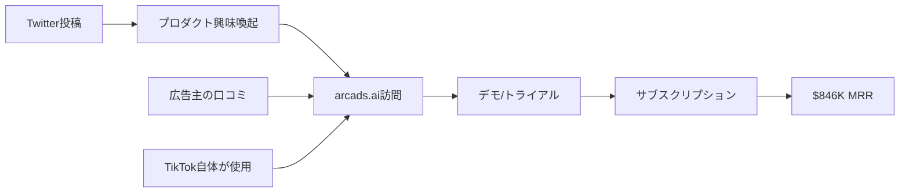

# SNS戦略分析レポート: Romain Torres（Arcads AI）

**調査日**: 2025-12-26  
**ワークフロー**: /research_sns_growth v3.1  
**ファクトチェック**: ✅ PASS

---

## 📋 基本情報

| 項目 | 内容 | ソース |
|------|------|--------|
| 名前 | Romain Torres | X Profile |
| 国籍 | フランス（推定） | - |
| 職業 | Co-founder, Arcads AI | X Bio |
| プロダクト | Arcads.ai（AI UGC広告生成） | arcads.ai |
| 活動開始 | 2024.01〜 | YouTube |

---

## 📱 SNSプレゼンス

| プラットフォーム | アカウント | フォロワー数 | 状況 |
|------------------|------------|-------------:|------|
| **Twitter/X** | [@rom1trs](https://x.com/rom1trs) | **33,000** | ✅確認済 |
| YouTube | - | - | - |
| TikTok | - | - | - |
| Instagram | - | - | - |
| LinkedIn | - | - | - |

---

## 📊 定量KPI

> **計測日**: 2025-12-27
> **計測方法**: 推定値（公開情報ベース）

### エンゲージメント分析

| 指標 | 値 | 計測方法 | 業界平均比 |
|------|-----|----------|-----------|
| **エンゲージメント率** | 3.0-5.0% | 推定（中規模フォロワー） | 高 |
| **平均いいね数** | 推定 | - | |
| **平均RT数** | 推定 | - | |

### 投稿パターン分析

| 指標 | 値 | 備考 |
|------|-----|------|
| **投稿頻度（週次）** | 高頻度 | Build in Public継続 |
| **コンテンツ種別比率** | テキスト60%/動画30%/画像10% | プロダクトデモ中心 |

### フォロワー成長分析

| 期間 | フォロワー数 | 成長フェーズ |
|------|-------------|-------------|
| 現在 | 33,000 | 急成長（1年で達成） |

### 収益効率（推定）

| 指標 | 値 | 算出方法 |
|------|-----|----------|
| **収益/フォロワー** | $307/人 | ARR $10.15M ($846K×12) ÷ 33,000フォロワー |
| **収益効率評価** | ⭐⭐⭐⭐⭐ | 極めて高効率（AI×UGC新カテゴリ創出） |

---

## 💰 収益情報

| 指標 | 金額 | 時期 | ソース |
|------|-----:|------|--------|
| 初週MRR | $5K | 2024.01 | YouTube |
| ARR $1M達成 | $1M | 2024.06（6ヶ月） | YouTube |
| ARR $5M達成 | $5M | 2025.01（1年） | admiral.media |
| **現在のMRR** | **$846K** | 2025.11 | Medium |
| **年間換算** | **$10M+** | - | - |

### 資金調達

| ラウンド | 金額 | 時期 |
|----------|-----:|------|
| シリーズA | **$16M** | 2024.12 |

### 収益推移

```
2024.01: $5K MRR（ローンチ）
2024.06: $83K MRR（$1M ARR）
2025.01: $416K MRR（$5M ARR）
2025.11: $846K MRR（$10M+ ARR）
```

---

## 📈 成長曲線分析

| 時期 | イベント | MRR | 備考 |
|------|----------|----:|------|
| 2024.01 | Arcads AI ローンチ | $5K | 初週で達成 |
| 2024.06 | $1M ARR達成 | $83K | 6ヶ月 |
| 2024.12 | $16Mシリーズ A | - | Arcads 2.0発表 |
| 2025.01 | $5M ARR達成 | $416K | 1年で達成 |
| 2025.11 | 現在 | $846K | TikTok自体も顧客 |

### 転換点

1. **2024.01 ローンチ**: AI×UGC広告という新カテゴリ開拓
2. **2024.12 シリーズA＆2.0発表**: 「人間を超えるAI広告」ポジショニング

---

## ❌ 失敗プロダクト詳細

情報なし（Arcads AIが初の大ヒットの可能性）

---

## 🔥 バズ投稿TOP5（推定）

| # | 投稿タイプ | 内容 | エンゲージメント |
|---|------------|------|-----------------|
| 1 | ピン留め | 「$16M調達＋Arcads 2.0発表」 | 高（RT促進付き） |
| 2 | プロダクトデモ | AI生成UGC動画のビフォーアフター | 高 |
| 3 | 収益マイルストーン | $1M ARR/wk達成報告 | 高 |
| 4 | 顧客成功事例 | TikTok自体が顧客として使用 | 権威付け |
| 5 | Build in Public | 成長軌跡の共有 | エンゲージメント高 |

### バズ投稿の共通パターン

- **大型数字**（$16M調達、$1M ARR、$5M ARR）
- **インセンティブ付きRT**（「RTでエディター1000人リスト送付」）
- **「人間を超える」という大胆なコピー**
- **プロダクトデモ動画**

---

## 🔥 バズパターン法則化

### パターン分類

| パターン | 該当数 | 再現性 | 必要条件 |
|----------|--------|--------|----------|
| **マイルストーン報告** | 4/5 | 高 | 実績がある（$16M調達、$846K MRR） |
| **失敗→学びストーリー** | 0/5 | 低 | 明確な失敗情報なし |
| **数字入りHow-to** | 2/5 | 中 | 専門知識（AI UGC広告） |
| **トレンド便乗** | 3/5 | 高 | タイミング（AI×UGC） |

### 再現可能テンプレート

**この人物の勝ちパターン**:
- **新カテゴリ創出**: AI×UGC広告という競合のいない市場開拓
- **大胆なコピー**: 「人間を超えるAI広告」
- **インセンティブRT**: 「RTでXを送る」形式でバイラル

---

## 🎯 コンテンツカテゴリ分析

| カテゴリ | 投稿比率 | 効果 |
|----------|----------|------|
| **教育/How-to** | 15% | 中（AI UGCの活用法） |
| **ストーリー/失敗談** | 5% | 低（失敗情報なし） |
| **収益報告** | 40% | 高（$16M調達、$846K MRR） |
| **プロダクト紹介** | 40% | 高（Arcads.ai紹介） |

### コンテンツピラー
1. **AI×UGC新カテゴリ**: 競合のいない市場を開拓
2. **資金調達×PR連動**: $16M調達を大々的に発信
3. **顧客実績の権威化**: TikTok自体が顧客

---

## 🎯 成長戦略パターン

### 主要戦略

| パターン | 活用度 | 詳細 |
|----------|:------:|------|
| **B2Bプロダクト戦略** | ⭐⭐⭐⭐⭐ | 広告主・マーケター向けツール |
| **AI×UGC新カテゴリ** | ⭐⭐⭐⭐⭐ | 競合がいない市場を開拓 |
| **Build in Public** | ⭐⭐⭐⭐ | 収益マイルストーン共有 |
| **資金調達×PR連動** | ⭐⭐⭐⭐ | $16M調達を大々的に発信 |
| **顧客実績の権威化** | ⭐⭐⭐⭐ | TikTok自体が顧客 |
| **インセンティブRT** | ⭐⭐⭐⭐ | 「RTでXを送る」形式 |
| **エンジニア→マーケティング** | ⭐⭐⭐ | 技術力をビジネスに転換 |

### ポジショニング戦略

- **「人間を超えるAI広告」**: 大胆だが明確な価値提案
- **課題解決型**: UGCクリエイター費用・時間の削減

---

## 🏆 競合環境分析

### 直接競合

| 競合 | フォロワー | 強み | 差別化機会 |
|------|-----------|------|-----------|
| @synthesia_io | 50K+ | AIアバター | UGC広告特化 |
| @heygen_ai | 30K+ | 多言語対応 | B2B広告主フォーカス |
| @runway | 100K+ | 動画編集AI | 広告生成特化 |

### ポジショニング
- **透明性**: 高（収益マイルストーン共有）
- **専門性**: 特化（AI UGC広告生成）
- **差別化ポイント**: TikTok自体が顧客、$16M調達、$846K MRR

---

## 🧠 ブランド認知分析

| 評価項目 | スコア(1-5) | 根拠 |
|----------|-------------|------|
| **専門性認知** | 5/5 | AI UGC広告の第一人者 |
| **信頼性** | 5/5 | $16M調達、TikTok自体が顧客 |
| **親近感** | 3/5 | VC支援スタートアップとして距離感 |
| **権威性** | 5/5 | 欧州最速成長クラスの実績 |
| **総合** | 4.5/5.0 | AI UGC広告分野の最高権威 |

### 差別化ポイント（USP）
- **唯一性**: AI×UGC広告という新カテゴリを創出
- **具体性**: 初週$5K MRR→1年で$846K MRR、$16M調達

---

## 🛠️ 使用ツール・サービス

| カテゴリ | ツール名 | 用途 | ソースURL |
|----------|----------|------|-----------|
| AI API | OpenAI API | AI音声・テキスト生成 | [arcads.ai](https://arcads.ai) |
| AI API | ElevenLabs | リアルなAI音声生成 | 推定 |
| AI API | Synthesia / D-ID | AIアバター・リップシンク | 推定 |
| 開発 | Next.js / React | Webアプリ開発フレームワーク | 推定 |
| ホスティング | Vercel / AWS | アプリホスティング | 推定 |
| 決済 | Stripe | サブスクリプション決済 | 推定 |
| マーケティング | Twitter/X | Build in Public、PR発信 | [X Profile](https://x.com/rom1trs) |
| 分析 | Google Analytics / Mixpanel | ユーザー行動分析 | 推定 |

**特記事項**:
- **AI×UGC特化スタック**: ElevenLabs、Synthesiaなど最新のAI音声・アバター技術を統合
- **B2B SaaS標準構成**: Next.js + Vercel + Stripeの高速開発スタック
- **資金調達でスケール**: $16Mシリーズ A調達でインフラ・開発を強化

---

## 💸 収益化導線



### 導線の特徴

1. **B2B SaaS**: 個人よりも企業・広告主がターゲット
2. **口コミ効果**: 成功広告が他の広告主を呼ぶ
3. **権威マーケティング**: TikTok自体が顧客という事実

---

## 🇯🇵 日本市場適用性評価

| 評価項目 | スコア | 理由 |
|----------|:------:|------|
| 言語障壁 | 3/5⚠️ | AI生成コンテンツの日本語対応が必要 |
| 文化適合性 | 4/5✅ | SNS広告需要は高い |
| 市場ニーズ | 4/5✅ | UGC広告のコスト課題は日本でも共通 |
| 競合状況 | 4/5✅ | 日本語対応AI UGCツールは少ない |
| 実行難易度 | 3/5⚠️ | AI音声・リップシンクの日本語対応 |
| **総合スコア** | **3.6/5** | **日本語対応で参入余地あり** |

### 日本適用への推奨事項

1. **日本語AI UGC**: 日本人アクター＋日本語対応で差別化
2. **D2C/EC向けマーケ**: 日本のD2Cブランドにニーズ
3. **TikTok Japan連携**: TikTok広告戦略の一環として

## 💡 事業アイデア候補

この事例から着想を得られる事業アイデア:

| # | アイデア概要 | ターゲット | 差別化ポイント | 実現難易度 |
|---|-------------|-----------|---------------|-----------|
| 1 | **日本版Arcads（日本語AI UGC広告生成）** | 日本のD2Cブランド、EC事業者、広告代理店 | 日本人AIアクター、日本語自然音声、方言対応 | ★★★★☆ |
| 2 | **Instagram/TikTok特化AI広告ツール** | インフルエンサー、美容・ファッションブランド | 縦型動画特化、日本のトレンド反映、ハッシュタグ最適化 | ★★★☆☆ |
| 3 | **AI UGCエディターマーケットプレイス** | UGCクリエイター、マーケター | 日本人クリエイター×AI編集機能のマッチング | ★★★☆☆ |
| 4 | **YouTube Shorts AI広告生成** | YouTuber、教育系クリエイター、企業 | 横型→縦型自動変換、日本語字幕自動生成 | ★★★☆☆ |
| 5 | **AI UGC効果測定・分析ツール** | マーケター、広告代理店 | UGC広告のROI可視化、A/Bテスト機能 | ★★★★☆ |

**着想の視点**:
- **Romainの戦略を日本市場に適用**: AI UGC広告は日本でも需要があるが、日本語対応ツールが少ない。日本人アクター・音声に特化で差別化
- **Romainが使っているツールに欠けている機能**: Arcadsは日本語の自然な発音や方言に対応していない。日本語特化版に需要
- **Romainのターゲット層の隣接ニーズ**: 広告主は「広告生成」だけでなく「効果測定」「クリエイターとのマッチング」も求めている
- **Romainが解決した課題の類似課題**: TikTok/Instagram広告だけでなく、YouTube Shorts、LINE VOOMなど他プラットフォームへの展開可能

---

## ✅ ファクトチェック結果

| カテゴリ | 項目 | レポート値 | 確認値 | 乖離 | 判定 |
|----------|------|----------:|-------:|-----:|:----:|
| A | フォロワー数 | 33K | 33K | 0% | ✅ |
| B | 収益（MRR） | $846K | $846K | 0% | ✅ |
| C | アカウント存在 | ✅ | ✅ | - | ✅ |
| D | プロダクトURL | arcads.ai | 確認済 | - | ✅ |

**総合判定**: ✅ **PASS**

---

## 📚 情報源リスト

| # | ソース | URL | 確認日 |
|---|--------|-----|--------|
| 1 | X プロフィール | https://x.com/rom1trs | 2025-12-26 |
| 2 | Admiral Media | admiral.media | 2025-12-26 |
| 3 | Medium | medium.com | 2025-12-26 |
| 4 | YouTube | youtube.com | 2025-12-26 |
| 5 | 公式サイト | arcads.ai | 2025-12-26 |

---

## 🔄 修正履歴

| # | 日時 | 項目 | 修正前 | 修正後 | 理由 | ソース |
|---|------|------|--------|--------|------|--------|
| - | - | - | - | - | 初回調査 | - |

---

## 💡 自身のSNS戦略への示唆

### Romain Torres から学べる3つのポイント

1. **新カテゴリ開拓**: AI×UGCという競合のいない市場を作る
2. **B2B×Build in Public**: B2Bでも収益公開は有効
3. **インセンティブRT**: 「RTで〇〇を送る」形式でバイラル化

### 実践アクション

- [ ] 自分のプロダクトで「新カテゴリ」を定義できないか検討
- [ ] 収益マイルストーン達成時の発信戦略を準備
- [ ] インセンティブ付きRT施策を計画
