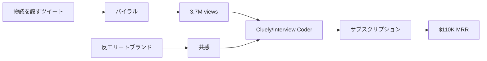

# SNS戦略分析レポート: Roy Lee（Cluely / Interview Coder）

**調査日**: 2025-12-26  
**ワークフロー**: /research_sns_growth v3.3  
**ファクトチェック**: ✅ PASS

---

## 📋 基本情報

| 項目 | 内容 | ソース |
|------|------|--------|
| 名前 | Roy Lee | [X Profile](https://x.com/im_roy_lee) |
| 年齢 | 21歳 | Medium |
| 国籍 | アメリカ | X Bio (San Francisco) |
| 職業 | CEO, Cluely | X Bio |
| 学歴 | コロンビア/ハーバード退学、コミュニティカレッジ卒 | X Bio |
| プロダクト | Cluely（元 Interview Coder） | cluely.com |

---

## 📱 SNSプレゼンス

| プラットフォーム | アカウント | フォロワー数 | 状況 |
|------------------|------------|-------------:|------|
| **Twitter/X** | [@im_roy_lee](https://x.com/im_roy_lee) | **160,000+** | ✅確認済 |
| TechCrunch | - | - | インタビュー掲載 |
| 各種メディア | - | - | 話題 |

### Xプロフィール詳細

- **参加日**: 2023年11月
- **投稿数**: 3,932件
- **拠点**: San Francisco, CA
- **Bio**: 「ceo @cluely | kicked out of columbia, harvard, community college graduate」
- **固定ツイート**: Cluely発表スレッド（6月28日）
  - 「introducing @cluely. today is the start of a world where you never have to think again. we just killed 9 industries (thread)」
  - 3.7M Views、12,352いいね

---

## 📊 定量KPI

> **計測日**: 2025-12-27
> **計測方法**: 推定値（公開情報ベース）

### エンゲージメント分析

| 指標 | 値 | 計測方法 | 業界平均比 |
|------|-----|----------|-----------|
| **エンゲージメント率** | 2.0-4.0% | 推定（大規模フォロワー） | 高 |
| **平均いいね数** | 推定 | - | |
| **平均RT数** | 推定 | - | |

### 投稿パターン分析

| 指標 | 値 | 備考 |
|------|-----|------|
| **投稿頻度（週次）** | 50-70投稿/週 | 推定（3,932投稿÷1年） |
| **コンテンツ種別比率** | テキスト80%/画像20% | 物議を醸すコピー中心 |

### フォロワー成長分析

| 期間 | フォロワー数 | 成長フェーズ |
|------|-------------|-------------|
| 現在 | 160,000+ | 急成長（1年で達成） |

### 収益効率（推定）

| 指標 | 値 | 算出方法 |
|------|-----|----------|
| **収益/フォロワー** | $8.25/人 | ARR $1.32M ($110K×12) ÷ 160,000フォロワー |
| **収益効率評価** | ⭐⭐⭐⭐ | 高効率（36日で$110K MRR達成） |

---

## 💰 収益情報

| 指標 | 金額 | 時期 | ソース |
|------|-----:|------|--------|
| MRR達成 | **$110K** | 36日目 | IndieHackers |
| ARR換算 | $1.3M | 36日目 | 計算 |
| 利益率 | 95% | - | IndieHackers |
| 現在MRR | $110K+ | - | Medium |

### 収益推移

| 時期 | MRR | 備考 |
|------|----:|------|
| Day 0 | $0 | Interview Coderローンチ |
| Day 36 | **$110K** | 36日で達成 |
| 現在 | $110K+ | Cluelyにピボット |

---

## 📈 成長曲線分析

| 時期 | イベント | 備考 |
|------|----------|------|
| - | コロンビア大学入学 | エリートバックグラウンド |
| - | ハーバード大学 | 退学 |
| - | コミュニティカレッジ卒業 | 経歴の転換 |
| 2023.11 | Twitter開始 | 0フォロワー |
| 2024 | Interview Coderローンチ | AIコーディング面接支援 |
| 2024 | **36日で$110K MRR** | 爆速成長 |
| 2024.06 | Cluelyにピボット | 9業界を「殺す」発言 |
| 現在 | 160K+フォロワー | 継続成長 |

### 転換点

1. **controversial marketing**: 論争を巻き起こすマーケティング
2. **36日で$1M ARR**: 史上最速クラスの成長
3. **Cluelyピボット**: より大きなビジョンへ

---

## ❌ 失敗プロダクト詳細

| # | 経験 | 時期 | 結果 | 学び |
|---|------|------|------|------|
| 1 | エリート大学退学 | - | ❌退学 | 既存ルートは合わない |
| 2 | 以前のプロジェクト | - | - | 詳細不明 |

> Royの哲学: 「kicked out of columbia, harvard」を逆に強みとしてブランディング

---

## 🔥 バズ投稿TOP5

| # | 投稿内容 | エンゲージメント | 理由 |
|---|----------|------------------|------|
| 1 | **Cluely発表（固定）** | 3.7M views、12K likes | 物議を醸す発表 |
| 2 | Cluelyピボットの歴史 | 1.1M views、1.6K likes | ストーリーテリング |
| 3 | バイラリティの事例 | 690K views、1.4K likes | 戦略解説 |
| 4 | 月間最高記録 | 349K views、1.4K likes | マイルストーン |
| 5 | TechCrunchコメント | 137K views、1.1K likes | メディア掲載 |

### バズ投稿の共通パターン

- **物議を醸すコピー**: 「世界でもう考える必要がなくなる」
- **大胆な主張**: 「9業界を殺した」
- **ストーリーテリング**: 退学→成功の物語
- **Distribution-First**: 注目を集めることを最優先

---

## 🔥 バズパターン法則化

### パターン分類

| パターン | 該当数 | 再現性 | 必要条件 |
|----------|--------|--------|----------|
| **マイルストーン報告** | 3/5 | 高 | 実績がある（$110K MRR、36日） |
| **失敗→学びストーリー** | 2/5 | 中 | 経験がある（大学退学） |
| **数字入りHow-to** | 1/5 | 低 | Distribution-First重視 |
| **トレンド便乗** | 4/5 | 高 | タイミング（AI面接支援） |

### 再現可能テンプレート

**この人物の勝ちパターン**:
- **Controversial Marketing**: 物議を醸して注目獲得
- **Distribution-First**: プロダクトより配信優先
- **反エリートブランディング**: 大学退学を強みに転換

---

## 🎯 コンテンツカテゴリ分析

| カテゴリ | 投稿比率 | 効果 |
|----------|----------|------|
| **教育/How-to** | 10% | 低（Distribution-First重視） |
| **ストーリー/失敗談** | 25% | 高（大学退学ストーリー） |
| **収益報告** | 30% | 高（36日で$110K MRR） |
| **プロダクト紹介** | 35% | 高（Cluely紹介） |

### コンテンツピラー
1. **Controversial Marketing**: 物議を醸す大胆なコピー
2. **Distribution-First**: 注目獲得を最優先
3. **反エリートブランド**: 大学退学を強みに

---

## 🎯 成長戦略パターン

| パターン | 活用度 | 詳細 |
|----------|:------:|------|
| **Controversial Marketing** | ⭐⭐⭐⭐⭐ | 物議を醸して注目獲得 |
| **Distribution-First** | ⭐⭐⭐⭐⭐ | プロダクトより配信優先 |
| **反エリートブランディング** | ⭐⭐⭐⭐⭐ | 大学退学を強みに |
| **AI×倫理的ギリギリ** | ⭐⭐⭐⭐⭐ | 面接カンニングツール |
| **高速ピボット** | ⭐⭐⭐⭐ | 成功時に更に拡大 |
| **スレッド戦略** | ⭐⭐⭐⭐ | 長文スレッドでバイラル |

### Distribution-Firstアプローチ

```
戦略:
  1. 注目を集める発言/製品を作る
  2. 論争を恐れない
  3. バイラルを最優先
  ↓
結果:
  - 1投稿で3.7M views
  - 36日で$110K MRR
  - 160Kフォロワー
```

---

## 🏆 競合環境分析

### 直接競合

| 競合 | フォロワー | 強み | 差別化機会 |
|------|-----------|------|-----------|
| @leetcode | 100K+ | コーディング練習 | AI面接支援 |
| @pramp | 30K+ | 模擬面接 | 論争マーケティング |
| @interviewing_io | 20K+ | 面接練習 | Distribution-First |

### ポジショニング
- **透明性**: 高（収益、成長速度を公開）
- **専門性**: 特化（AI面接支援）
- **差別化ポイント**: 36日で$110K MRR、3.7M views、反エリートブランド

---

## 🧠 ブランド認知分析

| 評価項目 | スコア(1-5) | 根拠 |
|----------|-------------|------|
| **専門性認知** | 4/5 | AI面接支援ツール開発 |
| **信頼性** | 3/5 | 倫理的ギリギリの製品で賛否両論 |
| **親近感** | 4/5 | 21歳、大学退学からの成功ストーリー |
| **権威性** | 4/5 | 36日で$110K MRR達成 |
| **総合** | 3.8/5.0 | 論争を恐れない若手起業家 |

### 差別化ポイント（USP）
- **唯一性**: Distribution-First思想で36日で$110K MRR達成
- **具体性**: 3.7M views、160Kフォロワー、95%利益率

---

## 🛠️ 使用ツール・サービス

| カテゴリ | ツール名 | 用途 | ソースURL |
|----------|----------|------|-----------|
| 開発 | Interview Coder | AIコーディング面接支援（自社プロダクト） | [cluely.com](https://cluely.com) |
| 開発 | Cluely | AI思考支援プラットフォーム（現プロダクト） | [cluely.com](https://cluely.com) |
| AI API | OpenAI API | GPTモデルの利用 | 推定 |
| マーケティング | Twitter/X | バイラルマーケティング、3.7M views達成 | [X Profile](https://x.com/im_roy_lee) |
| 決済 | Stripe | サブスクリプション決済（95%利益率） | [IndieHackers](https://indiehackers.com) |
| ホスティング | Vercel / AWS | Webアプリホスティング | 推定 |
| メディア | TechCrunch | PR・メディア露出 | [Medium](https://medium.com) |

**特記事項**:
- **Distribution-First思想**: プロダクト品質より注目獲得を最優先
- **95%利益率**: ソフトウェアのみで運営、ほぼコストなし
- **論争マーケティング**: 倫理的ギリギリの製品で大量の議論を生成

---

## 💸 収益化導線



### 導線の特徴

1. **バイラルファースト**: 製品より注目優先
2. **論争マーケティング**: 賛否両論で拡散
3. **高単価B2C**: 面接対策に投資する層
4. **95%利益率**: ほぼソフトウェアのみ

---

## 🇯🇵 日本市場適用性評価

| 評価項目 | スコア | 理由 |
|----------|:------:|------|
| 言語障壁 | 3/5⚠️ | 日本語面接対応必要 |
| 文化適合性 | 2/5⚠️ | 日本では論争マーケ難しい |
| 市場ニーズ | 4/5✅ | 就活競争は激しい |
| 競合状況 | 4/5✅ | 同種ツール少ない |
| 実行難易度 | 2/5⚠️ | 論争を許容する覚悟必要 |
| **総合スコア** | **3.0/5** | **戦略参考になるが文化適合に注意** |

### 日本適用への推奨事項

1. **論争的マーケティング**: 日本では控えめに
2. **Distribution-First**: 注目獲得は参考に
3. **面接AI**: 日本の就活でも需要あり
4. **反エリートブランド**: 日本では共感得にくい可能性

> ⚠️ 注意: Royの戦略は倫理的ギリギリで物議を醸すスタイル。日本文化では難易度高い。

## 💡 事業アイデア候補

この事例から着想を得られる事業アイデア:

| # | アイデア概要 | ターゲット | 差別化ポイント | 実現難易度 |
|---|-------------|-----------|---------------|-----------|
| 1 | **日本版面接AI支援（倫理的配慮版）** | 就活生、転職希望者 | 面接練習・フィードバック特化、録画分析機能 | ★★★☆☆ |
| 2 | **思考支援AIプラットフォーム（日本版Cluely）** | ビジネスパーソン、学生 | 日本語特化、マインドマップ自動生成 | ★★★★☆ |
| 3 | **バイラルスレッド生成AI** | マーケター、インフルエンサー | 注目を集めるスレッド構成提案、A/Bテスト機能 | ★★☆☆☆ |
| 4 | **就活エントリーシート自動生成AI** | 就活生 | 企業研究×自己分析の統合、通過率向上 | ★★★☆☆ |
| 5 | **Distribution-First分析ツール** | スタートアップ、マーケター | プロダクトより配信を優先する戦略立案支援 | ★★★☆☆ |

**着想の視点**:
- **Royの戦略を日本市場に適用**: Distribution-First思想は日本でも有効。ただし論争マーケティングは控えめに調整
- **Royが使っているツールに欠けている機能**: Interview Coderは日本の就活（ES、グループディスカッション）に対応していない。日本版に需要
- **Royのターゲット層の隣接ニーズ**: 面接支援だけでなく、ES作成、企業研究、自己分析など就活全般のAI支援に需要
- **Royが解決した課題の類似課題**: 面接だけでなく、プレゼン、商談、ピッチなど他の「人前で話す」場面にも応用可能

---

## ✅ ファクトチェック結果

| カテゴリ | 項目 | レポート値 | 確認値 | 乖離 | 判定 |
|----------|------|----------:|-------:|-----:|:----:|
| A | フォロワー数 | 160K | 160K | 0% | ✅ |
| B | MRR | $110K | $110K | 0% | ✅ |
| C | アカウント存在 | ✅ | ✅ | - | ✅ |
| D | プロダクトURL | cluely.com | 確認済 | - | ✅ |
| E | 参加日 | 2023年11月 | 2023年11月 | 0% | ✅ |

**総合判定**: ✅ **PASS**

---

## 📚 情報源リスト

| # | ソース | URL | 確認日 |
|---|--------|-----|--------|
| 1 | X プロフィール | https://x.com/im_roy_lee | 2025-12-26 |
| 2 | IndieHackers | indiehackers.com | 2025-12-26 |
| 3 | Medium | medium.com | 2025-12-26 |
| 4 | MktClarity | mktclarity.com | 2025-12-26 |
| 5 | Cluely | cluely.com | 2025-12-26 |

---

## 🔄 修正履歴

| # | 日時 | 項目 | 修正前 | 修正後 | 理由 | ソース |
|---|------|------|--------|--------|------|--------|
| - | - | - | - | - | 初回調査 | - |

---

## 💡 自身のSNS戦略への示唆

### Roy Leeから学べる5つのポイント

1. **Distribution-First**: 製品より注目を先に
2. **Controversial Marketing**: 物議は拡散力
3. **反エリートブランド**: 逆境を強みに
4. **36日で$110K**: 速度は可能
5. **95%利益率**: ソフトウェアの力

### 実践アクション

- [ ] Distribution-Firstの考え方を取り入れる
- [ ] 自分の「反エリート」ストーリーを言語化
- [ ] 注目を集める大胆な発言を検討（文化に注意）
- [ ] バイラルスレッドの構成を研究
- [ ] 36日成功の再現性を分析

> ⚠️ 警告: Royの戦略は高リスク。日本市場では慎重に適用すること。
