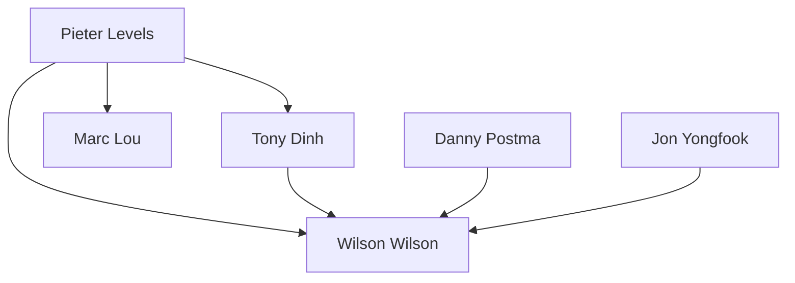

# Person Registry（人物レジストリ）

カテゴリ横断で同一人物のドキュメントを追跡するクロスリファレンス。

---

## 複数カテゴリに出現する人物

### Tier 1: $100K+ MRR

| Person ID | 人物名 | App事例 | SNS事例 | Newsletter | 主要戦略 | 総MRR |
|-----------|--------|---------|---------|------------|----------|-------|
| PERSON_001 | Pieter Levels | [APP_003](../01_App/case_studies/003_pieter_levels.md) | [SNS_001](../03_SNS/case_studies/pieter_levels/sns_analysis.md) | - | build_in_public | $360K |
| PERSON_002 | Tony Dinh | [APP_018](../01_App/case_studies/018_tony_dinh.md) | [SNS_tony_dinh](../03_SNS/case_studies/tony_dinh/sns_analysis.md) | - | build_in_public | $142K |

### Tier 2: $50K-100K MRR

| Person ID | 人物名 | App事例 | SNS事例 | Newsletter | 主要戦略 | 総MRR |
|-----------|--------|---------|---------|------------|----------|-------|
| PERSON_003 | Wilson Wilson | [APP_001](../01_App/case_studies/001_wilson_senja.md) | [SNS_wilson](../03_SNS/case_studies/wilson/sns_analysis.md) | - | build_in_public | $50K |
| PERSON_004 | Marc Lou | [APP_004](../01_App/case_studies/004_marc_lou.md) | [SNS_marc_lou](../03_SNS/case_studies/marc_lou/sns_analysis.md) | - | ship_fast | $100K+ |
| PERSON_005 | Danny Postma | [APP_014](../01_App/case_studies/014_danny_postma.md) | [SNS_danny_postma](../03_SNS/case_studies/danny_postma/sns_analysis.md) | - | seo_first | $75K |

---

## 詳細レジストリ

### PERSON_001: Pieter Levels

| 属性 | 値 |
|------|-----|
| **正式名** | Pieter Levels |
| **ハンドル** | @levelsio |
| **国籍** | Netherlands |
| **主要プロダクト** | PhotoAI, NomadList, RemoteOK |
| **総MRR** | $360K |
| **Twitterフォロワー** | 785K |
| **主要戦略** | build_in_public, ship_fast |

**関連ドキュメント**:
- App: [APP_003](../01_App/case_studies/003_pieter_levels.md) - プロダクト開発事例
- SNS: [SNS_001](../03_SNS/case_studies/pieter_levels/sns_analysis.md) - SNS成長戦略

---

### PERSON_002: Tony Dinh

| 属性 | 値 |
|------|-----|
| **正式名** | Tony Dinh |
| **ハンドル** | @tdinh_me |
| **国籍** | Vietnam |
| **主要プロダクト** | TypingMind, DevUtils |
| **総MRR** | $142K |
| **Twitterフォロワー** | 173K |
| **主要戦略** | build_in_public |

**関連ドキュメント**:
- App: [APP_018](../01_App/case_studies/018_tony_dinh.md)
- SNS: [SNS_tony_dinh](../03_SNS/case_studies/tony_dinh/sns_analysis.md)

---

### PERSON_003: Wilson Wilson

| 属性 | 値 |
|------|-----|
| **正式名** | Wilson Wilson |
| **ハンドル** | @euboid |
| **国籍** | Nigeria |
| **主要プロダクト** | Senja, Ferndesk |
| **総MRR** | $50K (Senja最高時) |
| **Twitterフォロワー** | 35K |
| **主要戦略** | build_in_public |

**関連ドキュメント**:
- App: [APP_001](../01_App/case_studies/001_wilson_senja.md)
- SNS: [SNS_wilson](../03_SNS/case_studies/wilson/sns_analysis.md)

---

## ロールモデル関係

どの人物が誰をロールモデルとしているかの関係図。

| 学習者 | ロールモデル | 参照元 |
|--------|-------------|--------|
| Wilson Wilson | Pieter Levels, Tony Dinh, Danny Postma | APP_001 |
| Marc Lou | Pieter Levels | APP_004 |
| 多数のIndie Hackers | Pieter Levels | 共通 |

---

## 更新履歴

| 日付 | 変更内容 |
|------|----------|
| 2025-12-27 | 初版作成 |
