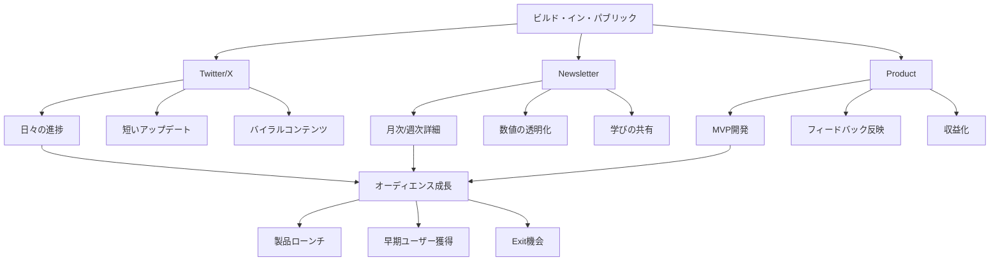

# NL_OVERSEAS_019: インディーメーカー・ビルド・イン・パブリック事例集

**バージョン**: 1.0
**ファイルID**: NL_OVERSEAS_019
**対象**: 2名統合（Tony Dinh、Courtland Allen / Indie Hackers）

---

## 基本情報

| 項目 | 内容 |
|------|------|
| **カテゴリ** | インディーメーカー / ビルド・イン・パブリック / プロダクト×ニュースレター |
| **情報源** | 複数ソース統合 |
| **調査日** | 2025-12-27 |

---

## 事例サマリー

### 一言まとめ

ニュースレターを単なる情報発信ツールではなく、プロダクト開発・マーケティング・コミュニティ構築を統合した「ビルド・イン・パブリック」戦略の中核に据え、MRR $45K（約600万円/月）やStripeによる買収を実現した2名のインディーメーカー事例。

---

## 事例1: Tony Dinh（Typing Mind、Black Magic、Xnapper）

### 基本データ

| 項目 | 数値 |
|------|------|
| **主要プロダクト** | Typing Mind（ChatGPTラッパー） |
| **MRR** | $45,000/月（約600万円/月） |
| **ニュースレター購読者** | 10,000人（2024年） |
| **Twitter（X）フォロワー** | 130,000人 |
| **過去のExit** | Black Magic: $128K、Xnapper: $150K |
| **ニュースレタープラットフォーム** | Substack |
| **配信頻度** | 月1回（月次レポート） |
| **開始時期** | 2021年頃（ビルド・イン・パブリック開始） |

### 成長タイムライン

```
2021年4月: ビルド・イン・パブリック開始
  - 日々の進捗をTwitterで共有開始
      ↓
2022年2月: Black Magic成長
  - MRR $4K、Twitter 28Kフォロワー
      ↓
2022年: Black Magic売却
  - MRR $14K到達
  - $128,000で売却成功
      ↓
2023年: Xnapper成長・売却
  - 平均MRR $4K
  - $150,000で売却
      ↓
2023年: Typing Mind急成長
  - ChatGPTブームに乗る
  - MRR $45K到達
      ↓
2024年11月: 初の$1M達成発表
  - 累計収益$1M突破
  - ニュースレター購読者10K
```

### プロダクトポートフォリオ

| プロダクト | 種類 | MRR | Exit金額 | 開発期間 |
|-----------|------|-----|----------|----------|
| **Typing Mind** | ChatGPTラッパー | $45K | 運営中 | 2023-現在 |
| **Black Magic** | Twitterツール | $14K（売却時） | $128K | 2021-2022 |
| **Xnapper** | スクリーンショットツール | $4K（平均） | $150K | 2022-2023 |

### ニュースレター戦略

**1. 月次進捗レポート形式**
- 収益の完全透明化（MRR、売上、利益すべて公開）
- 成功と失敗の両方を共有
- 具体的な数値と学びを提供

**月次レポートの構成例**:
```markdown
## 今月のハイライト
- MRR: $XX,XXX (+X%)
- 新規顧客: XXX人
- チャーン率: X%

## 今月の学び
1. [具体的な失敗や成功]
2. [実装した機能とその効果]
3. [マーケティング施策の結果]

## 来月の計画
- [具体的なゴール]
```

**2. ニュースレター×Twitterの相乗効果**
- Twitter: 日々の進捗、短いアップデート（130Kフォロワー）
- Newsletter: 月次の詳細な振り返り（10K購読者）
- 相互送客による両方の成長

**3. コミュニティ構築**
- 読者からのフィードバックを製品開発に反映
- 早期ユーザー獲得の場として活用
- インディーメーカー同士のネットワーキング

### Twitter戦略の詳細

**バイラルツイート事例**
- ダイナミックヘッダー機能のツイート: 2,000いいね、4,000新規フォロワー獲得
- 収益報告ツイート: 高エンゲージメント、透明性への共感

**フォロワー成長**
- 2021年4月: ビルド・イン・パブリック開始
- 2022年2月: 28,000フォロワー
- 2024年: 130,000フォロワー
- **成長率**: 約3年で130Kフォロワー（月平均+3,600）

### 成功要因

**1. 完全な透明性**
- MRR、売上、利益、失敗を全て公開
- 「学び」を共有することで価値提供
- 透明性が信頼とフォロワーを生む

**2. スピード重視の開発**
- MVPを数週間で開発
- 市場フィードバックを即座に反映
- 完璧主義を避ける

**3. トレンドへの素早い対応**
- ChatGPTブームをいち早くキャッチ
- Typing Mindを迅速に開発・ローンチ
- 市場タイミングの最適化

**4. 複数プロダクトのポートフォリオ**
- 1つのプロダクトに依存しない
- Exit実績を作りながら新規開発
- リスク分散と資金確保

**5. Twitterオーディエンスの構築**
- 130Kフォロワー = 強力な配信チャネル
- 無料マーケティングプラットフォーム
- 新規プロダクトのローンチ基盤

### 重要な見解

**"Building in public is a great way to share your progress, grow your audience, and help other makers."**
（ビルド・イン・パブリックは、進捗共有、オーディエンス成長、他のメーカー支援の素晴らしい方法）- Tony Dinh

---

## 事例2: Courtland Allen（Indie Hackers）

### 基本データ

| 項目 | 数値 |
|------|------|
| **プロダクト** | Indie Hackers（コミュニティプラットフォーム） |
| **ニュースレター購読者** | 85,000人（週3回配信） |
| **売却時MRR** | $8,000/月（約100万円/月） |
| **Exit** | Stripeに買収（2017年、金額非公開） |
| **開始時期** | 2016年 |
| **ローンチから買収まで** | 約8ヶ月 |

### 成長タイムライン

```
2016年初頭: Indie Hackers開始
  - 成功した起業家のインタビュープラットフォーム
      ↓
ローンチ1週間後:
  - ニュースレター購読者1,000人獲得
      ↓
初期数ヶ月:
  - MRR $0 → $2K → $4K
      ↓
2017年3月（8ヶ月後）:
  - MRR $7,000達成
  - 収益の90%が広告
      ↓
2017年: Stripeに買収
  - 買収後もCourtlandが運営継続
      ↓
現在:
  - ニュースレター購読者85K
  - 週3回配信
  - Stripe傘下で成長継続
```

### 収益構造（買収前）

| 収益源 | 比率 | 金額（月） |
|--------|------|-----------|
| **広告・スポンサーシップ** | 90% | $6,300 |
| - Podcastスポンサー | - | - |
| - ニュースレター広告 | - | - |
| - インタビュー広告枠 | - | - |
| **その他** | 10% | $700 |
| **合計MRR** | 100% | **$7,000** |

### ニュースレター戦略

**1. インタビューコンテンツの再利用**
- メインコンテンツ: 成功した起業家インタビュー
- インタビューをニュースレターで配信
- トラフィックの90%がインタビュー目的

**2. 透明性とビルド・イン・パブリック**
- 月次レビューブログで収益・訪問者数を公開
- 「透明性を求めるサイトで、自分も透明でなければ偽善」との哲学
- 公開コミットメントによるアカウンタビリティ

**3. コミュニティ統合**
- ニュースレター購読者をコミュニティメンバーに転換
- マイルストーン投稿をニュースレターで特集
- 相互推薦による成長加速

**配信頻度と内容**:
- **週3回配信**（現在）
- 成功事例インタビュー
- コミュニティメンバーのマイルストーン
- インディーハッカー向けTips

### Stripe買収の背景

**買収理由（推測）**:
1. Stripeのターゲット顧客（インディー起業家）へのリーチ
2. 高品質なコミュニティとコンテンツ
3. 創業者Courtlandの継続関与
4. 成長ポテンシャル

**買収後の変化**:
- Courtlandは継続して運営
- Stripeのリソースでさらに成長
- 収益プレッシャーが軽減
- コミュニティファーストの運営継続

### 成功要因

**1. コミュニティファースト**
- 収益よりも価値提供を優先
- 透明性によるコミュニティ信頼構築
- メンバー同士の助け合い文化

**2. インタビューコンテンツの価値**
- 成功事例から学ぶニーズをキャッチ
- 具体的な数値と戦略を共有
- 再現可能な学びの提供

**3. 複数収益源の早期確立**
- Podcast、ニュースレター、インタビュー広告
- 依存度を分散
- 収益化実験の早期開始

**4. スピード重視**
- ローンチから8ヶ月で買収
- MVPから始めて迅速に改善
- 市場フィードバックを即座に反映

**5. 透明性による差別化**
- 収益・訪問者数の完全公開
- 失敗も共有
- 信頼とエンゲージメントの向上

### 重要な見解

**"It would be hypocritical to have a site requiring transparency without sharing my own revenue."**
（透明性を求めるサイトを運営しながら、自分の収益を共有しないのは偽善だ）- Courtland Allen

---

## 統合分析: ビルド・イン・パブリック戦略

### 2名の比較マトリックス

| 要素 | Tony Dinh | Courtland Allen |
|------|-----------|-----------------|
| **主要プロダクト** | Typing Mind（SaaS） | Indie Hackers（コミュニティ） |
| **MRR** | $45K | $8K（買収時） |
| **Exit** | Black Magic $128K、Xnapper $150K | Stripe買収（金額非公開、推定7-8桁） |
| **ニュースレター購読者** | 10K | 85K |
| **Twitter/Xフォロワー** | 130K | 非公開 |
| **配信頻度** | 月1回 | 週3回 |
| **収益源** | 製品販売100% | 広告90%、その他10% |
| **開発スピード** | 数週間でMVP | 8ヶ月で買収 |
| **戦略** | マルチプロダクト | シングルプラットフォーム |

### ビルド・イン・パブリックの5原則

**1. 完全な透明性**
- MRR、収益、失敗を全て公開
- 隠すことなく現実を共有
- 透明性が信頼を生む

**2. 一貫した更新頻度**
- Tony: 毎日Twitter + 月次Newsletter
- Courtland: 週3回Newsletter + 月次ブログ
- 読者との継続的な関係構築

**3. 価値提供ファースト**
- 自分の学びを他者に共有
- 失敗から得た教訓を提供
- 「Give before Ask」の精神

**4. コミュニティ構築**
- 一方通行の発信ではなく対話
- 読者・フォロワーからのフィードバック
- 相互支援のエコシステム

**5. スピード重視**
- 完璧主義を避ける
- MVPを早期リリース
- 市場フィードバックで改善

### ニュースレター×プロダクトの統合戦略



### 収益化タイムライン比較

**Tony Dinhモデル（マルチプロダクト）**:
```
Year 1: ビルド・イン・パブリック開始 → MRR $0
Year 2: Black Magic成長 → MRR $14K → Exit $128K
Year 3: Xnapper → MRR $4K → Exit $150K
Year 4: Typing Mind → MRR $45K（継続運営）
累計: $278K Exit + $540K/年（MRR $45K × 12）
```

**Courtland Allenモデル（シングルプラットフォーム）**:
```
Month 1: ローンチ → MRR $0
Month 2-3: 成長 → MRR $2K-$4K
Month 8: 買収前 → MRR $7K
Month 9+: Stripe買収 → 継続成長
```

---

## 日本市場への適用

### 適用可能性分析

| 要素 | 適用可能性 | 理由 |
|------|-----------|------|
| **ビルド・イン・パブリック** | ◎ | 日本でも#技術書典、#個人開発で実績 |
| **Twitter戦略** | ◎ | 日本はTwitter（X）文化が強い |
| **透明性** | ○ | 文化的に控えめだが、差別化になる |
| **ニュースレター** | ○ | note、Substackで実現可能 |
| **総合評価** | ◎ | 高い適用可能性 |

### 日本向けアレンジ案

**プラットフォーム置換**
- Substack → note、Substack日本語
- Twitter → X（日本）
- Indie Hackers → Zenn、Qiita（エンジニア）、note（一般）

**文化的調整**
- 収益の完全公開 → 一部公開または範囲で公開（「6桁後半」等）
- 失敗の共有 → 「学び」としてポジティブに再構成
- 直接的な自己PR → 謙虚さを保ちつつ実績共有

**日本のビルド・イン・パブリック先行事例**
- motoさん（転職アンテナ）: Twitter + note
- けんすうさん（アル）: Twitter + note
- しゅうへいさん（フリーランスの学校）: Twitter + Voicy + Brain

---

## 実装ロードマップ（日本版）

### Phase 0: 準備期（0-1ヶ月）

**プロダクトアイデア検証**
- [ ] 解決したい課題を明確化
- [ ] ターゲット市場の規模推定
- [ ] 既存競合の調査
- [ ] MVPの最小機能セット定義

**プラットフォーム準備**
- [ ] Twitterアカウント最適化
- [ ] noteまたはSubstack開設
- [ ] プロフィール・Bioの最適化
- [ ] 初回投稿の下書き

### Phase 1: ビルド・イン・パブリック開始（1-3ヶ月）

**Week 1: キックオフ**
- [ ] ビルド・イン・パブリック宣言ツイート
- [ ] なぜ作るのか、何を作るのかを共有
- [ ] 初回フォロワー獲得（目標: 100人）

**Week 2-4: 日々の進捗共有**
- [ ] 毎日1ツイート（進捗、学び、失敗）
- [ ] スクリーンショット・デモ動画を積極的に共有
- [ ] フォロワー獲得（目標: 500人）

**Week 5-12: MVP開発**
- [ ] 週1回のニュースレター配信開始
- [ ] MVPローンチ
- [ ] 初回ユーザー獲得（目標: 50人）
- [ ] フォロワー獲得（目標: 2,000人）

### Phase 2: 収益化開始（3-6ヶ月）

**初回収益**
- [ ] 有料プラン設定
- [ ] 初回収益達成（目標: 月¥50K）
- [ ] 収益報告ツイート・ニュースレター

**成長加速**
- [ ] フィードバックに基づく改善
- [ ] バイラルツイート戦略実行
- [ ] フォロワー獲得（目標: 5,000人）

**月次レポート開始**
- [ ] 月次ニュースレターで収益・学び共有
- [ ] ニュースレター購読者獲得（目標: 500人）

### Phase 3: スケール・Exit検討（6-18ヶ月）

**収益スケール**
- [ ] MRR ¥500K達成
- [ ] フォロワー10,000人達成
- [ ] ニュースレター購読者3,000人達成

**Exit準備（オプション）**
- [ ] 買収候補企業リサーチ
- [ ] 財務資料整備
- [ ] Exit交渉開始

**次のプロダクト（マルチプロダクト戦略）**
- [ ] 2つ目のプロダクトアイデア検証
- [ ] 既存オーディエンスへのローンチ
- [ ] ポートフォリオ拡大

---

## ビルド・イン・パブリック実践テンプレート

### 日次Twitterポスト例

**月曜日: 週次ゴール**
```
今週の目標 🎯
✅ [機能名] の実装完了
✅ [指標] を X% 改善
✅ [ユーザー数] 人獲得

進捗は毎日シェアします！
#ビルドインパブリック #個人開発
```

**火-木曜日: 進捗報告**
```
[プロダクト名] 開発進捗 📊

今日の成果:
✅ [具体的な成果]
❌ [失敗したこと]
💡 [学んだこと]

明日は [次のタスク] に取り組みます

[スクリーンショットまたはデモ動画]
#ビルドインパブリック
```

**金曜日: 週次振り返り**
```
今週の振り返り 📈

達成:
✅ [成果1]
✅ [成果2]

課題:
❌ [課題1]

来週の目標:
🎯 [目標1]

[数値やグラフの画像]
#ビルドインパブリック #週次報告
```

### 月次ニュースレターテンプレート

```markdown
# [プロダクト名] 月次レポート - YYYY年M月

## ハイライト
- MRR: ¥XXX,XXX（前月比+X%）
- ユーザー数: XXX人（+XX人）
- 主要な達成: [具体的な成果]

## 詳細数値
| 指標 | 今月 | 前月 | 成長率 |
|------|------|------|--------|
| MRR | ¥XXX | ¥XXX | +X% |
| ユーザー | XXX | XXX | +X% |
| チャーン率 | X% | X% | - |

## 今月の学び
1. **[学び1のタイトル]**
   - 背景: [なぜこの課題に取り組んだか]
   - 施策: [何をしたか]
   - 結果: [どうなったか]
   - 学び: [次に活かせること]

2. **[学び2のタイトル]**
   [同様の構成]

## 失敗したこと
- [失敗1]: [詳細と学び]
- [失敗2]: [詳細と学び]

## 来月の目標
- [ ] [具体的な目標1]
- [ ] [具体的な目標2]
- [ ] [具体的な目標3]

---

ご購読ありがとうございます！
質問・フィードバックは返信でお願いします。

[あなたの名前]
```

---

## アクションチェックリスト

### 今週実施

- [ ] ビルド・イン・パブリックで作るプロダクトアイデアを3つリストアップ
- [ ] Tony DinhとCourtland Allenのニュースレターを購読
- [ ] Twitterプロフィールを「ビルド・イン・パブリック」用に最適化
- [ ] 初回ツイート下書き作成

### 今月実施

- [ ] MVPの最小機能セットを定義
- [ ] ビルド・イン・パブリック開始ツイート投稿
- [ ] 毎日1ツイート習慣化
- [ ] note or Substack開設

### 今四半期実施

- [ ] MVPローンチ
- [ ] 初回50ユーザー獲得
- [ ] 月次ニュースレター配信開始
- [ ] 初回収益達成（目標: 月¥50K）

---

## 関連戦略

| 戦略名 | 関連性 | ファイル |
|--------|--------|----------|
| 超高収益ニュースレター | 収益化の次のステージ | NL_OVERSEAS_018 |
| SNSからメール転換 | Twitter戦略の詳細 | NL_OVERSEAS_016 |
| Faster Than Normal | 同様のビルド・イン・パブリック事例 | NL_OVERSEAS_013 |

---

## 情報源

| ソース | URL | 確認日 |
|--------|-----|--------|
| Tony Dinh Solopreneur Story | https://www.indiehackers.com/post/my-solopreneur-story-zero-to-45k-mo-in-2-years-1b858f47af | 2025-12-27 |
| Tony Dinh Newsletter | https://news.tonydinh.com/ | 2025-12-27 |
| Tony Dinh My First Million | https://news.tonydinh.com/p/nov-2024-my-first-million | 2025-12-27 |
| Indie Hackers 100K Subscribers | https://www.indiehackers.com/product/indie-hackers/the-indie-hackers-newsletter-just-hit-100-000-subscribers--NAHbavZhGWtHDlJ5DkG | 2025-12-27 |
| Indie Hackers Stripe Acquisition | https://theygotacquired.com/community/indiehackers-acquired-by-stripe/ | 2025-12-27 |

---

**調査者**: Claude Sonnet 4.5
**最終更新**: 2025-12-27
