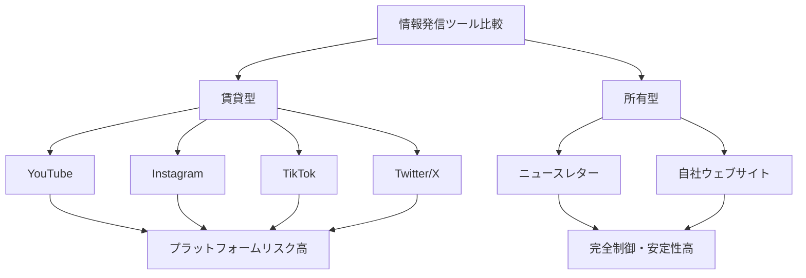

# NL_MARKET_006: クリエイター収益化・ニュースレター市場動向2025

**バージョン**: 1.0
**ファイルID**: NL_MARKET_006
**カバートピック**: 6件統合（ブログ終焉、直接課金、Substack成長、Spotify収益化等）

---

## 基本情報

| 項目 | 内容 |
|------|------|
| **カテゴリ** | 市場動向 / クリエイターエコノミー / 収益化トレンド |
| **情報源** | 複数ソース統合（2024-2025年データ） |
| **調査日** | 2025-12-27 |

---

## 市場サマリー

### 一言まとめ

2024-2025年、GoogleのAI Overviewsによるブログトラフィック90%減と引き換えにニュースレターが急成長し、クリエイターの直接課金モデルが$250B（約37兆円）から2027年に$480B（約71兆円）へと倍増する大転換期。

---

## セクション1: AI時代のブログ終焉とニュースレター台頭

### ブログ衰退の3大要因

**1. Google AI Overviews の破壊的インパクト（2024年5月導入）**

**影響実績**:
- The Planet D（旅行ブログ）: トラフィック **90%減** → 閉鎖
- The Verge: Google経由トラフィックがAI Overviews導入と同期して減少
- NPRレポート: オンライン出版社にとって「絶滅レベルの脅威」

**仕組み**:
```
従来:
ユーザー → Google検索 → ブログ訪問 → 広告収益

2024年以降:
ユーザー → Google検索 → AI Overviewsで完結 → ブログ訪問なし → 収益ゼロ
```

**ジレンマ**:
- AI Overviewsからオプトアウト = Google検索全体からオプトアウト
- オプトインしたまま = トラフィック激減
- **選択肢がない状況**

**2. ソーシャルメディアトラフィックの減少**

- プラットフォームアルゴリズムの変更
- リーチの不安定性
- 外部リンクへの優先度低下

**3. AI生成コンテンツの氾濫**

- 低品質AIコンテンツの大量生産
- オリジナルコンテンツの価値低下
- 検索結果の信頼性低下

### ニュースレター成長の5大要因

**1. プラットフォーム非依存**

**重要な原則**:
"There's no single company that controls the inbox"
（インボックスを支配する単一企業は存在しない）

- アルゴリズム変更の影響を受けない
- 読者が直接コンテンツを受け取る
- プラットフォームリスクの分散

**2. 直接的なオーディエンス関係**

- メールアドレス = 所有資産
- SNSフォロワー = 賃貸資産
- プラットフォーム倒産・変更のリスク回避

**3. 高いエンゲージメント率**

| チャネル | 平均エンゲージメント率 |
|---------|---------------------|
| **メール** | **37.67%**（beehiiv 2024年） |
| Facebook | 0.5-3% |
| Instagram | 1-5% |
| Twitter/X | 0.5-2% |

**4. 収益化の容易さ**

- 購読モデルの直接実装
- スポンサーシップの高単価
- デジタル製品販売の容易性

**5. プラットフォームの成熟**

| プラットフォーム | 出版者数/購読者数 |
|----------------|------------------|
| **beehiiv** | 400,000+出版者 |
| **Substack** | 500,000+有料購読者 |
| **ConvertKit** | 600,000+クリエイター |

### 主要メディアの対応戦略

**The Verge（Voxグループ）**:
- 購読モデル強化
- ポッドキャスト投資
- ニュースレター拡充
- 検索トラフィック依存からの脱却

**戦略的転換**:
```
旧モデル: SEO → 検索流入 → 広告収益
     ↓
新モデル: ニュースレター → 直接購読 → 購読収益
```

---

## セクション2: Substack成長の全貌

### 基本データ

| 項目 | 数値 |
|------|------|
| **設立** | 2017年10月 |
| **創業者** | Chris Best（元Kik）、Jairaj Sethi（元Kik）、Hamish McKenzie（元PandoDaily） |
| **最新評価額** | $1.1B（約1,650億円、2025年7月） |
| **累計調達額** | $100M+（Series C: $100M、2025年7月） |
| **有料購読者** | 500,000+ |
| **トップクリエイター収益** | $1M-12M/年 |

### 成長タイムライン

```
2017年10月: Substack設立
  - インスピレーション: Ben ThompsonのStratechery
  - 初期ユーザー: Bill Bishop（Sinocism、$11/月）
      ↓
2018年: Seed Round
  - The Chernin Group、Zhen Fund、Emmett Shear（Twitch CEO）等
      ↓
2020年: Series A（$15.3M）
  - Andreessen Horowitz（a16z）リード
      ↓
2021年: Series B（$65M）
  - Andreessen Horowitz（a16z）リード
  - 評価額: $650M
      ↓
2025年7月: Series C（$100M）
  - 評価額: $1.1B（ユニコーン達成）
  - 目標: より良いツール、広範なリーチ、深いサポート
```

### 成功要因

**1. クリエイターファースト哲学**

- シンプルなUI/UX
- 執筆・配信・課金の一元化
- 技術的負担の最小化

**2. ネットワーク効果**

- Substack Recommendations（相互推薦）
- Notes機能（Twitter類似のSNS）
- クリエイター間のコミュニティ

**3. 高収益クリエイターの存在**

トップクリエイター例:
- Heather Cox Richardson: 推定$12M+/年
- Matt Yglesias: $1.4M+/年
- Lenny Rachitsky: $2M+/年（NL単体）
- Gergely Orosz: $1.5M+/年

**4. 手数料モデル**

- 基本: 10%手数料（業界標準）
- 無料ニュースレターは完全無料
- クレジットカード処理費別途

**5. クリエイター支援プログラム**

- $20M Creator Fund（2025年発表）
- Substack Pro（前払い保証）
- 法的サポート、健康保険等

### Substackの課題

**モデレーション論争**:
- 極端な政治的コンテンツへの対応
- ヘイトスピーチの定義
- プラットフォーム責任 vs 表現の自由

**競合の台頭**:
- beehiiv（収益化機能充実）
- ConvertKit（マーケティング自動化）
- Ghost（オープンソース）

---

## セクション3: 直接課金がクリエイターの未来である理由

### クリエイターエコノミー市場規模

| 年 | 市場規模 | 成長率 |
|----|---------|--------|
| **2024年** | $250B（約37兆円） | - |
| **2027年（予測）** | $480B（約71兆円） | +92% |
| **2029年（予測）** | Creator Monetization Platform単体で$24.21B | CAGR 20.3% |

### 収益モデルの大転換

**旧モデル（広告依存）**:
```
クリエイター → プラットフォーム → 広告主 → 収益分配
問題:
- プラットフォームが50-70%搾取
- アルゴリズム変更で収益激減
- 広告主の意向に左右される
```

**新モデル（直接課金）**:
```
クリエイター → ファン → 直接支払い
メリット:
- 収益の80-90%を保持
- ファンとの直接関係
- プラットフォーム変更の影響最小
```

### 2025年トップ収益化戦略7選

**1. サブスクリプション（最重要）**

**プラットフォーム**:
- Patreon: クリエイター向け老舗
- Substack: ライター特化
- OnlyFans: クリエイター全般
- YouTube Premium: 動画クリエイター
- Twitch Subscriptions: ストリーマー

**価格帯**:
- Tier 1: $5-10/月（エントリー）
- Tier 2: $15-25/月（スタンダード）
- Tier 3: $50-100/月（プレミアム）

**2. デジタル製品販売**

**種類と価格帯**:
- eBook: $9-29
- オンラインコース: $99-997
- テンプレート集: $19-99
- ストック写真・動画: $29-199
- ウェブサイトテーマ: $49-199

**3. コミュニティ会員制**

- Discord/Slackコミュニティ
- 限定イベント
- Q&Aセッション
- ネットワーキング機会

**4. ペイドチャレンジ・ワークショップ**

- 30日間チャレンジ: $97-297
- ライブワークショップ: $197-497
- マスターマインドグループ: $997-2,997/月

**5. アフィリエイト・パートナーシップ**

- 製品紹介: 5-30%コミッション
- ブランドアンバサダー: 固定報酬+コミッション
- スポンサーシップ: $500-50,000/案件

**6. ライセンシング・IP販売**

- コンテンツライセンス
- キャラクター・ブランドライセンシング
- 既存コンテンツの再利用権販売

**7. プレミアムサービス**

- 1対1コンサルティング: $200-1,000/時間
- カスタム制作: プロジェクトベース
- スピーキング: $5,000-50,000/回

### 成功の鍵: 複数収益源の組み合わせ

**重要な原則**:
"Top performers blend subscriptions, affiliate commissions, digital products, paid communities, and partnerships for stability and scale"
（トップパフォーマーは、購読、アフィリエイト、デジタル製品、有料コミュニティ、パートナーシップを組み合わせて安定性とスケールを実現）

**収益ポートフォリオ例**:
```
月収$10,000の内訳:
- サブスクリプション: $4,000（40%）
- デジタル製品: $2,500（25%）
- コミュニティ会員: $2,000（20%）
- アフィリエイト: $1,000（10%）
- スポンサーシップ: $500（5%）
```

---

## セクション4: Spotify Creator Monetization（ポッドキャスト収益化）

### Spotify for Creators概要

| 項目 | 内容 |
|------|------|
| **プログラム名** | Spotify for Creators（旧: Spotify for Podcasters） |
| **開始** | 2021年4月 |
| **最新アップデート** | 2024年11月 |
| **ビデオポッドキャスト視聴** | 前年比+88% |

### 3つの収益化モデル

**1. サブスクリプション（Paid Podcasts）**

**仕組み**:
- クリエイターが月額料金設定
- サブスクリプション限定エピソード配信
- ファンは月額料金で全エピソードアクセス

**収益分配**:
- 最初の2年間（2021-2023年）: **100%** クリエイター取り分（手数料0%）
- 2023年以降: **95%** クリエイター、5% Spotify
- 決済手数料別途

**2. Spotify Partner Program（広告収益分配）**

**仕組み**:
- Spotifyが自動的に広告挿入
- プラットフォーム内外での再生で収益
- ビデオポッドキャスト: Premium会員視聴でも収益

**収益源**:
- オーディオ広告: 再生ごとに収益分配
- ビデオ広告: Premium会員視聴時も収益（新機能）
- 視聴時間ベースの収益計算

**3. Open Access Platform（外部連携）**

**対応プラットフォーム**:
- Patreon
- Substack
- Supporting Cast
- その他メンバーシッププラットフォーム

**メリット**:
- 既存サブスクリプションをSpotifyにシームレス連携
- 複数プラットフォームでの収益化
- ファンベースの統合

### Spotifyの戦略: YouTubeモデルの再現

**YouTubeとの比較**:

| 要素 | YouTube | Spotify for Creators |
|------|---------|---------------------|
| **メインコンテンツ** | 動画 | 音声+ビデオポッドキャスト |
| **収益分配** | 55%クリエイター | 95-100%クリエイター |
| **広告収益** | あり | あり |
| **サブスクリプション** | メンバーシップ | Paid Podcasts |
| **ビデオ重視** | 100% | 拡大中（+88%成長） |

**Spotifyの強み**:
- より高い収益分配率（95% vs YouTube 55%）
- 音声ファーストの差別化
- Premiumユーザーベース（2億+）

---

## セクション5: 情報発信の価値最大化ツールとしてのニュースレター

### なぜニュースレターが最強のツールなのか

**1. 所有権と制御**



**2. 複数タッチポイントの統合ハブ**

**統合戦略**:
```
Twitter/X → ニュースレター ← Instagram
     ↑              ↓              ↑
YouTube ← ← ← ハブ機能 → → → Podcast
     ↑              ↓              ↑
LinkedIn → ニュースレター ← TikTok
```

**メリット**:
- 全プラットフォームの読者を一箇所に集約
- プラットフォーム倒産・変更のリスクヘッジ
- 深いエンゲージメントの構築

**3. 高いROI（投資対効果）**

| 指標 | ニュースレター | SNS投稿 |
|------|--------------|---------|
| **平均開封率** | 37.67% | N/A |
| **平均CTR** | 3-5% | 0.5-2% |
| **寿命** | 永続的（メールボックス） | 数時間〜数日 |
| **リーチ** | 100%（購読者全員） | 1-10%（アルゴリズム依存） |
| **収益化** | 直接可能 | プラットフォーム経由 |

**4. 深い関係構築**

- メールボックス = プライベート空間
- 長文コンテンツの許容
- 返信による双方向コミュニケーション
- 信頼関係の構築

**5. データと分析**

**取得可能データ**:
- 開封率（MPP考慮必要）
- クリック率
- 返信率
- 購読解除率
- セグメント別エンゲージメント

**活用方法**:
- A/Bテスト（件名、配信時間、コンテンツ）
- セグメント配信最適化
- パーソナライゼーション
- 収益化戦略の改善

---

## セクション6: 2025年クリエイター収益化トレンド予測

### トップ5トレンド

**1. マイクロペイメントとライブストリーム収益化**

- リアルタイム投げ銭の標準化
- $1-5の少額決済増加
- ライブ配信×即時収益化

**2. AI駆動のパーソナライゼーション**

- AIによるコンテンツ推薦
- 個別化されたサブスクリプションオファー
- 自動セグメント配信

**3. コミュニティ所有型プラットフォーム**

- Web3 / DAO型クリエイターコミュニティ
- トークンエコノミー
- ファンの共同所有

**4. 複数プラットフォーム統合**

- クロスプラットフォームサブスクリプション
- 統一課金システム
- シームレスなファン体験

**5. "Owned Spaces"への投資集中**

**重要な洞察**:
"The real money is made in owned spaces like email, community, and product sales"
（真の収益は、メール、コミュニティ、製品販売といった所有スペースで生まれる）

**推奨投資配分**:
- メールリスト構築: 40%
- コミュニティプラットフォーム: 30%
- デジタル製品開発: 20%
- SNS運用: 10%

---

## 日本市場への適用

### 適用可能性分析

| 要素 | 適用可能性 | 日本の状況 |
|------|-----------|----------|
| **ニュースレター文化** | ○ | note、Substackが拡大中 |
| **直接課金文化** | ◎ | Brain、有料noteで実績多数 |
| **クリエイターエコノミー** | ◎ | 急成長中（推定¥3兆市場） |
| **ポッドキャスト** | ○ | Voicy、Spotifyで成長 |
| **総合評価** | ◎ | 高い適用可能性 |

### 日本独自の調整

**プラットフォーム**:
- Substack → note、Substack日本語版
- Patreon → pixivFANBOX、Fantia
- Podcast → Voicy、Spotify、Apple Podcasts
- Community → Discord、オープンチャット

**価格設定**:
- サブスクリプション: $5-10/月 → ¥500-1,000/月
- デジタル製品: $29-997 → ¥2,980-98,000
- コミュニティ: $39-99/月 → ¥3,980-9,800/月

**文化的配慮**:
- 直接的な収益化訴求 → 「応援」「サポート」の文脈
- 個人の成功強調 → コミュニティ・共創の強調
- 高額商品 → 分割払い、段階的価格設定

---

## アクションチェックリスト

### 今週実施（全クリエイター）

- [ ] 現在の収益源を棚卸し（広告依存度を確認）
- [ ] ニュースレター開設検討（note or Substack）
- [ ] メールリスト構築開始（最低100人目標）
- [ ] SNSプロフィールにニュースレター登録リンク追加

### 今月実施（ニュースレター運営者）

- [ ] 直接課金モデル導入（有料購読 or デジタル製品）
- [ ] 複数収益源の設計（最低3つ）
- [ ] 既存SNSフォロワーのメールリスト転換施策
- [ ] 週1回以上のニュースレター配信習慣化

### 今四半期実施（本格収益化志向）

- [ ] 月収¥100K達成（複数収益源）
- [ ] 1,000メール購読者獲得
- [ ] デジタル製品1つローンチ
- [ ] ポッドキャスト開始検討（該当者）

---

## 重要な学び

### 市場の大転換

1. **ブログ → ニュースレター**: AI Overviewsが決定打
2. **広告依存 → 直接課金**: クリエイターエコノミー$250B→$480B
3. **プラットフォーム → 所有**: "Owned Spaces"への投資集中
4. **単一収益源 → 複数収益源**: 安定性とスケールの両立

### 成功の鍵

**"The real money is made in owned spaces like email, community, and product sales"**
（真の収益は、メール、コミュニティ、製品販売といった所有スペースで生まれる）

---

## 関連戦略

| 戦略名 | 関連性 | ファイル |
|--------|--------|----------|
| 2025年ニュースレタートレンド | 詳細市場データ | NL_OVERSEAS_015 |
| 多チャネル収益化 | 具体的収益化戦略 | NL_OVERSEAS_016 |
| 超高収益ニュースレター | 実践事例 | NL_OVERSEAS_018 |

---

## 情報源

| ソース | URL | 確認日 |
|--------|-----|--------|
| Digiday Newsletter Trends | https://digiday.com/media/publishers-revamp-their-newsletter-offerings-to-engage-audiences-amid-threat-of-ai-and-declining-referral-traffic/ | 2025-12-27 |
| NPR Google AI Impact | https://www.npr.org/2025/07/31/nx-s1-5484118/google-ai-overview-online-publishers | 2025-12-27 |
| Substack Wikipedia | https://en.wikipedia.org/wiki/Substack | 2025-12-27 |
| Substack Contrary Research | https://research.contrary.com/company/substack | 2025-12-27 |
| Creator Monetization Guide 2025 | https://influencermarketinghub.com/creator-monetization/ | 2025-12-27 |
| Spotify for Creators | https://creators.spotify.com/features/monetization | 2025-12-27 |
| 2025 Newsletter Predictions | https://zapier.com/blog/email-newsletter-predictions/ | 2025-12-27 |

---

**調査者**: Claude Sonnet 4.5
**最終更新**: 2025-12-27
