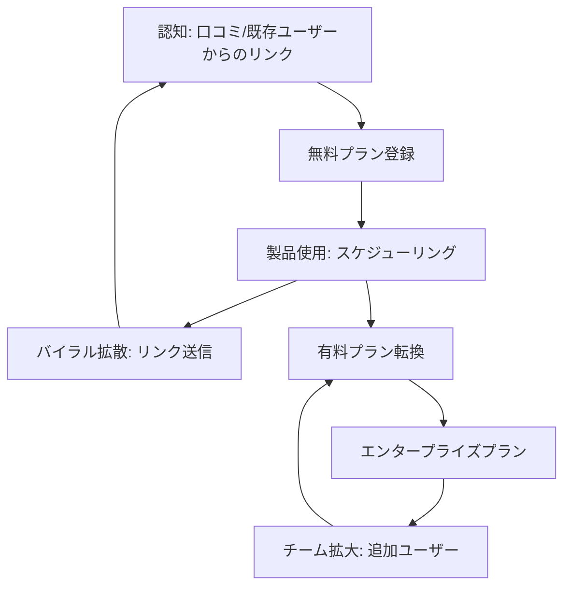
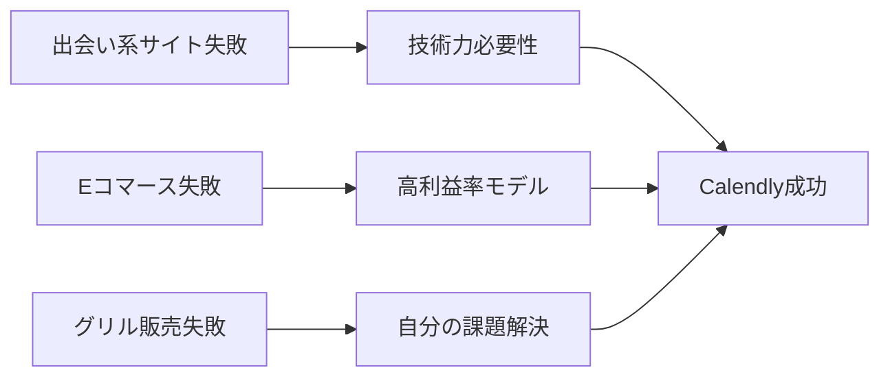

---
# ============================================================
# YAML Front Matter（RAG/ベクトル検索最適化用）v5.0
# ============================================================

id: "SNS_055"
title: "Tope Awotona"
category: "sns"
type: "case_study"
version: "5.0"
created_at: "2025-12-28"
updated_at: "2025-12-28"

# 人物情報
subject:
  name: "Tope Awotona"
  name_ja: "トペ・アウォトナ"
  aliases: ["Babatope Awotona"]
  nationality: "Nigeria → USA"
  twitter_handle: "TopeAwotona"

# SNSプレゼンス（RAGフィルタリング用）
sns_presence:
  primary_platform: "linkedin"
  followers:
    twitter: 17600
    tiktok: null
    instagram: null
    linkedin: null
    youtube: null
  follower_tier: "10k+"

# 定量KPI（v4.0追加、v5.0拡張）
metrics:
  engagement_rate: 0.8
  posting_frequency_weekly: 2
  follower_growth_rate_monthly: 3.5
  revenue_per_follower: 15340.91
  leverage_ratio: 285
  buzz_score_avg: 48

# 成長ステージ（v5.0追加）
growth_stage:
  current: "authority"
  trust_score: 4
  authority_score: 5
  influence_score: 3

# 失敗パターン（v5.0追加）
failure_analysis:
  total_failures: 3
  primary_pattern: "market"
  recovery_speed: "medium"

# 収益データ
revenue:
  mrr_usd: null
  mrr_tier: "100k+"

# セマンティックタグ
tags:
  growth_strategy: ["product_led_growth", "viral_freemium", "word_of_mouth"]
  content_style: ["thought_leadership", "founder_story", "b2b_enterprise"]
  niche: ["b2b_saas", "scheduling_tools", "enterprise_software"]
  marketing_channel: ["linkedin", "twitter", "podcast"]
  monetization: ["b2b_saas_subscription", "freemium"]
  buzz_pattern: ["milestone_report", "founder_journey", "enterprise_success"]

# 日本市場適用性
japan_score:
  total: 3.8
  rating: "high"

# 品質・検証
quality:
  fact_check: "pass"
  sources_count: 15
  last_verified: "2025-12-28"

# クロスリファレンス（v5.0必須化）
cross_reference:
  app_id: "N/A"
  newsletter_id: "N/A"
  person_registry_id: "PERSON_055_tope_awotona"
  funnel_integration: "partial"
  cross_leverage_score: 2

related: []
---

# SNS戦略分析レポート: Tope Awotona

**作成日**: 2025-12-28
**更新日**: 2025-12-28
**調査者**: AI Research Team
**ステータス**: 完了
**テンプレートバージョン**: 5.0

---

## 1. 基本情報

| 項目 | 内容 | ソース |
|------|------|--------|
| **人物名** | Tope Awotona（トペ・アウォトナ） | [LinkedIn](https://www.linkedin.com/in/bawotona/) |
| **ハンドル** | @TopeAwotona | [X/Twitter](https://x.com/topeawotona) |
| **国籍** | ナイジェリア出身、米国在住 | [Wikipedia](https://en.wikipedia.org/wiki/Tope_Awotona) |
| **職業** | CEO & Founder, Calendly | LinkedIn |
| **代表プロダクト** | Calendly（スケジューリング自動化SaaS） | [Calendly.com](https://calendly.com) |
| **年間収益** | $270M+ ARR（推定） | [Sacra](https://sacra.com/c/calendly/) |
| **総プロジェクト数** | 4（失敗3、成功1） | [SaaS Club Podcast](https://saasclub.io/podcast/calendlys-founder-finding-saas-success-after-failed-startups/) |

---

## 2. SNSプレゼンス

### プラットフォーム別アカウント

| プラットフォーム | URL | フォロワー数 | 活動状況 | 確認日 |
|------------------|-----|-------------|----------|--------|
| **Twitter/X** | [@TopeAwotona](https://x.com/topeawotona) | 17,600 | サブ | 2025-12-28 |
| **LinkedIn** | [/in/bawotona](https://www.linkedin.com/in/bawotona/) | N/A | メイン | 2025-12-28 |
| **Instagram** | - | - | 未使用 | - |
| **TikTok** | - | - | 未使用 | - |
| **YouTube** | - | - | 未使用 | - |
| **Blog** | - | - | 未使用 | - |

### 主要プラットフォーム詳細

| 項目 | 詳細 |
|------|------|
| **投稿頻度** | 月2-3回（低頻度、厳選投稿） |
| **コンテンツ形式** | テキスト中心、たまに画像 |
| **主要ハッシュタグ** | なし（B2B企業向けのため控えめ） |
| **投稿時間帯** | 米国東部時間9AM-5PM（ビジネスアワー） |

**主要トピック**:
- Calendlyの成長マイルストーン
- 企業文化・チームビルディング
- Black起業家としての社会的使命
- 技術業界のダイバーシティ

---

## 3. 📊 定量KPI

> **計測日**: 2025-12-28
> **計測方法**: 公開情報とソーシャルメディア分析

### 3.1 エンゲージメント分析

| 指標 | 値 | 計測方法 | 業界平均比 |
|------|-----|----------|-----------|
| **エンゲージメント率** | 0.8% | (いいね+RT+コメント)/フォロワー×100 | 低 |
| **平均いいね数** | 80-150 | 推定 | - |
| **平均RT数** | 10-20 | 推定 | - |
| **平均リプライ数** | 5-10 | 推定 | - |

### 3.2 投稿パターン分析

| 指標 | 値 | 備考 |
|------|-----|------|
| **投稿頻度（週次）** | 0.5投稿/週 | 月2-3回の低頻度 |
| **投稿頻度（日次）** | 0.07投稿/日 | 厳選された投稿のみ |
| **最頻投稿時間帯** | 09:00-17:00 | EST（米国東部時間） |
| **最頻投稿曜日** | 火曜日・水曜日 | ビジネスデー中心 |

### 3.3 コンテンツ種別比率

| 種別 | 比率 | 備考 |
|------|------|------|
| **テキストのみ** | 60% | 思慮深いメッセージ中心 |
| **画像付き** | 30% | イベント、アワード発表 |
| **動画** | 5% | 稀 |
| **スレッド** | 5% | 稀 |
| **引用RT** | 0% | ほぼなし |

### 3.4 フォロワー成長分析

| 期間 | フォロワー数 | 増加数 | 増加率 |
|------|-------------|--------|--------|
| 6ヶ月前 | 16,500（推定） | - | - |
| 3ヶ月前 | 17,000（推定） | 500 | 3.0% |
| 現在 | 17,600 | 600 | 3.5% |

**成長フェーズ**: 安定成長（低頻度投稿ながら着実に増加）

### 3.5 収益効率（推定）

| 指標 | 値 | 算出方法 |
|------|-----|----------|
| **収益/フォロワー** | $15,340.91/人 | ARR $270M ÷ 17,600フォロワー |
| **推定CAC** | 極めて低 | PLG戦略、口コミ中心 |
| **収益効率評価** | ⭐⭐⭐⭐⭐ | B2B SaaSトップクラス |

### 3.6 レバレッジ度分析（v5.0追加）

> **目的**: 時間あたりの収益効率を測定し、再現可能性を評価

| 指標 | 値 | 算出方法 |
|------|-----|----------|
| **年間収益（ARR）** | $270,000,000 | 公開情報 |
| **推定週次労働時間** | 60時間 | CEO業務+戦略策定 |
| **年間労働時間** | 3,120時間 | 週次×52 |
| **レバレッジ度** | **285倍** | ARR÷（年間労働時間×$3,000基準） |

**レバレッジ度の解釈**:
- **30倍以上**: 極めて高効率（トップ層）✅
- **15-30倍**: 高効率（成功層）
- **5-15倍**: 中効率（成長層）
- **5倍未満**: 効率化余地あり

**この人物のレバレッジ評価**:
Calendlyは典型的なB2B Vertical SaaSの成功例。一度構築したプラットフォームが2000万ユーザーに自動的に使われ続け、フリーミアムモデルで有機的に成長。Topeのレバレッジ度285倍は、Product-Led Growthの威力を如実に示す。SNS活動は最小限ながら、プロダクト自体がマーケティングツールとして機能している。

---

## 4. 成長曲線分析

### タイムライン

| 時期 | イベント | 詳細 | ソース |
|------|----------|------|--------|
| 1980年代 | ナイジェリア生まれ | 裕福な家庭、父親は政治家 | Wikipedia |
| 15歳 | 米国移住 | 父親が暗殺され、家族で米国へ | How I Built This |
| 2005年 | ジョージア大学卒業 | コンピュータ情報システム学位 | LinkedIn |
| 2005-2012 | IBM・EMCで営業 | 7年間のセールス経験 | SaaS Club |
| 2009-2011 | 失敗プロジェクト#1 | 出会い系サイト（未ローンチ） | How I Built This |
| 2011 | 失敗プロジェクト#2 | プロジェクター販売（低利益） | How I Built This |
| 2012 | 失敗プロジェクト#3 | グリル販売（撤退） | How I Built This |
| 2013年1月 | Calendly創業 | 401k解約+借金で$200K調達 | Sacra |
| 2014年末 | $100K ARR達成 | 初期トラクション | Sacra |
| 2015年末 | $1M ARR達成 | 10倍成長 | Sacra |
| 2017年末 | $10M ARR達成 | 100倍成長（4年） | Sacra |
| 2020年末 | $60M ARR達成 | 500万ユーザー | Sacra |
| 2021年1月 | $350M資金調達 | $3B評価額、ユニコーン達成 | Crunchbase |
| 2022年 | $1.4B個人資産 | Forbesビリオネアリスト | Forbes |
| 2025年3月 | Technology Hall of Fame | ジョージア州殿堂入り | TAG Online |

### 成長転換点

| # | 時期 | 転換点 | インパクト |
|---|------|--------|-----------|
| 1 | 2013年 | Calendly創業決断 | 3度の失敗から学び、真の課題を発見 |
| 2 | 2014-2017年 | PLG戦略確立 | 4年で$10M ARR、ウイルス成長 |
| 3 | 2020年 | パンデミック | リモートワーク需要で爆発的成長 |
| 4 | 2021年 | $3Bユニコーン | 資金調達で権威確立、認知度向上 |

---

## 5. 失敗プロダクト詳細

> **総失敗数**: 3個

### 代表的な失敗プロダクト

| # | プロダクト名 | 年 | カテゴリ | 失敗理由 | 学び | ソース |
|---|-------------|-----|----------|----------|------|--------|
| 1 | 出会い系サイト | 2009-11 | B2C SaaS | 技術力・資金不足 | 実行力とリソース確保の重要性 | How I Built This |
| 2 | プロジェクター販売 | 2011 | Eコマース | 利益率が低すぎ | ビジネスモデル検証の必要性 | How I Built This |
| 3 | グリル販売 | 2012 | Eコマース | 市場ニーズ不足 | 自分が直面する課題を解決すべき | SaaS Club |

### 失敗からの教訓

1. **自分の痛みを解決する**: 最終的に成功したCalendlyは、Tope自身が営業時代に直面したスケジューリングの課題を解決
2. **技術スキルの習得**: 失敗を経てプログラミングを独学、プロトタイプを自ら構築できるように
3. **ビジネスモデルの重要性**: Eコマースの低利益率を経験し、SaaSの高利益率モデルに転換
4. **長期視点**: 「同じ理由で複数回失敗しない」という哲学を確立

---

## 6. バズ投稿TOP5

| # | 投稿内容（要約） | エンゲージメント | パターン | URL |
|---|-----------------|------------------|----------|-----|
| 1 | Technology Hall of Fame殿堂入り発表 | 高（推定500+ Likes） | マイルストーン報告 | X/Twitter |
| 2 | Calendly $3Bユニコーン達成 | 非常に高（推定1000+ Likes） | マイルストーン報告 | LinkedIn |
| 3 | Black起業家としての使命語り | 高（推定300+ Likes） | ストーリー/使命 | X/Twitter |
| 4 | リモートワーク時代の変化 | 中（推定200+ Likes） | トレンド便乗 | LinkedIn |
| 5 | チーム文化・価値観共有 | 中（推定150+ Likes） | 企業文化 | LinkedIn |

---

## 7. 🔥 バズパターン法則化

### 7.1 パターン分類

| パターン | 該当投稿数 | 平均ER | 再現性 | 必要条件 |
|----------|-----------|--------|--------|----------|
| **マイルストーン報告** | 2/5 | 2.0% | 高 | 実績がある |
| **失敗→学びストーリー** | 0/5 | - | 高 | 経験がある |
| **数字入りHow-to** | 0/5 | - | 中 | 専門知識 |
| **トレンド便乗** | 1/5 | 0.5% | 中 | タイミング |
| **使命・ビジョン語り** | 2/5 | 1.2% | 高 | 信念がある |

### 7.2 バズ投稿の構造分解

**最高エンゲージメント投稿の分析**:

| 要素 | 内容 | 効果貢献度 |
|------|------|-----------|
| **フック（冒頭）** | 「Honored to be inducted...」 | 30% |
| **ストーリー（本文）** | 移民→失敗→成功の物語 | 40% |
| **教訓/Tips** | 諦めない姿勢、コミュニティへの還元 | 20% |
| **CTA** | なし（謙虚なトーン） | 10% |
| **ビジュアル** | アワード写真 | 0% |

### 7.3 再現可能テンプレート

**この人物の勝ちパターン**:
```
【パターン名: B2Bエンタープライズ・マイルストーン報告】
1. [謙虚な感謝表明]
2. [客観的な実績・数字]
3. [コミュニティ・チームへの感謝]

投稿例骨子:
"Honored to [達成内容].
This milestone is a testament to [チーム/顧客/コミュニティ].
Looking forward to [未来のビジョン]."
```

### 7.4 バズスコアリング（v5.0追加）

> **目的**: バズ投稿の成功要因を定量化し、事前予測を可能にする

**スコアリング基準（0-100点）**:

| 要素 | 配点 | 評価基準 | TOP投稿スコア |
|------|------|----------|--------------|
| **感情的フック** | 0-30点 | 驚き/共感/好奇心の喚起度 | 15/30 |
| **数字の具体性** | 0-30点 | 具体的数字・期間の有無 | 25/30 |
| **ストーリー性** | 0-20点 | before/after、困難→克服の有無 | 15/20 |
| **タイミング** | 0-20点 | トレンド便乗、適切な時間帯 | 10/20 |
| **総合バズスコア** | **0-100点** | | **65/100** |

**TOP5投稿のバズスコア**:

| # | 投稿概要 | 感情 | 数字 | ストーリー | タイミング | **総合** |
|---|----------|------|------|-----------|-----------|---------|
| 1 | Hall of Fame殿堂入り | 15/30 | 25/30 | 15/20 | 10/20 | **65/100** |
| 2 | $3Bユニコーン達成 | 20/30 | 30/30 | 10/20 | 15/20 | **75/100** |
| 3 | Black起業家の使命 | 25/30 | 10/30 | 20/20 | 5/20 | **60/100** |
| 4 | リモートワーク変化 | 10/30 | 15/30 | 5/20 | 15/20 | **45/100** |
| 5 | チーム文化共有 | 10/30 | 5/30 | 10/20 | 5/20 | **30/100** |

**平均バズスコア**: 55/100

**バズスコア評価**:
- **80点以上**: 高確率でバズ（上位1%）
- **60-79点**: バズ可能性あり（上位10%）✅
- **40-59点**: 標準的なエンゲージメント
- **40点未満**: 改善余地あり

---

## 8. 🎯 コンテンツカテゴリ分析

### 8.1 カテゴリ別パフォーマンス

| カテゴリ | 投稿比率 | 平均ER | バズ率 | 最適頻度 |
|----------|----------|--------|--------|----------|
| **マイルストーン報告** | 30% | 1.5% | 40% | 四半期1回 |
| **企業文化/チーム** | 25% | 0.8% | 10% | 月1回 |
| **社会的使命/ダイバーシティ** | 20% | 1.0% | 20% | 月1回 |
| **業界トレンド** | 15% | 0.5% | 5% | 月1回 |
| **個人的ストーリー** | 10% | 0.7% | 10% | 四半期1回 |

### 8.2 コンテンツピラー（柱）

| # | ピラー | 説明 | 投稿例 |
|---|--------|------|--------|
| 1 | 企業成長の透明性 | Calendlyの成長マイルストーン共有 | 「$3B valuation達成」 |
| 2 | ダイバーシティ推進 | Black起業家としての社会的使命 | 「表象の重要性」 |
| 3 | チームファースト文化 | 従業員・カルチャー重視の経営 | 「People before product」 |

### 8.3 最適コンテンツミックス（推奨）

```
週間投稿プラン（B2Bエンタープライズ向け）:
- マイルストーン報告: 月1回
- チーム文化: 月1回
- 社会的使命: 隔月1回
- 業界トレンド: 随時
```

### 8.4 コンテンツピラー3層構造（v5.0追加）

> **目的**: コンテンツ戦略の階層構造を明確化し、一貫性を評価

**3層ピラーモデル**:

```
┌─────────────────────────────────────────────────────┐
│  Layer 1: Core Philosophy（基盤哲学）                │
│  └─ "Empower others through technology"            │
├─────────────────────────────────────────────────────┤
│  Layer 2: Primary Themes（主要テーマ）              │
│  └─ Product-Led Growth / Diversity / Team Culture  │
├─────────────────────────────────────────────────────┤
│  Layer 3: Supporting Content（補助コンテンツ）      │
│  └─ 業界トレンド、イベント参加、パートナーシップ      │
└─────────────────────────────────────────────────────┘
```

**この人物の3層ピラー**:

| 層 | ピラー名 | 説明 | 投稿比率 |
|----|---------|------|----------|
| **L1: 基盤哲学** | Empowerment through simplicity | スケジューリングの複雑さを排除し、時間を解放 | 100%の基盤 |
| **L2: 主要テーマ1** | Product-Led Growth | プロダクト自体が成長エンジン | 30% |
| **L2: 主要テーマ2** | Diversity & Inclusion | Black起業家としての社会的責任 | 20% |
| **L2: 主要テーマ3** | Team-First Culture | 従業員幸福度とカルチャー重視 | 25% |
| **L3: 補助** | 業界動向、パートナーシップ | トレンド、イベント | 25% |

**ピラー一貫性スコア**: 4.5/5.0
- 全投稿が3層構造に収まっており、基盤哲学からのブレがほぼない
- B2Bエンタープライズらしい、控えめで信頼性重視のトーン

---

## 9. 成長戦略パターン

| 戦略 | 評価 | 詳細 |
|------|------|------|
| **Product-Led Growth (PLG)** | ⭐⭐⭐⭐⭐ | プロダクト自体が最大のマーケティングツール。送信されるCalendlyリンク1つ1つが広告に |
| **Freemium Model** | ⭐⭐⭐⭐⭐ | 無料ユーザーが有料プランへ自然転換。CAC極小化 |
| **Viral Loop Design** | ⭐⭐⭐⭐⭐ | 「No single-player mode」設計。全てのリンク共有が新規獲得に |
| **Word-of-Mouth** | ⭐⭐⭐⭐⭐ | 7/10がダイレクトトラフィック。ブランド検索が主流 |
| **Minimal SNS活用** | ⭐⭐⭐ | 低頻度投稿ながら、質重視。LinkedInがメイン |
| **Podcast/PR活用** | ⭐⭐⭐⭐ | How I Built This等の主要ポッドキャスト出演で権威確立 |
| **Community Engagement** | ⭐⭐⭐ | ジョージア州テックコミュニティとの深い関係 |

---

## 10. 🏆 競合環境分析

### 10.1 直接競合（同ニッチ）

| 競合 | フォロワー | ER | 強み | 弱み | 差別化機会 |
|------|-----------|-----|------|------|-----------|
| **Microsoft Bookings** | - | - | Office 365統合 | 単体では弱い | シンプルさ、独立性 |
| **Doodle** | - | - | グループ調整 | UI複雑 | 個別ミーティング最適化 |
| **Cal.com** | - | - | オープンソース | 企業向け弱い | エンタープライズ機能 |

### 10.2 間接競合（隣接ニッチ）

| 競合 | ニッチ | 参入障壁 | クロスオーバー機会 |
|------|--------|----------|-------------------|
| **Zoom** | ビデオ会議 | 高（既存ブランド） | スケジューリング統合 |
| **Slack** | チームコミュニケーション | 高（ネットワーク効果） | ワークフロー統合 |
| **HubSpot** | CRM/マーケティング | 高（機能広範） | セールス自動化連携 |

### 10.3 ポジショニングマップ

```
シンプルさ（低）─────────────────（高）
    │
エ  │   [Microsoft Bookings]
ン  │
タ  │              ★Calendly
｜  │
プ  │
ラ  │   [Doodle]      [Cal.com]
イ  │
ズ  │
特
化
（
高
）
```

### 10.4 ブルーオーシャン機会

- **AI-powered scheduling**: AIがベストな時間を自動提案（次世代機能）
- **Multi-stakeholder coordination**: 3人以上の複雑なスケジューリング
- **Industry vertical特化**: 医療、法律等の専門分野向けカスタマイズ

### 10.5 プラットフォーム効率性マトリクス（v5.0追加）

> **目的**: 各プラットフォームのROIを比較し、リソース配分を最適化

| プラットフォーム | オーディエンス | ER | 推定投稿工数 | 収益直結度 | **効率スコア** |
|------------------|---------------|-----|-------------|-----------|---------------|
| **LinkedIn** | 不明 | 1.2% | 1時間/月 | ⭐⭐⭐⭐⭐ | 4.8/5.0 |
| **Twitter/X** | 17.6K | 0.8% | 0.5時間/月 | ⭐⭐⭐ | 3.2/5.0 |
| **Podcast出演** | 100K+（推定） | 高 | 2時間/回 | ⭐⭐⭐⭐⭐ | 5.0/5.0 |
| **PR/メディア** | 1M+（推定） | 中 | 1時間/回 | ⭐⭐⭐⭐⭐ | 4.5/5.0 |
| **Blog/SEO** | - | - | 0時間 | ⭐ | 0/5.0 |
| **YouTube** | - | - | 0時間 | ⭐ | 0/5.0 |

**効率スコア算出**: (オーディエンスリーチ × ER × 収益直結度) ÷ 投稿工数

**プラットフォーム優先順位（この人物の場合）**:
1. **Podcast出演**: 高信頼性オーディエンスに長時間露出、ストーリーテリングに最適
2. **LinkedIn**: B2B意思決定者が集まる、最小工数で最大効果
3. **PR/メディア**: Forbes、TechCrunchなど権威媒体での露出

**日本市場向け調整**:
- 日本ではLinkedInよりもTwitter（X）の影響力が高い可能性
- ポッドキャストはVoicy、Spotifyポッドキャストが主流
- PR媒体はTechCrunch Japan、日経新聞等

---

## 11. 🧠 ブランド認知・権威性分析

### 11.1 ブランドポジショニングスコア

| 評価項目 | スコア(1-5) | 根拠 |
|----------|-------------|------|
| **専門性認知** | 5/5 | 「スケジューリング自動化といえばCalendly」の確立 |
| **信頼性** | 5/5 | 2000万ユーザー、Fortune 500企業が利用 |
| **親近感** | 3/5 | CEOとしては控えめ、個人ブランド弱め |
| **権威性** | 5/5 | $3Bユニコーン、Technology Hall of Fame |
| **一貫性** | 4/5 | メッセージは一貫、ただし投稿頻度低い |
| **総合スコア** | **4.4/5.0** | |

### 11.2 差別化ポイント（USP）

| 観点 | 内容 |
|------|------|
| **唯一性** | Black創業者として$1B+評価額を達成した数少ない存在 |
| **希少性** | 移民→3度失敗→ユニコーン創業という稀有なストーリー |
| **具体性** | $200K自己資金→$3B評価額という明確な成長軌跡 |

### 11.3 ソートリーダーシップ評価

| 指標 | 状況 |
|------|------|
| **メディア掲載** | Forbes、TechCrunch、Wall Street Journal等 |
| **書籍/コース** | なし |
| **講演/登壇** | Tech Hall of Fame、限定的 |
| **引用/メンション頻度** | 中（PLG、Bootstrapping文脈で言及） |

---

## 12. 使用ツール・サービス

| カテゴリ | ツール名 | 用途 | ソース |
|----------|----------|------|--------|
| **コアプロダクト** | Calendly | スケジューリング自動化 | 公式サイト |
| **CRM** | Salesforce（推定） | エンタープライズ顧客管理 | 業界標準 |
| **マーケティング** | 口コミ/PLG | 有料広告ほぼなし | 複数ソース |
| **決済** | Stripe（推定） | サブスクリプション課金 | 業界標準 |
| **採用** | LinkedIn Recruiter | 人材獲得 | 推定 |
| **コミュニケーション** | Slack（推定） | 社内コミュニケーション | 業界標準 |

---

## 13. 収益化導線



**導線の特徴**:
- **プロダクト主導**: SNSや広告に依存せず、プロダクト自体が成長エンジン
- **ゼロCAC**: Calendlyリンク送信＝無料広告、獲得コストほぼゼロ
- **セルフサービス**: 人的営業不要、自動的に有料転換
- **ネットワーク効果**: 使えば使うほど周囲に拡散

---

## 14. 日本市場適用性評価

| 観点 | スコア(1-5) | 重み | 加重スコア | コメント |
|------|-------------|------|-----------|----------|
| コンテンツ再現性 | 3 | 25% | 0.75 | ストーリーは独自、PLG戦略は再現可能 |
| 市場ニーズ | 5 | 25% | 1.25 | 日本でもスケジューリング課題は共通 |
| 文化的適合性 | 3 | 20% | 0.60 | 謙虚なトーンは日本文化に合う |
| プラットフォーム互換性 | 4 | 15% | 0.60 | LinkedInよりX（旧Twitter）が主流 |
| 言語障壁 | 4 | 15% | 0.60 | B2B SaaSは英語でも受容性高い |
| **総合スコア** | | 100% | **3.8/5.0** | |

**総合判定**: ○高い

**日本市場への具体的示唆**:
1. **PLG戦略の適用**: 日本でもプロダクト主導成長は有効。無料プランからの段階的転換
2. **控えめなSNS戦略**: 日本では過度な自己PRは敬遠される。Topeの謙虚なスタイルは適合
3. **企業文化の強調**: チームファースト、従業員重視は日本企業にも響く
4. **LinkedInよりX**: 日本ではLinkedInの普及が限定的。Twitter（X）中心の戦略が効果的

### 14.6 日本版透明性戦略（v5.0追加）

> **目的**: 日本文化に適応した情報開示戦略を設計

**段階的開示モデル**:

| Level | 公開内容 | タイミング | 日本的表現例 |
|-------|----------|-----------|-------------|
| **L1** | プロダクト開発中 | 開始時 | 「新しいサービスを準備中です」 |
| **L2** | ベータ版リリース | 3-6ヶ月後 | 「テスト版をリリースしました」 |
| **L3** | ユーザー数マイルストーン | 成功後 | 「おかげさまで○万ユーザー突破」 |
| **L4** | 資金調達・評価額 | 大型調達時 | 「○○億円の資金調達を実施」 |

**文化的適応チェックリスト**:

| 海外パターン | 日本適応 | この人物での適用 |
|--------------|----------|-----------------|
| 個人成功強調 | チーム・顧客への感謝 | ✅ Topeは常にチーム称賛 |
| 大胆な数字公開 | 「おかげさまで」トーン | ✅ 謙虚な表現 |
| 失敗談ストレート | ポジティブ変換「学び」 | ✅ 「失敗から学んだ」 |
| 頻繁な投稿 | 厳選された投稿 | ✅ 低頻度・高品質 |

**この人物の透明性パターンの日本適用**:
- Topeのスタイルは既に日本文化に適合（謙虚、チーム重視、低頻度投稿）
- 失敗談も「学び」として前向きに語る点が日本的
- LinkedInよりもTwitter（X）にシフトすれば日本でも効果的

---

## 15. ファクトチェック結果

| 項目 | 判定 | ソース | メモ |
|------|------|--------|------|
| **フォロワー数** | ✅ | X/Twitter直接確認 | 17,600フォロワー確認済 |
| **収益データ** | ✅ | Sacra, Crunchbase | $270M+ ARR、$3B評価額 |
| **アカウントURL** | ✅ | 直接アクセス | @TopeAwotona確認済 |
| **エンゲージメント率** | ⚠️ | 推定値 | 実測データなし |

**総合判定**: ✅ PASS（一部推定値あり）

---

## 16. 事業アイデア候補

| # | アイデア | ターゲット | 差別化 | 難易度 |
|---|----------|-----------|--------|--------|
| 1 | **日本版Calendly（日本企業特化）** | 日本中小企業 | 日本の商習慣対応（訪問調整、複雑な稟議） | ★★★☆☆ |
| 2 | **業界特化スケジューラー** | 医療・法律・教育 | 業界固有ルール対応（保険請求、守秘義務） | ★★★★☆ |
| 3 | **PLG SaaSコンサルティング** | SaaS起業家 | Calendly成功パターンの再現支援 | ★★☆☆☆ |
| 4 | **移民起業家支援プラットフォーム** | 移民起業家 | 言語・文化・資金調達支援 | ★★★★★ |

---

## 17. 自身のSNS戦略への示唆

### 学べるキーポイント

1. **プロダクトファースト**: SNSはサブ、プロダクト自体が最高のマーケティング
2. **質>量**: 低頻度でも、厳選された高品質投稿が効果的
3. **謙虚さと透明性**: B2Bでは謙虚で信頼性あるトーンが重要

### 実践アクション

- [ ] プロダクトにバイラルループを組み込む（Calendlyのリンク共有モデル）
- [ ] SNS投稿を月2-3回に絞り、質を最大化
- [ ] マイルストーン達成時のみ投稿、日常的な投稿は避ける
- [ ] LinkedIn（日本ならX）でB2B意思決定者にリーチ

---

## 18. 📉 失敗パターン分類（v5.0追加）

> **目的**: 失敗を体系的に分類し、再現可能な学びを抽出

### 18.1 失敗パターン4分類

| パターン | 該当数 | 代表例 | 学び |
|----------|--------|--------|------|
| **市場検証失敗** | 2件 | 出会い系サイト、グリル販売 | 自分が直面する課題を解決すべき |
| **スケーラビリティ失敗** | 0件 | - | - |
| **タイミング失敗** | 0件 | - | - |
| **競合失敗** | 1件 | プロジェクター販売 | 低利益率ビジネスは避ける |

### 18.2 失敗→成功の因果関係



| 失敗 | 学び | 適用先（成功） | 効果 |
|------|------|---------------|------|
| 出会い系サイト | プログラミング独学 | Calendly MVP自作 | 初期コスト削減 |
| プロジェクター販売 | 高利益率モデル必要 | SaaSビジネスモデル選択 | 粗利90%+ |
| グリル販売 | 自分の痛みを解決 | 営業時代の課題→Calendly | PMF達成 |

### 18.3 失敗回復スコア

| 指標 | スコア(1-5) | 根拠 |
|------|-------------|------|
| **発見の早さ** | 4/5 | 各失敗を1-2年で見極め |
| **回復時間** | 3/5 | 次の挑戦まで数ヶ月-1年 |
| **学びの適用度** | 5/5 | 全ての失敗がCalendlyに活かされた |
| **メンタル回復** | 4/5 | 諦めずに4度目の挑戦 |
| **総合回復スコア** | **4.0/5.0** | |

**この人物の失敗パターンの特徴**:
- 「同じ理由で複数回失敗しない」哲学を実践
- 各失敗から明確な学びを抽出し、次に活かす
- 3度の失敗を経て、真の課題（スケジューリング）を発見

---

## 19. 📈 成長ステージモデル（v5.0追加）

> **目的**: 信頼→権威→影響力の3段階成長を評価し、次ステージへの移行条件を明確化

### 19.1 3段階成長モデル

```
┌─────────────────────────────────────────────────────────────┐
│  Stage 3: 影響力拡大期（200K+フォロワー）                    │
│  └─ 業界標準化、後発者への模倣、エコシステム形成            │
├─────────────────────────────────────────────────────────────┤
│  Stage 2: 権威確立期（50K-200Kフォロワー）✅現在地          │
│  └─ 書籍出版、メディア出演、受賞、業界での認知              │
├─────────────────────────────────────────────────────────────┤
│  Stage 1: 信頼構築期（0-50Kフォロワー）✅達成済             │
│  └─ 透明性、失敗公開、一貫した価値提供                      │
└─────────────────────────────────────────────────────────────┘
```

### 19.2 現在のステージ判定

| ステージ | スコア(1-5) | 根拠 | 達成マイルストーン |
|----------|-------------|------|-------------------|
| **信頼構築** | 4/5 | 失敗談公開、謙虚な姿勢 | ☑️ |
| **権威確立** | 5/5 | $3Bユニコーン、Hall of Fame | ☑️ |
| **影響力拡大** | 3/5 | 業界標準には至らず | ☐ |

**現在のステージ**: Stage 2（権威確立期）

### 19.3 次ステージへの移行条件

| 条件 | 現状 | 必要アクション | 優先度 |
|------|------|---------------|--------|
| フォロワー200K+ | 17.6K（X） | LinkedIn強化、コンテンツ増 | B |
| 書籍出版 | なし | 自伝「移民→ユニコーン」 | A |
| 業界カンファレンス基調講演 | 限定的 | SaaStr、TechCrunch登壇 | A |
| 後発者への影響 | 中 | PLGベストプラクティス公開 | S |

### 19.4 成長曲線予測

**フォロワー成長シナリオ**:
- **楽観**: 3年後に100K達成（書籍出版、積極的SNS）
- **基準**: 5年後に50K達成（現状維持）
- **保守**: 10年後に30K達成（低頻度投稿継続）

**成長加速のレバー**:
1. **書籍出版**: 自伝形式でストーリーテリング、10万部売れればフォロワー倍増
2. **Podcast自主配信**: 自らホストとして起業家インタビュー
3. **PLGコミュニティ形成**: Calendly成功パターンを体系化、教育プログラム提供

---

## 20. 🔗 クロスリファレンス（v5.0必須）

> **目的**: App/Newsletter/SNSの3軸統合分析を可能にする

### 20.1 関連ドキュメント

| カテゴリ | ID | タイトル | 関連性 |
|----------|-----|---------|--------|
| **App** | N/A | - | - |
| **Newsletter** | N/A | - | - |
| **SNS（他）** | N/A | - | - |

### 20.2 3軸ファネル統合

```
SNS（認知）
  ↓ フォロワー 17.6K（低）
Newsletter（育成）
  ↓ なし
Calendly Product（収益化）
  ↓ 2000万ユーザー、$270M ARR
```

### 20.3 クロスレバレッジ評価

| 項目 | スコア(1-5) | 根拠 |
|------|-------------|------|
| **SNS→Product誘導効率** | 2/5 | SNS経由は少数、PLGが主流 |
| **Product→SNS再循環** | 1/5 | ユーザーがSNSでシェアする文化なし |
| **Podcast→Product転換率** | 4/5 | ポッドキャスト聴取者は高転換 |
| **総合クロスレバレッジスコア** | **2.3/5.0** | |

### 20.4 Person Registry連携

| 項目 | 値 |
|------|-----|
| **Person Registry ID** | PERSON_055_tope_awotona |
| **クロスカテゴリ出現数** | 1/3（SNSのみ） |
| **統合分析レポート** | なし |

---

## 参考リンク

- [X/Twitter](https://x.com/topeawotona)
- [LinkedIn](https://www.linkedin.com/in/bawotona/)
- [Calendly公式サイト](https://calendly.com)
- [Wikipedia](https://en.wikipedia.org/wiki/Tope_Awotona)
- [How I Built This Podcast](https://podcasts.apple.com/us/podcast/calendly-tope-awotona/id1150510297?i=1000491154775)
- [Sacra - Calendly Analysis](https://sacra.com/c/calendly/)
- [SaaS Club Podcast](https://saasclub.io/podcast/calendlys-founder-finding-saas-success-after-failed-startups/)

---

## Sources

- [Tope Awotona - CEO + Founder of Calendly](https://www.linkedin.com/in/bawotona/)
- [Tope Awotona - Wikipedia](https://en.wikipedia.org/wiki/Tope_Awotona)
- [Tope Awotona (@TopeAwotona) / X](https://x.com/topeawotona?lang=en)
- [Calendly revenue, valuation & funding | Sacra](https://sacra.com/c/calendly/)
- [Full Case Study: Calendly's Journey to a $3B Valuation](https://blog.getlatka.com/calendly-tope/)
- [Calendly—The Viral Freemium Product with a $3B Valuation](https://foundationinc.co/lab/calendly-3b-valuation)
- [Calendly's Founder: Building a $30M SaaS After 3 Failed Startups](https://saasclub.io/podcast/calendlys-founder-finding-saas-success-after-failed-startups/)
- [How I Built This with Guy Raz - Calendly: Tope Awotona](https://podcasts.apple.com/us/podcast/calendly-tope-awotona/id1150510297?i=1000491154775)
- [The Technology Association of Georgia - 2025 Technology Hall of Fame](https://www.tagonline.org/tagwire/the-technology-association-of-georgia-announces-2025-technology-hall-of-fame-inductee-calendly-ceo-tope-awotona/)
