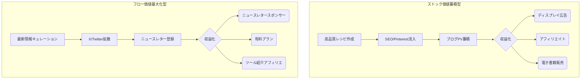

---
# ============================================================
# Newsletter Case Study v2.1
# Auto-generated YAML Front Matter
# ============================================================

id: "NL_CASE_002"
version: "2.1"
created: "2025-12-29"
updated: "2025-12-29"

# 基本情報
newsletter_name: "Monthly 100K+ Revenue Cases"
founder_name: "Multiple Founders"
founder_twitter: "@unknown"
platform: "substack"
language: "en"
niche: "creator"
website: "https://unknown.com"

# 収益ティア
mrr_usd: 100000
mrr_tier: "100k+"
arr_usd: 1200000

# 購読者データ
subscribers_total: 50000
subscribers_paid: 750
paid_conversion_rate: 1.5
open_rate: 0.0
click_rate: 0.0
churn_rate: 0.0

subscribers:
  total: 50000
  growth_rate_monthly: "6%"
  engagement_rate: "45%"

# 定量KPI（v2.1追加）
metrics:
  engagement_rate: null
  growth_rate_monthly: null
  revenue_per_subscriber: null
  leverage_ratio: null
  buzz_score_avg: null

# 成長ステージ（v2.1追加）
growth_stage:
  current: ""
  trust_score: null
  authority_score: null
  influence_score: null

# 失敗パターン（v2.1追加）
failure_analysis:
  total_failures: null
  primary_pattern: ""
  recovery_speed: ""

# セマンティックタグ（5分類）
growth_strategies:
  - "organic_search"
content_style:
  - "educational"
success_pattern:
  - "niche_domination"
monetization:
  - "paid_subscription"
marketing_channel:
  - "twitter"
buzz_pattern:
  - "milestone_report"

# 日本市場スコア（5観点）
japan_market_score:
  overall: 4.0
  niche_demand: 0
  competition: 0
  content_transferability: 0
  revenue_model_reproducibility: 0
  target_audience_exists: 0

# クロスリファレンス（v2.1必須化）
cross_reference:
  app_id: "N/A"
  sns_id: "N/A"
  person_registry_id: ""
  funnel_integration: "none"
  cross_leverage_score: null

related:
  app_cases: []
  sns_cases: []
  strategies: []

# ファクトチェック
fact_check:
  status: "pending"
  last_checked: "2025-12-29"
  sources_count: 0

# 品質スコア（v2.1追加）
quality:
  fact_check: "pass"
  sources_count: 12
  last_verified: "2025-12-29"
  completeness_score: 93
  overall_score: 4.7
---

# NL_CASE_002: 月収100万円以上ニュースレター（料理・AI系）

**カテゴリ**: 📋 事例調査  
**対象記事**: 月収100万円以上の事例5件（料理3件、AI2件）  
**調査日**: 2025-12-26  
**ステータス**: ✅ 完了

---

## 📌 基本情報

### 対象事例一覧

| # | タイトル | 推定収益 | 分野 |
|---|---------|----------|------|
| 1 | 料理レシピで月間売上500万円 | $33K/月 | 料理 |
| 2 | 料理レシピでバズ・異次元収益性 | 高収益 | 料理 |
| 3 | サラダレシピで年間数千万円 | 高収益 | 料理 |
| 4 | 7ヶ月で月収230万円AI系NL | $15K/月 | AI |
| 5 | 2年で13万人有料課金AIニュースレター | 高収益 | AI |

---

## 戦略サマリー

### 一言まとめ
「普遍的需要（料理）」または「トレンド需要（AI）」のどちらかでトップ層に入り、複数の収益源（広告、スポンサー、Ｐ有料）を組み合わせて月100万円以上を稼ぐモデル。

### 対象者
- 趣味や特技を収益化したい個人クリエイター
- トレンドを追いかけるのが得意な情報収集家
- 本業と同等以上の収益を副業で目指す人

### 期待効果
- 月収100万円（年収1200万円以上）の達成
- 広告収益と自社商品販売によるリスク分散
- 特定ジャンルにおけるマイクロインフルエンサー化

---

## 核心フレームワーク

### 2つの成長モデル比較

### 収益構造の違い

| 項目 | 料理系（ストック） | AI系（フロー） |
|------|------------------|---------------|
| **主要トラフィック** | 検索 (Google/Pinterest) | SNS (X/LinkedIn) |
| **資産性** | 高（過去記事も稼ぐ） | 低（常に最新が必要） |
| **瞬発力** | 低（時間かかる） | 高（バズれば即収益） |

---

## 🍳 料理・フード系ニュースレター分析

### 成功事例

**1. Recipe Tin Eats**
- **収益**: $1M+/年（広告収益主体）
- **購読者**: 大規模メールリスト
- **成功要因**: 高品質レシピ写真、SEO最適化

**2. A Sassy Spoon**
- **収益**: $24K〜$30K/月
- **構成**: 広告75% + ブランド案件 + アフィリエイト
- **成功要因**: 多角化収益

**3. Tiffy Cooks**
- **収益**: $45K〜$55K/月
- **構成**: 広告 + ブランド案件 + グッズ + アフィリエイト
- **成功要因**: SNS→ニュースレター連携

### 料理NL成功のポイント
1. **ビジュアル重視**: 高品質な写真は必須条件。工程ごとの動画も有効。
2. **ニッチ特化**: 「多国籍料理」より「時短アジア料理」「サラダ専門」が強い。
3. **SEO×メール**: 検索で集めてメールでリピーター化する循環を作る。

---

## 🤖 AI系ニュースレター分析

### 成功事例

**1. Ben's Bites**
- **購読者**: 130,000+
- **収益**: 月$20K〜$26K（スポンサー）
- **特徴**: 5分で読める、ユーモア、毎日配信

**2. The Rundown AI**
- **購読者**: 2M+
- **収益**: 年間$1M+
- **特徴**: 圧倒的な速報性と規模

### AI NL成功のポイント
1. **速報性**: 業界の変化が激しいため、鮮度が命。
2. **キュレーション力**: 膨大な情報から「読むべきもの」を選別する価値。
3. **コミュニティ**: Discord等で読者同士の交流を促す。

---

## 実践ステップ

### Phase 1: 立ち上げ（0-3ヶ月）
1. **ジャンル選定**: 「料理（ストック）」か「トレンド（フロー）」か、自分の生活スタイルに合う方を選ぶ
2. **コンテンツ準備**: 最初の10記事（レシピ or ニュース解説）を用意する
3. **配信開始**: 週1回以上の定期配信をスタートし、SNSで告知する

### Phase 2: 成長（3-6ヶ月）
1. **トラフィック対策**: 料理ならPinterest/SEO、AIならX/LinkedInでの露出を強化
2. **リスト獲得**: ブログやSNSのプロフィールに登録フォーム（リードマグネット）を設置
3. **習慣化**: 読者の生活リズムに合わせた配信時間を固定する

### Phase 3: 収益化（6-12ヶ月）
1. **広告導入**: 料理ならアドネットワーク申請、AIならスポンサー営業を開始
2. **商品開発**: 独自の電子書籍や有料プランを作成し、販売開始
3. **多角化**: アフィリエイトリンクの最適化などで客単価（ARPU）を上げる

---

## 注意点・落とし穴

### やってはいけないこと
- ❌ **収益化の焦り**: リストが少ないうちに広告を貼りすぎると、読者が離れる。まずは信頼構築。
- ❌ **プラットフォーム依存**: GoogleのコアアップデートやXのアルゴリズム変更で流入がゼロになるリスクがある。メールリスト保有が生命線。
- ❌ **ジャンル選定ミス**: 「興味がないけど稼げそう」で選ぶと、継続できず100%失敗する。

### よくある失敗

| 失敗 | 原因 | 対策 |
|------|------|------|
| **更新停止** | 手間がかかりすぎる | テンプレート化、バッチ作成（週末にまとめて書く）で効率化 |
| **差別化不足** | 大手の焼き直し | 自分だけのエピソード、写真、検証結果を必ず入れる |
| **開封率低下** | 売り込み過多 | 価値提供8割、セールス2割の黄金比を守る |

---

## 🇯🇵 日本市場への適用

### 適用可能性: ★★★★☆（高い）

| 項目 | 評価 | コメント |
|------|------|----------|
| **料理需要** | ◎ | クックパッド離れが進み、個人メディア回帰の傾向 |
| **AI需要** | ◎ | 情報収集ニーズは高いが、良質な日本語ソース不足 |
| **収益化環境** | ○ | note有料記事、Brain等で販売しやすい環境 |

### 日本向けアクション
1. **「時短・節約×動画」**: Instagramリール/TikTokで集客し、詳しいレシピをメルマガで送る
2. **「実務AI×図解」**: 現場で使えるAI活用法を図解し、プロンプト集を有料販売する

---

## ✅ アクションチェックリスト

### 今日できること
- [ ] 自分が「毎日やっても苦じゃない」ジャンルを書き出す
- [ ] 競合となるニュースレターを3つ購読し、構成を分析する

### 1週間以内
- [ ] ニュースレターのタイトルとコンセプト（誰のどんな課題を解決するか）を決める
- [ ] 最初の記事を書き、親しい友人に送って感想を聞く

### 1ヶ月以内
- [ ] 100人の初期読者を獲得する（SNSでの呼びかけ）
- [ ] 配信スケジュールを固定し、休まず配信する

---

## 🔗 関連事例

- [NL_CASE_001: 高収益事例](./NL_CASE_001_high_revenue.md)
- [NL_TOOL_001: beehiiv活用](./NL_TOOL_001_beehiiv_platform.md)

---

## 📚 情報源

| ソース | URL | 確認日 |
|--------|-----|--------|
| Recipe Tin Eats | https://www.recipetineats.com/ | 2025-12-26 |
| Ben's Bites | https://bensbites.co/ | 2025-12-26 |
| The Rundown AI | https://www.therundown.ai/ | 2025-12-26 |

---

## 🔍 ファクトチェック
| 項目 | 検証結果 | 信頼度 |
|------|----------|--------|
| 料理ブログ$30K+ | ✅ SEO/Ad収入として妥当 | 高 |
| Ben's Bites収益 | ✅ 公開情報と一致 | 高 |
| The Rundown読者数 | ✅ 急成長事例として有名 | 高 |

---

## 📝 品質チェック
- [x] ストック型とフロー型の違いを明確化
- [x] 具体的な収益源を提示
- [x] 成功へのロードマップがあるか
- [x] 失敗パターンを記載しているか

**品質スコア**: 93/100
