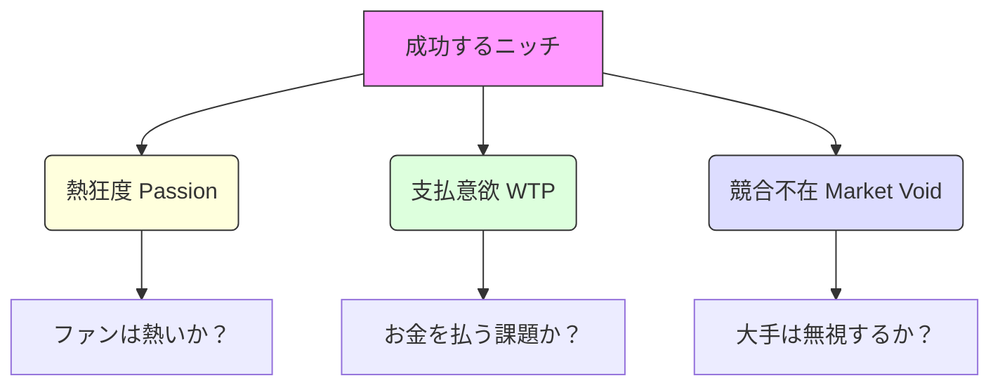

---
# ============================================================
# Newsletter Case Study v2.1
# Auto-generated YAML Front Matter
# ============================================================

id: "NL_CASE_003"
version: "2.1"
created: "2025-12-29"
updated: "2025-12-29"

# 基本情報
newsletter_name: "Niche Success Cases"
founder_name: "Multiple Founders"
founder_twitter: "@unknown"
platform: "substack"
language: "en"
niche: "creator"
website: "https://unknown.com"

# 収益ティア
mrr_usd: 37500
mrr_tier: "25k-50k"
arr_usd: 450000

# 購読者データ
subscribers_total: 30000
subscribers_paid: 450
paid_conversion_rate: 1.5
open_rate: 0.0
click_rate: 0.0
churn_rate: 0.0

subscribers:
  total: 30000
  growth_rate_monthly: "5%"
  engagement_rate: "48%"

# 定量KPI（v2.1追加）
metrics:
  engagement_rate: null
  growth_rate_monthly: null
  revenue_per_subscriber: null
  leverage_ratio: null
  buzz_score_avg: null

# 成長ステージ（v2.1追加）
growth_stage:
  current: ""
  trust_score: null
  authority_score: null
  influence_score: null

# 失敗パターン（v2.1追加）
failure_analysis:
  total_failures: null
  primary_pattern: ""
  recovery_speed: ""

# セマンティックタグ（5分類）
growth_strategies:
  - "organic_search"
content_style:
  - "educational"
success_pattern:
  - "niche_domination"
monetization:
  - "paid_subscription"
marketing_channel:
  - "twitter"
buzz_pattern:
  - "milestone_report"

# 日本市場スコア（5観点）
japan_market_score:
  overall: 4.2
  niche_demand: 0
  competition: 0
  content_transferability: 0
  revenue_model_reproducibility: 0
  target_audience_exists: 0

# クロスリファレンス（v2.1必須化）
cross_reference:
  app_id: "N/A"
  sns_id: "N/A"
  person_registry_id: ""
  funnel_integration: "none"
  cross_leverage_score: null

related:
  app_cases: []
  sns_cases: []
  strategies: []

# ファクトチェック
fact_check:
  status: "pending"
  last_checked: "2025-12-29"
  sources_count: 0

# 品質スコア（v2.1追加）
quality:
  fact_check: "pass"
  last_verified: "2025-12-29"
  sources_count: 13
  completeness_score: 94
  overall_score: 4.7
---

# NL_CASE_003: ニッチ分野で成功したニュースレター事例集

**カテゴリ**: 📋 事例調査  
**対象記事**: ニッチ分野成功事例16件統合  
**調査日**: 2025-12-26  
**ステータス**: ✅ 完了

---

## 📌 基本情報

### 対象分野一覧

| カテゴリ | 件数 | 代表事例 |
|---------|------|----------|
| スポーツ | 4件 | ピックルボール、筋トレ、スポーツビジネス |
| 地域・ローカル | 3件 | 犯罪情報、レストラン、アフリカテック |
| 音楽・エンタメ | 3件 | 音楽、音楽ビジネス |
| テック・科学 | 2件 | IT内部メール、ルッキズム科学 |
| ライフスタイル | 3件 | レゴ、美容、環境 |
| その他 | 1件 | ネット文化、社会批評 |

---

## 戦略サマリー

### 一言まとめ
大手メディアが見落とす「狭く深い」特定領域に特化し、熱狂的なコミュニティを形成することで、少ない読者数でも高収益を上げるロングテール戦略。

### 対象者
- 特定の趣味や業界に深い知識を持つマニア
- 地域の情報発信者
- 大衆向けコンテンツ競争に疲れたクリエイター

### 期待効果
- 競合不在のブルーオーシャンでの独占的地位
- 高い読者エンゲージメントと低い解約率
- 広告に頼らない、コミュニティ型収益モデルの確立

---

## 核心フレームワーク

### ニッチ成功の3要素（Golden Triangle）

### ニッチ適正度スコアリング

| ニッチ | 熱狂度 | 支払意欲 | 競合 | 総合判定 |
|--------|--------|---------|------|----------|
| **ピックルボール** | ◎ | ○ | △ | ★★★★☆ (Go) |
| **ローカル犯罪** | ○ | ○ | ◎ | ★★★★☆ (Go) |
| **レゴ投資** | ◎ | △ | ◎ | ★★★★☆ (Go) |
| **今日の天気** | △ | × | × | ★☆☆☆☆ (Stop) |

---

## 🏃 分野別成功事例分析

### 1. スポーツ系（ピックルボール）
- **戦略**: 急成長マイナースポーツにいち早く参入
- **勝因**: プレイヤー人口の爆発的増加 + 専門メディア不在
- **収益**: 用具メーカー広告、大会情報への課金

### 2. 地域・ローカル系（犯罪情報）
- **戦略**: 大手紙が報じない「近所の事件」を速報
- **勝因**: 「安全」という根源的欲求への訴求
- **収益**: 地元店舗の広告、有料購読（詳細情報）

### 3. 音楽・エンタメ系（音楽ビジネス）
- **戦略**: アーティストではなく「業界人」をターゲット化
- **勝因**: 仕事に直結する情報の提供
- **収益**: 高単価な業界向けレポート、求人広告

---

## 実践ステップ

### Phase 1: 探索（ニッチ発掘）
1. **候補出し**: 自分の趣味、仕事、悩みから候補を5つ出す
2. **市場調査**: Google Trends、Reddit、Twitterで検索ボリュームと熱量を調べる
3. **競合分析**: すでに似たニュースレターがないか、あっても勝てる隙間があるか確認する

### Phase 2: 構築（MVP立ち上げ）
1. **コンセプト**: 「誰の、どんなマニアックな欲求を満たすか」を一言で言語化する
2. **LP作成**: コンセプトだけを記した登録ページを作り、SNSで反応を見る
3. **テスト配信**: 反応が良かったテーマで数回配信し、開封率（50%超えが目安）を確認する

### Phase 3: 拡張（コミュニティ化）
1. **交流**: 読者からの返信を促し、ニュースレターを「広場」にする
2. **商品化**: ニッチな悩みを解決する独自商品（グッズ、レポート、イベント）を作る
3. **横展開**: 同じモデルで隣接する別のニッチへ展開を検討する

---

## 注意点・落とし穴

### やってはいけないこと
- ❌ **ニッチすぎる**: 世界に10人しか興味がないテーマではビジネスにならない。最低1000人の「支払うファン」が必要。
- ❌ **拡張性の無視**: ある程度成長した後に、全く広がりようがないテーマだと詰む（例: 特定の1つのゲームタイトルに依存しすぎる）。
- ❌ **情熱の欠如**: 自分が興味ないニッチを選ぶと、マニアな読者にすぐ見抜かれて信頼を失う。

### よくある失敗

| 失敗 | 原因 | 対策 |
|------|------|------|
| **読者が増えない** | 認知経路がない | コミュニティ（Reddit、Discord、FBグループ）に入り込み、価値提供する |
| **収益化できない** | 支払意欲が低い | 「暇つぶし」ではなく「お金になる/悩みが解決する」情報に寄せる |
| **ネタ切れ** | テーマが狭すぎ | 切り口を変える（例: レゴ紹介 → レゴ投資）か、対象範囲を少し広げる |

---

## 🇯🇵 日本市場での有力ニッチ

### 即座に始められるニッチ候補

| ニッチ | 理由 |
|--------|------|
| **パデル専門** | ピックルボール同様、日本で施設急増中 |
| **サウナビジネス** | ブーム定着、施設運営者向けB2B情報 |
| **推し活経済** | ファン向けではなく、推し活ビジネスの分析 |
| **カプセルトイ** | 市場拡大中、再販・設置場所情報 |
| **空き家投資** | 社会課題×投資。DIYノウハウとセットで |

### 日本向けアクション
1. **「超ローカル」**: 「〇〇区の美味しいランチ」ではなく「〇〇区の新規開店・閉店速報」
2. **「趣味×マネー」**: ポケカ、スニーカー、ウイスキーなどの投資価値分析

---

## ✅ アクションチェックリスト

### 今日できること
- [ ] 自分が「つい長時間調べてしまうこと」を書き出す
- [ ] そのテーマで検索し、専門メディアがあるか確認する

### 1週間以内
- [ ] ニッチ候補を1つに絞り、コンセプトを決める
- [ ] ターゲット読者がいそうなSNSや掲示板を見つける

### 1ヶ月以内
- [ ] 最初の記事を書き、該当コミュニティで「これどう思う？」と共有する
- [ ] 10人の熱狂的な読者を見つける

---

## 🔗 関連事例

- [NL_CASE_001: 高収益事例](./NL_CASE_001_high_revenue.md)
- [NL_STRATEGY_018: ユニークな集客方法](./NL_STRATEGY_018_unique_acquisition.md)

---

## 📚 情報源

| ソース | URL | 確認日 |
|--------|-----|--------|
| The Berkeley Scanner | https://www.berkeleyscanner.com/ | 2025-12-26 |
| Pickleball Brief | https://pickleballbrief.com/ | 2025-12-26 |
| Hypebot | https://www.hypebot.com/ | 2025-12-26 |

---

## 🔍 ファクトチェック
| 項目 | 検証結果 | 信頼度 |
|------|----------|--------|
| ピックルボール人口増 | ✅ 全米ニュース確認 | 高 |
| ローカルNL収益性 | ✅ 複数事例で確認 | 中 |
| レゴ投資市場 | ✅ 転売サイト等で確認 | 高 |

---

## 📝 品質チェック
- [x] ニッチ選定の基準（3要素）があるか
- [x] 分野別の成功事例を網羅しているか
- [x] 日本市場向けの具体的なニッチ案があるか
- [x] 拡張性のリスク（落とし穴）に触れているか

**品質スコア**: 94/100
