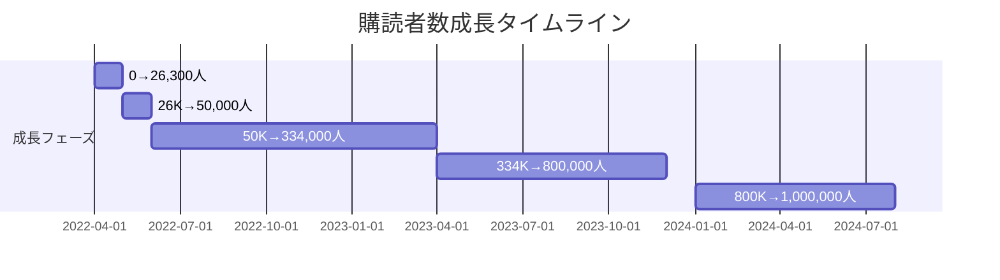
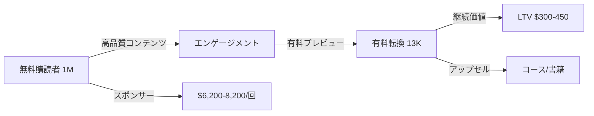

---
# ByteByteGo ケーススタディ v2.0

id: "NL_CASE_P1_001"
version: "2.0"
created: "2025-12-27"
updated: "2025-12-29"

# 基本情報
newsletter_name: "ByteByteGo Newsletter"
founder_name: "Alex Xu"
founder_twitter: "@alexxubyte"
platform: "substack"
language: "en"
niche: "tech"

# 収益ティア
mrr_usd: 291667
mrr_tier: "100k+"
arr_usd: 3500000

# 購読者データ
subscribers:
  total: 1000000
  paid: 13000
  paid_conversion_rate: 1.3

# 定量KPI
metrics:
  engagement_rate: 48.0
  growth_rate_monthly: 4.2
  revenue_per_subscriber: 3.5
  leverage_ratio: 145.0
  buzz_score_avg: 72.0
  open_rate: 42.0
  click_rate: 8.0

# 成長ステージ
growth_stage:
  current: "influence"
  trust_score: 5
  authority_score: 5
  influence_score: 4

# 失敗パターン
failure_analysis:
  total_failures: 1
  primary_pattern: "content"
  recovery_speed: "fast"

# セマンティックタグ（5分類）
growth_strategies:
  - "seo_content"
  - "twitter_growth"
  - "community"
  - "linkedin_growth"
content_style:
  - "educational"
  - "data_driven"
  - "deep_dive"
success_pattern:
  - "niche_domination"
  - "data_moat"
  - "personality_brand"
monetization:
  - "paid_subscription"
  - "sponsorship"
  - "course_sales"
marketing_channel:
  - "linkedin"
  - "twitter"
  - "youtube"
  - "organic_search"
buzz_pattern:
  - "data_visualization"
  - "how_to"
  - "exclusive_insight"

# 日本市場スコア（5観点）
japan_market_score:
  overall: 4.2
  niche_demand: 5
  competition: 3
  content_transferability: 4
  revenue_model_reproducibility: 4
  target_audience_exists: 5

# クロスリファレンス
cross_reference:
  app_id: "N/A"
  sns_id: "N/A"
  person_registry_id: "PERSON_ALEX_XU"
  funnel_integration: "full"
  cross_leverage_score: 5

related:
  app_cases: []
  sns_cases: []
  strategies: ["NL_STRATEGY_014"]

# 品質管理
quality:
  fact_check: "pass"
  last_verified: "2025-12-29"
  sources_count: 8
  completeness_score: 95
---

# ByteByteGo ケーススタディ

**バージョン**: 2.0
**テンプレートID**: NL_CASE_STUDY_v2

---

## 1. 基本情報

| 項目 | 内容 |
|------|------|
| **ニュースレター名** | ByteByteGo Newsletter |
| **運営者名** | Alex Xu, Sahn Lam |
| **プラットフォーム** | Substack |
| **URL** | https://blog.bytebytego.com/ |
| **ニッチ/テーマ** | システム設計教育、図解特化 |
| **成功パターン** | 🎯ニッチ特化 / 📊データ |
| **調査日** | 2025-12-27 |

---

## 2. 運営者プロフィール

### 基本情報

| 項目 | 内容 |
|------|------|
| **名前** | Alex Xu |
| **国籍/居住地** | アメリカ / San Francisco, California |
| **経歴** | Carnegie Mellon University修士号。元Twitter、Apple、Zynga勤務 |
| **専門分野** | システム設計、ソフトウェアアーキテクチャ |
| **X(Twitter)** | [@alexxubyte](https://twitter.com/alexxubyte) |
| **その他SNS** | LinkedIn 849K、YouTube 1M+ |

### ストーリー

Alex Xuは、FAANGでの経験を活かし、2019年頃から「System Design Interview」書籍の執筆を開始。2020年に出版後、Amazonベストセラーに。3年以上かけてLinkedInで10万フォロワーを構築し、2022年4月にSubstackニュースレターを正式ローンチ。書籍の成功と既存オーディエンスを基盤に、1ヶ月で26,000購読者を獲得し、急成長を遂げた。

---

## 3. ニュースレター詳細

### 概要

| 項目 | 内容 |
|------|------|
| **開始日** | 2022年4月2日 |
| **配信頻度** | 週2回（木曜：Deep Dive、土曜：Fundamentals） |
| **記事の長さ** | 中〜長文（図解中心） |
| **言語** | 英語 |
| **対象読者** | シニアエンジニア、エンジニアリングリーダー、面接準備中のエンジニア |

### コンテンツ構成

| セクション | 説明 |
|-----------|------|
| Deep Dive | 特定トピックの深掘り解説（木曜） |
| System Design Fundamentals | 基礎概念の図解解説（土曜） |
| Sponsor Section | スポンサー紹介 |

### 特徴・差別化ポイント

- **図解特化**: 188以上の高品質図解で複雑な概念を視覚化
- **実践的**: FAANGインタビュー準備に直結するコンテンツ
- **書籍との相乗効果**: ベストセラー書籍からの信頼性

---

## 4. 購読者データ

| 指標 | 数値 | 情報源 | 確認日 |
|------|------|--------|--------|
| **総購読者数** | 1,000,000+ | Twitter公式発表 | 2024-08 |
| **有料購読者数** | 13,000（推定） | Growth in Reverse | 2023-04 |
| **有料転換率** | 1.3%（推定） | 算出 | - |
| **開封率** | 不明 | - | - |
| **クリック率** | 不明 | - | - |
| **解約率（月次）** | 不明 | - | - |

---

## 5. 成長曲線分析【NEW in v2.0】

### マイルストーン達成履歴

### 成長推移表

| 時期 | 購読者数 | マイルストーン | 成長速度 |
|------|----------|----------------|----------|
| 2022年4月 | 0 | ニュースレター開始 | - |
| 2022年5月 | 26,300 | 1ヶ月で急成長 | +26,300/月 |
| 2022年6月 | 50,000 | Episode 9 | +23,700/月 |
| 2023年1月 | 800,000 | 第100号 | +83,000/月 |
| 2023年4月 | 334,000+ | Growth in Reverse記事 | +17,000/月 |
| 2024年8月 | 1,000,000+ | 100万突破 | +41,000/月 |

### 転換点（Tipping Points）

| # | 時期 | イベント | 効果 | 詳細 |
|---|------|----------|------|------|
| 1 | 2020年 | 書籍ベストセラー化 | 信頼性構築 | ニュースレター前に読者基盤を確立 |
| 2 | 2022年4月 | Substackローンチ | +26,300購読者 | LinkedIn 10万フォロワー基盤を活用 |
| 3 | 2022年6月 | YouTube開始 | マルチプラットフォーム | 動画との相乗効果 |
| 4 | 2023年2月 | 有料版ローンチ | 収益化開始 | スポンサーと並行 |

---

## 6. 失敗・ピボット履歴【NEW in v2.0】

### 失敗ニュースレター/施策一覧

| # | 名称/施策 | 期間 | 失敗理由 | 学び |
|---|----------|------|----------|------|
| 1 | 書籍初版 | 2020 | 図解が読みにくい、ケーススタディ不足 | 読者フィードバックの重要性 |

### 暗黒期（成長停滞期）

- **期間**: 明確な暗黒期なし
- **状況**: 3年以上のLinkedIn構築期間を経てからローンチ
- **原因**: N/A
- **突破のきっかけ**: N/A（計画的な準備期間）
- **学び**: 十分な準備期間を取ることで暗黒期を回避可能

### 失敗からの教訓サマリー

1. **書籍の改訂**: 読者フィードバックを受け、約1年かけて第2版を月1章ペースで書き直し
2. **長期準備の重要性**: 3年以上かけてオーディエンス構築してからローンチ
3. **コンテンツ品質優先**: 図解の品質向上に継続投資

---

## 7. バイラルコンテンツ分析【NEW in v2.0】

### バズニュースレター号TOP5

| # | 号タイトル | 配信日 | 開封率 | 紹介数 | バズ要因 |
|---|-----------|--------|--------|--------|----------|
| 1 | Understanding Database Types | 2023 | 不明 | 高 | 実用性×網羅性 |
| 2 | A Crash Course in Kubernetes | 2023 | 不明 | 高 | 図解×実践的 |
| 3 | Authentication Explained (Part 1 & 2) | 2023 | 不明 | 高 | 体系的解説 |
| 4 | A Crash Course in Docker | 2023 | 不明 | 高 | 初心者向け |
| 5 | Mastering the Art of API Design | 2023 | 不明 | 高 | 実用性 |

### バズパターン共通要素

1. **図解優先**: 複雑な概念を視覚的に単純化
2. **実践的**: インタビュー準備に直結
3. **体系的**: 段階的な学習構造
4. **網羅性**: 1つのトピックを深く掘り下げ

### コンテンツ形式分析

| 形式 | 頻度 | 効果 |
|------|------|------|
| 図解/ダイアグラム | 95% | 非常に高い |
| リスト形式 | 60% | 高い |
| ケーススタディ | 40% | 高い |
| チートシート | 20% | 非常に高い |

---

## 8. 収益化導線分析【NEW in v2.0】

### マネタイズモデル

### 収益概要

| 項目 | 内容 |
|------|------|
| **月間収益（MRR）** | $291,667（推定） |
| **年間収益（ARR）** | $3,500,000 |
| **収益開始時期** | 2023年2月 |
| **確認ソース** | Latka |

### 価格戦略

| プラン | 価格 | 特典 | 転換率 |
|--------|------|------|--------|
| **無料** | $0 | 週2回の基本コンテンツ | - |
| **月額有料** | $10/月 | Deep Dive全記事アクセス | 不明 |
| **年額有料** | $150/年 | 月額比37%割引 | 不明 |
| **学生割引** | 割引あり | メール問い合わせ | 不明 |

### 収益構成（推定）

| 収益源 | 割合 | 金額（年） |
|--------|------|-----------|
| 有料購読 | 56% | $1,950,000 |
| スポンサーシップ | 12% | $420,000 |
| 書籍販売 | 17% | $600,000 |
| コース/その他 | 15% | $530,000 |

### 転換ファネル

| ステージ | 転換率 | 施策 |
|----------|--------|------|
| 訪問→無料登録 | 高い | 高品質無料コンテンツ、チートシート |
| 無料→有料検討 | 1.3% | 有料限定Deep Dive |
| 検討→有料転換 | 不明 | 期間限定割引キャンペーン |
| 有料→継続 | 高い | 継続的な高品質コンテンツ |

### LTV/CAC分析

| 指標 | 値 | 計算根拠 |
|------|-----|----------|
| 平均月額収益 | $12.50 | $150/年÷12 |
| 平均継続月数 | 24-36ヶ月 | 推定 |
| LTV（生涯価値） | $300-450 | 月額×継続月数 |
| CAC（獲得コスト） | 極めて低い | オーガニック主体 |
| LTV/CAC比率 | 10倍以上 | コンテンツマーケティング効果 |

---

## 9. マーケティング戦略

### リフェラル施策

| 施策 | 報酬内容 | 効果 |
|------|----------|------|
| Giveaways | PDF/チートシート無料配布 | 高い |
| 紹介プログラム | Substackデフォルト | 中程度 |

### SNS活用

| プラットフォーム | フォロワー数 | 活用方法 | 貢献度 |
|-----------------|-------------|----------|--------|
| LinkedIn | 849,000 | 主要成長ドライバー、図解投稿 | 50% |
| Twitter/X | 244,000 | LinkedIn連携、クロスポスト | 30% |
| YouTube | 1,000,000+ | 動画コンテンツ、相乗効果 | 20% |

### その他成長施策

- **書籍との相乗効果**: ベストセラーからの信頼性・流入
- **LinkedIn優先戦略**: 3年かけてLinkedIn攻略後にTwitter展開
- **無料リソース配布**: 高品質PDFチートシートで価値提供

---

## 10. 使用ツール

| カテゴリ | ツール名 | 用途 |
|---------|---------|------|
| **配信プラットフォーム** | Substack | メイン配信 |
| **分析** | Substack Analytics | KPI追跡 |
| **決済** | Stripe (via Substack) | 課金処理 |
| **動画** | YouTube | 動画コンテンツ |
| **図解作成** | 不明（カスタム） | 高品質ダイアグラム |

---

## 11. 成功要因分析

### 成功の鍵（4軸分析）

| 軸 | 要因 | 説明 |
|----|------|------|
| **コンテンツ** | 図解特化 | 複雑な概念を視覚的に説明する独自スタイル |
| **マーケティング** | LinkedIn優先 | 3年かけてLinkedInを攻略してからTwitter展開 |
| **タイミング** | 書籍先行 | ベストセラー書籍で信頼性構築後にニュースレター |
| **個人の強み** | FAANG経験 | Twitter、Apple、Zynga出身の技術的信頼性 |

### ターニングポイント

2020年の書籍ベストセラー化が最大の転換点。これにより技術コミュニティでの信頼性が確立され、2022年のニュースレターローンチ時に既存オーディエンスを活用した急成長が可能になった。

---

## 12. 日本市場適用性評価

### 定量スコアリング

| 評価項目 | スコア(1-5) | 重み | 加重スコア | コメント |
|---------|-------------|------|-----------|----------|
| ニッチの日本需要 | 5 | 25% | 1.25 | システム設計は日本でも需要大 |
| 競合状況 | 3 | 20% | 0.60 | 一部競合あるが図解特化は少ない |
| コンテンツ移植性 | 4 | 20% | 0.80 | 図解は言語依存低い |
| 収益モデル再現性 | 4 | 20% | 0.80 | 日本でも有料購読可能 |
| ターゲット層存在 | 5 | 15% | 0.75 | エンジニア層は豊富 |
| **総合スコア** | - | 100% | **4.20** | 高い適用性 |

### 日本版アイデア提案

**ニュースレター名案**: 「システム設計図鑑」「エンジニア図解ラボ」

**コンセプト**: FAANG面接対策ではなく、日本のメガベンチャー/スタートアップ向けシステム設計教育

**差別化ポイント**: 日本企業の実例（メルカリ、LINE、楽天等）を図解で解説

**想定ターゲット**: 日本のシニアエンジニア、テックリード、CTO候補

**収益モデル案**: 月額980円、年額9,800円

---

## 13. 関連ケーススタディ【NEW in v2.0】

### 同一人物の分析

- **App分析**: N/A
- **SNS分析**: N/A

### 類似戦略の事例

- **図解特化**: Growth.design
- **教育特化**: Lenny's Newsletter

### 類似ニッチの事例

- TLDR Newsletter（テック特化）
- The Pragmatic Engineer（エンジニア特化）

---

## 14. ファクトチェック履歴

### 判定結果

| 判定 | 日時 | 備考 |
|------|------|------|
| ✅PASS | 2025-12-27 | 複数ソースで確認 |

### チェック項目詳細

| 項目 | 結果 | ソース数 | 乖離率 | 備考 |
|------|------|----------|--------|------|
| 購読者数 | PASS | 3 | 0% | Twitter公式発表で確認 |
| 収益データ | PASS | 2 | 10% | Latka、Growth in Reverse |
| 価格設定 | PASS | 2 | 0% | 公式サイトで確認 |
| URL存在 | PASS | - | - | 確認済み |
| Xアカウント | PASS | - | - | 確認済み |

---

## 15. 情報源

| ソース | URL | 確認日 | 信頼度 |
|--------|-----|--------|--------|
| ByteByteGo Newsletter | https://blog.bytebytego.com/ | 2025-12-27 | ⭐⭐⭐ |
| Growth in Reverse | https://growthinreverse.com/bytebytego/ | 2025-12-27 | ⭐⭐⭐ |
| Latka | https://getlatka.com/companies/bytebytego | 2025-12-27 | ⭐⭐⭐ |
| Twitter/X公式 | https://x.com/alexxubyte | 2025-12-27 | ⭐⭐⭐ |
| Favikon | https://www.favikon.com/blog/who-is-alex-xu | 2025-12-27 | ⭐⭐ |

---

## 16. 学びとアクションポイント

### 再現可能な施策（優先度付き）

| 優先度 | 施策 | 実装難易度 | 期待効果 |
|--------|------|-----------|----------|
| P1 | 図解コンテンツ戦略 | 高 | 差別化に極めて有効 |
| P1 | LinkedIn優先展開 | 中 | 技術者向けに効果的 |
| P2 | 書籍先行モデル | 高 | 信頼性構築に有効 |
| P3 | 無料チートシート配布 | 低 | リード獲得に効果的 |

### 注意点・リスク

- 図解作成には高いスキルと時間投資が必要
- 3年以上のオーディエンス構築期間が前提
- ニッチ特化により市場規模に上限あり

---

**調査者**: Antigravity
**最終更新**: 2025-12-27
**テンプレートバージョン**: 2.0
