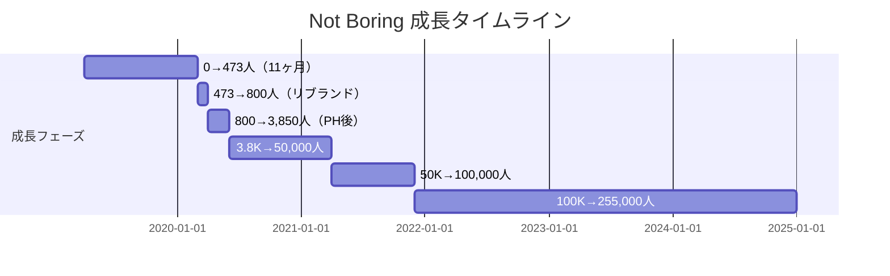
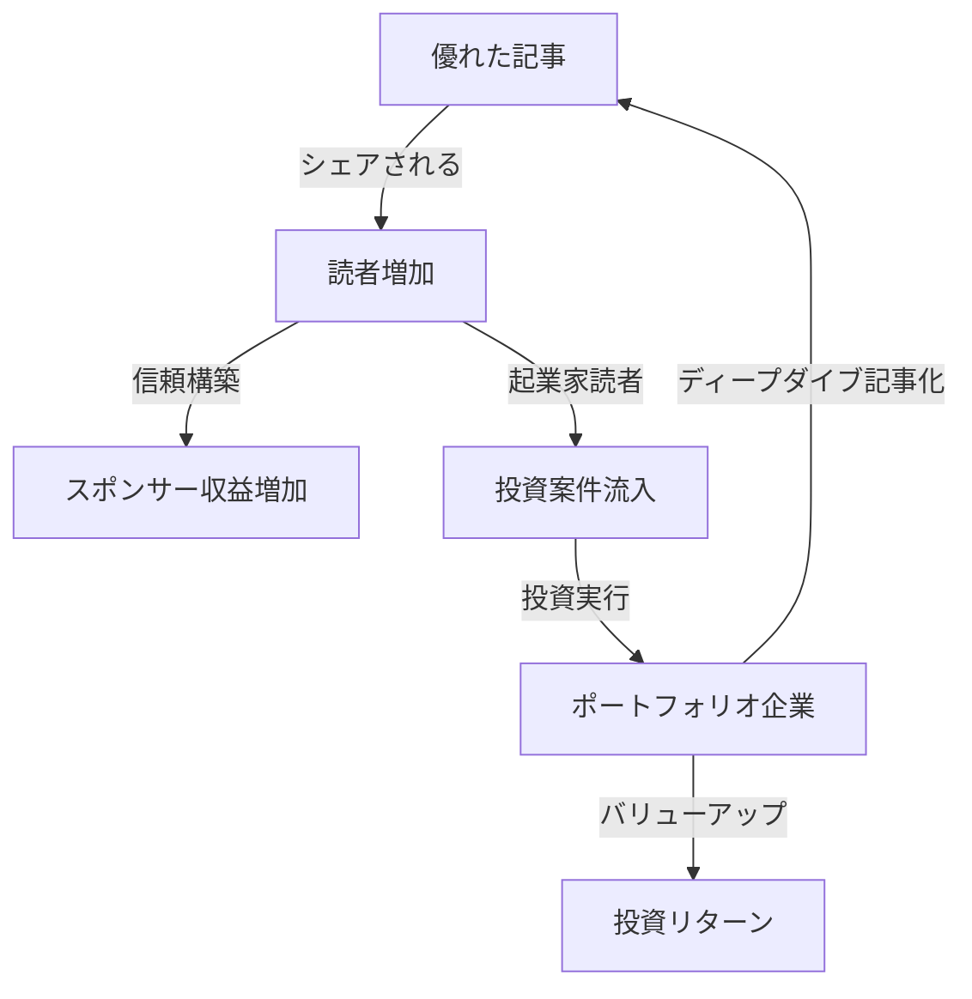

# Not Boring ケーススタディ

## 1. 基本情報

| 項目 | 内容 |
|------|------|
| ニュースレター名 | Not Boring |
| 運営者 | Packy McCormick |
| URL | https://www.notboring.co/ |
| プラットフォーム | Substack |
| 開始日 | 2019年4月（「Per My Last Email」として開始）、2020年4月2日に「Not Boring」にリブランド |
| 配信頻度 | 週2回（火曜日・金曜日） |
| ポジション | Substack ビジネスカテゴリ **第1位** |

### 運営者経歴

- Duke大学 経済学部卒業（2005-2009年）
- Bank of America Merrill Lynch 投資銀行アソシエイト
- Breather社 NYC General Manager（2013-2018年）、VP of Experience（2018-2019年）
- David Perellの「Write of Passage」コース受講が転機
- **2019年10月**: 150人のチームを管理するVPを辞職し、400人の購読者しかいないニュースレターにフルコミット

---

## 2. 数値サマリー

| 指標 | 値 |
|------|-----|
| 総購読者数 | **255,000+** |
| 有料購読者数 | 0（ペイウォールなし） |
| 推定ARR | **$3,000,000〜$3,500,000** |
| 月間収益 | 平均$250,000 |
| Twitterフォロワー | 212,000+ |
| Substackランキング | ビジネスカテゴリ第1位 |

### 重要な特徴

**Not Boringは有料購読モデルを採用していない**。Substackのペイウォール機能を意図的に使用せず、全コンテンツを無料で提供。

---

## 3. 収益構造

### マルチレイヤー収益構造

| 収益源 | 価格/詳細 | 推定年間収益 |
|--------|----------|--------------|
| スポンサード・ディープダイブ | $10,000〜$20,000/記事 | $2,000,000+ |
| 通常スポンサー（月曜日） | $5,000/回 | $500,000+ |
| Not Boring Capital（VC） | Fund I-III 累計$70M | キャリー（長期） |
| シンジケート投資 | AngelList経由 | 手数料 |

### スポンサード・ディープダイブの革新性

| 従来の広告 | Not Boringのスポンサード・ディープダイブ |
|------------|----------------------------------------|
| バナー広告 | 企業分析記事として提供 |
| 読者にとって邪魔 | 読者に価値を提供 |
| 低CPM | $20Kで25万人以上にリーチ |
| Substack手数料10% | **手数料0%**（ペイウォール不使用のため） |

### Not Boring Capital

| ファンド | 規模 | 時期 |
|----------|------|------|
| Fund I | $10M | 2021年7月 |
| Fund II | $30M | 2022年 |
| Fund III | $30M | 2023年 |
| **累計** | **$70M+** | - |

**著名LP**: Thrive Capital（アンカーLP）、a16z（Marc Andreessen, Chris Dixon）、Bain Capital Ventures、First Round Capital等

---

## 4. 成長曲線分析

### マイルストーン達成履歴

### タイムライン詳細

| 時期 | イベント | 購読者数 |
|------|----------|----------|
| 2019年4月 | 「Per My Last Email」開始（1人から20人へ） | ~20 |
| 2020年3月 | 11ヶ月で473購読者（**超スロー成長期**） | 473 |
| 2020年4月2日 | 「Not Boring」にリブランド | ~800 |
| 2020年6月9日 | **Product Hunt ローンチ（#2 Product of the Day）** | 1,885→3,850（2日で2倍） |
| 2021年4月 | 1年で10倍以上 | 50,000 |
| 2021年7月 | Not Boring Capital Fund I ローンチ | - |
| 2021年12月 | 8ヶ月で50K→100K | 100,000 |
| 2025年現在 | - | 255,000+ |

### 転換点（Tipping Points）

| # | 時期 | イベント | 効果 |
|---|------|----------|------|
| 1 | 受講時 | David Perellの「Write of Passage」受講 | ライティングスキルと戦略的思考を獲得 |
| 2 | 2020年4月 | リブランド（「Not Boring」へ） | ブランド力強化 |
| 3 | 2020年6月 | Product Hunt ローンチ | **2日で購読者倍増** |
| 4 | 2021年7月 | Not Boring Capital設立 | メディアからVCへ拡張 |

---

## 5. ストーリーテリング手法

### コアコンセプト

> 「Ben Thompson（Stratechery）とBill Simmons（スポーツライター）の子供のような存在」

### 具体的な手法

| 手法 | 詳細 |
|------|------|
| **トーンによる差別化** | 多くのライターが「特定のトピック」で差別化するのに対し、Packyは「声のトーン」で差別化 |
| **ユーモア・ポップカルチャー** | ジョーク、皮肉、ミーム、ポップカルチャーの参照を多用 |
| **TL;DR先出し** | 記事冒頭で結論を提示、読者が深く読むかどうかを選択可能 |
| **意外性のあるフック** | 一見無関係な導入から本題へ導く（例：Shen Yun→スタートアップ経済モデル） |
| **ビジュアル要素** | GIF、グラフィック、図解を長文記事に埋め込み |

### Alpha Content vs Beta Content

| Beta Content | Alpha Content（Packyの選択） |
|--------------|---------------------------|
| 24時間で消える安価なエンターテインメント | 長期的な価値を持つ質の高いコンテンツ |
| 量重視 | 質重視 |

---

## 6. バイラルコンテンツ分析

### 代表的なバイラル記事

| 記事名 | 特徴 |
|--------|------|
| **The Electric Slide（2025年）** | 2025年で最も読まれた記事。1ヶ月の執筆期間、極めて長文だが爆発的にシェア |
| **Oh Snap!** | Snapの長期AR戦略を分析。掲載後にSnap株が92%上昇 |
| **If I Ruled the Tweets** | Twitter戦略論。TwitterがLinkedInのように価値を捉えるべきという提言 |

### バイラル成功の要因

- リブランド後の最初の54本のニュースレターで**80万回以上**閲覧
- 記事の質に全エネルギーを投入し、読者の自然なシェアに依存
- Twitterとの相乗効果（400フォロワー → 212,000フォロワー）

---

## 7. 収益化導線分析

### メディアとVCのフライホイール

### ARPU分析

Packyの試算によると、約**$15 ARPU**（保守的な見積もり）

| 計算 | 数値 |
|------|------|
| 購読者数 | 255,000 |
| 年間収益 | $3,250,000 |
| ARPU | **$12.7** |

---

## 8. 成功要因分析

### 主要成功要因

| 要因 | 詳細 |
|------|------|
| **1. 差別化された声（Voice）** | テック/ビジネス分析を「楽しく」読ませる独自のトーン |
| **2. 戦略的なリブランド** | 「Per My Last Email」→「Not Boring」で約束を明確化 |
| **3. Product Hunt活用** | 入念な準備とリサーチで2日で購読者倍増 |
| **4. ペイウォールを使わない決断** | 到達範囲を最大化、手数料ゼロ |
| **5. Twitter/Xとの相乗効果** | 400→212,000フォロワー、相互成長 |
| **6. メディア→VCへの進化** | 単なるニュースレターからプラットフォームへ |

### フライホイールの威力

全てが相互に強化し合う構造：
- 読者 → 信頼 → スポンサー → 収益
- 読者（起業家） → 投資案件 → 投資リターン
- 投資先 → 記事ネタ → 読者増加

---

## 9. 日本市場への示唆

### 日本版立ち上げの可能性

| 観点 | 評価 | 理由 |
|------|------|------|
| ニッチの需要 | ★★★★☆ | ビジネス/テック分析の需要はある |
| 競合状況 | ★★★★☆ | 日本語で同等の質のNLは少ない |
| コンテンツ移転性 | ★★★☆☆ | 米国企業分析が多く、日本企業版が必要 |
| 収益モデル再現性 | ★★★★☆ | スポンサード・ディープダイブは可能 |
| ターゲット存在 | ★★★★☆ | 起業家、投資家、ビジネスパーソン |

### 日本版実装時の推奨事項

1. **日本企業のディープダイブ**: メルカリ、SmartNews、Sansan等の分析
2. **ユーモアのローカライズ**: 日本のポップカルチャー参照
3. **スポンサード・ディープダイブ**: 日本のスタートアップとの連携
4. **VC展開**: 日本版Not Boring Capitalの可能性

---

## 10. 主要な教訓

1. **声で差別化する**: トピックではなくトーンで独自性を出す
2. **Product Huntを活用**: 入念な準備で購読者を一気に獲得
3. **ペイウォールは必須ではない**: リーチを最大化し、スポンサーで収益化
4. **Twitter/Xとの相乗効果**: ニュースレターとソーシャルを相互に成長させる
5. **メディアは入り口**: VC、投資、その他の事業への展開も可能
6. **質に全力投球**: Alpha Contentを作り続ける

---

## Sources

- [Not Boring by Packy McCormick | Substack](https://www.notboring.co/)
- [Growth in Reverse - How Packy McCormick Makes $3.5 Million](https://growthinreverse.com/packy/)
- [Almanac - Why Packy McCormick Went All-In](https://almanac.io/blog/packy-mccormick-not-boring)
- [Acquired - Not Boring with Packy McCormick](https://www.acquired.fm/episodes/not-boring-with-packy-mccormick)
- [Aakash Gupta - Packy McCormick Story](https://www.aakashg.com/packy-mccormicks-story/)
- [Starter Story - Not Boring Breakdown](https://www.starterstory.com/stories/not-boring-breakdown)
- [Not Boring Capital](https://www.notboring.co/p/introducing-not-boring-capital)
