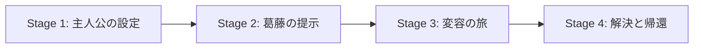

# ストーリーテリング4段階設計図

**バージョン**: 1.0  
**戦略ID**: NL_STRATEGY_002

---

## 基本情報

| 項目 | 内容 |
|------|------|
| **戦略名** | ストーリーテリング4段階設計図 |
| **カテゴリ** | ブランディング / コンテンツ |
| **情報源** | jabba記事 第157号 |
| **jabba記事タイトル** | なぜマスターカードは自社の強みではなくストーリーを語るのか |
| **調査日** | 2025-12-26 |

---

## 戦略サマリー

### 一言まとめ

Mastercard社が348倍のROIを達成した「ストーリーテリング4段階設計図」。自社の強みを直接語るのではなく、顧客の物語を通じて価値を伝える手法。

### 対象者

- ブランドストーリーを構築したいニュースレター運営者
- 読者との感情的なつながりを深めたい人
- 広告やセールス色を薄めつつ価値を伝えたい人

### 期待効果

- ROI 348倍（Mastercard事例）
- 読者との感情的共感の構築
- 開封率・クリック率の向上

---

## 核心フレームワーク

### 主要構成要素

| # | 要素 | 説明 |
|---|------|------|
| 1 | 主人公 | 読者が感情移入できる人物（顧客自身） |
| 2 | 葛藤 | 読者が共感できる課題・問題 |
| 3 | 変容 | 解決への道筋と成長 |
| 4 | 解決 | 価値の実現と新たな日常 |

---

## 実践ステップ

## 重要数値・ベンチマーク

| 指標 | 初心者 | 中級者 | 上級者 |
|------|--------|--------|--------|
| {指標1} | {数値} | {数値} | {数値} |
| {指標2} | {数値} | {数値} | {数値} |
| {指標3} | {数値} | {数値} | {数値} |

*上記は一般的なベンチマーク。戦略により変動あり。*

---

## 注意点・落とし穴

### やってはいけないこと

- ❌ {失敗パターン1}
- ❌ {失敗パターン2}
- ❌ {失敗パターン3}

### よくある失敗

| 失敗 | 原因 | 対策 |
|------|------|------|
| {失敗1} | {原因} | {対策} |
| {失敗2} | {原因} | {対策} |
| {失敗3} | {原因} | {対策} |

---
### Phase 1: 準備

1. 読者のペルソナを詳細に定義
2. 読者が抱える共通の「葛藤」をリスト化
3. 自社／自分が提供できる「変容」を明確化

### Phase 2: 実行

1. 読者を主人公にしたストーリーを構築
2. 自社サービスは「導き手」として登場
3. 感情に訴えかける表現を使用

### Phase 3: 最適化

1. 読者の反応（開封率・返信）を分析
2. 共感を得られたストーリーのパターンを特定

---

## 成功事例

### 事例1: Mastercard

| 項目 | 内容 |
|------|------|
| **企業名** | Mastercard |
| **実施内容** | 「Priceless」キャンペーン - 商品機能ではなく体験価値を物語化 |
| **結果** | ROI 348倍を達成 |
| **成功要因** | 顧客の感情的価値に焦点を当てた |

---

## 日本市場への適用

### 適用可能性

| 評価項目 | 評価 | コメント |
|---------|------|----------|
| 戦略の汎用性 | ◎ | ストーリーテリングは言語・文化を超えて有効 |
| 日本での実践例 | ○ | 老舗企業のブランディングで実績あり |
| 必要リソース | ○ | ライティングスキルが必要 |
| **総合評価** | ◎ | 日本のニュースレターでも即実践可能 |

### 日本向けアレンジ案

- 「職人の想い」「創業ストーリー」など日本人が共感しやすい文脈を活用
- 控えめな自己主張の文化に合わせ、顧客の声を主役に

---

## アクションチェックリスト

### すぐにできること（今日中）

- [ ] 読者ペルソナの「葛藤」を3つリストアップ
- [ ] 次回ニュースレターのストーリー骨格を作成

### 1週間以内にやること

- [ ] ストーリーテリング形式で1記事執筆
- [ ] 読者の反応を計測

---

## 情報源

| ソース | 確認日 |
|--------|--------|
| jabbaニュースレター 第157号 | 2025-12-26 |

---

**調査者**: Antigravity  
**最終更新**: 2025-12-26
