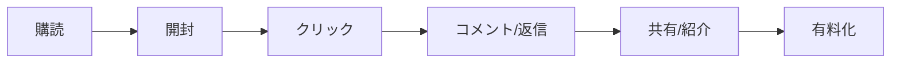

# 購読者維持の基本戦略

**バージョン**: 1.0  
**戦略ID**: NL_STRATEGY_005

---

## 基本情報

| 項目 | 内容 |
|------|------|
| **戦略名** | 購読者維持の基本戦略 |
| **カテゴリ** | 成長 / コンテンツ |
| **情報源** | jabba記事 |
| **jabba記事タイトル** | ニュースレターで購読者を取り逃がさないための超基本のキホン |
| **調査日** | 2025-12-26 |

---

## 戦略サマリー

### 一言まとめ

購読者を「取り逃がさない」ための4つの基本原則：明確なターゲット設定、継続的な配信、価値提供、データ分析。

### 対象者

- ニュースレターを始めたが解約率が高い人
- 開封率やクリック率を改善したい人
- 長期的な読者との関係を構築したい運営者

### 期待効果

- 解約率の低下
- 開封率の向上
- LTV（顧客生涯価値）の最大化

---

## 核心フレームワーク

### 購読者維持の4原則

| # | 原則 | 説明 |
|---|------|------|
| 1 | **明確なターゲット設定** | 誰に向けて配信するかを明確に |
| 2 | **継続的な配信** | 決めた頻度で信頼関係を構築 |
| 3 | **価値ある情報提供** | 読者の時間を大切に、必ず価値を提供 |
| 4 | **データ分析** | 開封率・クリック率を定期チェック |

### エンゲージメント設計

---

## 実践ステップ

### Phase 1: ターゲット明確化

1. 理想の読者ペルソナを1人定義
2. その人が抱える問題を3つリストアップ
3. 自分が提供できる解決策を明確化

### Phase 2: 配信設計

1. 配信頻度を決定（週1推奨）
2. 曜日・時間を固定
3. 読者の期待値を設定（何を得られるか明示）

### Phase 3: 継続改善

1. 週次で開封率を確認
2. 月次でクリック率を分析
3. 四半期で戦略を見直し

---

## 重要数値・ベンチマーク

| 指標 | 業界平均 | 優良水準 | トップクラス |
|------|----------|----------|-------------|
| 開封率 | 20-25% | 30-40% | 50%以上 |
| クリック率 | 2-3% | 5-7% | 10%以上 |
| 解約率（月間） | 0.5-1% | 0.3%以下 | 0.1%以下 |

---

## 注意点・落とし穴

### やってはいけないこと

- ❌ 不規則な配信（読者の信頼を失う）
- ❌ セールスばかりの内容
- ❌ 読者のフィードバックを無視

### よくある失敗

| 失敗 | 原因 | 対策 |
|------|------|------|
| 開封率低下 | 件名がつまらない | A/Bテストで最適化 |
| 解約増加 | 価値を感じない | 読者アンケート実施 |
| 成長停滞 | 紹介がない | リファラルプログラム導入 |

---

## 日本市場への適用

### 適用可能性

| 評価項目 | 評価 | コメント |
|---------|------|----------|
| 戦略の汎用性 | ◎ | 基本原則は普遍的 |
| 日本での実践例 | ◎ | 多くの成功事例あり |
| 必要リソース | ◎ | 特別なツール不要 |
| **総合評価** | ◎ | 全ニュースレター運営者必須 |

---

## アクションチェックリスト

### すぐにできること（今日中）

- [ ] 次回配信の件名を3パターン作成
- [ ] 過去10回の開封率を確認

### 1週間以内にやること

- [ ] 読者ペルソナを文書化
- [ ] 配信スケジュールをカレンダーに設定

---

## 情報源

| ソース | 確認日 |
|--------|--------|
| jabbaニュースレター「ニュースレターで購読者を取り逃がさないための超基本のキホン」 | 2025-12-26 |

---

**調査者**: Antigravity  
**最終更新**: 2025-12-26
