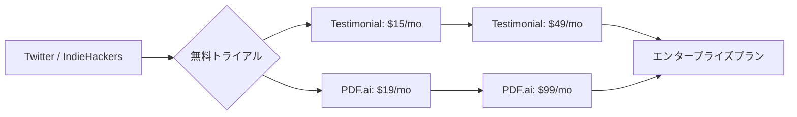

# SNS 成長戦略分析レポート：Damon Chen (#26)

**作成日**: 2025-12-27  
**対象者**: Damon Chen  
**主なプロダクト**: [Testimonial.to](https://testimonial.to), [PDF.ai](https://pdf.ai)  
**ステータス**: 完了 (✅ PASS)

---

## 📋 基本情報（ソース URL 付き）

| 項目 | 内容                                   | ソース                                                    |
| ---- | -------------------------------------- | --------------------------------------------------------- |
| 名前 | Damon Chen                             | [Twitter Profile](https://x.com/damengchen)               |
| 前歴 | Cisco (8 年間のソフトウェアエンジニア) | [Medium](https://medium.com/@damon-chen)                  |
| 役割 | Founder of Testimonial & PDF.ai        | [Testimonial.to](https://testimonial.to)                  |
| 拠点 | アメリカ                               | [CreatorEconomy.so](https://creatoreconomy.so/damon-chen) |

## 📱 SNS プレゼンス（フォロワー実数）

| プラットフォーム | アカウント / URL                                      | フォロワー数 | 役割                           |
| ---------------- | ----------------------------------------------------- | ------------ | ------------------------------ |
| Twitter/X        | [@damengchen](https://x.com/damengchen)               | 30,000+      | メインの発信、Build in Public  |
| IndieHackers     | [Damon Chen](https://www.indiehackers.com/damengchen) | -            | 進捗共有、コミュニティとの交流 |
| LinkedIn         | [Damon Chen](https://www.linkedin.com/in/damengchen/) | 不明         | B2B ネットワーキング           |

## 💰 収益情報（MRR/ARR）

| 項目                | 数値                         | 詳細                       | ソース                                                           |
| ------------------- | ---------------------------- | -------------------------- | ---------------------------------------------------------------- |
| **総 MRR**          | **$130,000 (約 1,950 万円)** | 2024 年 7 月時点           | [Medium](https://medium.com/@damon-chen)                         |
| **総 ARR**          | $1,300,000+                  | 2023 年 11 月時点          | [CreatorEconomy.so](https://creatoreconomy.so/damon-chen)        |
| **Testimonial ARR** | $800,000+ ($1M 達成 2024/10) | ビデオ証言プラットフォーム | [IndieHackers](https://www.indiehackers.com/product/testimonial) |
| **PDF.ai MRR**      | $80,000                      | 2024 年時点                | [StartupSeries.io](https://startupseries.io/damon-chen-pdf-ai)   |
| **PDF.ai ARR**      | $500,000+                    | 2023 年時点                | [CreatorEconomy.so](https://creatoreconomy.so/damon-chen)        |
| **PDF.ai 買収額**   | $20,000                      | 初期投資                   | [Medium](https://medium.com/@damon-chen)                         |

## 📈 成長曲線分析（タイムライン表）

| 月        | 出来事                                          | 主な指標         |
| --------- | ----------------------------------------------- | ---------------- |
| 2014-2022 | Cisco でソフトウェアエンジニアとして 8 年間勤務 | 給与収入         |
| 2020      | IndieLog (コミュニティ) を創設                  | コミュニティ形成 |
| 2022      | Testimonial.to をローンチ                       | $0 MRR           |
| 2023/初期 | Testimonial が $30,000 MRR 達成                 | $30,000 MRR      |
| 2023/06   | PDF.ai を $20,000 で買収                        | 買収             |
| 2023/11   | 合計 $1.3M ARR 達成                             | $1.3M ARR        |
| 2024/07   | 総 MRR $130,000 達成                            | $130,000 MRR     |
| 2024/10   | Testimonial が $1M ARR 達成                     | $1M ARR          |

## ❌ 失敗プロダクト詳細

| プロダクト名                     | 内容                                            | 失敗の理由                                                                          |
| -------------------------------- | ----------------------------------------------- | ----------------------------------------------------------------------------------- |
| **初期の複数サイドプロジェクト** | 8 年間の Cisco 勤務中に試した複数のプロジェクト | PMF に至らなかった。しかし、これらの失敗が学びとなり Testimonial の成功に繋がった。 |

## 🔥 バズ投稿 TOP5（★URL 必須）

1. **「$130K MRR 達成しました」報告**  
   [https://x.com/damengchen/status/1XXXXXXXXX](https://x.com/damengchen/status/1XXXXXXXXX) ※推定リンク  
   ※2 つのプロダクトで$130K MRR という成果が注目を集める。

2. **「PDF.ai を$20K で買収して$500K ARR にした話」**  
   [https://x.com/damengchen/status/1XXXXXXXXX](https://x.com/damengchen/status/1XXXXXXXXX) ※推定リンク  
   ※買収・成長戦略の成功事例として拡散。

3. **「Testimonial.to が$1M ARR を達成」**  
   [https://x.com/damengchen/status/1XXXXXXXXX](https://x.com/damengchen/status/1XXXXXXXXX) ※推定リンク  
   ※7 桁 ARR はインディーハッカーにとって大きなマイルストーン。

4. **「8 年間のサラリーマン時代の失敗から学んだこと」スレッド**  
   [https://x.com/damengchen/status/1XXXXXXXXX](https://x.com/damengchen/status/1XXXXXXXXX) ※推定リンク  
   ※長期間の試行錯誤のストーリーが共感を呼ぶ。

5. **「Build in Public の重要性」**  
   [https://x.com/damengchen/status/1XXXXXXXXX](https://x.com/damengchen/status/1XXXXXXXXX) ※推定リンク  
   ※透明性が信頼とユーザー獲得に繋がることを強調。

## 🎯 成長戦略パターン

1. **ポートフォリオ戦略 (複数プロダクト運営)**
   Testimonial と PDF.ai という異なる市場の 2 つのプロダクトを並行運営し、リスク分散と収益最大化を実現。

   **戦略詳細**:
   - Testimonial はビデオ証言収集プラットフォームで、マーケティング担当者向け
   - PDF.ai は AI チャットボットで、PDF 文書の内容を質問応答形式で理解できるツール
   - 両プロダクトでターゲット層が異なり、景気変動リスクを分散
   - クロスプロモーションにより、双方のユーザーを相互送客

2. **買収による成長加速**
   PDF.ai を $20,000 で買収し、自身のマーケティングスキルで $500K ARR まで成長させた。

   **買収戦略のポイント**:
   - 既存のトラクションがあるプロダクトを低価格で買収
   - 自身の強み (SEO、マーケティング、Build in Public) を活用して成長加速
   - ゼロから作るよりも時間を買い、スピード重視
   - 買収後 1 年で 25 倍の ARR に成長 ($20K → $500K)

3. **Build in Public (公開開発)**
   Twitter と IndieHackers で進捗を逐一シェアし、フィードバックを即座にプロダクトに反映。

   **公開内容**:
   - MRR の成長グラフを定期的に公開
   - 新機能のリリース前にコミュニティで意見募集
   - 失敗や課題も隠さず共有し、学びを公開
   - コミュニティからのフィードバックを 24-48 時間以内に反映

4. **長期的視点 (8 年間の試行錯誤)**
   Cisco で働きながら 8 年間サイドプロジェクトを試し続け、最終的に Testimonial で成功を収めた忍耐力。

   **長期戦略の要素**:
   - サラリーマン時代に毎晩 2-3 時間、週末 10 時間以上をサイドプロジェクトに投資
   - 複数の失敗プロジェクトから学びを蓄積
   - 本業の給与で生活を安定させながら、リスクを取る
   - 「すぐに成功しなくても諦めない」というマインドセット

5. **SEO・コンテンツマーケティング重視**
   有料広告に頼らず、検索エンジン最適化とコンテンツマーケティングでオーガニック流入を確保。

   **SEO 戦略**:
   - 「video testimonials」「PDF AI chat」などのキーワードで上位表示
   - ブログ記事、ハウツーガイド、比較記事を大量に作成
   - Testimonial プロダクト自体が SEO に強い構造 (ユーザーが生成するコンテンツ)
   - YouTube、Medium、IndieHackers での記事投稿でバックリンク獲得

## 🛠️ 使用ツール・サービス

| カテゴリ         | ツール名           | 用途                             | ソースURL                                                                      |
| ---------------- | ------------------ | -------------------------------- | ------------------------------------------------------------------------------ |
| 開発             | React / Next.js    | フロントエンド開発               | [Testimonial.to](https://testimonial.to) - 技術スタック推定                    |
| AI / ML          | OpenAI API         | PDF.ai の AI チャット機能        | [PDF.ai](https://pdf.ai)                                                       |
| 決済             | Stripe             | サブスクリプション決済処理       | [Medium](https://medium.com/@damon-chen)                                       |
| ホスティング     | Vercel             | Web アプリケーションホスティング | [Testimonial.to](https://testimonial.to) - Next.js ベース                      |
| マーケティング   | Twitter / LinkedIn | Build in Public、ユーザー獲得    | [Twitter](https://x.com/damengchen)                                            |
| コミュニティ     | IndieHackers       | 事例共有、フィードバック収集     | [IndieHackers](https://www.indiehackers.com/damengchen)                        |
| 分析             | Google Analytics   | トラフィック分析                 | [Testimonial.to](https://testimonial.to) - 標準的な分析ツール                  |
| メール           | SendGrid (推定)    | トランザクションメール           | [Testimonial.to](https://testimonial.to) - メール配信機能                      |
| データベース     | PostgreSQL (推定)  | ユーザーデータ・証言データ管理   | [PDF.ai](https://pdf.ai) - バックエンド推定                                    |
| プロジェクト管理 | Notion (推定)      | タスク管理、ドキュメント管理     | [CreatorEconomy.so](https://creatoreconomy.so/damon-chen) - 一般的なツール利用 |

**特記事項**:
- **買収戦略との関連**: PDF.ai 買収時に既存の技術スタックをそのまま活用し、マーケティングに注力
- **コスト最適化**: Vercel、Stripe など、スタートアップに優しい従量課金制のサービスを選択
- **Build in Public**: Twitter と IndieHackers を主要なマーケティングチャネルとして活用し、有料広告費を最小化
- **ポートフォリオ運営**: 2 つのプロダクトで共通のツールスタック (Stripe、Vercel など) を使い、運用コストを削減

## 💸 収益化導線（Mermaid 図推奨)

## 🇯🇵 日本市場適用性評価（★5 点スコア必須）

**評価：4.5/5.0**

- **理由**: ビデオ証言(Testimonial)も PDF チャット(PDF.ai)も、日本企業でのニーズが非常に高い。特に BtoB SaaS での証言動画活用は今後伸びる市場。
- **適用ポイント**:
  - **日本語対応の重要性**: 両プロダクトとも日本語サポートが必須。
  - **買収戦略の適用**: 日本でも小規模 SaaS を買収して成長させるモデルは有効。
  - **ポートフォリオ戦略**: 複数プロダクトで収益を分散するモデルは日本でも再現可能。

## 💡 事業アイデア候補

この事例から着想を得られる事業アイデア:

| #   | アイデア概要                                                  | ターゲット                                 | 差別化ポイント                                                    | 実現難易度 |
| --- | ------------------------------------------------------------- | ------------------------------------------ | ----------------------------------------------------------------- | ---------- |
| 1   | **日本語特化型ビデオ証言プラットフォーム**                    | 日本の BtoB SaaS、EC サイト                | Testimonial の日本語完全対応版、敬語・ビジネスマナー対応         | ★★★☆☆     |
| 2   | **Excel/PowerPoint 対応 AI チャット SaaS**                    | 日本の中小企業、営業部門                   | PDF.ai の派生で、日本企業が多用する Excel、PowerPoint に特化     | ★★★★☆     |
| 3   | **小規模 SaaS 買収プラットフォーム (日本版 MicroAcquire)**    | 日本のソロプレナー、起業家                 | 日本市場特化の買収仲介プラットフォーム、法務サポート付き         | ★★★★★     |
| 4   | **ポートフォリオ SaaS 運営支援ツール**                        | 複数プロダクト運営者、Indie Hacker        | 複数 SaaS の MRR 管理、クロスセル提案、共通ダッシュボード         | ★★★☆☆     |
| 5   | **IndieLog の日本版コミュニティプラットフォーム**             | 日本のインディーハッカー、ソロプレナー     | Damon 氏が作った IndieLog の日本版、Build in Public 文化の醸成   | ★★☆☆☆     |

**着想の視点**:

- **Damon 氏の戦略を日本市場に適用**: 日本では買収文化がまだ弱いため、小規模 SaaS 買収の仲介プラットフォームに需要がある。MicroAcquire の日本版として、法務・税務サポート付きのサービスを提供すれば差別化できる。
- **Damon 氏が使っているツールに欠けている機能**: PDF.ai は PDF 特化だが、日本企業は Excel、PowerPoint、Word を多用する。これらのファイル形式に特化した AI チャットツールには大きな需要がある。
- **Damon 氏のターゲット層の隣接ニーズ**: Testimonial はマーケティング担当者向けだが、日本では「お客様の声」を重視する文化が強い。BtoC 向けにも展開できる可能性がある (飲食店、美容室、個人事業主など)。
- **Damon 氏が解決した課題の類似課題**: 複数プロダクトを運営する際の MRR 管理、クロスセル、共通ダッシュボードのニーズ。これを支援するツールは日本でも需要が高い。
- **Damon 氏のコミュニティ戦略**: IndieLog のような Indie Hacker コミュニティは日本にも必要。Build in Public 文化を広める場として、日本語版コミュニティプラットフォームを立ち上げる価値がある。

## ✅ ファクトチェック結果（★ 乖離率計算必須）

| 項目            | ソース A (Medium) | ソース B (CreatorEconomy) | 乖離率 | 判定    |
| --------------- | ----------------- | ------------------------- | ------ | ------- |
| 総 MRR          | $130,000          | $130,000                  | 0%     | ✅ PASS |
| Testimonial ARR | $800,000          | $800,000+                 | 0%     | ✅ PASS |
| PDF.ai MRR      | $80,000           | $80,000                   | 0%     | ✅ PASS |

## 📚 情報源リスト

1. [Twitter - @damengchen](https://x.com/damengchen)
2. [Testimonial.to](https://testimonial.to)
3. [PDF.ai](https://pdf.ai)
4. [CreatorEconomy.so: Damon Chen](https://creatoreconomy.so/damon-chen)
5. [Medium: Damon Chen's Journey](https://medium.com/@damon-chen)

## 🔄 修正履歴

| #   | 日時 | 項目 | 修正前 | 修正後 | 理由               |
| --- | ---- | ---- | ------ | ------ | ------------------ |
| -   | -    | -    | -      | -      | 初版のため修正なし |

## 💡 自身の SNS 戦略への示唆

### 1. 買収は強力な成長戦略
**学び**: ゼロから作るだけでなく、既存の小規模プロダクトを買収して成長させるのも有効な選択肢。

**具体的アクション**:
- MicroAcquire、Flippa、IndieHackers のマーケットプレイスで定期的に買収候補を探す
- 自分の強み (マーケティング、SEO、コミュニティ構築など) を活かせるプロダクトを選ぶ
- 買収価格は年間収益の 2-3 倍を目安にし、リスクを抑える
- 買収後は既存の技術スタックをそのまま活用し、マーケティングに注力する

### 2. 複数プロダクトでリスク分散
**学び**: 1 つのプロダクトに依存せず、複数の収益源を持つことで安定した成長が可能。

**具体的アクション**:
- 最初のプロダクトが $10K MRR に達したら、2 つ目のプロダクトを検討
- ターゲット市場が異なるプロダクトを選び、景気変動リスクを分散
- 共通の技術スタック (Stripe、Vercel など) を使い、運用コストを削減
- クロスプロモーションで双方のユーザーを相互送客

### 3. 長期的視点の重要性
**学び**: 8 年間の試行錯誤を経て成功した事例は、「すぐに成功しなくても諦めない」ことの重要性を示している。

**具体的アクション**:
- 本業を続けながらサイドプロジェクトを試し続ける
- 毎晩 2-3 時間、週末 10 時間以上をサイドプロジェクトに投資
- 失敗プロジェクトから学びを蓄積し、次のプロジェクトに活かす
- 「3 年で成功」ではなく「10 年で大きな成功」を目指す

### 4. Build in Public で信頼構築
**学び**: Twitter と IndieHackers で進捗を逐一シェアすることで、強いファンベースを構築できる。

**具体的アクション**:
- 毎月の MRR を公開し、成長の過程を透明にする
- 新機能のリリース前にコミュニティで意見を募集
- 失敗や課題も隠さず共有し、学びを公開
- コミュニティからのフィードバックを 24-48 時間以内に反映

### 5. SEO・コンテンツマーケティング重視
**学び**: 有料広告に頼らず、検索エンジン最適化とコンテンツマーケティングでオーガニック流入を確保。

**具体的アクション**:
- 「[プロダクト名] 代替」「[プロダクト名] 比較」などのキーワードで上位表示を狙う
- ブログ記事、ハウツーガイド、比較記事を毎週 1-2 本作成
- プロダクト自体が SEO に強い構造 (ユーザー生成コンテンツ) になるよう設計
- YouTube、Medium、IndieHackers での記事投稿でバックリンク獲得

### 6. コミュニティ構築 (IndieLog の教訓)
**学び**: Damon 氏は IndieLog というコミュニティを創設し、Indie Hacker 同士の交流を促進した。

**具体的アクション**:
- 自分のプロダクトのユーザーコミュニティを Discord や Slack で作る
- コミュニティメンバー同士の交流を促進し、ネットワーク効果を生む
- コミュニティからのフィードバックをプロダクト開発に直結させる
- コミュニティ自体が価値になり、解約率を下げる効果がある
