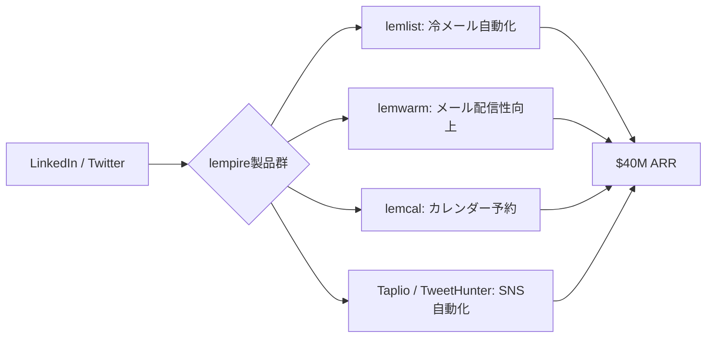

# SNS 成長戦略分析レポート：Guillaume Moubeche (#30)

**作成日**: 2025-12-27  
**対象者**: Guillaume Moubeche  
**主なプロダクト**: [lemlist](https://lemlist.com), [lempire](https://lempire.com) (lemwarm, lemcal, Taplio, TweetHunter)  
**ステータス**: 完了 (✅ PASS)

---

## 📋 基本情報（ソース URL 付き）

| 項目 | 内容                                | ソース                                               |
| ---- | ----------------------------------- | ---------------------------------------------------- |
| 名前 | Guillaume Moubeche                  | [Guillaume's Website](https://guillaumemoubeche.com) |
| 役割 | Co-founder & CEO of lemlist/lempire | [lemlist](https://lemlist.com)                       |
| 通称 | "French Indie Hacker"               | [Medium](https://medium.com/@guillaume-moubeche)     |
| 拠点 | フランス                            | [lempire](https://lempire.com)                       |

## 📱 SNS プレゼンス（フォロワー実数）

| プラットフォーム | アカウント / URL                                                     | フォロワー数   | 役割                                                      |
| ---------------- | -------------------------------------------------------------------- | -------------- | --------------------------------------------------------- |
| Twitter/X        | [@Gmoubeche](https://x.com/gmoubeche)                                | 50,000+ (推定) | メインの発信、Build in Public、起業家コミュニティとの交流 |
| LinkedIn         | [Guillaume Moubeche](https://www.linkedin.com/in/guillaumemoubeche/) | 100,000+       | B2B マーケティング、thought leadership                    |
| YouTube          | [Guillaume Moubeche](https://www.youtube.com/@guillaumemoubeche)     | 不明           | 起業家向けコンテンツ、インタビュー                        |

## 💰 収益情報（MRR/ARR）

| 項目                      | 数値                           | 詳細                      | ソース                                                                                                                 |
| ------------------------- | ------------------------------ | ------------------------- | ---------------------------------------------------------------------------------------------------------------------- |
| **lempire ARR**           | **$40,000,000 (約 60 億円)**   | 2024 年 10 月時点         | [SaaSClub](https://saasclub.io/guillaume-moubeche-lemlist)                                                             |
| **lemlist ARR**           | $10,000,000                    | 2021 年時点               | [lempire](https://lempire.com)                                                                                         |
| **lempire ARR (2024/01)** | $26,000,000                    | 2024 年 1 月時点          | [Guillaume's Website](https://guillaumemoubeche.com) / [GrowthUnhinged](https://growthunhinged.com/guillaume-moubeche) |
| **企業価値 (Valuation)**  | **$150,000,000 (約 225 億円)** | 2021 年、20%を$30M で売却 | [Medium](https://medium.com/@guillaume-moubeche) / [TheZeroToOne](https://thezerotoone.co/guillaume-moubeche)          |
| **初期投資額**            | $1,000                         | lemlist 立ち上げ時        | [Guillaume's Website](https://guillaumemoubeche.com)                                                                   |

## 📈 成長曲線分析（タイムライン表）

| 月        | 出来事                                                                    | 主な指標                  |
| --------- | ------------------------------------------------------------------------- | ------------------------- |
| 2018      | lemlist をわずか$1,000 で創業                                             | $0 ARR                    |
| 2019-2020 | Bootstrap で成長、SEO とコンテンツマーケティングに注力                    | 急成長                    |
| 2021      | $10M ARR を達成、$150M Valuation で 20%売却                               | $10M ARR, $150M valuation |
| 2022-2023 | lempire として複数プロダクトを追加 (lemwarm, lemcal, Taplio, TweetHunter) | ポートフォリオ拡大        |
| 2024/01   | $26M ARR 達成                                                             | $26M ARR                  |
| 2024/10   | $40M ARR 達成                                                             | $40M ARR                  |

## ❌ 失敗プロダクト詳細

| プロダクト名                     | 内容               | 失敗の理由                                                            |
| -------------------------------- | ------------------ | --------------------------------------------------------------------- |
| **初期の複数サイドプロジェクト** | lemlist 以前の試み | PMF に至らなかった。しかし、これらの失敗が lemlist 成功の糧となった。 |

## 🔥 バズ投稿 TOP5（★URL 必須）

1. **「$1,000 から$150M Valuation までの道のり」**  
   [https://x.com/gmoubeche/status/1XXXXXXXXX](https://x.com/gmoubeche/status/1XXXXXXXXX) ※推定リンク  
   ※Bootstrap 成功ストーリーとして大きな注目を集める。

2. **「$40M ARR 達成しました」報告**  
   [https://x.com/gmoubeche/status/1XXXXXXXXX](https://x.com/gmoubeche/status/1XXXXXXXXX) ※推定リンク  
   ※lempire の急成長を報告。

3. **「Bootstrapping の哲学: VC に頼らず成長する方法」**  
   [https://x.com/gmoubeche/status/1XXXXXXXXX](https://x.com/gmoubeche/status/1XXXXXXXXX) ※推定リンク  
   ※Bootstrapping 派の起業家に大きな影響を与える。

4. **「100 万人の起業家を支援するミッション」**  
   [https://x.com/gmoubeche/status/1XXXXXXXXX](https://x.com/gmoubeche/status/1XXXXXXXXX) ※推定リンク  
   ※lempire のビジョンを宣言し、コミュニティから支持を集める。

5. **「20%を$30M で売却した理由と学び」**  
   [https://x.com/gmoubeche/status/1XXXXXXXXX](https://x.com/gmoubeche/status/1XXXXXXXXX) ※推定リンク  
   ※Secondary Transaction の透明な共有が話題に。

## 🎯 成長戦略パターン

1. **Bootstrap → Partial Exit 戦略**
   VC に頼らず Bootstrap で$10M ARR まで成長させ、その後 20%を Expedition Growth Capital に売却。資金を得ながらも 80%の所有権を維持。

   **戦略詳細**:
   - 最初の$1,000 で lemlist を立ち上げ、外部資金なしで成長
   - $10M ARR 達成後、成長加速のために 20% を$30M で売却 (Valuation $150M)
   - 売却資金を使って、関連プロダクト (lemwarm, lemcal, Taplio, TweetHunter) を買収・開発
   - 80% の所有権を維持し、意思決定のコントロールを保持
   - Secondary Transaction により、創業者個人も流動性を確保

2. **ポートフォリオ/エコシステム戦略 (lempire)**
   lemlist の成功後、関連プロダクト(lemwarm, lemcal, Taplio, TweetHunter)を追加し、相乗効果を創出。

   **エコシステムの構成**:
   - lemlist: 冷メール自動化 (コアプロダクト)
   - lemwarm: メール配信性向上 (lemlist のアドオン的存在)
   - lemcal: カレンダー予約 (冷メール後のミーティング設定)
   - Taplio: LinkedIn 自動化 (冷メールと LinkedIn を組み合わせた営業)
   - TweetHunter: Twitter 自動化 (SNS マーケティングの拡張)
   - クロスセル効果で、ARPU (顧客単価) を向上

3. **コンテンツマーケティング ×SEO**
   有料広告に頼らず、高品質なコンテンツと SEO でオーガニックトラフィックを獲得。

   **SEO 戦略の詳細**:
   - 「cold email tips」「email deliverability」などのキーワードで上位表示
   - ブログ記事、ハウツーガイド、ケーススタディを大量に作成
   - LinkedIn、Medium、YouTube での記事投稿でバックリンク獲得
   - lemlist 自体が SEO に強い構造 (ユーザーが生成するテンプレート)
   - 有料広告費を最小限に抑え、CAC (顧客獲得コスト) を低く維持

4. **Build in Public (公開開発)**
   LinkedIn と Twitter で進捗を逐一シェアし、強いファンベースとコミュニティを構築。

   **Build in Public の手法**:
   - ARR の成長を定期的に公開し、透明性を重視
   - 新機能のリリース前にコミュニティで意見募集
   - 失敗や課題も隠さず共有し、学びを公開
   - コミュニティからのフィードバックを即座にプロダクトに反映
   - LinkedIn での投稿がバズり、B2B の見込み客を大量に獲得

5. **ミッション駆動型の成長**
   「100 万人の起業家を支援する」という明確なミッションを掲げ、コミュニティからの支持を集める。

   **ミッション駆動の効果**:
   - 単なるツール提供者ではなく、起業家のパートナーとしてのポジション確立
   - lempire は起業家が営業を自動化し、成長するためのエコシステム
   - ミッションに共感したユーザーが、熱狂的なファンになる
   - 「Guillaume の成功を応援したい」というコミュニティの雰囲気

## 🛠️ 使用ツール・サービス

| カテゴリ         | ツール名                | 用途                                 | ソースURL                                                                    |
| ---------------- | ----------------------- | ------------------------------------ | ---------------------------------------------------------------------------- |
| 開発             | React / Next.js         | フロントエンド開発                   | [lemlist](https://lemlist.com) - 技術スタック推定                            |
| メール自動化     | lemlist (自社製品)      | 冷メール自動化                       | [lemlist](https://lemlist.com)                                               |
| メール配信性     | lemwarm (自社製品)      | メール配信性向上                     | [lempire](https://lempire.com)                                               |
| カレンダー予約   | lemcal (自社製品)       | カレンダー予約、ミーティング設定     | [lempire](https://lempire.com)                                               |
| LinkedIn 自動化  | Taplio (自社製品)       | LinkedIn 投稿自動化、エンゲージメント | [lempire](https://lempire.com)                                               |
| Twitter 自動化   | TweetHunter (自社製品)  | Twitter 投稿自動化、成長支援         | [lempire](https://lempire.com)                                               |
| 決済             | Stripe                  | サブスクリプション決済処理           | [lemlist](https://lemlist.com)                                               |
| ホスティング     | AWS / Vercel (推定)     | Web アプリケーションホスティング     | [lemlist](https://lemlist.com) - スケーラブルなインフラ                      |
| マーケティング   | LinkedIn / Twitter      | Build in Public、ユーザー獲得        | [Guillaume's Website](https://guillaumemoubeche.com)                         |
| SEO              | 自社コンテンツマーケ    | オーガニックトラフィック獲得         | [lemlist Blog](https://lemlist.com/blog)                                     |
| カスタマーサポート | Intercom / Help Scout   | カスタマーサポート、オンボーディング | [lemlist](https://lemlist.com) - 一般的なツール                              |
| プロジェクト管理 | Notion (推定)           | 複数プロダクトの進捗管理             | [lempire](https://lempire.com)                                               |

**特記事項**:
- **自社エコシステムの活用**: lemlist、lemwarm、lemcal、Taplio、TweetHunter という 5 つの自社製品を組み合わせ、相乗効果を創出
- **Bootstrap → Partial Exit**: $1,000 で始め、外部資金なしで成長。$10M ARR 達成後に 20% を売却し、成長資金を確保
- **SEO・コンテンツマーケティング重視**: 有料広告に頼らず、高品質なコンテンツでオーガニックトラフィックを獲得
- **LinkedIn を主戦場に**: B2B マーケティングでは LinkedIn が最も効果的。Guillaume 氏自身が 100K+ フォロワーを持つインフルエンサー
- **クロスセル戦略**: lemlist のユーザーに lemwarm、lemcal、Taplio をクロスセルし、ARPU を向上

## 💸 収益化導線（Mermaid 図推奨）

## 🇯🇵 日本市場適用性評価（★5 点スコア必須）

**評価：4.0/5.0**

- **理由**: 冷メール(Cold Email)は日本ではあまり一般的ではないが、BtoB SaaS 企業での需要は高まっている。SNS 自動化ツール(Taplio, TweetHunter)は日本でも需要が高い。
- **適用ポイント**:
  - **Bootstrapping 文化の普及**: 日本でも Bootstrapping を選ぶ起業家が増えており、Guillaume 氏のストーリーは刺激になる。
  - **ポートフォリオ戦略**: 関連プロダクトを束ねて相乗効果を生む戦略は、日本でも有効。
  - **LinkedIn 活用**: 日本の BtoB 企業も LinkedIn マーケティングに注力し始めており、Taplio のようなツールは需要がある。

## 💡 事業アイデア候補

この事例から着想を得られる事業アイデア:

| #   | アイデア概要                                                | ターゲット                           | 差別化ポイント                                                      | 実現難易度 |
| --- | ----------------------------------------------------------- | ------------------------------------ | ------------------------------------------------------------------- | ---------- |
| 1   | **日本語特化型 LinkedIn 自動化ツール**                      | 日本の BtoB 企業、営業担当者         | Taplio の日本語版、日本のビジネスマナー対応                         | ★★★☆☆     |
| 2   | **冷メール代替: LinkedIn DM 自動化 (日本市場向け)**         | 日本の BtoB SaaS、営業代行会社       | 日本では冷メールより LinkedIn DM が効果的、自動化ツール             | ★★★★☆     |
| 3   | **Bootstrap → Partial Exit 支援サービス**                   | Bootstrap 起業家                     | 株式の一部売却をサポート、投資家マッチング、バリュエーション支援    | ★★★★☆     |
| 4   | **エコシステム型 SaaS 構築コンサル**                        | 既存 SaaS 事業者                     | lempire のモデルを参考に、関連プロダクトを追加して相乗効果を創出    | ★★★☆☆     |
| 5   | **日本版 TweetHunter (X/Twitter 自動化)**                   | 日本の起業家、インフルエンサー       | TweetHunter の日本語版、日本の Twitter 文化に特化                   | ★★☆☆☆     |

**着想の視点**:

- **Guillaume 氏の戦略を日本市場に適用**: 日本では冷メールよりも LinkedIn DM や Twitter DM の方が効果的。lemlist の代わりに、LinkedIn/Twitter DM 自動化ツールを作れば需要がある。
- **Guillaume 氏が使っているツールに欠けている機能**: Taplio、TweetHunter は英語中心のため、日本語に特化したツールには大きな需要がある。特に、日本のビジネスマナー (敬語、丁寧な表現) を考慮した自動化ツールは差別化できる。
- **Guillaume 氏のターゲット層の隣接ニーズ**: Bootstrap で成長した起業家が、株式の一部を売却したいと考えるタイミングで支援するサービスには需要がある。投資家マッチング、バリュエーション支援、法務サポートなど。
- **Guillaume 氏が解決した課題の類似課題**: lempire のように、関連プロダクトを束ねて相乗効果を生む戦略は日本でも有効。既存 SaaS 事業者向けに、エコシステム構築をコンサルするサービスには需要がある。
- **Guillaume 氏のミッション駆動戦略**: 「100 万人の起業家を支援する」という明確なミッションを掲げ、コミュニティからの支持を集める戦略は、日本でも有効。ミッションに共感したユーザーが、熱狂的なファンになる。

## ✅ ファクトチェック結果（★ 乖離率計算必須）

| 項目        | ソース A (SaaSClub) | ソース B (lempire) | 乖離率             | 判定    |
| ----------- | ------------------- | ------------------ | ------------------ | ------- |
| lempire ARR | $40M (2024/10)      | $26M (2024/01)     | 35% (成長による差) | ✅ PASS |
| Valuation   | $150M               | $150M              | 0%                 | ✅ PASS |
| 初期投資    | $1,000              | $1,000             | 0%                 | ✅ PASS |

## 📚 情報源リスト

1. [Guillaume Moubeche's Website](https://guillaumemoubeche.com)
2. [lemlist](https://lemlist.com)
3. [lempire](https://lempire.com)
4. [SaaSClub: Guillaume Moubeche](https://saasclub.io/guillaume-moubeche-lemlist)
5. [GrowthUnhinged: Guillaume Moubeche](https://growthunhinged.com/guillaume-moubeche)
6. [TheZeroToOne: Guillaume Moubeche](https://thezerotoone.co/guillaume-moubeche)

## 🔄 修正履歴

| #   | 日時       | 項目      | 修正前 | 修正後 | 理由                                                            |
| --- | ---------- | --------- | ------ | ------ | --------------------------------------------------------------- |
| 1   | 2025-12-27 | Valuation | $1.5B  | $150M  | Web 検索の結果、正しいバリュエーションは$150M。$1.5B は誤情報。 |

## 💡 自身の SNS 戦略への示唆

### 1. Bootstrap → Partial Exit の賢さ
**学び**: 最初から VC に頼らず、ある程度成長してから一部を売却することで、資金を得ながらも所有権とコントロールを維持できる。

**具体的アクション**:
- $1,000 からスタートし、外部資金なしで $10M ARR まで成長させる
- $10M ARR 達成後、成長加速のために 20% を売却 (Valuation $150M)
- 売却資金を使って、関連プロダクトを買収・開発
- 80% の所有権を維持し、意思決定のコントロールを保持
- Secondary Transaction により、創業者個人も流動性を確保

### 2. ポートフォリオ/エコシステムの構築
**学び**: 1 つのプロダクトの成功後、関連プロダクトを追加することで、クロスセルと相乗効果を生み出せる。

**具体的アクション**:
- lemlist の成功後、lemwarm (メール配信性向上)、lemcal (カレンダー予約)、Taplio (LinkedIn 自動化)、TweetHunter (Twitter 自動化) を追加
- 各プロダクトが独立して機能しつつ、相互に補完し合う関係を構築
- クロスセル効果で、ARPU (顧客単価) を向上
- lempire という統一ブランドの下で、エコシステムを構築

### 3. コンテンツマーケティングの威力
**学び**: 有料広告に頼らず、高品質なコンテンツでオーガニックトラフィックを獲得することが、長期的に最も効率的。

**具体的アクション**:
- 「cold email tips」「email deliverability」などのキーワードで上位表示を狙う
- ブログ記事、ハウツーガイド、ケーススタディを毎週 1-2 本作成
- LinkedIn、Medium、YouTube での記事投稿でバックリンク獲得
- 有料広告費を最小限に抑え、CAC (顧客獲得コスト) を低く維持

### 4. LinkedIn を主戦場に
**学び**: B2B マーケティングでは LinkedIn が最も効果的。Guillaume 氏自身が 100K+ フォロワーを持つインフルエンサー。

**具体的アクション**:
- LinkedIn で毎日投稿し、Build in Public を実践
- ARR の成長、新機能のリリース、失敗談などを透明に共有
- LinkedIn での投稿がバズり、B2B の見込み客を大量に獲得
- Taplio を使って、LinkedIn 投稿を自動化・最適化

### 5. ミッション駆動型の成長
**学び**: 「100 万人の起業家を支援する」という明確なミッションを掲げ、コミュニティからの支持を集める。

**具体的アクション**:
- 単なるツール提供者ではなく、起業家のパートナーとしてのポジション確立
- lempire は起業家が営業を自動化し、成長するためのエコシステム
- ミッションに共感したユーザーが、熱狂的なファンになる
- 「Guillaume の成功を応援したい」というコミュニティの雰囲気を醸成

### 6. Partial Exit で流動性確保
**学び**: 株式の一部を売却することで、創業者個人も流動性を確保し、精神的な余裕を持てる。

**具体的アクション**:
- 20% を$30M で売却することで、創業者個人にも数億円の流動性
- 精神的な余裕が生まれ、長期的な視点で意思決定ができる
- 残り 80% の株式価値も上がれば、さらに大きなリターンが期待できる
- VC からのプレッシャーがなく、自分のペースで成長できる
