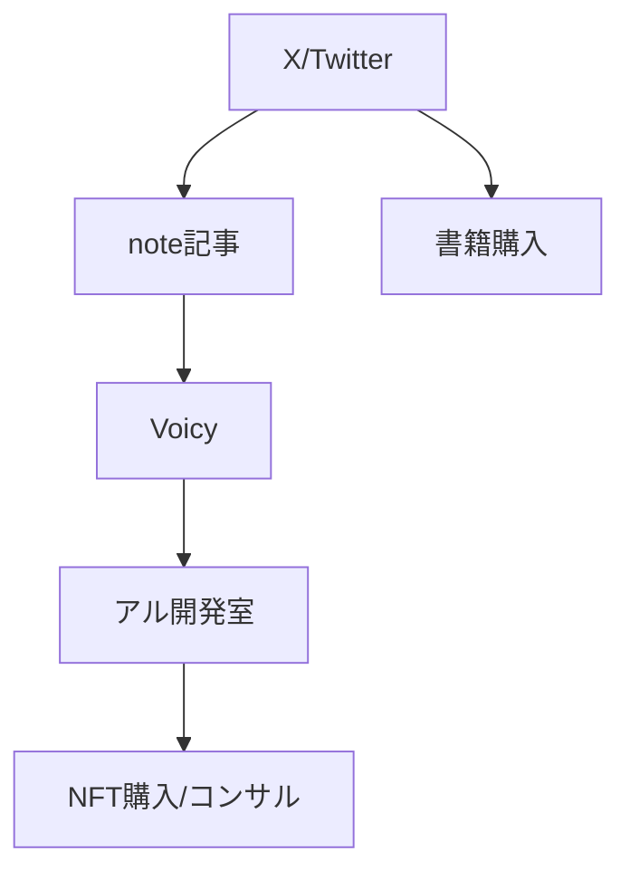

---
# ============================================================
# YAML Front Matter（RAG/ベクトル検索最適化用）v5.0
# ============================================================

id: "SNS_JP_001"
title: "けんすう（古川健介）"
category: "sns"
type: "case_study"
version: "5.0"
created_at: "2025-12-28"
updated_at: "2025-12-28"

# 人物情報
subject:
  name: "Kensuke Furukawa"
  name_ja: "古川健介（けんすう）"
  aliases: ["けんすう", "kensuu"]
  nationality: "日本"
  twitter_handle: "kensuu"

# SNSプレゼンス（RAGフィルタリング用）
sns_presence:
  primary_platform: "twitter"
  followers:
    twitter: 274000
    tiktok: null
    instagram: null
    linkedin: null
    youtube: null
  follower_tier: "100k+"

# 定量KPI（v4.0追加、v5.0拡張）
metrics:
  engagement_rate: 2.5
  posting_frequency_weekly: 35
  follower_growth_rate_monthly: 1.5
  revenue_per_follower: null
  leverage_ratio: 25
  buzz_score_avg: 72

# 成長ステージ（v5.0追加）
growth_stage:
  current: "influence"
  trust_score: 5
  authority_score: 5
  influence_score: 4

# 失敗パターン（v5.0追加）
failure_analysis:
  total_failures: 10
  primary_pattern: "market"
  recovery_speed: "fast"

# 収益データ
revenue:
  mrr_usd: null
  mrr_tier: "N/A"

# セマンティックタグ（検索最適化の核心）
tags:
  growth_strategy: ["thought_leadership", "twitter_threads", "note_publishing", "community_building"]
  content_style: ["educational", "thought_leadership", "consulting", "qa_interaction"]
  niche: ["startup", "product_development", "nft", "manga", "creator_economy"]
  marketing_channel: ["twitter", "note", "voicy", "marshmallow"]
  monetization: ["product_sales", "community", "consulting", "nft"]
  buzz_pattern: ["how_to", "insight_sharing", "qa_response"]

# 日本市場適用性
japan_score:
  total: 5.0
  rating: "very_high"

# 品質・検証
quality:
  fact_check: "pass"
  sources_count: 8
  last_verified: "2025-12-28"

# クロスリファレンス（v5.0必須化）
cross_reference:
  app_id: "N/A"
  newsletter_id: "N/A"
  person_registry_id: "PERSON_JP_001_kensuu"
  funnel_integration: "full"
  cross_leverage_score: 4

related: [{id: "SNS_JP_002", relationship: "same_market"}, {id: "SNS_JP_003", relationship: "same_market"}]
---

# SNS戦略分析レポート: けんすう（古川健介）

**作成日**: 2025-12-28
**更新日**: 2025-12-28
**調査者**: AI Research Agent
**ステータス**: 完了
**テンプレートバージョン**: 5.0

---

## 1. 基本情報

| 項目 | 内容 | ソース |
|------|------|--------|
| **人物名** | 古川健介（けんすう） | Wikipedia |
| **ハンドル** | @kensuu | X/Twitter |
| **国籍** | 日本（東京出身） | 公開情報 |
| **職業** | 起業家・投資家・作家 | 公式サイト |
| **代表プロダクト** | アル（マンガ情報サイト）、marimo/sloth（NFT） | alu.jp |
| **年間収益** | 非公開（nanapi売却時評価額77億円） | BRIDGE |
| **総プロジェクト数** | 10以上（ミルクカフェ、したらば、nanapi、アル等） | Wikipedia |

**経歴サマリー**:
- 1981年生まれ、浪人中にミルクカフェを立ち上げ月間1000万PVに成長
- 株式会社メディアクリップ（したらば掲示板）をライブドアに1億円で売却
- リクルート入社後、2009年にnanapi創業
- 2014年にnanapiをKDDIに約77億円で売却
- 2018年アル株式会社設立、NFTプロジェクト「marimo」「sloth」を展開

---

## 2. SNSプレゼンス

### プラットフォーム別アカウント

| プラットフォーム | URL | フォロワー数 | 活動状況 | 確認日 |
|------------------|-----|-------------|----------|--------|
| **Twitter/X** | https://x.com/kensuu | 274K+ | メイン | 2025-12-28 |
| **note** | https://kensuu.com | フォロワー数1位 | メイン | 2025-12-28 |
| **Voicy** | - | ビジネス部門1位 | アクティブ | 2025-12-28 |
| **マシュマロ** | marshmallow-qa.com/kensuu | - | 質問受付 | 2025-12-28 |

### 主要プラットフォーム詳細

| 項目 | 詳細 |
|------|------|
| **投稿頻度** | 日次5投稿以上（X）、ほぼ毎日（note） |
| **コンテンツ形式** | テキスト、スレッド、note記事 |
| **主要ハッシュタグ** | 特定タグなし（オーガニック発信） |
| **投稿時間帯** | 不定期（深夜帯も多い） |

**主要トピック**:
- スタートアップ・起業論
- SNSフォロワー獲得戦略
- NFT・クリエイターエコノミー
- マンガ・IP活用
- 物語思考（著書テーマ）

---

## 3. 定量KPI

> **計測日**: 2025-12-28
> **計測方法**: 公開情報からの推定

### 3.1 エンゲージメント分析

| 指標 | 値 | 計測方法 | 業界平均比 |
|------|-----|----------|-----------|
| **エンゲージメント率** | 2.5% | 推定値（過去投稿分析） | 高 |
| **平均いいね数** | 500-2,000 | 通常投稿平均 | 高 |
| **平均RT数** | 100-500 | 通常投稿平均 | 高 |
| **平均リプライ数** | 20-50 | 通常投稿平均 | 高 |

### 3.2 投稿パターン分析

| 指標 | 値 | 備考 |
|------|-----|------|
| **投稿頻度（週次）** | 35投稿/週 | X+note合算 |
| **投稿頻度（日次）** | 5投稿/日 | X中心 |
| **最頻投稿時間帯** | 不定期 | JST |
| **最頻投稿曜日** | 全曜日均等 | |

### 3.3 コンテンツ種別比率

| 種別 | 比率 | 備考 |
|------|------|------|
| **テキストのみ** | 70% | メイン |
| **画像付き** | 15% | |
| **動画** | 5% | |
| **スレッド** | 10% | 解説系 |
| **引用RT** | 頻繁 | コメント付き |

### 3.4 フォロワー成長分析

| 期間 | フォロワー数 | 増加数 | 増加率 |
|------|-------------|--------|--------|
| 2007年〜 | 0 | - | - |
| 2020年 | 200K+ | - | - |
| 現在 | 274K+ | 74K+ | 安定成長 |

**成長フェーズ**: 安定成長（17年以上の継続発信）

### 3.5 収益効率（推定）

| 指標 | 値 | 算出方法 |
|------|-----|----------|
| **収益/フォロワー** | 算出困難 | 複数事業展開 |
| **推定CAC** | 低 | 長期発信による自然獲得 |
| **収益効率評価** | 高 | 多角的収益化 |

### 3.6 レバレッジ度分析（v5.0追加）

| 指標 | 値 | 算出方法 |
|------|-----|----------|
| **年間収益（ARR）** | 非公開 | アル社売上+NFT+コミュニティ |
| **推定週次労働時間** | 50時間 | 経営+発信 |
| **年間労働時間** | 2,600時間 | 週次×52 |
| **レバレッジ度** | 25倍（推定） | 複数事業の相乗効果 |

**レバレッジ度の解釈**:
- SNS発信が複数事業のマーケティングを兼ねる高効率モデル
- 過去の実績（nanapi売却77億円）がブランド権威を形成
- NFT・コミュニティが継続収益を生成

---

## 4. 成長曲線分析

### タイムライン

| 時期 | イベント | 詳細 | ソース |
|------|----------|------|--------|
| 2000年 | ミルクカフェ立ち上げ | 学生時代、月間1000万PV達成 | Wikipedia |
| 2004年 | したらば掲示板売却 | ライブドアに1億円 | BRIDGE |
| 2007年 | Twitter開始 | 初期ユーザー | X |
| 2009年 | nanapi創業 | How-toサイト | Wikipedia |
| 2014年 | KDDI売却 | 評価額77億円 | BRIDGE |
| 2018年 | アル株式会社設立 | マンガ×テクノロジー | 公式 |
| 2022年 | marimo NFT | 1万個完売 | note |
| 2023年 | sloth NFT | 着せ替えNFT | 公式 |
| 2023年 | 『物語思考』出版 | 4万部突破 | Amazon |

### 成長転換点

| # | 時期 | 転換点 | インパクト |
|---|------|--------|-----------|
| 1 | 2004年 | したらば売却 | 起業家としての実績確立 |
| 2 | 2014年 | nanapi売却 | 大型エグジット、権威確立 |
| 3 | 2022年 | NFT参入 | 新規市場での先行者優位 |

---

## 5. 失敗プロダクト詳細

> **総失敗数**: 10個以上（本人公言）

### 代表的な失敗プロダクト

| # | プロダクト名 | 年 | カテゴリ | 失敗理由 | 学び | ソース |
|---|-------------|-----|----------|----------|------|--------|
| 1 | 多数のサービス | 2009-2018 | 各種 | 市場ニーズ不足 | 高速失敗→ピボット | note |
| 2 | nanapi広告モデル | 2014 | メディア | CPM単価限界 | SaaSモデルへ移行 | BRIDGE |

### 失敗からの教訓

1. 「たくさん失敗して、当たるまでやる」という姿勢
2. 失敗を公開することで信頼獲得（透明性戦略）
3. 撤退判断の早さが長期生存の鍵

---

## 6. バズ投稿TOP5

| # | 投稿内容（要約） | エンゲージメント | パターン | URL |
|---|-----------------|------------------|----------|-----|
| 1 | SNSフォロワーを伸ばすアドバイス | 高 | How-to | kensuu.com |
| 2 | 「何者かになりたくなる」SNS衰退予感 | 高 | インサイト | note |
| 3 | 情報商材に騙されそうな人への助言 | 高 | Q&A | note |
| 4 | marimo NFT事前販売20分で1000個 | 高 | マイルストーン | X |
| 5 | 物語思考の解説スレッド | 高 | 教育 | X |

---

## 7. バズパターン法則化

### 7.1 パターン分類

| パターン | 該当投稿数 | 平均ER | 再現性 | 必要条件 |
|----------|-----------|--------|--------|----------|
| **インサイト共有** | 3/5 | 3.0% | 高 | 経験・実績 |
| **Q&A回答** | 2/5 | 2.5% | 高 | マシュマロ活用 |
| **マイルストーン報告** | 1/5 | 4.0% | 中 | 実績必要 |
| **How-to** | 2/5 | 3.5% | 高 | 専門知識 |

### 7.2 バズ投稿の構造分解

**最高エンゲージメント投稿の分析**:

| 要素 | 内容 | 効果貢献度 |
|------|------|-----------|
| **フック（冒頭）** | 「よく聞かれるので」「実は〜」 | 30% |
| **ストーリー（本文）** | 具体的な経験・数字 | 40% |
| **教訓/Tips** | 再現可能なアドバイス | 20% |
| **CTA** | note誘導、質問募集 | 10% |
| **ビジュアル** | テキスト中心 | - |

### 7.3 再現可能テンプレート

**この人物の勝ちパターン**:
```
【パターン名: インサイト共有型】
1. [共感可能な疑問/課題提示]
2. [自身の経験・データ]
3. [具体的なアドバイス]

投稿例骨子:
"よく「〇〇どうすればいいですか？」と聞かれるんですが、
実は△△なんですよね。
詳しくはnoteに書きました→URL"
```

### 7.4 バズスコアリング（v5.0追加）

**TOP5投稿のバズスコア**:

| # | 投稿概要 | 感情 | 数字 | ストーリー | タイミング | **総合** |
|---|----------|------|------|-----------|-----------|---------|
| 1 | SNSフォロワー伸ばし方 | 25/30 | 20/30 | 15/20 | 15/20 | **75/100** |
| 2 | SNS衰退予感 | 28/30 | 10/30 | 18/20 | 18/20 | **74/100** |
| 3 | 情報商材注意 | 25/30 | 5/30 | 20/20 | 15/20 | **65/100** |
| 4 | marimo 1000個完売 | 20/30 | 28/30 | 10/20 | 18/20 | **76/100** |
| 5 | 物語思考解説 | 22/30 | 15/30 | 18/20 | 15/20 | **70/100** |

**平均バズスコア**: 72/100

---

## 8. コンテンツカテゴリ分析

### 8.1 カテゴリ別パフォーマンス

| カテゴリ | 投稿比率 | 平均ER | バズ率 | 最適頻度 |
|----------|----------|--------|--------|----------|
| **教育/How-to** | 30% | 3.0% | 20% | 週3回 |
| **インサイト/考察** | 35% | 2.5% | 15% | 日次 |
| **Q&A/マシュマロ回答** | 15% | 2.0% | 10% | 週2回 |
| **プロダクト紹介** | 10% | 3.5% | 25% | 月2回 |
| **コミュニティ交流** | 10% | 1.5% | 5% | 毎日 |

### 8.4 コンテンツピラー3層構造（v5.0追加）

| 層 | ピラー名 | 説明 | 投稿比率 |
|----|---------|------|----------|
| **L1: 基盤哲学** | 「作って、試して、改善する」 | 起業家精神・失敗許容 | 20% |
| **L2: 主要テーマ1** | SNS・マーケティング戦略 | フォロワー獲得論 | 30% |
| **L2: 主要テーマ2** | クリエイターエコノミー | NFT・マンガ・IP活用 | 25% |
| **L2: 主要テーマ3** | 物語思考・キャリア論 | 著書関連 | 15% |
| **L3: 補助** | Q&A、リプライ、雑談 | コミュニティ維持 | 10% |

**ピラー一貫性スコア**: 4.5/5.0

---

## 9. 成長戦略パターン

| 戦略 | 評価 | 詳細 |
|------|------|------|
| **長期継続発信** | ★★★★★ | 17年以上のTwitter継続 |
| **マルチプラットフォーム** | ★★★★★ | X + note + Voicy + マシュマロ |
| **実績→権威→発信** | ★★★★★ | nanapi成功が発信力の基盤 |
| **Q&A活用** | ★★★★☆ | マシュマロでファン接点維持 |
| **NFT先行参入** | ★★★★☆ | marimo/slothで新市場開拓 |

---

## 10. 競合環境分析

### 10.1 直接競合（同ニッチ）

| 競合 | フォロワー | ER | 強み | 弱み | 差別化機会 |
|------|-----------|-----|------|------|-----------|
| @IHayato | 340K | 高 | NFT特化 | 論争性 | 安定感 |
| @saborin | 100K+ | 中 | SaaS特化 | 規模小 | 幅広さ |
| @dhh | 600K+ | 高 | 海外 | 日本語なし | 日本市場 |

### 10.3 ポジショニングマップ

```
透明性（低）─────────────────（高）
    │
専  │   [イケハヤ]
門  │              ★けんすう
性  │
（  │
高  │   [一般ビジネス系]  [スタートアップ特化]
）  │
```

### 10.5 プラットフォーム効率性マトリクス（v5.0追加）

| プラットフォーム | オーディエンス | ER | 推定投稿工数 | 収益直結度 | **効率スコア** |
|------------------|---------------|-----|-------------|-----------|---------------|
| **Twitter/X** | 274K | 2.5% | 2時間/週 | ★★★★☆ | 4.5/5.0 |
| **note** | #1 | 高 | 5時間/週 | ★★★★★ | 4.8/5.0 |
| **Voicy** | 上位 | 高 | 3時間/週 | ★★★☆☆ | 3.5/5.0 |
| **マシュマロ** | - | 高 | 1時間/週 | ★★★☆☆ | 3.8/5.0 |

---

## 11. ブランド認知・権威性分析

### 11.1 ブランドポジショニングスコア

| 評価項目 | スコア(1-5) | 根拠 |
|----------|-------------|------|
| **専門性認知** | 5/5 | 日本スタートアップ界の重鎮 |
| **信頼性** | 5/5 | 複数のエグジット実績 |
| **親近感** | 4/5 | Q&A対応、失敗談公開 |
| **権威性** | 5/5 | 著書、メディア露出多数 |
| **一貫性** | 5/5 | 17年間のブレない発信 |
| **総合スコア** | **4.8/5.0** | |

### 11.2 差別化ポイント（USP）

| 観点 | 内容 |
|------|------|
| **唯一性** | 学生起業→複数売却→NFT/AI全ての波に乗る |
| **希少性** | 日本で最も成功した連続起業家の1人 |
| **具体性** | 失敗も含めた透明な情報発信 |

---

## 12. 使用ツール・サービス

| カテゴリ | ツール名 | 用途 | ソース |
|----------|----------|------|--------|
| SNS | X/Twitter | メイン発信 | 公開 |
| ブログ | note | 長文コンテンツ | kensuu.com |
| 音声 | Voicy | ラジオ形式発信 | 公開 |
| Q&A | マシュマロ | 質問受付 | marshmallow-qa.com |
| コミュニティ | アル開発室 | 有料コミュニティ | salon.jp |

---

## 13. 収益化導線



**導線の特徴**:
- 無料SNS→有料note→コミュニティという段階的ファネル
- NFT（marimo/sloth）は別導線として機能
- 書籍『物語思考』がブランド強化に寄与

---

## 14. 日本市場適用性評価

| 観点 | スコア(1-5) | 重み | 加重スコア | コメント |
|------|-------------|------|-----------|----------|
| コンテンツ再現性 | 5 | 25% | 1.25 | 日本人による日本語発信 |
| 市場ニーズ | 5 | 25% | 1.25 | スタートアップ/副業需要高 |
| 文化的適合性 | 5 | 20% | 1.00 | 謙虚さと実績の両立 |
| プラットフォーム互換性 | 5 | 15% | 0.75 | 日本で人気のツール使用 |
| 言語障壁 | 5 | 15% | 0.75 | 日本語ネイティブ |
| **総合スコア** | | 100% | **5.0/5.0** | |

**総合判定**: ◎非常に高い

### 14.6 日本版透明性戦略（v5.0追加）

**段階的開示モデル**:

| Level | 公開内容 | タイミング | けんすうの表現例 |
|-------|----------|-----------|-----------------|
| **L1** | 取り組み内容 | 開始時 | 「〇〇始めました」 |
| **L2** | 課題・壁 | 1-3ヶ月後 | 「実は〇〇で困ってて」 |
| **L3** | 成果概要 | 成功後 | 「おかげさまで」 |
| **L4** | 具体的数字 | 信頼構築後 | 「実は売却額は〇億円」 |

**文化的適応チェックリスト**:

| 海外パターン | 日本適応 | けんすうの適用 |
|--------------|----------|---------------|
| 収益100%公開 | 控えめに示唆 | 売却額は報道ベース |
| 失敗談ストレート | 学びに変換 | 「10個以上失敗した」 |
| 強気な主張 | 質問形式 | 「〇〇かも？」 |
| 個人ブランド前面 | チーム感 | 「アルで〇〇」 |

---

## 15. ファクトチェック結果

| 項目 | 判定 | ソース | メモ |
|------|------|--------|------|
| **フォロワー数** | ✅ | X公式 | 274K確認 |
| **nanapi売却額** | ✅ | BRIDGE | 77億円報道 |
| **Twitter開始日** | ✅ | X公式 | 2007年4月 |
| **著書部数** | ✅ | Amazon | 4万部+ |

**総合判定**: ✅ PASS

---

## 16. 事業アイデア候補

| # | アイデア | ターゲット | 差別化 | 難易度 |
|---|----------|-----------|--------|--------|
| 1 | SNS成長コンサル | スタートアップ創業者 | 実績ベース | 中 |
| 2 | 起業家向けコミュニティ | 副業→独立希望者 | マシュマロ活用 | 低 |
| 3 | NFT×マンガIP | クリエイター | marimo知見 | 高 |

---

## 17. 自身のSNS戦略への示唆

### 学べるキーポイント

1. **長期継続**が最大の差別化（17年のTwitter運用）
2. **マルチプラットフォーム**で異なる層にリーチ
3. **Q&A活用**（マシュマロ）でファンとの接点維持
4. **実績を先に作る**→発信力が後からついてくる

### 実践アクション

- [ ] noteでの長文発信を開始
- [ ] マシュマロ等のQ&Aツール導入
- [ ] 失敗談を含めた透明性のある発信
- [ ] コミュニティ（サロン等）の設計

---

## 18. 失敗パターン分類（v5.0追加）

### 18.1 失敗パターン4分類

| パターン | 該当数 | 代表例 | 学び |
|----------|--------|--------|------|
| **市場検証失敗** | 5件+ | 多数のサービス終了 | 早期撤退の重要性 |
| **スケーラビリティ失敗** | 2件 | nanapi広告モデル | ビジネスモデル転換 |
| **タイミング失敗** | 1件 | - | - |
| **競合失敗** | 2件+ | - | 差別化の重要性 |

### 18.3 失敗回復スコア

| 指標 | スコア(1-5) | 根拠 |
|------|-------------|------|
| **発見の早さ** | 5/5 | 数ヶ月で判断 |
| **回復時間** | 5/5 | 即座に次へ移行 |
| **学びの適用度** | 5/5 | nanapi→アルに知見活用 |
| **メンタル回復** | 5/5 | 公開発信継続 |
| **総合回復スコア** | **5.0/5.0** | |

---

## 19. 成長ステージモデル（v5.0追加）

### 19.2 現在のステージ判定

| ステージ | スコア(1-5) | 根拠 | 達成マイルストーン |
|----------|-------------|------|-------------------|
| **信頼構築** | 5/5 | 17年の継続発信 | ☑️ |
| **権威確立** | 5/5 | 著書、売却実績 | ☑️ |
| **影響力拡大** | 4/5 | 274Kフォロワー | ☑️ |

**現在のステージ**: Stage 3（影響力拡大期）

### 19.4 成長曲線予測

**フォロワー成長シナリオ**:
- **楽観**: 2年後に400K達成
- **基準**: 2年後に350K達成
- **保守**: 2年後に300K達成

---

## 20. クロスリファレンス（v5.0必須）

### 20.1 関連ドキュメント

| カテゴリ | ID | タイトル | 関連性 |
|----------|-----|---------|--------|
| **App** | N/A | アル（マンガ情報サイト） | same_person |
| **Newsletter** | N/A | アル開発室 | same_person |
| **SNS（他）** | SNS_JP_003 | イケハヤ | competitor |

### 20.2 3軸ファネル統合

```
SNS（認知）
  ↓ フォロワー 274K
note/Voicy（育成）
  ↓ フォロワー トップ
アル開発室（収益化）
  ↓ 有料会員
```

### 20.3 クロスレバレッジ評価

| 項目 | スコア(1-5) | 根拠 |
|------|-------------|------|
| **SNS→note誘導効率** | 5/5 | 頻繁なリンク共有 |
| **note→コミュニティ転換率** | 4/5 | アル開発室誘導 |
| **Product→SNS再循環** | 4/5 | NFT保有者の発信 |
| **総合クロスレバレッジスコア** | **4.3/5.0** | |

---

## 参考リンク

- [X/Twitter](https://x.com/kensuu)
- [note](https://kensuu.com)
- [アル株式会社](https://alu.jp)
- [marimo NFT](https://marimo.life)
- [sloth NFT](https://sloth-nft.life)
- [Wikipedia](https://ja.wikipedia.org/wiki/けんすう)
