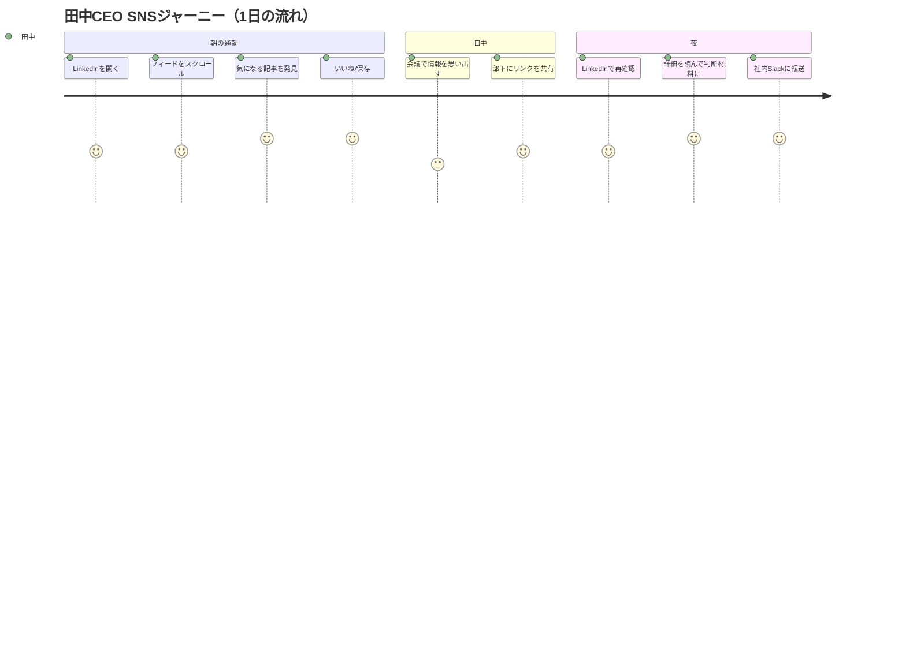

# SNSユーザー ジャーニーマップ

**作成日**: 2025-12-21  
**プロジェクト**: SNS生産性向上プロジェクト  
**対象ペルソナ**: 田中 雄一郎（45歳、中堅IT企業CEO）  
**目的**: 月間100万インプレッション達成に向けたユーザー接点の最適化

---

## 1. ジャーニー概要

### 🎯 本ジャーニーマップの範囲

| 項目 | 内容 |
|------|------|
| **開始点** | SNSフィードでの投稿発見 |
| **終了点** | コンテンツを社内共有し、行動につなげる |
| **対象プラットフォーム** | LinkedIn（主）、Facebook（副） |
| **想定期間** | 1回の情報接触サイクル（1〜3日） |

---

## 2. ユーザージャーニー全体像

---

## 3. フェーズ別詳細

### Phase 1: 認知（Awareness）🔔

**タイミング**: 朝7:00 通勤電車内 / 夜21:00 帰宅後

| 項目 | 詳細 |
|------|------|
| **シーン** | LinkedInアプリを開き、フィードをスクロール |
| **時間** | 5分程度 |
| **行動** | 親指でスクロールしながら、目に留まった投稿で手を止める |
| **トリガー** | 衝撃的な数字、著名人の名前、業界キーワード（AI、ロボット、半導体） |

#### 感情・思考

| 感情 | 思考 |
|------|------|
| 💭 **情報過多で疲れ** | 「また同じようなAI記事か…」 |
| 👀 **興味を惹かれる** | 「ん？テスラが18万台？ちょっと気になる」 |
| ⏰ **時間がない** | 「サッと読めそうなら見てみるか」 |

#### ペインポイント（Pain Points）

- ❌ 情報が多すぎて、重要な記事を見逃す
- ❌ 長い記事は読む気が起きない（5分以内が限界）
- ❌ タイトルだけでは価値がわからない

#### コンテンツ設計への示唆

| 要素 | 推奨 |
|------|------|
| **冒頭** | 具体的な数字で始める（「18万台」「1000億円」） |
| **長さ** | 2〜3分で読める（500〜800字） |
| **視認性** | 改行多め、箇条書きで読みやすく |

---

### Phase 2: 興味・関心（Interest）💡

**タイミング**: 投稿発見から数秒〜1分後

| 項目 | 詳細 |
|------|------|
| **シーン** | 投稿の冒頭を読み、続きを見るかどうか判断 |
| **行動** | 投稿を最後まで読む / 「いいね」を押す / 保存する |
| **判断基準** | 自分の仕事に関係があるか、会議で使えそうか |

#### 感情・思考

| 感情 | 思考 |
|------|------|
| 🤔 **吟味** | 「この情報、うちの会社でも使えそうか？」 |
| ✅ **納得** | 「なるほど、OpenAIがそう言ってるなら信頼できる」 |
| 💡 **発見** | 「これは役員会議で使えそうだ」 |

#### ペインポイント（Pain Points）

- ❌ 情報の信頼性がわからない（誰が言ってるのか？）
- ❌ 自社への適用可能性が見えない
- ❌ 保存しても後で読み返す時間がない

#### コンテンツ設計への示唆

| 要素 | 推奨 |
|------|------|
| **権威性** | サム・アルトマン、イーロン・マスク等の引用 |
| **具体性** | 企業名、金額、期限を明示 |
| **示唆** | 「経営者として考えるべきこと」を明記 |

---

### Phase 3: 検討・比較（Consideration）⚖️

**タイミング**: 投稿読了後〜数時間後

| 項目 | 詳細 |
|------|------|
| **シーン** | 経営会議、役員ミーティングで情報を思い出す |
| **行動** | 頭の中で「自社との関連性」を検討する |
| **判断基準** | 投資判断の材料になるか、競合との差別化につながるか |

#### 感情・思考

| 感情 | 思考 |
|------|------|
| 😰 **焦り** | 「競合はもう動いているのかもしれない」 |
| 💪 **決意** | 「うちも何かしないと」 |
| 🤷 **迷い** | 「でも、何から始めればいいんだ」 |

#### ペインポイント（Pain Points）

- ❌ 具体的な次のステップがわからない
- ❌ 社内にAI人材がいないため、誰に相談すればいいか不明
- ❌ 投資対効果（ROI）が見えない

#### コンテンツ設計への示唆

| 要素 | 推奨 |
|------|------|
| **次のステップ** | 「まず取るべき3つのアクション」を明記 |
| **事例** | 同規模企業の導入事例を紹介 |
| **CTA** | 質問を投げかけ、コメント欄での対話を促す |

---

### Phase 4: 行動（Action）🚀

**タイミング**: 投稿接触から1〜3日後

| 項目 | 詳細 |
|------|------|
| **シーン** | 社内Slack、メール、会議で情報を共有 |
| **行動** | 部下に調査指示、役員に情報共有、予算検討開始 |
| **成功指標** | 「このリンクを見て、部下が動き始めた」 |

#### 感情・思考

| 感情 | 思考 |
|------|------|
| 😌 **安心** | 「とりあえず動き出せた」 |
| 💼 **責任感** | 「CEOとして先を見据えた判断ができた」 |
| 🏆 **優越感** | 「周囲より一歩先を行っている」 |

#### ペインポイント（Pain Points）

- ❌ 共有先の部下がAIに詳しくないため、追加説明が必要
- ❌ リンクだけでは文脈が伝わらない
- ❌ 次の情報がいつ得られるか不明

#### コンテンツ設計への示唆

| 要素 | 推奨 |
|------|------|
| **シェアしやすさ** | 要約+リンクで完結する形式 |
| **継続性** | 「シリーズ化」でフォロー継続を促す |
| **コミュニティ** | コメント欄での議論を活性化 |

---

### Phase 5: 推奨・継続（Advocacy）🔄

**タイミング**: コンテンツ接触後、次回訪問時

| 項目 | 詳細 |
|------|------|
| **シーン** | 再度SNSを開いた時、同じ発信者を探す |
| **行動** | フォロー、通知ON、定期的なチェック |
| **成功指標** | 「このアカウントの情報は信頼できる」と認識 |

#### 感情・思考

| 感情 | 思考 |
|------|------|
| 🌟 **信頼** | 「この発信者は質の高い情報を出す」 |
| 🔔 **期待** | 「次の投稿も見逃したくない」 |
| 🤝 **帰属** | 「同じ価値観を持つコミュニティの一員」 |

#### ペインポイント（Pain Points）

- ❌ 投稿頻度が不定期だと、存在を忘れる
- ❌ 質が下がると、すぐにフォロー解除される
- ❌ 他の発信者との差別化がないと埋もれる

#### コンテンツ設計への示唆

| 要素 | 推奨 |
|------|------|
| **一貫性** | 週4回、固定曜日・時間の投稿 |
| **品質維持** | JTBD対応のフォーマットを徹底 |
| **差別化** | AI+経営視点という独自ポジション |

---

## 4. タッチポイント別最適化戦略

### 4.1 LinkedIn（主要チャネル）

| フェーズ | 最適化施策 | KPI |
|---------|-----------|-----|
| **認知** | 投稿時間を朝7:00と夜21:00に固定 | インプレッション数 |
| **興味** | 冒頭150字に全ての価値を凝縮 | エンゲージメント率 |
| **検討** | 経営示唆を明記、質問を投げかける | コメント数 |
| **行動** | シェアしやすい要約形式 | シェア数 |
| **推奨** | 週3回の安定投稿、シリーズ化 | フォロワー増加数 |

### 4.2 Facebook（補助チャネル）

| フェーズ | 最適化施策 | KPI |
|---------|-----------|-----|
| **認知** | より感情的なフック、友人関係の活用 | リーチ数 |
| **興味** | ストーリー性のある長文投稿 | 滞在時間 |
| **検討** | 個人的な見解を交える | コメント数 |
| **行動** | メッセンジャーでの1対1対話 | DM数 |
| **推奨** | グループへの参加・価値提供 | グループ内影響力 |

---

## 5. ペルソナ別ジャーニー比較

| フェーズ | 田中CEO（主） | 鈴木経営企画（副） | 山田エンジニア（副） |
|---------|--------------|-------------------|-------------------|
| **認知** | 短時間で価値判断 | 上司への報告ネタ探し | 技術トレンドチェック |
| **興味** | 経営判断への活用 | 資料作成の参考に | 実装可能性の検討 |
| **検討** | ROI、競合分析 | 上司への説明準備 | 技術的詳細の確認 |
| **行動** | 部下への指示 | 上司への報告 | PoC開始の提案 |
| **推奨** | 経営者仲間に紹介 | 同僚に共有 | 技術コミュニティで共有 |

---

## 6. ジャーニーマップ活用指針

### 6.1 投稿カレンダーへの反映

| 曜日 | 時間 | フェーズ対応 | 投稿タイプ |
|------|------|-------------|-----------|
| **月** | 7:00 | 認知（週始め） | 衝撃数字型（目覚まし） |
| **水** | 7:00 | 興味・検討 | 権威引用型（深堀り） |
| **金** | 21:00 | 行動・推奨 | 示唆型（週のまとめ） |
| **日** | 10:00 | 継続（週末） | FB長文ストーリー型 |

### 6.2 KPI設計

| フェーズ | KPI | 目標値（月間） |
|---------|-----|---------------|
| **認知** | インプレッション | 1,000,000 |
| **興味** | エンゲージメント率 | 5%以上 |
| **検討** | コメント率 | 0.5%以上 |
| **行動** | シェア数 | 500件 |
| **推奨** | フォロワー増加 | 1,000人 |

---

## 7. 次のアクション

1. [ ] **投稿カレンダー作成**: ジャーニーマップに基づく週4回の投稿計画
2. [ ] **テンプレート適用**: 各フェーズ対応のテンプレートを使用開始
3. [ ] **2週間後レビュー**: KPIとジャーニーの照合（2025/1/4）
4. [ ] **ペルソナ別コンテンツ**: 田中CEOをメインに、副ペルソナ向けも月2回程度

---

## 8. 関連ドキュメント

- [ペルソナ定義書 v2](../Stock/programs/副業/projects/SNS/documents/2_discovery/persona_v2.md)
- [投稿分析データ](../Stock/programs/副業/projects/SNS/documents/2_discovery/top_posts_summary.md)

---

*ジャーニーマップ作成完了: 2025-12-21 16:40*
