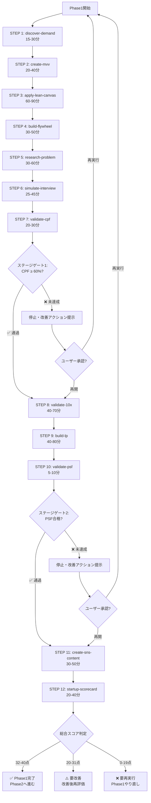

# /orchestrate-phase1 詳細分析

**生成日時**: 2025-12-30
**分析対象**: `/orchestrate-phase1` の12ステップ詳細
**総実行時間**: 3-6時間（自動実行）

---

## エグゼクティブサマリー

### 概要

`/orchestrate-phase1`は、アイデア創出からPSF検証まで全12ステップを自律実行するオーケストレータースキル。

**主要特徴**:
1. **完全自律実行**: 3-6時間で12ステップを順次実行
2. **ステージゲート管理**: CPF/PSF未達成時は必ず停止・報告（Human-in-the-Loop）
3. **品質保証**: CPF 60%以上/PSF 10倍2軸以上の基準
4. **総合評価**: 最終スコアカード（40点満点）

### 全12ステップ構成

| Phase | ステップ | スキル | 所要時間 | 依存関係 |
|-------|---------|--------|---------|---------|
| **Discovery & Planning** | STEP 1 | /discover-demand | 15-30分 | なし |
| | STEP 2 | /create-mvv | 20-40分 | STEP 1 |
| | STEP 3 | /apply-lean-canvas | 60-90分 | STEP 1, 2 |
| | STEP 4 | /build-flywheel | 30-50分 | STEP 3 |
| **Validation** | STEP 5 | /research-problem | 30-60分 | STEP 3 |
| | STEP 6 | /simulate-interview | 25-45分 | STEP 3, 5 |
| | STEP 7 | /validate-cpf | 20-30分 | STEP 5, 6 |
| **🚧 ステージゲート1** | - | CPF判定 | - | STEP 7 |
| **PSF Validation** | STEP 8 | /validate-10x | 40-70分 | ゲート1通過 |
| | STEP 9 | /build-lp | 40-80分 | STEP 8 |
| | STEP 10 | /validate-psf | 5-10分 | STEP 8, 9 |
| **🚧 ステージゲート2** | - | PSF判定 | - | STEP 10 |
| **Launch Preparation** | STEP 11 | /create-sns-content | 30-50分 | ゲート2通過 |
| | STEP 12 | /startup-scorecard | 20-40分 | STEP 1-11 |

---

## I. 12ステップ詳細分析

### Phase 1: Discovery & Planning（発見・計画）

#### STEP 1: `/discover-demand` - 需要発見リサーチ

**目的**: 市場の魅力度を定量評価し、最有望候補を特定

**入力**:
- 探索分野キーワード（例: "AIツール 業務効率化"）

**処理**:
1. 市場規模推定（TAM/SAM/SOM）
2. 4軸スコアリング（市場魅力度、競争環境、技術適合性、実現可能性）
3. 20点満点評価（12点以上で有望）

**出力**:
- `documents/1_initiating/demand_discovery.md`
- 最有望候補（スコア17/20等）

**依存関係**: なし（Phase1の起点）

**所要時間**: 15-30分

**起業の科学対応**:
- STEP 1.3: 市場規模推定（TAM/SAM/SOM）
- 起業大全 Framework 2: 戦略（ターゲット市場）

---

#### STEP 2: `/create-mvv` - MVV早期定義

**目的**: チームの方向性を統一し、MVVを明文化

**入力**:
- STEP 1の市場情報

**処理**:
1. MVVテンプレート記入（Mission/Vision/Value）
2. 5項目チェック（Mission明確性、Vision明確性、Value具体性、整合性、差別化）
3. 5/5合格で完了

**出力**:
- `documents/3_planning/mvv.md`
- MVV判定: ✅/❌

**依存関係**: STEP 1（市場情報が必要）

**所要時間**: 20-40分

**起業の科学対応**:
- 起業大全 Framework 1: MVV（100%カバー）

---

#### STEP 3: `/apply-lean-canvas` - リーンキャンバス作成

**目的**: ビジネスモデル全体を1枚のキャンバスに可視化

**入力**:
- STEP 1の市場情報
- STEP 2のMVV

**処理**:
1. リーンキャンバス9要素記入
   - 課題（Top 3）
   - 顧客セグメント
   - UVP（Unique Value Proposition）
   - ソリューション
   - チャネル
   - 収益の流れ
   - コスト構造
   - 主要指標
   - 圧倒的な優位性
2. 9要素完成度チェック

**出力**:
- `documents/2_discovery/lean_canvas.md`
- リーンキャンバス完成度: 9/9要素

**依存関係**: STEP 1, 2（市場情報とMVVが必要）

**所要時間**: 60-90分（最も時間がかかるステップ）

**起業の科学対応**:
- STEP 2.1: 課題仮説キャンバス（部分的）
- STEP 3.1: UVP定義（部分的）
- リーンキャンバス自体は起業の科学の補完フレームワーク

---

#### STEP 4: `/build-flywheel` - フライホイール設計

**目的**: 成長の好循環を事前に設計

**入力**:
- STEP 3のリーンキャンバス

**処理**:
1. フライホイール6要素循環設計
   - ユーザー増加 → データ蓄積 → プロダクト改善 → 満足度向上 → 口コミ増加 → ユーザー増加（循環）
2. Mermaid図による可視化
3. 10点満点評価（8-10点で完了）

**出力**:
- `documents/2_discovery/flywheel.md`
- フライホイール図（Mermaid）

**依存関係**: STEP 3（ビジネスモデルが必要）

**所要時間**: 30-50分

**起業の科学対応**:
- STEP 5.3: フライホイールの構築（95%カバー）

---

### Phase 2: Validation（検証）

#### STEP 5: `/research-problem` - Web課題発見

**目的**: Web情報で課題を裏付け、仮説を強化

**入力**:
- STEP 3のリーンキャンバス（課題仮説）

**処理**:
1. Web検索による課題裏付け
2. 5軸スコアリング（課題深刻度、頻度、既存代替品の問題、ターゲットの明確性、検証可能性）
3. 50点満点評価（35点以上で強い裏付け）

**出力**:
- `documents/2_discovery/problem_research.md`
- 課題裏付けスコア（50点満点）

**依存関係**: STEP 3（課題仮説が必要）

**所要時間**: 30-60分

**起業の科学対応**:
- STEP 2.1: 課題仮説キャンバス（補完）
- STEP 2.2: 顧客インタビュー（Web版）

---

#### STEP 6: `/simulate-interview` - 仮想ペルソナインタビュー

**目的**: AI仮想インタビューで初期検証を高速化

**入力**:
- STEP 3のペルソナ
- STEP 5の課題情報

**処理**:
1. 4U検証（Unworkable, Unavoidable, Urgent, Underserved）
2. 15-20問のインタビュー質問
3. 40点満点スコアリング（32点以上で良好）
4. v2拡張: 4Uスコア（Underserved軸追加）

**出力**:
- `documents/2_discovery/interview_simulation.md`
- 4Uスコア（40点満点）
- インタビュー結果（15-20問）

**依存関係**: STEP 3, 5（ペルソナと課題が必要）

**所要時間**: 25-45分

**起業の科学対応**:
- STEP 1.1: 3U+1の法則（85%カバー、仮想版）
- STEP 2.2: 顧客インタビュー（仮想版）

---

#### STEP 7: `/validate-cpf` - CPF診断

**目的**: CPF（Customer Problem Fit）達成状況を判定

**入力**:
- STEP 5の課題裏付け
- STEP 6のインタビュー結果

**処理**:
1. CPF4指標判定
   - インタビュー数: 20人以上（仮想）
   - 課題共通率: 70%以上
   - 支払い意思率: 50%以上
   - 緊急性スコア: 7/10以上
2. CPFスコア算出（0-100%）
3. v2拡張: Phase2実インタビューロードマップ生成

**出力**:
- `documents/3_planning/cpf_diagnosis.md`
- **CPFスコア**: 75%等（ステージゲート判定に使用）

**依存関係**: STEP 5, 6（課題とインタビュー結果が必要）

**所要時間**: 20-30分

**起業の科学対応**:
- STEP 2.4: CPF達成の判断基準（85%カバー）

---

### 🚧 ステージゲート1: CPF判定

**判定基準**: CPFスコア ≥ 60%

**通過時**: STEP 8へ進む

**未達成時**: **停止**（Human-in-the-Loop必須）
- 改善アクション提示:
  - Problem再定義
  - Persona絞り込み
  - UVP調整
- ユーザー承認後に再開 or Phase1再実行

**起業の科学対応**:
- STEP 2.4: CPF達成の判断基準（ステージゲート機能）

---

### Phase 3: PSF Validation（PSF検証）

#### STEP 8: `/validate-10x` - 10倍優位性検証

**目的**: 既存代替品に対する10倍の優位性を検証

**入力**:
- STEP 3のUVP
- 競合情報（`/research-competitors`がある場合）

**処理**:
1. 5軸比較（速度、価格、便利さ、楽しさ、品質）
2. 各軸で10倍判定（10倍以上: ✅、3-10倍: △、3倍未満: ❌）
3. **2軸以上10倍達成がPSF通過条件**
4. v2拡張: `/research-competitors`成果物統合

**出力**:
- `documents/2_discovery/10x_validation.md`
- **10倍達成軸数**: 3軸等（ステージゲート判定に使用）
- 各軸の倍率（10.5倍等）

**依存関係**: ステージゲート1通過（CPF達成後のみ実行）

**所要時間**: 40-70分

**起業の科学対応**:
- STEP 3.3: 10倍改善の原則（95%カバー）

---

#### STEP 9: `/build-lp` - LP構築

**目的**: MVP（最小実用プロダクト）としてランディングページを構築

**入力**:
- STEP 3のUVP
- STEP 8の10倍優位性

**処理**:
1. MVP10類型から最適形式を選択（通常はランディングページ）
2. LP自動生成（HTML/CSS/JS）
3. 5項目チェック（5/5で完了）
   - UVP明確性
   - CTA（Call To Action）明確性
   - 便益の可視化
   - 信頼性の担保
   - モバイル対応

**出力**:
- `mvp/lp/README.md`
- ランディングページ（HTML/CSS/JS）
- **MVP選定完了**: Yes（ステージゲート判定に使用）

**依存関係**: STEP 8（10倍優位性が必要）

**所要時間**: 40-80分

**起業の科学対応**:
- STEP 3.2: MVPの種類（85%カバー、ランディングページMVP）

---

#### STEP 10: `/validate-psf` - PSF診断

**目的**: PSF（Problem Solution Fit）達成状況を判定

**入力**:
- STEP 8の10倍優位性
- STEP 9のMVP選定

**処理**:
1. PSF3条件判定
   - 10倍優位性: 2軸以上 ✅
   - MVP選定: 完了 ✅
   - UVP明確性: 35/40以上 ✅
2. PSFスコア算出（0-100%）
3. v2拡張候補: MoSCoW Prioritization（未実装）

**出力**:
- `documents/3_planning/psf_diagnosis.md`
- **PSFスコア**: 85%等（ステージゲート判定に使用）

**依存関係**: STEP 8, 9（10倍優位性とMVPが必要）

**所要時間**: 5-10分（最も短いステップ）

**起業の科学対応**:
- STEP 3.4: PSF達成の判断基準（70%カバー）

---

### 🚧 ステージゲート2: PSF判定

**判定基準**: 10倍2軸以上 + MVP選定完了 + UVP明確（35/40以上）

**通過時**: STEP 11へ進む

**未達成時**: **停止**（Human-in-the-Loop必須）
- 改善アクション提示:
  - Solution再設計
  - 10倍軸の強化
  - MVP類型変更
- ユーザー承認後に再開 or Phase1再実行

**起業の科学対応**:
- STEP 3.4: PSF達成の判断基準（ステージゲート機能）

---

### Phase 4: Launch Preparation（ローンチ準備）

#### STEP 11: `/create-sns-content` - SNSコンテンツ作成

**目的**: ローンチ時の初期認知獲得施策を準備

**入力**:
- STEP 3のUVP
- STEP 9のLP

**処理**:
1. X投稿3パターン以上生成
2. LinkedIn投稿生成
3. ハッシュタグ10個以上提案
4. 投稿スケジュール提案

**出力**:
- `mvp/sns_contents/posts.md`
- SNS投稿コンテンツ（3パターン以上）
- ハッシュタグリスト（10個以上）

**依存関係**: ステージゲート2通過（PSF達成後のみ実行）

**所要時間**: 30-50分

**起業の科学対応**:
- STEP 5.2: グロースハック（Acquisition部分、90%カバー）
- 起業大全 Framework 6: マーケティング（SNSチャネル戦略）

---

#### STEP 12: `/startup-scorecard` - 最終評価

**目的**: Phase1全体の成果を総合評価

**入力**:
- STEP 1-11の全成果物

**処理**:
1. 4視点評価（各10点、40点満点）
   - アイデア・課題（10点）
   - ソリューション（10点）
   - 市場・顧客（10点）
   - チーム・実行（10点）
2. 総合判定
   - 32-40点: ✅ Phase1完了 → Phase2へ進む
   - 20-31点: ⚠️ 要改善 → 低スコア視点を改善後、再評価
   - 0-19点: ❌ 要再実行 → Phase1を最初からやり直し

**出力**:
- `documents/5_monitoring/scorecard.md`
- **総合スコア**: 39/40点等
- **総合判定**: ✅ Phase1完了 / ⚠️ 要改善 / ❌ 要再実行
- 次のアクション提案

**依存関係**: STEP 1-11（全成果物が必要）

**所要時間**: 20-40分

**起業の科学対応**:
- 全STEP（STEP 0-5）の総合評価（85%カバー）
- 起業大全 Framework 9: KPIダッシュボード（簡易版）

---

## II. 実行フロー図



---

## III. 依存関係マトリクス

| ステップ | 依存するステップ | 必須入力 |
|---------|----------------|---------|
| STEP 1 | なし | 探索分野キーワード（オプション） |
| STEP 2 | STEP 1 | 市場情報 |
| STEP 3 | STEP 1, 2 | 市場情報、MVV |
| STEP 4 | STEP 3 | リーンキャンバス |
| STEP 5 | STEP 3 | リーンキャンバス（課題仮説） |
| STEP 6 | STEP 3, 5 | ペルソナ、課題情報 |
| STEP 7 | STEP 5, 6 | 課題裏付け、インタビュー結果 |
| **ゲート1** | STEP 7 | CPFスコア ≥ 60% |
| STEP 8 | ゲート1通過 | UVP、競合情報 |
| STEP 9 | STEP 8 | 10倍優位性 |
| STEP 10 | STEP 8, 9 | 10倍優位性、MVP |
| **ゲート2** | STEP 10 | PSF合格 |
| STEP 11 | ゲート2通過 | UVP、LP |
| STEP 12 | STEP 1-11 | 全成果物 |

---

## IV. ステージゲート詳細

### ステージゲート1: CPF（Customer Problem Fit）

**目的**: 顧客課題の実在性と緊急性を確認

**判定基準**:
- CPFスコア ≥ 60%
- 内訳:
  - 課題共通率: 70%以上（仮想インタビュー）
  - 支払い意思率: 50%以上
  - 緊急性スコア: 7/10以上
  - 課題裏付け強度: 35/50以上

**通過時**: STEP 8（PSF検証）へ進む

**未達成時**:
1. **停止**（自動実行を一時停止）
2. **改善アクション提示**:
   - Problem再定義（課題を再検討）
   - Persona絞り込み（ターゲット顧客の明確化）
   - UVP調整（価値提案の見直し）
3. **Human-in-the-Loop**: ユーザーに承認を求める
   - 承認 → 改善後に再開
   - 拒否 → Phase1を最初からやり直し

**起業の科学との整合性**:
- STEP 2.4: CPF達成の判断基準（5条件）
- ステージゲート機能により、品質の低いアイデアが後続ステップに進まない

---

### ステージゲート2: PSF（Problem Solution Fit）

**目的**: 課題に対するソリューションの適合性を確認

**判定基準**:
- 10倍優位性: 2軸以上で10倍達成
- MVP選定: 完了
- UVP明確性: 35/40以上

**通過時**: STEP 11（ローンチ準備）へ進む

**未達成時**:
1. **停止**（自動実行を一時停止）
2. **改善アクション提示**:
   - Solution再設計（ソリューションの見直し）
   - 10倍軸の強化（既存代替品との差別化強化）
   - MVP類型変更（ランディングページ以外のMVP検討）
3. **Human-in-the-Loop**: ユーザーに承認を求める
   - 承認 → 改善後に再開
   - 拒否 → Phase1を最初からやり直し

**起業の科学との整合性**:
- STEP 3.4: PSF達成の判断基準（5条件）
- ステージゲート機能により、10倍改善されていないソリューションが後続ステップに進まない

---

## V. エラーハンドリング

### 各ステップの失敗時

**失敗シナリオ**:
- Webアクセス失敗
- スキル実行エラー
- 成果物生成失敗

**対応**:
1. **自動リトライ**: 最大3回
2. **代替手段提示**:
   - 例: `/research-problem`失敗 → 手動リサーチ推奨
3. **停止・報告**: リトライ失敗時はユーザーに報告

---

### ステージゲート未達成時

**対応**: 前述の通り（Human-in-the-Loop必須）

---

## VI. 成果物一覧

### 最終成果物（12個）

```
{IDEA_FOLDER}/
├── documents/
│   ├── 1_initiating/
│   │   ├── demand_discovery.md ← STEP 1
│   │   └── business_idea.md ← STEP 3
│   ├── 2_discovery/
│   │   ├── lean_canvas.md ← STEP 3
│   │   ├── persona.md ← STEP 3
│   │   ├── flywheel.md ← STEP 4
│   │   ├── problem_research.md ← STEP 5
│   │   ├── interview_simulation.md ← STEP 6
│   │   └── 10x_validation.md ← STEP 8
│   ├── 3_planning/
│   │   ├── mvv.md ← STEP 2
│   │   ├── cpf_diagnosis.md ← STEP 7
│   │   └── psf_diagnosis.md ← STEP 10
│   └── 5_monitoring/
│       └── scorecard.md ← STEP 12
├── mvp/
│   ├── lp/ ← STEP 9
│   │   ├── README.md
│   │   ├── index.html
│   │   ├── style.css
│   │   └── script.js
│   └── sns_contents/ ← STEP 11
│       └── posts.md
└── phase1_summary.md ← 最終サマリー
```

---

## VII. 起業の科学 対応分析

### 全STEP対応度

| 起業の科学 | 対応ステップ | カバー率 |
|-----------|------------|---------|
| **STEP 0: Starting Point** | - | 75% |
| **STEP 1: アイデア検証** | STEP 1, 6 | 83% |
| **STEP 2: CPF** | STEP 3, 5, 6, 7 | **88%** ✅ |
| **STEP 3: PSF** | STEP 8, 9, 10 | **75%** ✅ |
| **STEP 4: PMF** | - | **0%** ❌ |
| **STEP 5: Scale** | STEP 4, 11 | 50% |

### 実装されているフレームワーク

1. ✅ **TAM/SAM/SOM計算** (STEP 1)
2. ✅ **MVV策定** (STEP 2)
3. ✅ **リーンキャンバス** (STEP 3)
4. ✅ **フライホイール設計** (STEP 4)
5. ✅ **課題仮説キャンバス** (STEP 5)
6. ✅ **3U+1の法則** (STEP 6)
7. ✅ **CPF判定基準** (STEP 7 + ゲート1)
8. ✅ **10倍改善の原則** (STEP 8)
9. ✅ **MVP10類型選択** (STEP 9)
10. ✅ **PSF判定基準** (STEP 10 + ゲート2)
11. ✅ **グロースハック（Acquisition）** (STEP 11)
12. ✅ **総合スコアカード** (STEP 12)

### 未実装フレームワーク（Phase1対象外）

1. ❌ **PMF Validation** - Phase2で実装予定
2. ❌ **AARRR詳細** - Phase2で実装予定
3. ❌ **Unit Economics詳細** - オプションスキルで実装済み
4. ❌ **人材・組織** - レイター期向け
5. ❌ **Sales・CS** - PMF達成後

---

## VIII. 実行時の重要ポイント

### 1. Human-in-the-Loop設計

**ステージゲート未達成時は必ず停止**:
- 自動実行だが、品質基準未達成時は人間の判断を求める
- 低品質なアイデアが後続ステップに進まない

### 2. 総実行時間の変動要因

**最短ケース（3時間）**:
- 全ステップが順調に完了
- ステージゲート両方とも一発通過
- 最短実行時間で完了

**最長ケース（6時間）**:
- STEP 3（リーンキャンバス）で90分
- STEP 8（10倍検証）で70分
- STEP 9（LP構築）で80分
- その他のステップも上限時間

**ステージゲート停止時**:
- 改善アクション実行時間は別途必要
- 再実行の場合は3-6時間を追加

### 3. v2拡張機能

**既に実装済み**:
1. **4U検証** (STEP 6) - Underserved軸追加
2. **MVP10類型自動選択** (STEP 9)
3. **競合対比10倍検証** (STEP 8) - `/research-competitors`統合
4. **Phase2実インタビューロードマップ** (STEP 7) - CPF判定後の次ステップ

---

## IX. 次ステップ推奨（Phase2移行）

### Phase1完了後のアクション

**総合スコア32-40点の場合**:
1. **LP公開** (Netlify等)
2. **SNS投稿開始** (STEP 11の成果物活用)
3. **Phase2へ進む**:
   - 実顧客インタビュー（20-30人）
   - PMF検証（Sean Ellisテスト）
   - Growth Hacking（AARRR詳細実装）

**総合スコア20-31点の場合**:
1. 低スコア視点を改善
2. STEP 12再実行
3. 32点以上達成後にPhase2へ

**総合スコア0-19点の場合**:
1. Phase1を最初からやり直し
2. アイデア自体の見直しを検討

---

## X. 制約事項と将来拡張

### 現在の制約

1. **実顧客インタビュー未対応**: STEP 6は仮想インタビュー
2. **PMF検証未実装**: Phase2で実装予定
3. **MoSCoW Prioritization未実装**: STEP 10で未カバー
4. **A/Bテスト未実装**: STEP 9で未カバー

### 将来拡張候補

1. **Phase2オーケストレーター**: PMF検証までの自動実行
2. **MoSCoW Prioritization統合**: STEP 10 v2拡張
3. **実インタビュー連携**: STEP 6とPhase2の統合
4. **A/Bテスト機能**: STEP 9の拡張

---

**作成完了日**: 2025-12-30
**次ステップ**: T004-6で各ステップと起業の科学フレームワークの対応を明記
