# 落合陽一note記事 時系列トレンド可視化

## 概要

本ドキュメントは、2019年1月から2025年12月までの落合陽一氏のnote記事（全1,620件）について、時系列で変化している主要トレンドをMermaidダイアグラムで可視化したものである。

## 1. 投稿数の時系列推移

### 1.1 年別投稿数の推移

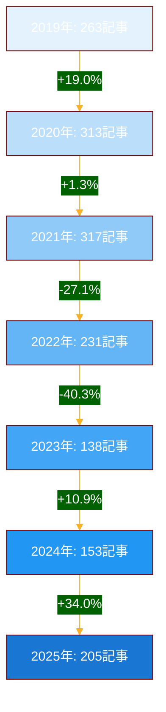

### 1.2 期間別投稿数比較

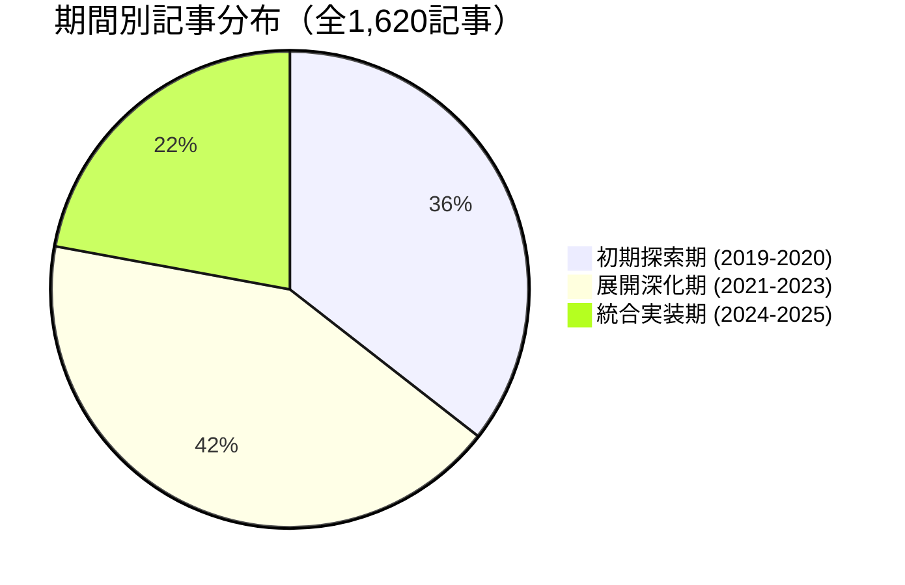

**分析**:
- 2019-2020年の初期探索期から2021-2023年の展開深化期にかけて投稿が増加
- 2023年以降は記事数が減少するも、2025年にnull²プロジェクト関連で再増加
- 量から質への転換が見られる

## 2. テーマ別トレンドの時系列変化

### 2.1 期間別主要テーマ分布

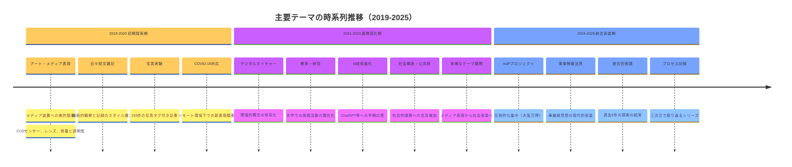

### 2.2 主要テーマの出現頻度推移（棒グラフ概念図）

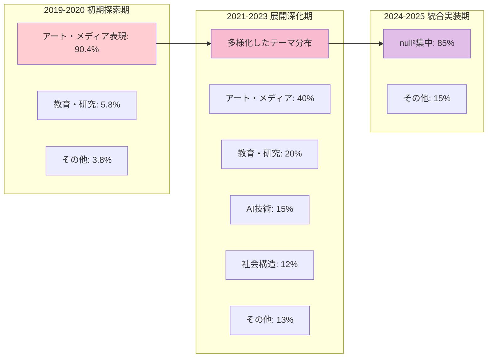

**分析**:
- **初期探索期**: アート・メディア表現が圧倒的（90%以上）
- **展開深化期**: テーマの多様化、教育・AI・社会課題への展開
- **統合実装期**: null²プロジェクトへの集中（85%以上）

## 3. キーワード出現頻度の時系列変遷

### 3.1 期間別特徴的キーワード

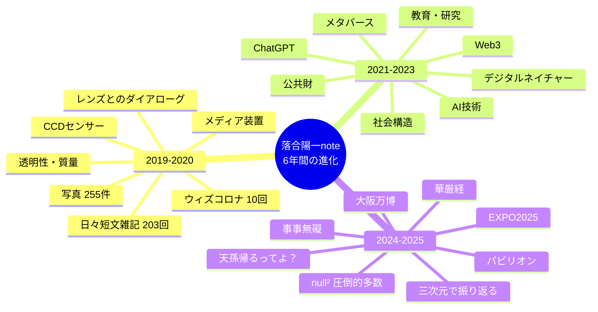

### 3.2 トレンドキーワードの推移（ライン概念）

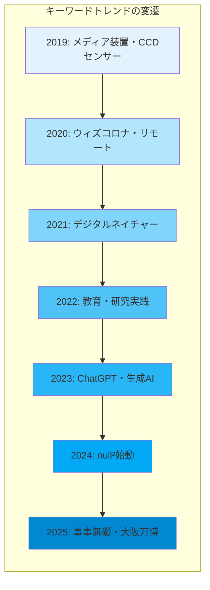

## 4. タグ使用パターンの変化

### 4.1 主要タグの時系列分布

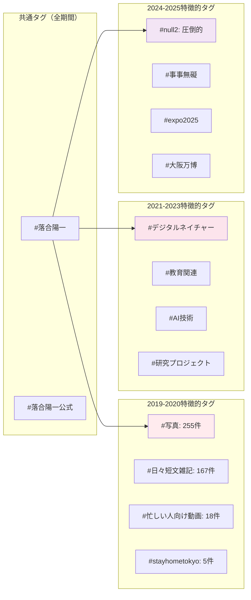

## 5. トレンド1: 「個人的探索」から「社会的実装」へ

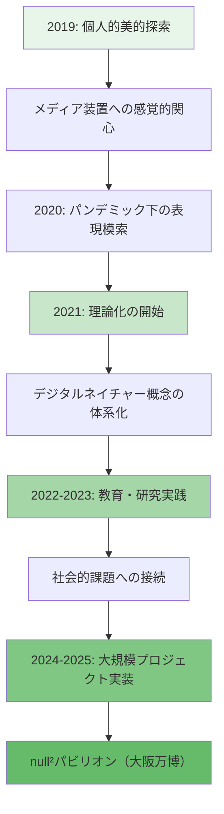

**トレンド分析**:
- 初期の「CCDセンサーで見る夜の街はなぜこんなに妖艶なんだろう」的な個人的美的探索
- 中期の理論構築と教育実践
- 後期の大規模社会実装（大阪万博）
- **6年間で「個人」→「理論」→「社会」へと射程が拡大**

## 6. トレンド2: 「断片的記録」から「体系的ドキュメンテーション」へ

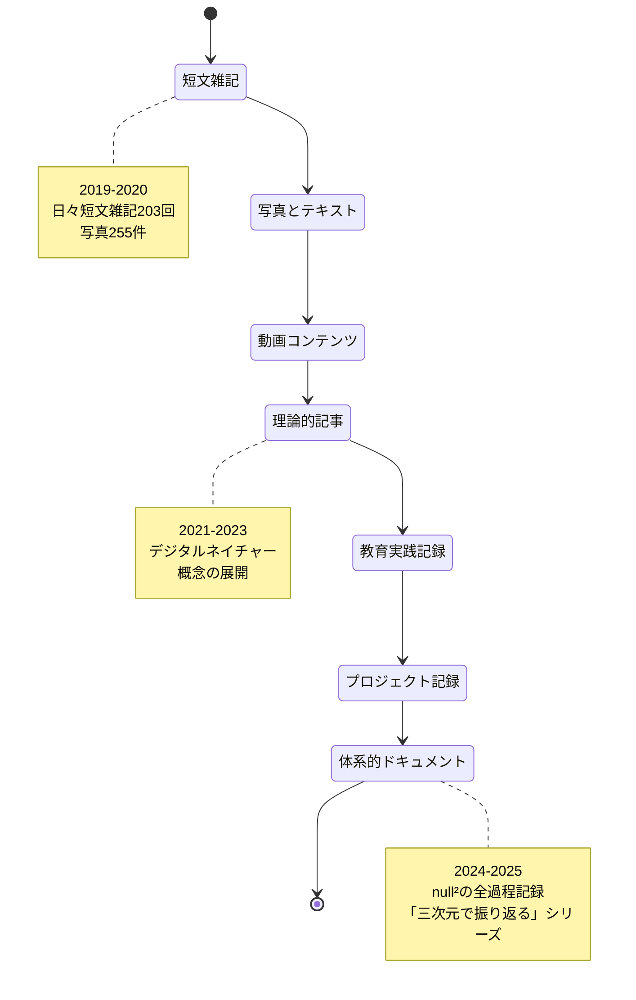

**トレンド分析**:
- 初期: 断片的観察（「随時更新」「書き途中」）
- 中期: より構造化された記事
- 後期: プロジェクト全体の体系的記録
- **記録の質的進化: スナップショット→ドキュメンタリー→アーカイブ**

## 7. トレンド3: 「技術と美」から「技術と思想」へ

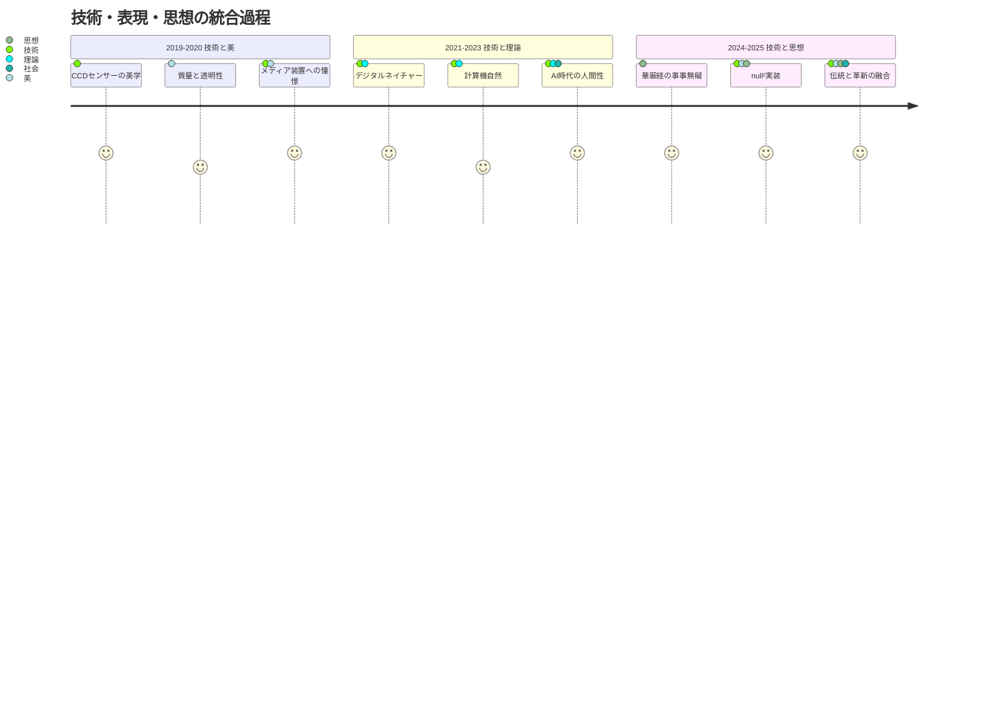

**トレンド分析**:
- 初期: 技術的メディアへの美的関心
- 中期: 理論的概念の構築
- 後期: 伝統思想（華厳経）と現代技術の統合
- **「表層の美」→「概念の構築」→「思想の実装」という深化**

## 8. 月別投稿パターンの変化

### 8.1 期間別月平均投稿数

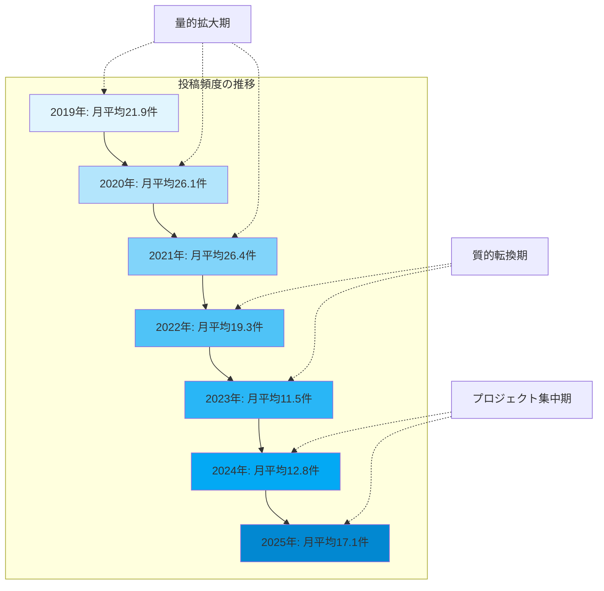

## 9. テーマ多様性指数の変化

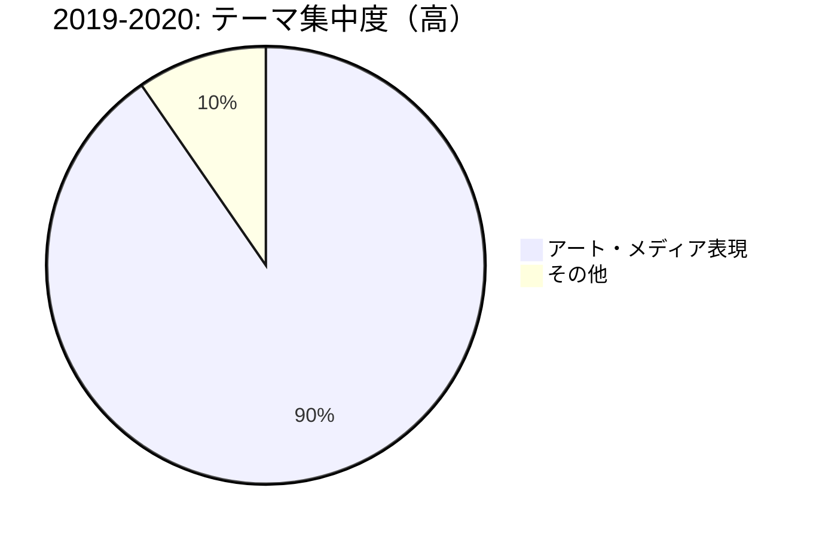

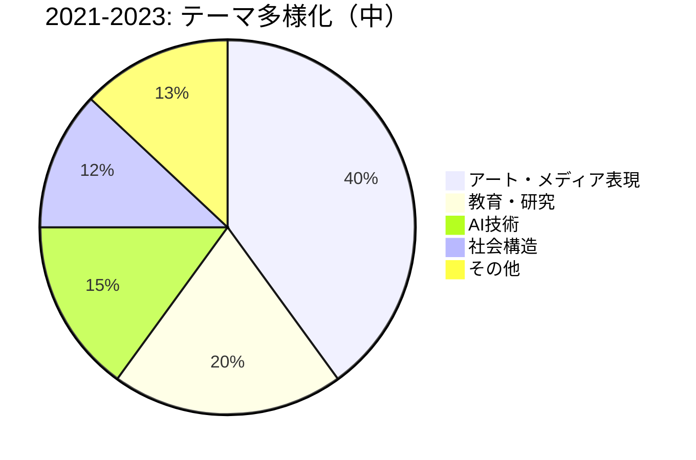

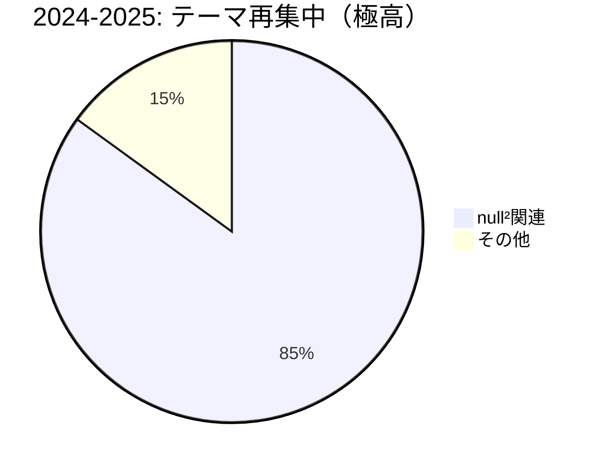

**トレンド分析**:
- 初期: 単一テーマへの集中（探索）
- 中期: テーマの多様化（展開）
- 後期: 新たな集中（統合）
- **U字型の集中度変化: 探索→拡散→統合**

## 10. 総合トレンドマップ

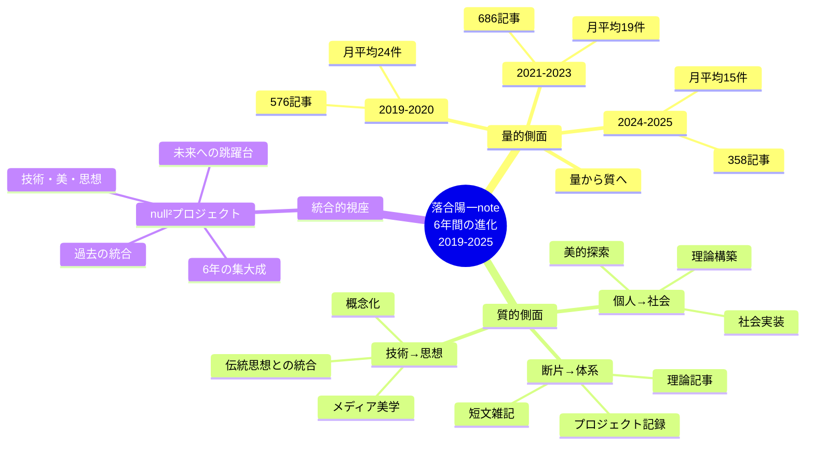

## まとめ

本可視化により、以下の3つの主要トレンドが明確化された：

### トレンド1: 射程の拡大
- **個人的探索** → **理論構築** → **社会的実装**
- 美的感受性から始まり、概念化を経て、大阪万博という社会的舞台での実装へ

### トレンド2: 記録の進化
- **断片的スナップショット** → **構造的記述** → **体系的アーカイブ**
- 「随時更新」から「三次元で振り返る」シリーズへの質的転換

### トレンド3: 深化の軌跡
- **技術と美** → **技術と理論** → **技術と思想**
- メディア装置の美学から、華厳経「事事無礙」の現代的実装へ

これら3つのトレンドは独立ではなく、**相互に影響し合いながら螺旋的に深化**している。null²プロジェクトは、この6年間の探索・理論・実践の総体的結実であり、同時に次なる展開への起点でもある。

---

**作成日**: 2025-12-30
**データ期間**: 2019年1月 - 2025年12月
**総記事数**: 1,620件
