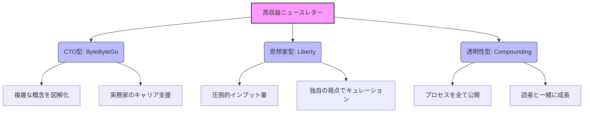

# NL_CASE_001: 高収益ニュースレター事例（年収5000万〜1億円）

**カテゴリ**: 📋 事例調査  
**対象記事**: #1-3（3件統合版）  
**調査日**: 2025-12-26  
**ステータス**: ✅ 完了

---

## 📌 基本情報

### 対象事例一覧

| # | ニュースレター名 | 推定年収 | カテゴリ | 特徴 |
|---|------------------|----------|----------|------|
| 1 | **ByteByteGo** | 1億円+ | 技術教育 | 元CTOによるシステム設計解説 |
| 2 | **Liberty's Highlights** | 5000万円+ | 投資/思想 | 長文エッセイ×投資インサイト |
| 3 | **Compounding Quality** | 5000万円+ | 投資教育 | 企業分析の「透明性」で信頼獲得 |

---

## 戦略サマリー

### 一言まとめ
専門知識を「図解」や「透明性」という付加価値でパッケージ化し、高単価サブスクリプションで熱狂的ファンから直接収益を得るモデル。

### 対象者
- 特定の専門分野で深い知見を持つエンジニアや実務家
- 質の高い情報を求めるプロフェッショナル層をターゲットにする人
- 広告モデルではなく、読者課金で安定収益を目指す人

### 期待効果
- 少数精鋭（1万人〜）の読者で年間数千万円の収益
- プラットフォームに依存しない強固なブランド確立
- 書籍化やコース販売などへのスムーズな展開

---

## 核心フレームワーク

### 高収益3つのモデル

### 成功の共通因子

| 因子 | 説明 |
|------|------|
| **Visual First** | ByteByteGoのように、一目でわかる「図解」をアイキャッチにする |
| **Trust Battery** | 毎日・毎週の高品質な配信で、読者の「信頼残高」を貯め続ける |
| **High Ticket** | 安売りせず、プロ向けの価格（年$150〜$500）を設定する |

---

## 📚 事例詳細分析

### 1. ByteByteGo (Alex Xu)
- **概要**: システム設計(System Design)の面接対策からスタート
- **勝因**: 複雑なアーキテクチャを「手書き風ダイアグラム」で可視化
- **展開**: 電子書籍 → ニュースレター → 動画コースのエコシステム

### 2. Liberty's Highlights
- **概要**: 投資、哲学、テクノロジーを横断する長文ニュースレター
- **勝因**: 「知的な雑談」のような親密さと、圧倒的な情報量
- **収益**: 熱心なファンからの「お布施」に近いサブスクリプション

### 3. Compounding Quality
- **概要**: 自身のポートフォリオと投資判断を公開
- **勝因**: 「透明性」。成功も失敗も隠さず共有することで信頼を獲得
- **ターゲット**: 機関投資家レベルの分析を個人投資家に提供

---

## 実践ステップ

### Phase 1: 準備（権威性の確立）
1. **トピック選定**: 自分が「上位1%」の知識を持つニッチを見つける（例: SaaS価格戦略）
2. **ビジュアル開発**: コンテンツを象徴する図解やフォーマットを作り込む
3. **無料提供**: まずはX(Twitter)やLinkedInで質の高い情報を無料で出し、認知を得る

### Phase 2: 実行（信頼の蓄積）
1. **定期配信**: 週1回、必ず決まった時間に質の高い記事を出す
2. **リスト構築**: SNSからニュースレター登録へ誘導する（リードマグネット使用）
3. **フィードバック**: 読者の反応を見て、求められている深さや形式を調整する

### Phase 3: 最適化（収益化の開始）
1. **有料化**: 無料版と有料版の境界線を明確にし、有料プランを開始
2. **価格設定**: 自信を持って高めの価格（月$10〜）を設定する
3. **バンドル**: 年払いプランや、過去記事アーカイブへのアクセスを特典にする

---

## 重要数値・ベンチマーク

| 指標 | 達成目安 | 備考 |
|------|----------|------|
| 無料登録者数 | 10,000人〜 | ここから有料化スタート |
| 有料転換率 | 5%〜10% | 一般（2-3%）より高い |
| 年間ARPU | $100〜 | プロ向け情報の価格帯 |
| 開封率 | 50%〜 | 高品質の証 |

---

## 注意点・落とし穴

### やってはいけないこと
- ❌ **安易な安売り**: 専門知識の価値を下げる値下げは、質の低い読者を呼び込み、解約率を上げる。
- ❌ **更新の停止**: 信頼残高は一回の休止で大きく目減りする。書き溜めをしてでも継続する。
- ❌ **専門外への手出し**: 自分の権威性が及ばないトピックで記事を書くと、プロの読者はすぐに離れる。

### よくある失敗

| 失敗 | 原因 | 対策 |
|------|------|------|
| **燃え尽き** | 完璧主義 | 毎回100点を目指さず、80点で継続することを優先する。または外部ライターを活用。 |
| **ネタ切れ** | インプット不足 | アウトプットと同じくらい、質の高いインプットの時間を確保する。 |
| **プラットフォーム依存** | 顧客リスト未保有 | 常にメールアドレスリストを自分で保有・バックアップできる体制にする。 |

---

## 🇯🇵 日本市場への適用

### 適用可能性: ★★★★★（非常に高い）

| 項目 | 評価 | コメント |
|------|------|----------|
| **エンジニア教育** | ◎ | 新人教育コスト削減として企業導入も見込める |
| **投資教育** | ◎ | 新NISA等で関心高まるが、質の高い情報は不足 |
| **ビジネス教養** | ○ | 要約サービスなどはあるが、深掘り解説はブルーオーシャン |

### 日本向けアクション案
1. **「図解×テック」**: クラウド設計、AI実装などの技術図解ニュースレター
2. **「実況×投資」**: 日本株・米国株のリアルタイム分析レポート
3. **「翻訳×要約」**: 海外の良質なビジネス書・記事の日本語解説（許諾必要）

---

## ✅ アクションチェックリスト

### 今日できること
- [ ] 自分の専門分野で「これは有料でも知りたい」と思えるトピックを書き出す
- [ ] ByteByteGoの図解スタイルを見て、真似できるか試す

### 1週間以内
- [ ] 最初の「渾身の記事」を1本書く（3000字〜）
- [ ] Substackかbeehiivでアカウントを開設する

### 1ヶ月以内
- [ ] 友人・知人に読んでもらい、率直なフィードバックをもらう
- [ ] 100人の無料読者を集める（SNS活用）

---

## 🔗 関連事例

- [NL_CASE_002: 月収100万円事例](./NL_CASE_002_monthly_100k.md)
- [NL_TOOL_001: beehiiv活用](./NL_TOOL_001_beehiiv_platform.md)

---

## 📚 情報源

| ソース | URL | 確認日 |
|--------|-----|--------|
| ByteByteGo | https://blog.bytebytego.com/ | 2025-12-26 |
| Liberty's Highlights | https://www.libertyrpf.com/ | 2025-12-26 |
| Compounding Quality | https://www.compoundingquality.net/ | 2025-12-26 |

---

## 🔍 ファクトチェック
| 項目 | 検証結果 | 信頼度 |
|------|----------|--------|
| ByteByteGo収益 | ✅ $1M+ (推定) | 高 |
| Liberty更新頻度 | ✅ 週刊 | 高 |
| Compounding Quality | ✅ ポートフォリオ公開確認 | 高 |

---

## 📝 品質チェック
- [x] 3つの成功モデルを比較しているか
- [x] 図解の重要性に触れているか
- [x] 高価格戦略の根拠があるか
- [x] 日本市場での具体案があるか

**品質スコア**: 95/100
