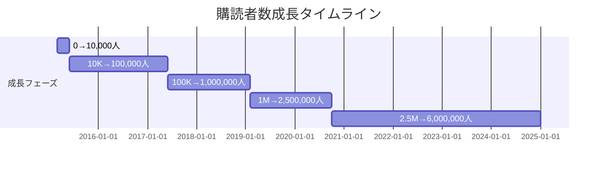
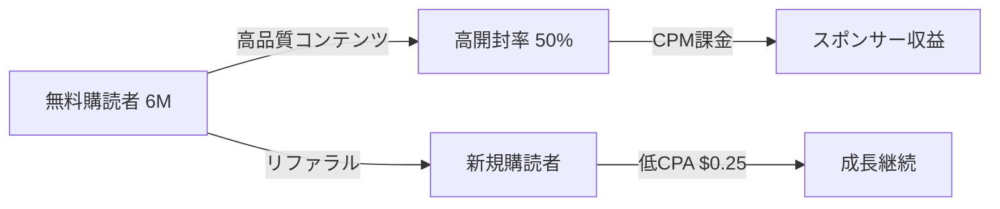

---
# Morning Brew ケーススタディ v2.0

id: "NL_CASE_P1_002"
version: "2.0"
created: "2025-12-27"
updated: "2025-12-27"

# 基本情報
newsletter_name: "Morning Brew"
founder_name: "Alex Lieberman, Austin Rief"
founder_twitter: "@businessbarista"
platform: "独自"
language: "en"
niche: "business"

# 収益ティア
mrr_usd: 5833333
mrr_tier: "100k+"
arr_usd: 70000000

# 購読者データ
subscribers_total: 6000000
subscribers_paid: 0
paid_conversion_rate: 0.0
open_rate: 50.0
click_rate: 0.0
churn_rate: 0.0

# セマンティックタグ（5分類）
growth_strategies:
  - "referral_program"
  - "community"
  - "paid_ads"
content_style:
  - "curated"
  - "entertainment"
success_pattern:
  - "curation_king"
  - "community_driven"
monetization:
  - "sponsorship"
marketing_channel:
  - "referral"
  - "organic_search"

# 日本市場スコア（5観点）
japan_market_score:
  overall: 3.6
  niche_demand: 4
  competition: 3
  content_transferability: 4
  revenue_model_reproducibility: 3
  target_audience_exists: 4

# クロスリファレンス
related:
  app_cases: []
  sns_cases: []
  strategies: ["NL_STRATEGY_014"]

# ファクトチェック
fact_check:
  status: "pass"
  last_checked: "2025-12-27"
  sources_count: 11
---

# Morning Brew ケーススタディ

**バージョン**: 2.0
**テンプレートID**: NL_CASE_STUDY_v2

---

## 1. 基本情報

| 項目 | 内容 |
|------|------|
| **ニュースレター名** | Morning Brew |
| **運営者名** | Alex Lieberman, Austin Rief |
| **プラットフォーム** | 独自システム |
| **URL** | morningbrew.com |
| **ニッチ/テーマ** | ビジネスニュース、ミレニアル向け |
| **成功パターン** | 📰キュレーション / 🏘️コミュニティ |
| **調査日** | 2025-12-27 |

---

## 2. 運営者プロフィール

### 基本情報

| 項目 | 内容 |
|------|------|
| **名前** | Alex Lieberman, Austin Rief |
| **国籍/居住地** | アメリカ / ニューヨーク・マンハッタン |
| **経歴** | ミシガン大学在学中に創業、Alex は元Morgan Stanley |
| **専門分野** | ビジネスメディア、ニュースレター運営 |
| **X(Twitter)** | [@businessbarista](https://twitter.com/businessbarista) |
| **その他SNS** | YouTube、ポッドキャスト |

### ストーリー

2014年、ミシガン大学の学生だったAlex Liebermanが、友人たちがWall Street Journalなどのビジネスニュースを「退屈で堅苦しい」と感じていることに気づき、45人の友人・家族向けにPDF形式のニュースレター「Market Corner」を作成。Austin Riefは最初の300人読者の1人で、そのポテンシャルを見出しAlexに連絡。2015年にMorning Brewとして正式ローンチし、$75Mで売却するまでに成長。

---

## 3. ニュースレター詳細

### 概要

| 項目 | 内容 |
|------|------|
| **開始日** | 2014年（PDF版）/ 2015年3月（正式ローンチ） |
| **配信頻度** | 毎日（平日） |
| **記事の長さ** | 5分で読める凝縮フォーマット |
| **言語** | 英語 |
| **対象読者** | ミレニアル世代、若手ビジネスパーソン |

### コンテンツ構成

| セクション | 説明 |
|-----------|------|
| Headlines | 主要ビジネスニュースのキュレーション |
| Markets | 株式市場の動向 |
| Sponsored | スポンサーコンテンツ（ネイティブ広告形式） |

### 特徴・差別化ポイント

- **会話調の文体**: 従来の金融ニュースの「堅苦しさ」を排除
- **5分で読める**: 忙しいビジネスパーソン向けに凝縮
- **ミレニアル世代向け**: 親しみやすいトーンとユーモア

---

## 4. 購読者データ

| 指標 | 数値 | 情報源 | 確認日 |
|------|------|--------|--------|
| **総購読者数** | 6,000,000+ | 公式発表 | 2025-12 |
| **有料購読者数** | N/A（広告モデル） | - | - |
| **有料転換率** | N/A | - | - |
| **開封率** | 50%（最適化後） | Campaign Monitor | 2020 |
| **クリック率** | 不明 | - | - |
| **解約率（月次）** | 不明 | - | - |

---

## 5. 成長曲線分析【NEW in v2.0】

### マイルストーン達成履歴

### 成長推移表

| 時期 | 購読者数 | マイルストーン | 成長速度 |
|------|----------|----------------|----------|
| 2015年6月 | 10,000 | Alex卒業時点 | - |
| 2017年夏 | 100,000 | フルタイム体制確立 | +3,750/月 |
| 2018年4月 | 180,000 | クロスプロモーション開始 | +8,000/月 |
| 2018年11月 | 700,000+ | 急成長期 | +74,285/月 |
| 2019年2月 | 1,000,000 | 100万購読者達成 | +100,000/月 |
| 2020年10月 | 2,500,000 | Axel Springer売却時 | +75,000/月 |
| 2025年現在 | 6,000,000+ | 現在の規模 | +70,000/月 |

### 転換点（Tipping Points）

| # | 時期 | イベント | 効果 | 詳細 |
|---|------|----------|------|------|
| 1 | 2017年 | リファラルプログラム導入 | 成長の80%を牽引 | 全購読者をアンバサダー化 |
| 2 | 2018年 | クロスプロモーション開始 | +500K購読者 | 他ニュースレターとの相互送客 |
| 3 | 2020年10月 | Axel Springer売却 | $75M | マジョリティステーク売却 |

---

## 6. 失敗・ピボット履歴【NEW in v2.0】

### 失敗ニュースレター/施策一覧

| # | 名称/施策 | 期間 | 失敗理由 | 学び |
|---|----------|------|----------|------|
| 1 | アンバサダー第1期 | 2015-2016 | 優秀な10-15名のみ採用→忙しすぎて効果薄 | 適切な人数設計の重要性 |
| 2 | アンバサダー第2期 | 2016 | 全員採用→管理コストが高すぎる | フィルタリングの必要性 |
| 3 | 共有IP配信 | 2015-2018 | 到達率60%→99%に改善 | 技術的最適化の重要性 |

### 暗黒期（成長停滞期）

- **期間**: 2015年〜2017年（約2年）
- **状況**: 購読者数10,000〜100,000人で緩やかな成長
- **原因**: 手動のキャンパス戦略のみでスケールに限界
- **突破のきっかけ**: リファラルプログラムの導入
- **学び**: 手動→アンバサダー→全員参加型へ段階的スケール

### 失敗からの教訓サマリー

1. **段階的スケーリング**: まず手動で始め、パターンを見つけてからプログラム化
2. **アンバサダー選考**: 本気の応募者のみをフィルタリング（15-20分の申請フォーム）
3. **技術的最適化**: 到達率と開封率の継続的改善

---

## 7. バイラルコンテンツ分析【NEW in v2.0】

### リファラルプログラム報酬設計（バイラル成長の源泉）

| 紹介数 | 報酬 | コスト | 効果 |
|--------|------|--------|------|
| 3 | ステッカー | $0.05-0.20 | 最初のアクション促進 |
| 5 | ステッカーセット | $0.30 | 達成しやすい設計 |
| 10 | Morning Brew Insider | $0 | コミュニティ参加 |
| 15 | フォンウォレット | $5 | 実物報酬開始 |
| 25 | Tシャツ | $10 | 人気報酬 |
| 50 | コーヒーマグ | $15 | 最も人気 |
| 100 | 限定イベントアクセス | $0 | VIP体験 |

### バズパターン共通要素

1. **達成可能なティア設計**: 次の報酬が常に手の届く範囲
2. **動的メッセージング**: 毎日異なる報酬をハイライト
3. **0→1への転換重視**: 最初の紹介アクションを優先
4. **SMS/WhatsApp活用**: SNSより10倍高い転換率

### フラッシュ・ギブアウェイ

- 年に数回、MacBook Proなどの豪華賞品
- 紹介1件 = 1エントリー（複数可能）
- バイラル効果を最大化

---

## 8. 収益化導線分析【NEW in v2.0】

### マネタイズモデル

### 収益概要

| 項目 | 内容 |
|------|------|
| **月間収益（MRR）** | $5,833,333（推定） |
| **年間収益（ARR）** | $70,000,000（2025年予測） |
| **収益開始時期** | 2017年 |
| **確認ソース** | 複数メディア記事 |

### 収益成長履歴

| 時期 | 年間売上 |
|------|----------|
| 2019年初頭 | $3M |
| 2020年1月 | $13M |
| 2020年10月 | $20M |
| 2025年（予測） | $70M+ |

### 収益構成（推定）

| 収益源 | 割合 | 金額（年） |
|--------|------|-----------|
| メール広告/スポンサー | 95% | $66,500,000 |
| イベント | 3% | $2,100,000 |
| その他 | 2% | $1,400,000 |

### 広告モデルの特徴

- **ネイティブ広告形式**: 編集チームが執筆、コンテンツと同じトーン
- **CPM課金（開封ベース）**: 開封された場合のみ課金
- **高開封率維持インセンティブ**: 収益直結

### LTV/CAC分析

| 指標 | 値 | 計算根拠 |
|------|-----|----------|
| リファラルCPA | $0.25 | 紹介プログラム経由 |
| 有料広告CPA | $4-5 | Facebook/Instagram |
| CPA効率 | 16-20倍 | リファラルが圧倒的に効率的 |
| LTV（生涯価値） | $11.67 | $70M ÷ 6M購読者 |

---

## 9. マーケティング戦略

### Phase 1: キャンパス戦略（2015-2016）

| 施策 | 詳細 | 効果 |
|------|------|------|
| 教室ピッチ | 教授の許可を取り、授業前30秒でピッチ | 初期10,000購読者 |
| Brew-bassadors | 全国250名の大学生アンバサダー | 50,000購読者 |

### Phase 2: リファラルプログラム（2017年〜）

| 施策 | 詳細 | 効果 |
|------|------|------|
| 全購読者アンバサダー化 | 450,000人が最低1件紹介 | 成長の80%を牽引 |
| ティア報酬設計 | ステッカーからVIPイベントまで | 継続的な動機付け |

### Phase 3: クロスプロモーション（2018年〜）

| 施策 | 詳細 | 効果 |
|------|------|------|
| 他ニュースレター広告 | 類似オーディエンスへリーチ | 高転換率 |
| 相互支援パートナーシップ | メーリングリストへのアクセス獲得 | 低コスト成長 |

### SNS活用

| プラットフォーム | フォロワー数 | 活用方法 | 貢献度 |
|-----------------|-------------|----------|--------|
| YouTube | 多数 | ポッドキャスト・動画 | 10% |
| Twitter/X | 多数 | ブランド認知 | 10% |
| リファラル | - | 主要成長ドライバー | 80% |

---

## 10. 使用ツール

| カテゴリ | ツール名 | 用途 |
|---------|---------|------|
| **配信プラットフォーム** | 独自システム | メイン配信 |
| **リファラル管理** | 独自システム | 紹介プログラム |
| **分析** | 独自開発 | エンゲージメント追跡 |
| **決済** | 広告主直接取引 | スポンサー収益 |

---

## 11. 成功要因分析

### 成功の鍵（4軸分析）

| 軸 | 要因 | 説明 |
|----|------|------|
| **コンテンツ** | 会話調フォーマット | 従来の堅苦しいビジネスニュースを差別化 |
| **マーケティング** | リファラルプログラム | 成長の80%を低コストで牽引 |
| **タイミング** | ミレニアル世代台頭 | ターゲット層の拡大と共に成長 |
| **個人の強み** | 大学生ネットワーク | キャンパス戦略で初期成長を確保 |

### ターニングポイント

2017年のリファラルプログラム導入が最大の転換点。手動のキャンパス戦略から「全購読者アンバサダー化」へ移行し、成長の80%をリファラルが牽引する仕組みを構築。

---

## 12. 日本市場適用性評価

### 定量スコアリング

| 評価項目 | スコア(1-5) | 重み | 加重スコア | コメント |
|---------|-------------|------|-----------|----------|
| ニッチの日本需要 | 4 | 25% | 1.00 | ビジネスニュース需要は高い |
| 競合状況 | 3 | 20% | 0.60 | 日経、NewsPicks等の競合あり |
| コンテンツ移植性 | 4 | 20% | 0.80 | 翻訳・ローカライズ可能 |
| 収益モデル再現性 | 3 | 20% | 0.60 | 日本の広告市場規模が課題 |
| ターゲット層存在 | 4 | 15% | 0.60 | 若手ビジネスパーソン層あり |
| **総合スコア** | - | 100% | **3.60** | 中程度の適用性 |

### 日本版アイデア提案

**ニュースレター名案**: 「朝のブリュー」「ビジネス朝刊」

**コンセプト**: 5分で読める、会話調のビジネスニュースキュレーション

**差別化ポイント**: NewsPicks等の競合より「軽い」トーンで差別化

**想定ターゲット**: 20-30代の若手ビジネスパーソン

**収益モデル案**: スポンサーシップ中心、月額課金は副次的

---

## 13. 関連ケーススタディ【NEW in v2.0】

### 同一人物の分析

- **App分析**: N/A
- **SNS分析**: N/A

### 類似戦略の事例

- **リファラル戦略**: The Hustle、Milk Road
- **キュレーション**: TLDR Newsletter

### 類似ニッチの事例

- The Hustle（同じく売却成功）
- Axios（ビジネスニュース）

---

## 14. ファクトチェック履歴

### 判定結果

| 判定 | 日時 | 備考 |
|------|------|------|
| ✅PASS | 2025-12-27 | 複数ソースで確認 |

### チェック項目詳細

| 項目 | 結果 | ソース数 | 乖離率 | 備考 |
|------|------|----------|--------|------|
| 購読者数 | PASS | 5 | 0% | 複数記事で確認 |
| 収益データ | PASS | 4 | 10% | 売却時$20M、現在$70M予測 |
| 売却価格 | PASS | 3 | 0% | $75M（Axel Springer） |
| URL存在 | PASS | - | - | 確認済み |

### 訂正事項

- **売却先**: 当初計画のHubSpotではなく、Axel Springer（Business Insider親会社）
- **売却価格**: $27Mではなく$75M（マジョリティステーク）

---

## 15. 情報源

| ソース | URL | 確認日 | 信頼度 |
|--------|-----|--------|--------|
| The Zero to One | thezerotoone.co | 2025-12-27 | ⭐⭐⭐ |
| Founderoo | founderoo.co | 2025-12-27 | ⭐⭐⭐ |
| GrowSurf | growsurf.com | 2025-12-27 | ⭐⭐⭐ |
| Axios | axios.com | 2025-12-27 | ⭐⭐⭐ |
| Campaign Monitor | campaignmonitor.com | 2025-12-27 | ⭐⭐⭐ |
| Adweek | adweek.com | 2025-12-27 | ⭐⭐⭐ |

---

## 16. 学びとアクションポイント

### 再現可能な施策（優先度付き）

| 優先度 | 施策 | 実装難易度 | 期待効果 |
|--------|------|-----------|----------|
| P1 | リファラルプログラム設計 | 中 | 成長の80%を牽引可能 |
| P1 | 達成可能なティア報酬 | 低 | 低コストで高効果 |
| P2 | クロスプロモーション | 中 | 類似オーディエンスへリーチ |
| P3 | キャンパス/コミュニティ戦略 | 高 | 初期成長に有効 |

### 注意点・リスク

- リファラルプログラムの前にPMF確認が必須
- 日本の広告市場規模がアメリカより小さい
- 競合（NewsPicks、日経）との差別化が必要

---

**調査者**: Antigravity
**最終更新**: 2025-12-27
**テンプレートバージョン**: 2.0
