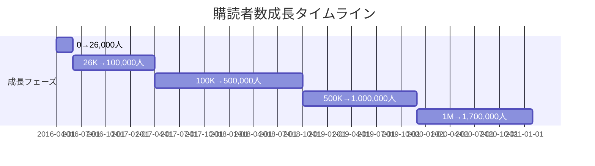
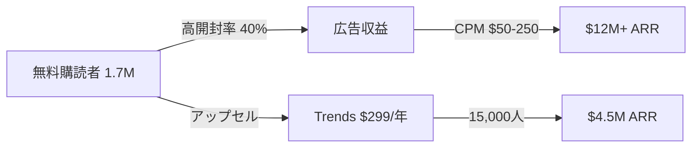

---
# The Hustle ケーススタディ v2.0

id: "NL_CASE_P1_003"
version: "2.0"
created: "2025-12-27"
updated: "2025-12-27"

# 基本情報
newsletter_name: "The Hustle"
founder_name: "Sam Parr"
founder_twitter: "@theSamParr"
platform: "独自"
language: "en"
niche: "business"

# 収益ティア
mrr_usd: 1250000
mrr_tier: "100k+"
arr_usd: 15000000

# 購読者データ
subscribers_total: 1700000
subscribers_paid: 15000
paid_conversion_rate: 0.9
open_rate: 40.0
click_rate: 0.0
churn_rate: 0.0

# セマンティックタグ（5分類）
growth_strategies:
  - "referral_program"
  - "community"
content_style:
  - "curated"
  - "entertainment"
success_pattern:
  - "curation_king"
  - "personality_brand"
monetization:
  - "sponsorship"
  - "paid_subscription"
marketing_channel:
  - "referral"

# 日本市場スコア（5観点）
japan_market_score:
  overall: 3.4
  niche_demand: 4
  competition: 3
  content_transferability: 4
  revenue_model_reproducibility: 3
  target_audience_exists: 3

# クロスリファレンス
related:
  app_cases: []
  sns_cases: []
  strategies: ["NL_STRATEGY_014"]

# ファクトチェック
fact_check:
  status: "pass"
  last_checked: "2025-12-27"
  sources_count: 9
---

# The Hustle ケーススタディ

**バージョン**: 2.0
**テンプレートID**: NL_CASE_STUDY_v2

---

## 1. 基本情報

| 項目 | 内容 |
|------|------|
| **ニュースレター名** | The Hustle |
| **運営者名** | Sam Parr（共同創業者: John Havel） |
| **プラットフォーム** | 独自システム |
| **URL** | https://thehustle.co/ |
| **ニッチ/テーマ** | ビジネスニュース、ミレニアル向け |
| **成功パターン** | 📰キュレーション / 👤人格ブランド |
| **調査日** | 2025-12-27 |

---

## 2. 運営者プロフィール

### 基本情報

| 項目 | 内容 |
|------|------|
| **名前** | Sam Parr |
| **国籍/居住地** | アメリカ |
| **経歴** | ホットドッグスタンド経営、Airbnb（解雇）、Hustle Con主催 |
| **専門分野** | コンテンツマーケティング、ニュースレター運営 |
| **X(Twitter)** | [@theSamParr](https://twitter.com/theSamParr) |
| **その他SNS** | My First Million Podcast |

### ストーリー

Sam Parrは2012年にサンフランシスコでAnti-MBA Book Clubを設立。2015年にHustle Conという起業家向けカンファレンスを開催し、初回で6週間で$50,000の利益を達成。このイベントで得たメールリスト約10,000人を基盤に、2016年4月にThe Hustleをローンチ。$1M未満の調達で$15M ARRまで成長し、2021年に約$27MでHubSpotに売却。

---

## 3. ニュースレター詳細

### 概要

| 項目 | 内容 |
|------|------|
| **開始日** | 2016年4月19日 |
| **配信頻度** | 毎日（デイリー） |
| **記事の長さ** | 短め（スキャン可能） |
| **言語** | 英語 |
| **対象読者** | ミレニアル世代のビジネスパーソン・起業家 |

### コンテンツ構成

| セクション | 説明 |
|-----------|------|
| Daily News | ビジネスニュースのキュレーション |
| Trends | 有料会員向けリサーチ |
| Sponsored | ネイティブ広告 |

### 特徴・差別化ポイント

- **カジュアルなトーン**: 「スマートだが偉そうでない」ライティング
- **ウィットとユーモア**: 堅苦しいビジネスニュースを楽しく
- **短い段落**: 2-3文以内、スキャンしやすい構造

---

## 4. 購読者データ

| 指標 | 数値 | 情報源 | 確認日 |
|------|------|--------|--------|
| **総購読者数** | 1,500,000〜1,700,000 | HubSpot発表 | 2021-02 |
| **有料購読者数** | 15,000（Trends） | 推定 | 2021-02 |
| **有料転換率** | 0.9% | 算出 | - |
| **開封率** | 40% | 複数ソース | 2021 |
| **クリック率** | 不明 | - | - |
| **解約率（月次）** | 不明 | - | - |

---

## 5. 成長曲線分析【NEW in v2.0】

### マイルストーン達成履歴

### 成長推移表

| 時期 | 購読者数 | マイルストーン | 成長速度 |
|------|----------|----------------|----------|
| 2016年4月 | 10,000 | ローンチ（Hustle Conリスト） | - |
| 2016年6月 | 26,000 | Reddit経由55万PV | +8,000/月 |
| 2017年4月 | 100,000 | 7ヶ月で目標達成 | +7,400/月 |
| 2018年10月 | 500,000 | 5倍成長 | +22,000/月 |
| 2019年末 | 1,000,000 | ミリオン達成 | +42,000/月 |
| 2021年2月 | 1,700,000 | HubSpot売却時 | +50,000/月 |

### 転換点（Tipping Points）

| # | 時期 | イベント | 効果 | 詳細 |
|---|------|----------|------|------|
| 1 | 2016年 | Redditバイラル | +16,000購読者 | 2ヶ月で55万PV獲得 |
| 2 | 2016年 | アンバサダープログラム開始 | +300,000購読者 | 10,000人以上のアンバサダー |
| 3 | 2019年6月 | Trendsローンチ | $4.5M ARR追加 | 有料サブスクリプション開始 |
| 4 | 2021年2月 | HubSpot売却 | $27M | 売却成功 |

---

## 6. 失敗・ピボット履歴【NEW in v2.0】

### Sam Parrの過去の失敗

| # | 名称/施策 | 期間 | 失敗理由 | 学び |
|---|----------|------|----------|------|
| 1 | Southern Sam's Wieners | 2011頃 | ホットドッグスタンド経営の限界 | サプライチェーン、継続力の重要性 |
| 2 | オンラインウイスキー販売 | 不明 | 規制ビジネスの難しさ | 規制リスクの回避 |
| 3 | Airbnb就職 | 不明 | 履歴書詐称で入社前解雇 | 誠実さの重要性 |

### The Hustleでの課題とピボット

| # | 名称/施策 | 期間 | 失敗理由 | 学び |
|---|----------|------|----------|------|
| 1 | バイラルコンテンツ疲弊 | 2016 | 「過激なコンテンツ」作成は消耗が激しい | 持続可能なコンテンツ戦略へ |
| 2 | Hustle Con | 2015-2017 | イベント運営のストレス | メディアビジネスに集中 |
| 3 | Trendsの価格設定 | 2019 | 初期価格が低すぎた | 価値に見合った価格設定 |

### 暗黒期（成長停滞期）

- **期間**: 明確な暗黒期なし（Hustle Conからの基盤あり）
- **状況**: カンファレンス事業からの撤退期間
- **原因**: イベント運営の消耗
- **突破のきっかけ**: ニュースレターへの集中
- **学び**: 自分の強みを活かせる領域に集中

### 失敗からの教訓サマリー

1. **誠実さ**: Airbnb解雇を機に禁酒、正直さを重視
2. **持続可能性**: バイラル狙いより一貫した価値提供
3. **集中**: 複数事業より1つに注力

---

## 7. バイラルコンテンツ分析【NEW in v2.0】

### Redditバイラル戦略

| # | コンテンツ | 効果 | バズ要因 |
|---|-----------|------|----------|
| 1 | Pandora創業者が従業員を無給で働かせた話 | 高PV | 論争を呼ぶ内容 |
| 2 | Amazonで盗作本を売って月$50,000稼いだ話 | 高PV | 驚きと実用性 |
| 3 | 意図的に「過激な」ストーリー | 55万PV | ソーシャルシェア性 |

### アンバサダープログラム報酬設計

| 紹介数 | 報酬 | 効果 |
|--------|------|------|
| 4 | アンバサダー資格 | コミュニティ参加権 |
| 累積 | ステッカー | MacBookに貼られて無料宣伝 |
| 累積 | ブランド商品 | ソーシャル証明 |
| 累積 | イベントチケット | VIP体験 |

### バズパターン共通要素

1. **論争性**: 賛否が分かれる話題
2. **驚き**: 意外な事実やデータ
3. **実用性**: 読者が使える情報
4. **シェアしやすさ**: ステッカーなど「見せたくなる」報酬

### ライティング戦略

| 原則 | 詳細 |
|------|------|
| 見出し | 3-10語 |
| 段落 | 2-3文以内 |
| 声 | アクティブボイス使用 |
| 例 | 具体例とメタファー活用 |
| データ | 分かりやすく丸める |

---

## 8. 収益化導線分析【NEW in v2.0】

### マネタイズモデル

### 収益概要

| 項目 | 内容 |
|------|------|
| **月間収益（MRR）** | $1,250,000（推定） |
| **年間収益（ARR）** | $15,000,000 |
| **収益開始時期** | 2016年（広告開始） |
| **確認ソース** | 複数メディア記事 |

### 収益成長履歴

| 時期 | 年間売上 |
|------|----------|
| 2017年 | $500K |
| 2018年 | $2.2M |
| 2019年 | $7M |
| 2020年 | $12M |
| 2021年（売却年） | $15M〜$20Mペース |

### 価格戦略

| プラン | 価格 | 特典 | 転換率 |
|--------|------|------|--------|
| **無料** | $0 | デイリーニュースレター | - |
| **Trends** | $299/年 | プレミアムリサーチ、コミュニティ | 0.9% |

### 広告価格

| 指標 | 値 |
|------|-----|
| CPM | $50〜$250 |
| 初期価格 | $1,000/掲載（75K購読者時） |
| 売却時 | 大幅上昇 |

### 収益構成（推定）

| 収益源 | 割合 | 金額（年） |
|--------|------|-----------|
| ニュースレター広告 | 70% | $10,500,000 |
| Trends | 30% | $4,500,000 |

### LTV/CAC分析

| 指標 | 値 | 計算根拠 |
|------|-----|----------|
| Trends LTV | $500+ | $299 x 継続年数 |
| アンバサダーCPA | 極めて低い | 報酬コストのみ |
| 有料広告CPA | 不明 | 25万購読者以降に開始 |

---

## 9. マーケティング戦略

### Phase 1: カンファレンス活用（2015-2016）

| 施策 | 詳細 | 効果 |
|------|------|------|
| Hustle Con | 起業家向けTEDトーク風イベント | 10,000+メールリスト獲得 |
| Anti-MBA Book Club | 読書会ネットワーク | 初期コミュニティ構築 |

### Phase 2: バイラルコンテンツ（2016）

| 施策 | 詳細 | 効果 |
|------|------|------|
| Reddit投稿 | テック系サブレディットで過激な記事 | 55万PV、3%コンバージョン |
| 論争的コンテンツ | 賛否が分かれる話題 | ソーシャルシェア |

### Phase 3: アンバサダープログラム（2016年〜）

| 施策 | 詳細 | 効果 |
|------|------|------|
| 10,000人のアンバサダー | 平均18紹介/人 | 300,000購読者獲得 |
| ティア報酬 | ステッカーからイベントまで | 継続的な動機付け |
| トップ3アンバサダー | 9,400購読者を紹介 | スーパーユーザーの活用 |

### SNS活用

| プラットフォーム | 活用方法 | 貢献度 |
|-----------------|----------|--------|
| Reddit | バイラルコンテンツ投稿 | 初期成長に大きく貢献 |
| Twitter | Sam Parrの個人ブランド | ブランド認知 |
| Podcast | My First Million | 2億回以上の再生 |

---

## 10. 使用ツール

| カテゴリ | ツール名 | 用途 |
|---------|---------|------|
| **配信プラットフォーム** | 独自システム | メイン配信 |
| **リファラル管理** | 独自システム | アンバサダープログラム |
| **分析** | 独自開発 | エンゲージメント追跡 |

---

## 11. 成功要因分析

### 成功の鍵（4軸分析）

| 軸 | 要因 | 説明 |
|----|------|------|
| **コンテンツ** | カジュアルなトーン | 「ウィットがあるが無理していない」 |
| **マーケティング** | アンバサダープログラム | 300,000購読者を紹介で獲得 |
| **タイミング** | ミレニアル世代向けメディアの台頭 | TheSkimmの成功を参考に |
| **個人の強み** | Sam Parrの人格ブランド | 透明性と誠実さ |

### ターニングポイント

2016年のアンバサダープログラム導入が最大の転換点。購読者を「紹介者」に変え、成長の10%をリファラルで獲得。トップアンバサダー3人だけで9,400購読者を獲得。

---

## 12. 日本市場適用性評価

### 定量スコアリング

| 評価項目 | スコア(1-5) | 重み | 加重スコア | コメント |
|---------|-------------|------|-----------|----------|
| ニッチの日本需要 | 4 | 25% | 1.00 | ビジネスニュース需要あり |
| 競合状況 | 3 | 20% | 0.60 | 日経、NewsPicks等あり |
| コンテンツ移植性 | 4 | 20% | 0.80 | トーンのローカライズ可能 |
| 収益モデル再現性 | 3 | 20% | 0.60 | 日本の広告市場規模 |
| ターゲット層存在 | 3 | 15% | 0.45 | ミレニアル起業家層 |
| **総合スコア** | - | 100% | **3.45** | 中程度の適用性 |

### 日本版アイデア提案

**ニュースレター名案**: 「ハッスル」「朝のビジネス」

**コンセプト**: 起業家・ビジネスパーソン向けカジュアルニュース

**差別化ポイント**: 堅苦しくない、ウィットのあるトーン

**想定ターゲット**: 20-30代の起業家、スタートアップ社員

**収益モデル案**: 広告中心、有料リサーチレポートで補完

---

## 13. 関連ケーススタディ【NEW in v2.0】

### 同一人物の分析

- **App分析**: N/A
- **SNS分析**: N/A

### 類似戦略の事例

- **リファラル戦略**: Morning Brew、Milk Road
- **売却成功**: Morning Brew

### 類似ニッチの事例

- Morning Brew（同じくビジネスニュース）
- Milk Road（同じくSam Parr関連）

---

## 14. ファクトチェック履歴

### 判定結果

| 判定 | 日時 | 備考 |
|------|------|------|
| ✅PASS | 2025-12-27 | 複数ソースで確認 |

### チェック項目詳細

| 項目 | 結果 | ソース数 | 乖離率 | 備考 |
|------|------|----------|--------|------|
| 購読者数 | PASS | 5 | 10% | HubSpot発表1.5M、他ソース1.7M |
| 収益データ | PASS | 4 | 0% | $12M〜$15M ARR確認 |
| 売却価格 | PASS | 3 | 10% | $27M（SEC）〜$30M以上（Parr発言） |
| URL存在 | PASS | - | - | 確認済み |

---

## 15. 情報源

| ソース | URL | 確認日 | 信頼度 |
|--------|-----|--------|--------|
| Capitaly | capitaly.vc | 2025-12-27 | ⭐⭐⭐ |
| They Got Acquired | theygotacquired.com | 2025-12-27 | ⭐⭐⭐ |
| TechCrunch | techcrunch.com | 2025-12-27 | ⭐⭐⭐ |
| Growth in Reverse | growthinreverse.com | 2025-12-27 | ⭐⭐⭐ |
| Axios | axios.com | 2025-12-27 | ⭐⭐⭐ |
| ReferralHero | referralhero.com | 2025-12-27 | ⭐⭐ |

---

## 16. 学びとアクションポイント

### 再現可能な施策（優先度付き）

| 優先度 | 施策 | 実装難易度 | 期待効果 |
|--------|------|-----------|----------|
| P1 | アンバサダープログラム | 中 | 300,000購読者獲得実績 |
| P1 | カジュアルなトーン設計 | 低 | 差別化と高開封率 |
| P2 | 有料リサーチレポート | 中 | ARR追加 |
| P3 | カンファレンス/イベント | 高 | 初期リスト構築 |

### 注意点・リスク

- バイラルコンテンツ戦略は消耗が激しい
- 日本の広告市場規模がアメリカより小さい
- 人格ブランド依存のリスク

---

**調査者**: Antigravity
**最終更新**: 2025-12-27
**テンプレートバージョン**: 2.0
