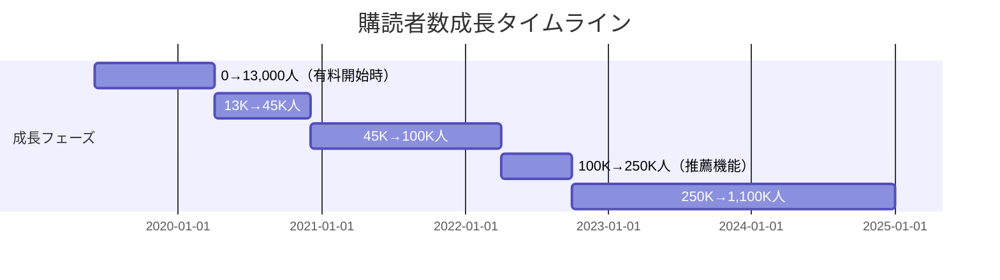
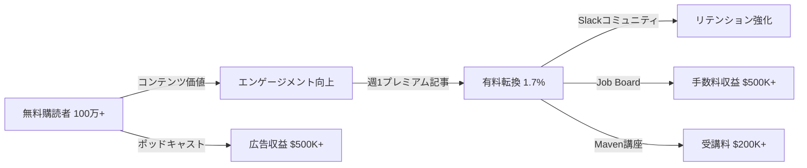
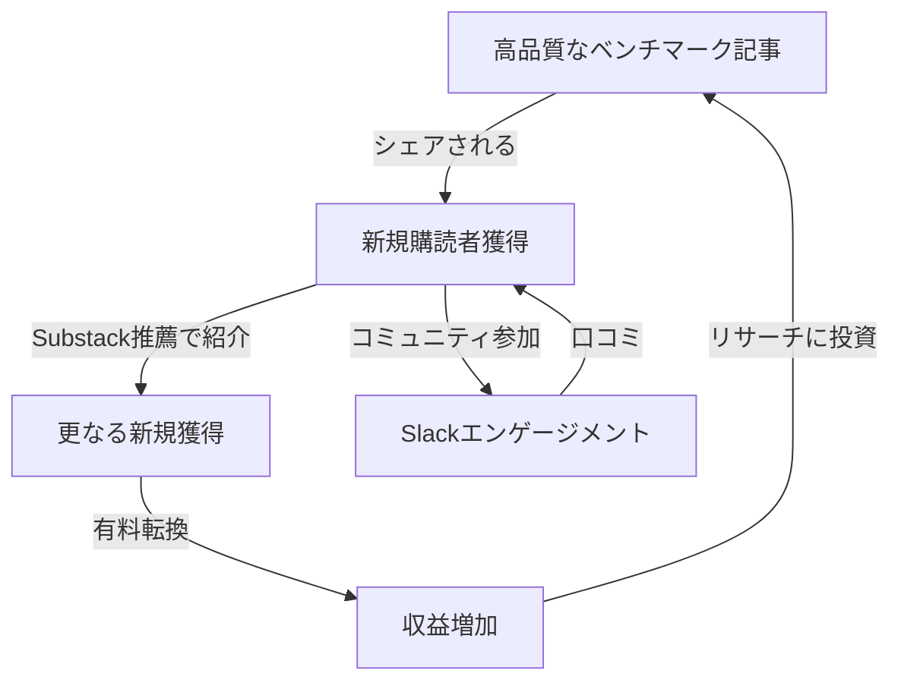

# Lenny's Newsletter ケーススタディ

## 1. 基本情報

| 項目 | 内容 |
|------|------|
| ニュースレター名 | Lenny's Newsletter |
| 運営者 | Lenny Rachitsky |
| URL | https://www.lennysnewsletter.com/ |
| プラットフォーム | Substack |
| 開始日 | 2019年6月（無料版）、2020年4月7日（有料版開始） |
| 配信頻度 | 週1回（有料会員向け）+ ポッドキャスト週2回 |
| ニッチ | プロダクトマネジメント、グロース |

### 運営者経歴

- ウクライナ出身、6歳で米国に移住
- エンジニアとしてキャリアをスタート
- **2011年**: Localmind（位置情報Q&Aプラットフォーム）をCEOとして創業
- **2012年**: LocalmindをAirbnbに売却
- **2012-2019年**: Airbnbでプロダクトリード（Supply Growth、Conversion、Community、Instant Book、Trip Experienceを担当）
- **2019年**: Airbnbを退職し、ニュースレターを開始
- **140+のエンジェル投資**（12社がユニコーン）

---

## 2. 数値サマリー

| 指標 | 値 |
|------|-----|
| 総購読者数 | 1,100,000+ |
| 有料購読者数 | 約18,000-20,000人（推定） |
| 有料転換率 | 1.7%（無料→有料） |
| 推定ARR | $4,000,000+ |
| 月額価格 | $20/月（2025年2月改定後） |
| 年間価格 | $200/年 |
| Substackランキング | ビジネスカテゴリー1位 |
| Twitterフォロワー | 283,000+ |

---

## 3. 収益構造

| 収益源 | 推定金額（年間） |
|--------|------------------|
| ニュースレター有料購読 | $2,000,000+ |
| ポッドキャスト広告 | $500,000+ |
| Job Board / Talent Collective | $500,000+ |
| Maven講座 | $200,000+ |
| **合計推定ARR** | **$4,000,000+** |

### 価格戦略の変遷

| 時期 | 月額 | 年額 |
|------|------|------|
| 初期（2020年） | $15 | $150 |
| 2025年2月改定後 | $20 | $200 |
| Insiderプラン | - | $350/年 |

---

## 4. 成長曲線分析

### マイルストーン達成履歴

### 転換点（Tipping Points）

| # | 時期 | イベント | 効果 |
|---|------|----------|------|
| 1 | 2020年4月 | 有料版ローンチ | 初月$56K ARR、486人の有料会員 |
| 2 | **2022年4月12日** | **Substack Recommendations機能開始** | 新規購読者の**78%**がこの機能経由 |
| 3 | 2023年 | ポッドキャスト開始 | Top 10テック番組、$500K+/年の追加収益 |

### 最重要転換点：Substack Recommendations

Lenny自身が「史上最もインパクトのある成長機能の一つ」と評価：
- 5,000以上のニュースレターがLennyを推薦
- 新規購読者の**78%**がこの機能経由
- 有料購読者の**11%**もこの機能経由
- この日から「ホッケースティック型」成長が開始

---

## 5. 失敗・ピボット履歴

### Airbnb退職時の不確実性（2019年）

Lennyは7年間Airbnbに在籍した後、バーンアウト状態で退職。当初の計画：

| 優先度 | プラン | 結果 |
|--------|--------|------|
| Plan A | 新しいスタートアップを創業 | ❌ |
| Plan B | アドバイザリー業務 | ❌ |
| Plan C | スタートアップに参加 | ❌ |
| Plan D | 大企業のPMに戻る | ❌ |
| **Plan Z以下** | **フルタイムで執筆** | ✅ 結果的にこれが成功 |

> 「自分に6ヶ月の猶予を与え、エネルギーが湧くことを探した」— Lenny Rachitsky

### ニュースレター運営上の課題

| 課題 | 対応策 |
|------|--------|
| コンテンツ制作のプレッシャー | 深いリサーチに投資、数ヶ月かけてベンチマーク記事を作成 |
| 価格設定のジレンマ | 地域別価格ではなく、経費精算プランを別途用意 |
| 時間管理 | 午後3時まで会議を入れない厳格なルールを設定 |

**特筆すべき「暗黒期」は確認されず** - Lennyのニュースレター事業は比較的順調に成長。

---

## 6. バイラルコンテンツ分析

### 最初のバイラル記事

**"What Seven Years at Airbnb Taught Me About Building a Business"**（2019年、Medium）

| 指標 | 結果 |
|------|------|
| Mediumの「拍手」 | 29,000以上 |
| ランキング | Mediumのトップ数百記事 |
| 社内反響 | AirbnbのCEO Brian Cheskyが全社員にシェア |
| 収益 | 1記事で$1,700 |
| 影響 | ニュースレター開始のきっかけに |

### 高インパクトコンテンツの特徴

- **最初の1年で2つの記事が購読者の50%を獲得**
- 数ヶ月かけて作成したベンチマーク系記事が最も効果的

| バイラル記事 | 特徴 |
|-------------|------|
| "How today's fastest growing B2B businesses found their first ten customers" | 創業初期の具体的戦術 |
| "What is good retention?" | ベンチマークデータ提供 |
| "What is good activation rate?" | 定量的な基準値を提示 |

### バズパターン共通要素

1. **具体的な数値**: 抽象論ではなく、実データに基づくベンチマーク
2. **実用性**: 読者が即座に自社に適用できるフレームワーク
3. **深いリサーチ**: 数ヶ月の調査に基づく網羅的分析
4. **権威性**: Airbnb経験と140+のエンジェル投資実績

---

## 7. 収益化導線分析

### マネタイズモデル

### 有料会員の価値提供

| 特典 | 内容 |
|------|------|
| プレミアムコンテンツ | 週1回の深掘り記事 |
| Slackコミュニティ | 30,000人以上のPM/成長専門家 |
| 無料ツールバンドル | Granola、Notion AI、Linear、Perplexity Pro等（$10,000+相当） |
| Job Board割引 | 求人掲載20%オフ |
| リアルイベント | 5大陸30カ国以上でミートアップ |
| メンタリング | マスターマインドグループ、ブッククラブ |

### LTV/CAC分析

| 指標 | 推定値 | 根拠 |
|------|--------|------|
| 平均契約期間 | 2-3年 | 高いリテンション率から推定 |
| 年間ARPU | $200-300 | 価格帯から算出 |
| 推定LTV | $400-900 | ARPU × 契約期間 |
| CAC | **ほぼ$0** | 口コミ・Substack推薦が主要チャネル |
| LTV/CAC比率 | **極めて高い** | オーガニック成長モデル |

---

## 8. マーケティング戦略

### 主要成長チャネル

| チャネル | 貢献度 | 詳細 |
|----------|--------|------|
| **Substack Recommendations** | 78% | 5,000以上のニュースレターが推薦 |
| **口コミ（Word of Mouth）** | 高 | Lenny曰く「最大のレバー」 |
| **Twitter/X** | 高 | 283K フォロワー、記事をスレッド化 |
| **Podcast** | 中 | 10M+ ダウンロード、Top 10テック番組 |
| **SEO** | 低 | Lenny自身「効果なし」と発言 |
| **有料広告** | 低 | Lenny自身「効果なし」と発言 |

### コンテンツ戦略

- **9ヶ月間無料で執筆**してから有料化（信頼構築期間）
- **深いリサーチ**に基づくコンテンツ（ベンチマーク記事に数ヶ月投入）
- **アクショナブル**な実践的アドバイス
- **年末ベストコンテンツ集**の定期公開

---

## 9. 成功要因分析

### 主要成功要因

| 要因 | 詳細 |
|------|------|
| **1. パーソナルブランドと専門性** | 7年間のAirbnb経験、140+エンジェル投資（12社ユニコーン） |
| **2. プロダクトマーケットフィット** | PM/グロース担当者という明確なターゲット |
| **3. プラットフォームレバレッジ** | Substack Recommendations機能を最大限活用 |
| **4. 複合的収益モデル** | 購読、広告、Job Board、講座の組み合わせ |
| **5. 運営効率** | 従業員ゼロ、コントラクターのみで運営 |
| **6. コミュニティ構築** | 30,000人Slack、招待制による質の維持 |

### フライホイール効果

---

## 10. 日本市場への示唆

### 日本版立ち上げの可能性

| 観点 | 評価 | 理由 |
|------|------|------|
| ニッチの需要 | ★★★★★ | 日本でもPM需要は高まっている |
| 競合状況 | ★★★☆☆ | 類似ニュースレターは少数だが、書籍・ブログは多い |
| コンテンツ移転性 | ★★★★☆ | フレームワークは汎用的、ベンチマークは日本版が必要 |
| 収益モデル再現性 | ★★★★☆ | Substackは日本でも使用可能、有料購読文化は要構築 |
| ターゲット存在 | ★★★★★ | PM、グロース担当者は日本企業にも多数 |

### 日本版実装時の推奨事項

1. **日本企業のベンチマークデータ収集**: メルカリ、SmartNews、Sansanなどの日本発スタートアップのデータ
2. **コミュニティ構築**: Slack/Discordで日本PM向けコミュニティを先行構築
3. **価格設定**: 日本市場に合わせた価格（月額1,500-2,000円程度）
4. **プラットフォーム選択**: note、Substack両方でのテスト

---

## 11. 主要な教訓

1. **最初に信頼を構築する**: 9ヶ月間無料で価値を提供してから有料化
2. **プラットフォームの機能を活用**: Substack Recommendations機能が成長の78%に貢献
3. **口コミが最大のレバー**: 有料広告やSEOより、シェアされるコンテンツが重要
4. **深いリサーチに投資**: ベンチマーク記事など、長期間かけて作成したコンテンツがバイラル化
5. **複数の収益源を構築**: ニュースレター、ポッドキャスト、Job Board、講座の組み合わせ
6. **シンプルさを維持**: 従業員を雇わず、コントラクターのみで運営

---

## Sources

- [Lenny's Newsletter](https://www.lennysnewsletter.com/)
- [Growth in Reverse - Lenny Rachitsky Analysis](https://growthinreverse.com/lenny/)
- [How Lenny Rachitsky earned $65,000 in his first year](https://on.substack.com/p/how-lenny-rachitsky-earned-65000)
- [CNBC - Lenny Rachitsky Podcast Revenue](https://www.cnbc.com/2024/01/11/lenny-rachitsky-podcast-brings-in-more-than-500k-a-year-heres-how.html)
- [Fast Company - Who is Lenny Rachitsky?](https://www.fastcompany.com/90940453/lenny-rachitsky-newsletter-podcast-job-board-substack)
- [Hunter Walk Interview](https://hunterwalk.com/2020/04/17/did-i-intend-to-stay-there-for-seven-years-hells-no-but-man-its-a-tough-place-to-leave-five-questions-on-startups-newsletters-life-post-airbnb-w-lenny-rachitsky/)
- [Nathan Barry Interview](https://nathanbarry.com/022-lenny-rachitsky-dark-side-paid-newsletters-talks/)
- [What Seven Years at Airbnb Taught Me](https://marker.medium.com/what-seven-years-at-airbnb-taught-me-about-building-a-company-e1d035d49c56)
