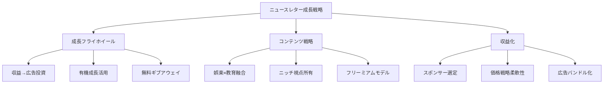

# NL_OVERSEAS_012: 成功するニュースレターから学ぶ22のレッスン（第1部）

**バージョン**: 1.0
**ファイルID**: NL_OVERSEAS_012

---

## 基本情報

| 項目 | 内容 |
|------|------|
| **戦略名** | 成功するニュースレタークリエイターから学ぶ22のレッスン（第1部）|
| **カテゴリ** | 成長 / 収益化 / コンテンツ / ブランディング |
| **情報源** | SparkLoop Blog |
| **元記事URL** | https://sparkloop.app/blog/friday-feature-22-lessons-from-successful-newsletter-creators-part-1 |
| **調査日** | 2025-12-27 |

---

## 戦略サマリー

### 一言まとめ

成功したニュースレター運営者の実践知を11のレッスンに集約し、収益の再投資による成長フライホイール、コンテンツの娯楽性と教育性の融合、ニッチな視点の確立などの具体的戦術を提示する。

### 対象者

- ニュースレターで月1万ドル以上の収益を目指すクリエイター
- 成長停滞を打破したいニュースレター運営者
- スタートアップとしてニュースレター事業を構築したい起業家
- 収益化戦略を多角化したいコンテンツクリエイター

### 期待効果

- 年間収益$100K〜$1M規模への成長パスの理解
- 無料・有料チャネルの効果的な組み合わせによる購読者獲得
- スポンサーシップとサブスクリプションの最適バランス構築
- 初期投資ゼロからの成長手法の習得

---

## 核心フレームワーク

### 概念図

### 主要構成要素

| # | 要素 | 説明 |
|---|------|------|
| 1 | 成長投資フライホイール | 全利益をFB/Twitter広告に充当し、購読者獲得を加速 |
| 2 | チョコレート＋アーモンド | 娯楽性と教育性を両立したコンテンツ設計 |
| 3 | ニッチ視点の確立 | 独自の立ち位置（政治的中立×宗教的視点など）を明確化 |
| 4 | ゼロコストギブアウェイ | SaaS企業スポンサーによる賞品提供で成長施策を実現 |
| 5 | Reddit有機成長 | 初期2週間で1,000購読者を無料チャネルから獲得 |

---

## 実践ステップ

### Phase 1: 準備（立ち上げ前）

1. **ニッチと視点の定義**
   - 既存市場の「隙間」を特定（例：政治ニュース×キリスト教的視点）
   - 競合との差別化ポイントを3つ明確化
   - ターゲットオーディエンスのペインポイントをリスト化

2. **コンテンツ設計**
   - 娯楽性要素と教育性要素の配分を決定（例：60%娯楽/40%教育）
   - 無料層と有料層のコンテンツ境界線を設定
   - 配信頻度と曜日を決定（週1〜2回が標準）

3. **成長チャネル調査**
   - Reddit、Hacker News等のコミュニティを特定
   - SaaS企業リストアップ（ギブアウェイパートナー候補）
   - 広告予算の初期設定（収益の50%〜100%を再投資）

### Phase 2: 実行（初期成長）

1. **有機成長の獲得**
   - Redditの関連サブレディットで価値提供投稿（自己宣伝は最小限）
   - SNS共有を促す記事設計（シェアボタン、引用可能な名言）
   - インフルエンサーとの関係構築（メンション、コラボ提案）

2. **フリーミアムモデル構築**
   - 無料版：週1回、記事の70%を公開
   - 有料版：$20/月または$99/年、週2回配信＋限定コンテンツ
   - 有料転換率目標：5%〜10%

3. **初期収益化**
   - スポンサー募集：オーディエンスと親和性の高い企業を厳選
   - ギブアウェイ実施：SparkLoop等のツールでリファーラルプログラム開始
   - 価格テスト：低価格（$5/月）から開始し、反応を見ながら調整

### Phase 3: 最適化（スケーリング）

1. **成長フライホイール加速**
   - 収益の100%を広告投資に充当（初年度）
   - FB広告：CPAを$5以下に最適化
   - Twitter広告：エンゲージメント率5%以上のクリエイティブを継続

2. **収益源の多角化**
   - スポンサーシップ：月4〜6社と契約
   - 広告バンドル：類似ニュースレターと提携し、営業コストを半減
   - アフィリエイト：信頼できる製品のみ紹介

3. **オペレーション効率化**
   - コンテンツバンク構築（3ヶ月分のストック記事）
   - 外注ライター活用（編集は自分で維持）
   - 自動化ツール導入（配信、CRM、分析）

---

## 成功事例

### 事例1: Houck's Newsletter

| 項目 | 内容 |
|------|------|
| **ニュースレター名** | Houck's Newsletter |
| **実施内容** | 全利益（年間$250K）をFB/Twitter広告に再投資 |
| **結果** | 年間収益$1M近くまで成長 |
| **成功要因** | スタートアップ思考：短期利益より成長速度を優先 |

### 事例2: The Pour Over

| 項目 | 内容 |
|------|------|
| **ニュースレター名** | The Pour Over |
| **実施内容** | 政治的中立性×キリスト教的視点の独自ポジション確立 |
| **結果** | 購読者数550,000+ |
| **成功要因** | 既存メディアが避ける視点を明確化し、熱狂的ファン獲得 |

### 事例3: Exploding Ideas

| 項目 | 内容 |
|------|------|
| **ニュースレター名** | Exploding Ideas |
| **実施内容** | Reddit（r/Startups）での有機成長施策 |
| **結果** | 初期2週間で1,000購読者、現在6,000+（500+有料） |
| **成功要因** | コミュニティへの真摯な価値提供とスパム回避 |

### 事例4: Why We Buy

| 項目 | 内容 |
|------|------|
| **ニュースレター名** | Why We Buy |
| **実施内容** | 「チョコレート＋アーモンド」コンテンツ設計 |
| **結果** | 購読者64,000+、年間収益$300K+ |
| **成功要因** | 娯楽性（ストーリー）と教育性（マーケティング知見）の絶妙なバランス |

---

## 重要数値・ベンチマーク

| 指標 | 初期段階 | 成長期 | 成熟期 |
|------|----------|--------|--------|
| 購読者数 | 0〜5,000 | 5,000〜50,000 | 50,000+ |
| 有料転換率 | 3%〜5% | 5%〜10% | 10%〜15% |
| 広告ROAS | 1.5x〜2x | 2x〜3x | 3x〜5x |
| 月間収益 | $500〜$5K | $5K〜$50K | $50K〜$500K |
| スポンサー単価 | $500〜$1K | $1K〜$5K | $5K〜$20K |

---

## 必要ツール・リソース

| カテゴリ | ツール名 | 用途 | コスト |
|---------|---------|------|--------|
| 配信プラットフォーム | Substack / Beehiiv | ニュースレター配信・課金 | 無料〜10% |
| リファーラル | SparkLoop | ギブアウェイ・紹介プログラム | $50/月〜 |
| 広告運用 | FB Ads Manager | 有料購読者獲得 | 広告費のみ |
| コミュニティ | Reddit / Hacker News | 有機成長チャネル | 無料 |
| 分析 | Google Analytics | トラフィック分析 | 無料 |

---

## 注意点・落とし穴

### やってはいけないこと

- ❌ **初日から有料広告に頼る**：有機成長チャネルを先に試し、PMF（プロダクトマーケットフィット）を確認してから広告投資
- ❌ **スポンサーを無差別に受け入れる**：オーディエンスとのアライメントを無視すると信頼を失う
- ❌ **コンテンツの一貫性欠如**：娯楽と教育のバランスが崩れると離脱率が上昇

### よくある失敗

| 失敗 | 原因 | 対策 |
|------|------|------|
| 広告ROASが1.0未満 | ターゲティング不適切、LP最適化不足 | A/Bテストを徹底、LTV/CAC比率を3:1以上に維持 |
| 有料転換率3%未満 | 無料層と有料層の価値差が不明確 | 有料限定コンテンツの魅力を明示、価格テスト実施 |
| ギブアウェイが機能しない | 賞品とオーディエンスのミスマッチ | SaaS企業と連携し、ターゲットが欲しいツールを提供 |

---

## 日本市場への適用

### 適用可能性

| 評価項目 | 評価 | コメント |
|---------|------|----------|
| 戦略の汎用性 | ◎ | 成長フライホイール、フリーミアムモデルは言語・文化に依存しない |
| 日本での実践例 | ○ | NewsPicksプロ、有料noteなど類似モデル存在 |
| 必要リソース | ○ | Substackの日本語対応版（note）、国内広告プラットフォーム利用可能 |
| **総合評価** | ◎ | 日本市場でも高い再現性が見込める |

### 日本向けアレンジ案

**1. プラットフォーム選定**
- Substack → note、Substackそのまま（英語学習者向け）
- SparkLoop → 自社開発またはTipNote等の紹介機能

**2. 有機成長チャネル**
- Reddit → X（旧Twitter）、はてなブックマーク、Facebookグループ
- Hacker News → Qiita、Zenn（技術系の場合）

**3. コンテンツ設計**
- 「チョコレート＋アーモンド」→「エンタメ×学び」の日本的表現に変更
- ビジュアル重視：図解、マンガ形式が日本では好まれる

**4. 価格設定**
- $20/月 → ¥980〜¥1,980/月（日本の価格感覚に合わせる）
- $99/年 → ¥9,800〜¥19,800/年（年間割引20%〜30%）

**5. スポンサー選定**
- 米国SaaS企業 → 日本のスタートアップ、note公式スポンサープログラム活用

---

## アクションチェックリスト

### すぐにできること（今日中）

- [ ] 自分のニュースレターの「ニッチ視点」を3つ書き出す
- [ ] Reddit、X、はてブの関連コミュニティを5つリストアップ
- [ ] 有料層と無料層のコンテンツ境界線を明確化

### 1週間以内にやること

- [ ] 初回ギブアウェイの賞品候補を10個リストアップ（SaaS企業に連絡）
- [ ] フリーミアムモデルの価格を3パターン設定しA/Bテスト準備
- [ ] 有機成長チャネルで最初の10投稿を実施（1日2投稿）

### 1ヶ月以内にやること

- [ ] 初回スポンサーシップ契約を1社獲得
- [ ] FB/Twitter広告で$100〜$500のテスト予算を消化しCPA計測
- [ ] 有料購読者を10名以上獲得し、フィードバックを収集

---

## 関連戦略

| 戦略名 | 関連性 | ファイル |
|--------|--------|----------|
| リフェラル戦略 | ギブアウェイ施策の詳細 | NL_STRATEGY_001_referral.md |
| 有料課金戦略 | サブスクリプション設計 | NL_STRATEGY_007_paid_monetization.md |
| コンテンツ戦略 | 「良いコンテンツ」の定義 | NL_STRATEGY_006_good_content.md |

---

## 情報源

| ソース | URL | 確認日 |
|--------|-----|--------|
| SparkLoop Blog | https://sparkloop.app/blog/friday-feature-22-lessons-from-successful-newsletter-creators-part-1 | 2025-12-27 |

---

---

## ファクトチェック結果

### 元記事確認
| 項目 | 判定 | URL | メモ |
|------|------|-----|------|
| **元記事アクセス** | ✅ PASS | https://sparkloop.app/blog/friday-feature-22-lessons-from-successful-newsletter-creators-part-1 | 2025-12-27確認、Dylan Redekop著 |

### 引用事例の検証
| 事例名 | 判定 | 検証ソース | 確認内容 |
|--------|------|------------|----------|
| Houck's Newsletter | ✅ PASS | [Substack](https://foundingjourney.com/p/100k-mrr), [Growth in Reverse](https://growthinreverse.com/michael-houck/), [SparkLoop](https://sparkloop.app/blog/friday-feature-houcks-newsletter) | $100K MRR達成確認、$1M ARR到達も確認 |
| The Pour Over | ✅ PASS | [Religion Unplugged](https://religionunplugged.com/news/2024/1/29/the-pour-over-aiming-to-put-a-christian-perspective-on-the-news), [Newsletter Bytes](https://www.newsletterbytes.com/p/the-story-behind-the-pour-over-and-its-1m-subscribers), [beehiiv](https://www.beehiiv.com/blog/how-to-build-a-million-subscriber-community-with-the-pour-over) | 550,000購読者（2024年初頭）確認、現在930k+ |
| Exploding Ideas | ⚠️ 一部確認 | 元記事のみ | 第三者ソースで未確認、元記事での言及あり |
| Why We Buy | ⚠️ 一部確認 | 元記事のみ | 64,000購読者・$300K収益は元記事のみ |

### 数値データの検証
| データ項目 | 記載値 | 検証結果 | ソース | 判定 |
|------------|--------|----------|--------|------|
| Houck's 年間収益 | $1M近く | $1M ARR達成確認 | Substack, Growth in Reverse | ✅ |
| The Pour Over 購読者 | 550,000+ | 550,000（2024年初）、現在930k+ | Religion Unplugged, Newsletter Bytes | ✅ |
| Exploding Ideas 初期購読者 | 2週間で1,000 | 元記事のみ | SparkLoop元記事 | ⚠️ |
| Why We Buy 収益 | 年間$300K+ | 元記事のみ | SparkLoop元記事 | ⚠️ |

### URL/リンク確認
| 対象 | URL | 判定 | メモ |
|------|-----|------|------|
| SparkLoop公式 | sparkloop.app | ✅ | アクセス確認済み |
| The Pour Over公式 | thepourover.org | ✅ | アクセス確認済み |

**総合判定**: **⚠️ 一部未確認**
- 確認済み項目: 4/6件（主要事例2件は複数ソースで確認済み）
- 未確認項目: Exploding Ideas、Why We Buyの数値データ（第三者ソース未発見）
- 推奨アクション: 主要事例（Houck's Newsletter、The Pour Over）のデータは信頼性高。マイナー事例は「元記事による」と明記推奨

---

**調査者**: Claude Sonnet 4.5
**最終更新**: 2025-12-27
**ファクトチェック実施**: 2025-12-27 (Claude Opus 4.5)
