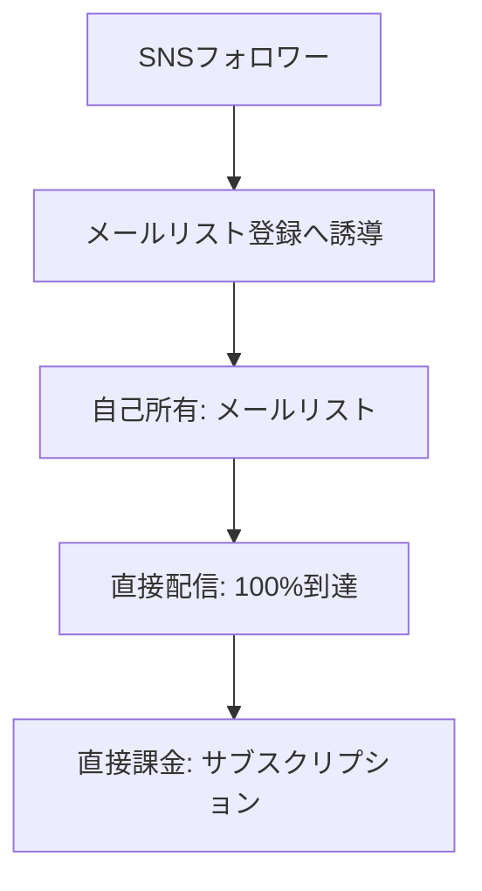

# 自己所有インフラ戦略（Patreon創業者の警告）

**バージョン**: 1.0  
**戦略ID**: NL_STRATEGY_004

---

## 基本情報

| 項目 | 内容 |
|------|------|
| **戦略名** | 自己所有インフラ戦略 |
| **カテゴリ** | 成長 / 収益化 |
| **情報源** | jabba記事 第147号 |
| **jabba記事タイトル** | Patreon創業者が警告するクリエイターの生存戦略 |
| **調査日** | 2025-12-26 |

---

## 戦略サマリー

### 一言まとめ

「フォロワーの95%はもうあなたの投稿を見ていない」- Patreon創業者ジャック・コンテ氏の警告。プラットフォーム依存から脱却し、自己所有の配信インフラ（メールリスト）を構築する生存戦略。

### 対象者

- SNSフォロワーは多いが収益に繋がっていない人
- プラットフォームのアルゴリズム変更に振り回されている人
- 長期的に安定した収益基盤を築きたいクリエイター

### 期待効果

- アルゴリズムに左右されない確実なリーチ
- 直接課金による収益の安定化
- ファンとの深い関係構築

---

## 核心フレームワーク

### 「フォロワーの死」とは

| 問題 | 数値 | 影響 |
|------|------|------|
| リーチ率の低下 | フォロワーの5%しか投稿を見ていない | 95%のフォロワーは無意味 |
| 収益の不均衡 | 100万再生でたった166ドル | 時間と労力に見合わない |
| プラットフォーム依存 | アルゴリズム変更で一夜にして収益ゼロ | 不安定な収入 |

### 解決策: 自己所有インフラ

### 主要構成要素

| # | 要素 | 説明 |
|---|------|------|
| 1 | メールリスト | 自己所有でアルゴリズム影響なし |
| 2 | ニュースレター | 定期配信でファンとの関係維持 |
| 3 | 直接課金 | 有料サブスクで安定収益 |
| 4 | コミュニティ | 深いエンゲージメントの場 |

---

## 実践ステップ

### Phase 1: インフラ構築

1. メール配信プラットフォームを選定（beehiiv, Substack等）
2. ランディングページを作成
3. SNSプロフィールにメール登録リンクを設置

### Phase 2: 移行促進

1. SNS投稿で「続きはニュースレターで」と誘導
2. メール限定コンテンツを用意
3. 既存フォロワーに登録を呼びかけ

### Phase 3: 収益化

1. 無料コンテンツで信頼構築
2. 有料プランを導入
3. コミュニティ機能を追加

---

## 成功事例

### 事例1: Patreon自体の成功

| 項目 | 内容 |
|------|------|
| **プラットフォーム名** | Patreon |
| **創業背景** | 100万再生で166ドルという現実からの逆転 |
| **結果** | 年間32億円規模のプラットフォームに成長 |
| **成功要因** | クリエイターとファンの直接的な金銭関係を構築 |

---

## 重要数値・ベンチマーク

| 指標 | SNS依存 | 自己所有インフラ |
|------|----------|------------------|
| リーチ率 | 5% | 開封率40-60% |
| 収益安定性 | 低（アルゴリズム依存） | 高（直接課金） |
| データ所有 | なし | 完全所有 |

---

## 注意点・落とし穴

### やってはいけないこと

- ❌ {失敗パターン1}
- ❌ {失敗パターン2}
- ❌ {失敗パターン3}

### よくある失敗

| 失敗 | 原因 | 対策 |
|------|------|------|
| {失敗1} | {原因} | {対策} |
| {失敗2} | {原因} | {対策} |
| {失敗3} | {原因} | {対策} |

---
## 日本市場への適用

### 適用可能性

| 評価項目 | 評価 | コメント |
|---------|------|----------|
| 戦略の汎用性 | ◎ | プラットフォーム依存の問題は日本でも同様 |
| 日本での実践例 | ○ | note有料記事、オンラインサロン等で実績 |
| 必要リソース | ◎ | 初期コストほぼゼロで開始可能 |
| **総合評価** | ◎ | 日本のクリエイターにも強く推奨 |

### 日本向けアレンジ案

- 日本人は「無料が当たり前」意識が強いため、有料化は段階的に
- noteやオンラインサロンからの移行パスを用意
- 「ファンクラブ」「会員制」といった馴染みのある表現を使用

---

## アクションチェックリスト

### すぐにできること（今日中）

- [ ] beehiiv or Substackのアカウント作成
- [ ] SNSプロフィールにメール登録リンク設置

### 1週間以内にやること

- [ ] 最初のニュースレターを配信
- [ ] SNSでメール登録を告知

### 1ヶ月以内にやること

- [ ] 100人のメールリスト構築
- [ ] メール限定コンテンツの提供開始

---

## 情報源

| ソース | 確認日 |
|--------|--------|
| jabbaニュースレター 第147号「Patreon創業者が警告するクリエイターの生存戦略」 | 2025-12-26 |
| ジャック・コンテ氏発言 | 2025-12-26 |

---

**調査者**: Antigravity  
**最終更新**: 2025-12-26
