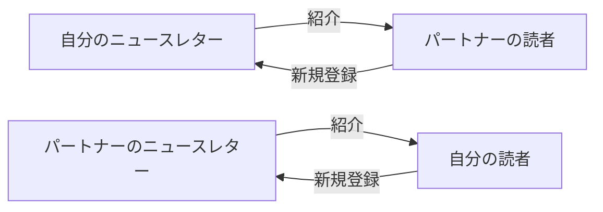

# クロスプロモーション戦略

**バージョン**: 1.0  
**戦略ID**: NL_STRATEGY_008

---

## 基本情報

| 項目 | 内容 |
|------|------|
| **戦略名** | ニュースレター・クロスプロモーション戦略 |
| **カテゴリ** | 成長 / 集客 |
| **情報源** | jabba記事 |
| **jabba記事タイトル** | ニュースレターのクロスプロモーションはネットメディアの集客をひっくり返す |
| **調査日** | 2025-12-26 |

---

## 戦略サマリー

### 一言まとめ

同規模の他ニュースレターと相互に紹介し合うことで、広告費ゼロで購読者を獲得するグロースハック戦略。

### 対象者

- 広告費をかけずに成長したい運営者
- 一定の購読者基盤がある人（500人～）
- 成長が停滞している人

### 期待効果

- 広告費ゼロでの購読者獲得
- 質の高い読者の獲得（紹介経由）
- ネットワーク効果による継続成長

---

## 核心フレームワーク

### クロスプロモーションの仕組み

### 成功の3条件

| # | 条件 | 説明 |
|---|------|------|
| 1 | 同規模のパートナー | 読者数が近いほうが対等な関係 |
| 2 | 関連性のあるテーマ | 読者の興味が重なる |
| 3 | 競合ではない | 補完関係にあるコンテンツ |

---

## 実践ステップ

## 重要数値・ベンチマーク

| 指標 | 初心者 | 中級者 | 上級者 |
|------|--------|--------|--------|
| 新規購読者獲得数/月 | 50-100人 | 200-500人 | 500-1000人以上 |
| クロスプロモーション転換率 | 2-5% | 5-10% | 10-15%+ |
| 全成長に占める割合 | 10-15% | 20-30% | 30-40%+ |

**参考データ**:
- Greg Bussman: クロスプロモーションで全購読者の30%を獲得
- Emanuel Cinca（Stacked Marketer）: 50,000購読者中4,000-8,000人をクロスプロモーションで獲得（8-16%）
- 平均的なケース: 最初の8ヶ月で465購読者獲得（報告例）

*上記は一般的なベンチマーク。戦略により変動あり。*

---

---
### Phase 1: パートナー探し

1. 同規模のニュースレターをリストアップ
2. テーマの親和性を確認
3. 運営者にDMでコンタクト

### Phase 2: 実行

1. 相互紹介の条件を合意
2. 紹介文を作成（推薦文形式が効果的）
3. 同時期に配信

### Phase 3: 効果測定

1. 紹介経由の登録数を計測
2. 効果が高いパートナーと継続
3. ネットワークを拡大

---

## 注意点・落とし穴

### やってはいけないこと

- ❌ 規模が大きく異なるパートナーとの交渉
- ❌ 読者層がまったく異なるニュースレター
- ❌ 一方的な紹介の依頼

### よくある失敗

| 失敗 | 原因 | 対策 |
|------|------|------|
| 登録されない | 紹介文が魅力的でない | 具体的なメリットを提示 |
| 解約が多い | 読者層のミスマッチ | 事前にペルソナを確認 |

---

## 日本市場への適用

### 適用可能性

| 評価項目 | 評価 | コメント |
|---------|------|----------|
| 戦略の汎用性 | ◎ | 相互紹介の原則は普遍的 |
| 日本での実践例 | △ | 文化的に依頼しづらい傾向あり |
| 必要リソース | ◎ | コストゼロ |
| **総合評価** | ○ | ネットワーキング力が鍵 |

### 日本向けアレンジ案

- オンラインコミュニティで関係構築から始める
- 「お互い様」の精神で丁寧に依頼
- まず小規模な相互紹介から試す

---

## 情報源

| ソース | 確認日 |
|--------|--------|
| jabbaニュースレター「ニュースレターのクロスプロモーションはネットメディアの集客をひっくり返す」 | 2025-12-26 |

---

**調査者**: Antigravity  
**最終更新**: 2025-12-26
