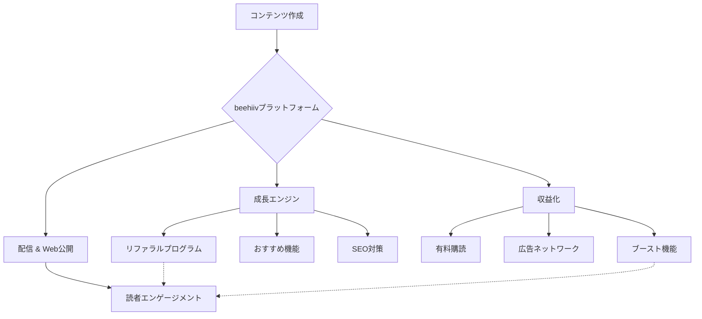

# NL_TOOL_001: beehiivプラットフォーム分析

**カテゴリ**: 🛠️ ツール・AI活用  
**ソース**: jabba ニュースレター  
**URL**: https://jabba.m-newsletter.com/posts/9568f22f292b3cf0  
**調査日**: 2025-12-26

---

## 概要

元Morning Brew CTOが創業したニュースレタープラットフォーム「beehiiv」がSubstackに代わる次世代プラットフォームとなりうるかを分析。

---

## 戦略サマリー

### 一言まとめ
Morning Brewの急成長を支えた「グロース機能内蔵型」のニュースレタープラットフォーム。

### 対象者
- 収益化を目指す本気のクリエイター
- 独自のWebサイトデザインにこだわりたい運営者
- 既存のメルマガスタンド機能に不満があるマーケター

### 期待効果
- 強力なリファラル機能によるSubscriber獲得コストの削減
- 従量課金ではない固定料金制による、規模拡大時の利益率向上
- 高度な分析機能による読者エンゲージメントの最適化

---

## 核心フレームワーク

### 概念図

### 主要構成要素

| # | 要素 | 説明 |
|---|------|------|
| 1 | **Growth Engine** | 紹介機能、推奨機能など、読者を増やすための仕組みが標準装備 |
| 2 | **Monetization** | 有料購読だけでなく、広告ネットワークへの参加も容易 |
| 3 | **Analytics** | 開封率やクリック率だけでなく、どの流入元が優秀かを詳細分析可能 |

---

## キーポイント

### 1. beehiivの背景
- **創業者**: Tyler Denk氏（Morning Brew 元CTO）
- **資金調達**: シリーズAで1,250万ドル（約17億円）
- **背景**: Morning Brewの成長ノウハウをプラットフォーム化

### 2. 課金モデル比較

| プラットフォーム | モデル | コスト例（年商1億円時） |
|-----------------|--------|----------------------|
| **Substack** | 売上の10%手数料 | 1,000万円/年 |
| **beehiiv** | 月額固定（$42-$84〜） | 約6-12万円/年 |

→ 高収益クリエイターほどbeehiivが圧倒的に有利

### 3. beehiiv独自機能

| 機能 | 説明 |
|------|------|
| **紹介プログラム** | Morning Brew式の多層的リファラルシステムをワンクリック実装 |
| **広告ネットワーク** | 独自のスポンサー広告掲載システム内蔵 |
| **カスタマイズ性** | デザイン自由度が高く、Zapier等との連携も可能 |
| **分析機能** | 高度なデータ分析ダッシュボード |

### 4. Substackとの差別化

| 項目 | Substack | beehiiv |
|------|----------|---------|
| デザイン | ミニマル（自由度低） | 高カスタマイズ |
| 手数料 | 10%（従量課金） | 固定月額 |
| リファラル | なし | Morning Brew式搭載 |
| ターゲット | 個人クリエイター | 成長志向のプロ |

---

## 実践ステップ

### Phase 1: 準備
1. **目的の明確化**: なぜbeehiivへ移行するのか（コスト削減？機能拡張？SEO？）を定義する
2. **プラン選定**: 購読者数と必要な機能（API、独自ドメイン等）に合わせてプラン決定（無料プランで開始も可）
3. **デザイン設定**: Webサイトのルック＆フィール、LP、ロゴなどを設定

### Phase 2: 実行（移行・開始）
1. **リストインポート**: CSV形式で既存リストをインポート（タグ付けに注意）
2. **ドメイン認証**: 到達率を高めるため、DKIM/SPF設定を確実に行う
3. **ウェルカムメール設定**: 新規登録者向けの一連の自動応答メール（Automation）を設定

### Phase 3: 最適化
1. **リファラル設定**: 報酬（特典コンテンツ等）を決めて紹介プログラムを稼働
2. **A/Bテスト**: タイトルや送信時間のテストを行い、開封率を改善
3. **収益化オン**: Boost機能や広告ネットワークへの参加審査を申請

---

## 必要ツール・リソース

| カテゴリ | ツール名 | 用途 | コスト |
|---------|---------|------|--------|
| プラットフォーム | beehiiv | 配信・管理 | 月額 $0〜 |
| ドメイン | お名前.com等 | 独自ドメイン取得 | 年額 1,500円〜 |
| 画像作成 | Canva | ヘッダー画像等は必須 | 無料〜 |

---

## 注意点・落とし穴

### やってはいけないこと

- ❌ **検証なしのいきなり全移行**: ドメイン評価がリセットされるため、最初は到達率が下がる可能性がある。段階的に移行するか、Warm-up期間を設けるべき。
- ❌ **デザインへの過度なこだわり**: カスタマイズ性は高いが、Webflowのような完全自由なWebビルダーではない。記事を書く時間を削ってデザインばかりいじらない。
- ❌ **無料プランでの過度な期待**: SEO対策（Canonical URL設定）や高度なAutomationは有料プラン限定機能が多い。

### よくある失敗

| 失敗 | 原因 | 対策 |
|------|------|------|
| **メールが届かない** | 新規ドメインの信頼性不足 | 独自ドメイン設定後、少しずつ配信数を増やす（Subdomain使用も検討） |
| **SEOが弱い** | Canonicalタグ未設定 | ブログ併用時は有料プランでCanonical設定をするか、beehiivをマスターにする |
| **操作が難しい** | 機能過多 | 最初は「書く・送る」に集中し、リファラル等は慣れてから設定 |

---

## 日本市場適用性評価

| 評価項目 | スコア | コメント |
|----------|--------|----------|
| 日本での需要 | ◎ | 収益化重視のクリエイター増加中 |
| 競合状況 | ○ | 日本語での詳細解説記事は少ない |
| コンテンツ移植性 | ◎ | プラットフォーム解説は普遍的 |
| 収益モデル再現性 | △ | 英語圏ほどニュースレター市場が成熟していない |
| ターゲット層 | ○ | ビジネス系・マーケター層に需要 |

**総合評価**: ○（日本市場にも適用可能）

---

## ファクトチェック履歴

| 項目 | 確認結果 | ソース数 |
|------|----------|----------|
| beehiiv創業者 | ✅ Tyler Denk | 3 |
| 資金調達額 | ✅ $12.5M | 2 |
| Substack手数料 | ✅ 10% | 複数公式 |
| beehiiv月額 | ✅ $42-$84+ | 公式サイト |

**判定**: ✅ PASS

---

## 品質チェック

- [x] 全必須項目が埋まっているか
- [x] 収益・データに矛盾がないか
- [x] 情報源が明記されているか
- [x] 日本市場評価が記載されているか
- [x] ファクトチェック結果が記録されているか
- [x] 成功パターン分類が記載されているか

---

## アクションアイテム

### すぐにできること（今日中）
- [ ] beehiivの無料アカウントを作成し、管理画面のUIを確認する
- [ ] 既存のニュースレター（ある場合）のCSVエクスポート方法を確認する

### 1週間以内にやること
- [ ] 独自ドメインを取得またはサブドメインを決定する
- [ ] テスト配信を行い、Gmail等での表示崩れがないか確認する

### 1ヶ月以内にやること
- [ ] ウェルカムメール（Automations）の内容を作成・設定する
- [ ] 有料プランへのアップグレード要否を判断する

---

## 関連戦略

| 戦略名 | 関連性 | ファイル |
|--------|--------|----------|
| **AI自動化ツール** | コンテンツ生成の効率化 | [NL_TOOL_002](./NL_TOOL_002_ai_automation.md) |
| **高収益事例** | プラットフォーム活用の成功例 | [NL_CASE_001](../cases/NL_CASE_001_high_revenue.md) |

---

## 情報源

| ソース | URL | 確認日 |
|--------|-----|--------|
| jabba記事 | https://jabba.m-newsletter.com/posts/9568f22f292b3cf0 | 2025-12-26 |
| beehiiv公式サイト | https://www.beehiiv.com/ | 2025-12-26 |
| G2 Review | https://www.g2.com/products/beehiiv/reviews | 2025-12-27 |

---

## 成功パターン分類

- 🛠️ **プラットフォーム分析型**: ツール選定の判断材料を提供
